# Compose runtime vs Compose UI

- **Compose UI**는 Android용 새로운 UI 툴킷으로, LayoutNode 트리 구조를 기반으로 화면에 요소를 렌더링한다.
- **Compose runtime**은 Compose UI의 기반을 이루는 상태 및 composition 관련 기능을 제공하는 저수준 런타임이다.

## 핵심 차이점

- Compose UI는 화면(Canvas)을 다루지만, Compose runtime은 UI와 무관한 구조에서도 활용 가능하다.
- Kotlin에서 실행되는 모든 곳에서 Compose runtime을 이용한 트리 구조를 만들 수 있다.
- React JS의 구성과 유사하게, UI 외에도 synthesizer나 3D renderer 등 다양한 목적으로 활용될 수 있다.
- React의 HTML-in-JS와 유사하게, Compose 초기 프로토타입은 Kotlin으로 직접 XML 구조를 정의하는 방식이었다.
    


# Compose의 멀티 플랫폼 확장

JetBrains는 Kotlin Multiplatform을 기반으로 Compose를 다양한 플랫폼에 확장하고 있다.

## Compose for Desktop

- Android의 구현과 매우 유사하며, Skia 기반 렌더링 시스템을 사용
- Skia wrapper를 활용하여 Compose UI 전체 렌더링 레이어를 재사용
- 마우스 및 키보드 이벤트를 위한 시스템 확장
## Compose for iOS (개발 중)

- 역시 Skia를 렌더링 레이어로 사용
- Kotlin/Native 기반으로 JVM 로직을 이식하여 재사용
    
## Compose for Web

- HTML/CSS 기반으로 구성요소를 정의하며, 브라우저의 DOM을 직접 사용
- Compose compiler와 runtime은 그대로 사용하지만, UI 시스템은 Compose UI와 다름
- Kotlin WASM과 함께 Skia 기반 Compose Web도 시도 중
    
## 구조 요약

```
Compiler → Runtime → Compose UI → Android UI
                       ↓
                   Compose Web
                   Compose Desktop
```

- 위 구조는 JetBrains의 Compose Multiplatform 아키텍처를 나타낸다.
- 공통된 Compiler와 Runtime 위에 각 플랫폼에 맞는 UI 시스템이 얹어진다.

# (Re-) Introducing composition

## Composition이란?

- 모든 Composable 함수는 Composition 컨텍스트 내에서 실행된다.
- Composition은 SlotTable을 기반으로 한 캐시와, Applier를 통한 커스텀 트리 생성 인터페이스를 제공한다.
- Recomposer가 Composition을 구동하며, 관련된 상태 변화가 감지되면 recomposition을 트리거한다.
## 구성 요소

- Composer: Composition의 핵심 로직을 담당
- SlotTable: Composition 중 상태 저장과 복원에 쓰이는 캐시
- Applier: 실제 UI 트리(또는 다른 구조)를 생성/연결하는 인터페이스

## 생성 방법

```
fun Composition(
    applier: Applier<*>,
    parent: CompositionContext
): Composition
```

- parent는 보통 rememberCompositionContext()를 통해 얻는다.
- Recomposer 자체도 CompositionContext를 구현하므로 직접 넘길 수 있다.
- Applier는 트리를 어떻게 생성하고 연결할지 결정한다.

## 팁

- 트리를 만들지 않고 Compose의 상태 관리 기능만 쓰고 싶다면 Applier<Nothing\>을 만들고 ComposeNode를 사용하지 않으면 된다.
- 예시: Cash App의 [Molecule](https://github.com/cashapp/molecule)

## 앞으로 다룰 내용
  

이후 예제에서는 **Compose UI 없이 Compose runtime만 사용하는 패턴**들을 다룬다:

- 커스텀 트리를 사용해 벡터 그래픽 렌더링 (Compose UI 라이브러리)
- Kotlin/JS에서 Compose를 활용해 브라우저 DOM 트리를 직접 다루는 예제

# Composition of vector graphics

## 개요


Compose에서 벡터 렌더링은 Painter 추상화를 통해 이루어진다. 이는 기존 Android 시스템의 Drawable과 유사하다.

```kotlin
Image(
    painter = rememberVectorPainter { width, height ->
        Group(
            scaleX = 0.75f,
            scaleY = 0.75f
        ) {
            val pathData = PathData { ... }
            Path(pathData = pathData)
        }
    }
)
```

- 위 예시는 rememberVectorPainter 내부에서 Group과 Path를 사용해 벡터 이미지를 구성하는 예다.
## 주요 개념

- rememberVectorPainter 블록 내부의 Group, Path는 일반 UI 컴포저블과 달리 **별도의 composition** 안에서 작동한다.
- 이 composition은 벡터 이미지를 구성하는 요소만 허용하며, 일반 UI 요소(Text, Image, Box 등)는 허용되지 않는다.
- 그 결과, VectorPainter는 벡터 전용 트리를 만들고 이를 나중에 캔버스에 그린다.
## 구조 시각화

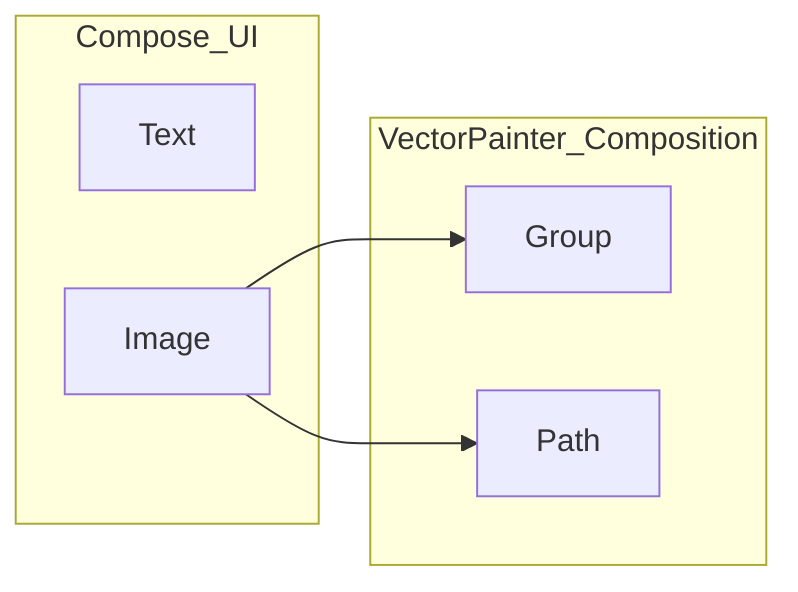

## 검증과 안전성

- 컴파일러는 현재 시점에서 벡터 컴포저블 유효성 검사를 **런타임에** 수행한다.
- 따라서 VectorPainter 내부에 잘못된 UI 요소를 넣으면, 컴파일은 통과하지만 실행 중 에러가 날 수 있다.
- 향후 Compose 컴파일러에서 이를 컴파일 타임에 검증할 수 있도록 개선할 예정이라는 소문이 있다.
## 기타 사항

- 이전 장들에서 다룬 **runtime**, **상태 관리**, **이펙트** 관련 개념은 벡터 composition에도 동일하게 적용된다.
- 예를 들어, Transition API를 사용해 벡터 이미지에 애니메이션을 적용할 수 있다.

## 예제

- [VectorGraphicsDemo.kt](https://android.googlesource.com/platform/frameworks/support/+/refs/heads/androidx-main/compose/ui/ui-graphics/src/androidAndroidTest/kotlin/androidx/compose/ui/graphics/vector/VectorGraphicsDemo.kt)
- [AnimatedVectorGraphicsDemo.kt](https://android.googlesource.com/platform/frameworks/support/+/refs/heads/androidx-main/compose/ui/ui-graphics/src/androidAndroidTest/kotlin/androidx/compose/ui/graphics/vector/AnimatedVectorGraphicsDemo.kt)
    
### 1. Composition과 Recomposer

- Composition은 모든 composable 함수의 컨텍스트이며, SlotTable, Applier와 연결되어 있음.
- Recomposer는 변경된 상태에 따라 recomposition을 트리거함.
- 직접 Composition을 구성할 수도 있으며, 이 경우 Applier와 CompositionContext가 필요함.
### 2. 벡터 그래픽 구성 (VectorPainter)

- rememberVectorPainter 블록 내부에서는 Group, Path 등의 벡터 전용 composable 함수 사용.
- 이들은 일반 UI와는 다른 Composition 안에서 동작하며, LayoutNode 대신 vector tree를 구성함.
### 3. VNode 트리

- 벡터 이미지는 VNode 기반 트리 구조로 구성됨.
- 주요 노드:
    - GroupComponent: 자식 노드를 갖고 transform 적용
    - PathComponent: path를 직접 그리는 leaf 노드
### 4. ComposeNode와 VectorApplier

- ComposeNode는 벡터 트리에 노드를 삽입함.
- VectorApplier는 VNode 간 연결을 담당하며, insertTopDown, remove, move 등의 연산을 구현.
### 5. TopDown vs BottomUp 삽입 방식

- topDown: 부모부터 삽입하고 그다음 자식들을 삽입
- bottomUp: 자식들을 모두 만든 후 부모에 한 번에 삽입
- 성능상의 이유로 vector 트리는 topDown 방식을 사용
    

이 파트는 Compose가 UI 트리뿐만 아니라 다양한 트리 구조를 구성하는 범용 런타임이라는 점을 보여주며, 특히 vector graphics나 커스텀 DOM 시스템처럼 UI 외 구조에도 적용 가능하다는 점을 강조합니다.

## Integrating vector composition into Compose UI

이 섹션은 Jetpack Compose 내부에서 벡터 그래픽을 어떻게 Compose UI에 통합하는지 설명합니다. 핵심은 VectorPainter 클래스 내부에서 독립적인 Composition을 유지하며 UI의 재구성과 연결시키는 방식입니다.


### 통합 흐름 요약

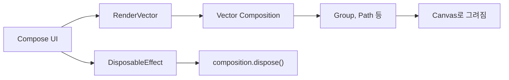

### 주요 구성 요소 설명

  

#### 1. RenderVector()

- UI에서 VectorPainter의 내용을 그리기 위한 진입점
- 내부에서 composeVector()를 호출해 vector 전용 composition을 구성
    

```kotlin
@Composable
internal fun RenderVector(content: @Composable () -> Unit) {
    val composition = composeVector(
        rememberCompositionContext(),
        content
    )

    DisposableEffect(composition) {
        onDispose { composition.dispose() }
    }
}
```

  


#### 2. composeVector()

- 기존 composition이 없거나 disposed 상태이면 새로 구성
- 내부적으로 VectorApplier를 사용하여 벡터 트리 구성
    

```kotlin
private fun composeVector(
    parent: CompositionContext,
    composable: @Composable () -> Unit
): Composition {
    val composition = if (this.composition == null || this.composition.isDisposed) {
        Composition(
            VectorApplier(vector.root),
            parent
        )
    } else {
        this.composition
    }

    this.composition = composition
    composition.setContent {
        composable(vector.viewportWidth, vector.viewportHeight)
    }

    return composition
}
```

#### 3. onDraw()

####  **오버라이드

- Painter 인터페이스의 핵심 구현부
- 매 프레임마다 vector 트리를 기반으로 Canvas에 그림
    

```kotlin
override fun DrawScope.onDraw() {
    with(vector) {
        draw()
    }
}
```

### 요약 포인트

1. VectorPainter는 UI의 Composition과 별도로 독립적인 Composition을 유지함
2. composeVector()를 통해 vector-specific composition을 직접 생성하거나 재사용
3. DisposableEffect를 통해 UI에서 벗어나면 composition을 해제
4. onDraw()는 실제로 벡터 트리를 Canvas에 렌더링함
    

이 구조는 Jetpack Compose가 UI toolkit을 넘어서 **트리 기반 렌더링 시스템**이라는 본질을 보여줍니다. 다음 섹션인 “Managing DOM with Compose”도 이전에 다뤘고, 그 이후가 있다면 계속 정리해드릴게요!


# Managing DOM with Compose 

## 개요

Jetpack Compose는 멀티플랫폼을 지원하지만, **runtime과 compiler만이 JVM 이외 환경에서 사용 가능**합니다. 이 두 모듈만으로도 구성이 가능하므로 다양한 실험이 가능합니다.

> Jetbrains는 JS용 멀티플랫폼 아티팩트를 포함한 Compose를 따로 배포하고 있음.

## Compose와 DOM의 연결


브라우저에서는 이미 HTML/CSS 기반의 **트리 구조(UI 요소)** 가 있으며, JS에서는 이를 **DOM(Document Object Model)** 으로 제어합니다.

Kotlin/JS에서도 이를 org.w3c.dom.Node 및 하위 클래스로 다룰 수 있습니다.

### HTML 구조 예시

```html
<div>
  <ul>
    <li>Item 1</li>
    <li>Item 2</li>
    <li>Item 3</li>
  </ul>
</div>
```

### Mermaid로 표현한 브라우저의 DOM 트리

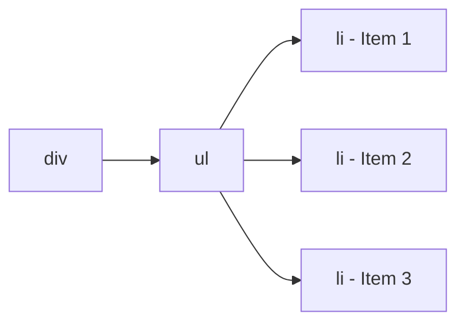

### JS 입장에서 본 구조

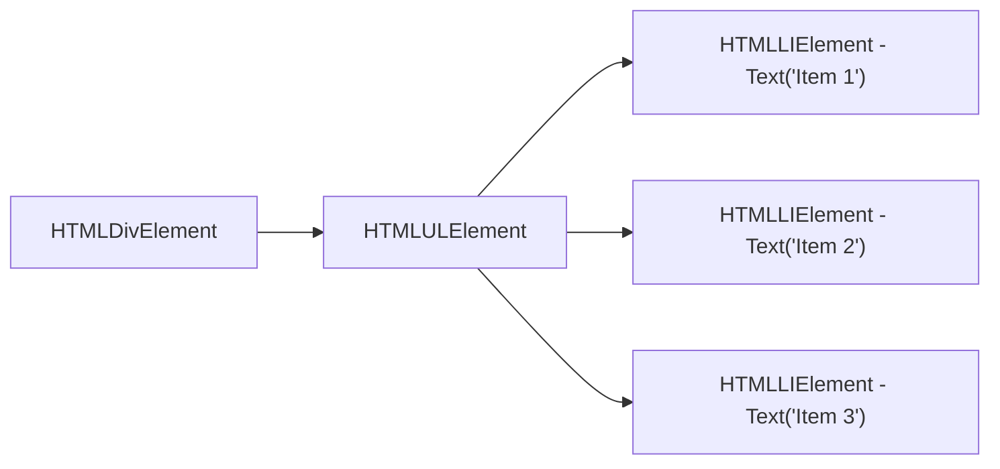


## JS DOM 요소 다루기

- **HTML 요소**: document.createElement("tag") → HTMLElement
- **텍스트 노드**: document.createTextElement("value") → Text
    
## Compose에서 DOM을 쓰는 방식

- Tag() 및 Text() Composable 함수는 각각 HTML 요소 및 텍스트를 생성.
- 내부적으로 ComposeNode 또는 ReusableComposeNode 사용.
    

```kotlin
@Composable
fun Tag(tag: String, content: @Composable () -> Unit) {
  ComposeNode<HTMLElement, DomApplier>(
    factory = { document.createElement(tag) as HTMLElement },
    update = {},
    content = content
  )
}
```


## 주의사항 및 최적화

- <div\>와 <audio\>는 다른 구조를 가지므로 태그가 바뀌면 해당 노드를 재생성해야 함.
- 태그별로 별도의 Composable로 래핑하는 것이 좋음 (e.g., Div(), Ul() 등).
- Text()는 구조적으로 동일하므로 ReusableComposeNode로 재사용 가능.


## DOM 트리 조합

- Compose는 DOM 요소를 다룰 수 있는 Applier 구현이 필요함.
- 내부 구현은 VectorApplier와 유사하지만, HTML의 DOM 메서드를 사용.
    


# HTML DOM을 Compose로 구현하기
## HtmlApplier 구성

Compose에서 DOM 요소들을 관리하려면 **Applier**가 필요합니다. VectorApplier와 구조는 유사하나, HTMLElement를 다루는 방식으로 설계됩니다.

### HTMLApplier의 역할:

- 자식 노드 삽입/삭제
- 트리 상의 노드 이동
- 모든 연산은 HTMLElement를 기준으로 작동

## Mermaid로 표현한 HTML DOM Applier 작동 구조

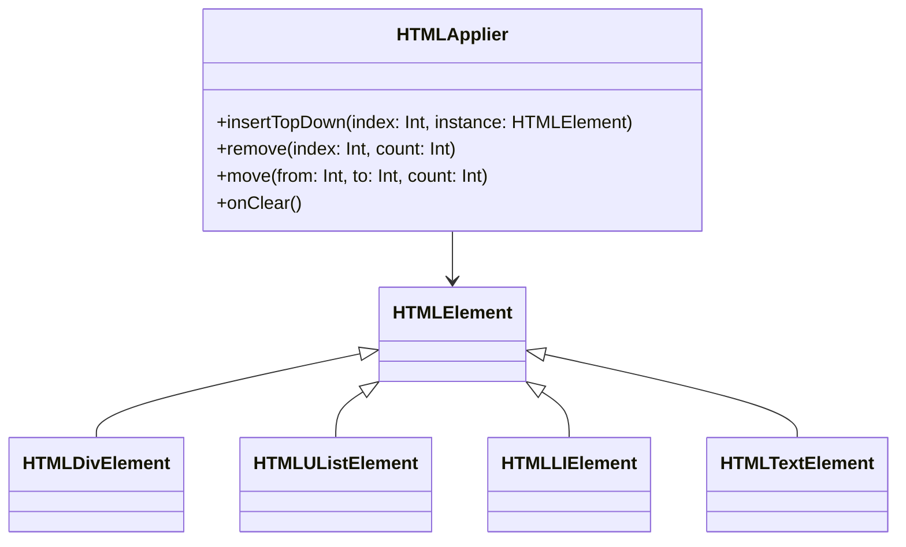


### 주요 코드 구성 요소

- HtmlApplier는 AbstractApplier<HTMLElement\>를 상속
- insertTopDown에서 parent.insertBefore(...) 등을 호출하여 DOM 트리를 구성
- ReusableComposeNode와 ComposeNode를 통해 실제 DOM 요소를 렌더링

### HTML 트리 구성 예시

```kotlin
@Composable
fun Html() {
  Tag("div") {
    Tag("ul") {
      Tag("li") { Text("Item 1") }
      Tag("li") { Text("Item 2") }
      Tag("li") { Text("Item 3") }
    }
  }
}
```

### Compose 내부에서 일어나는 구조

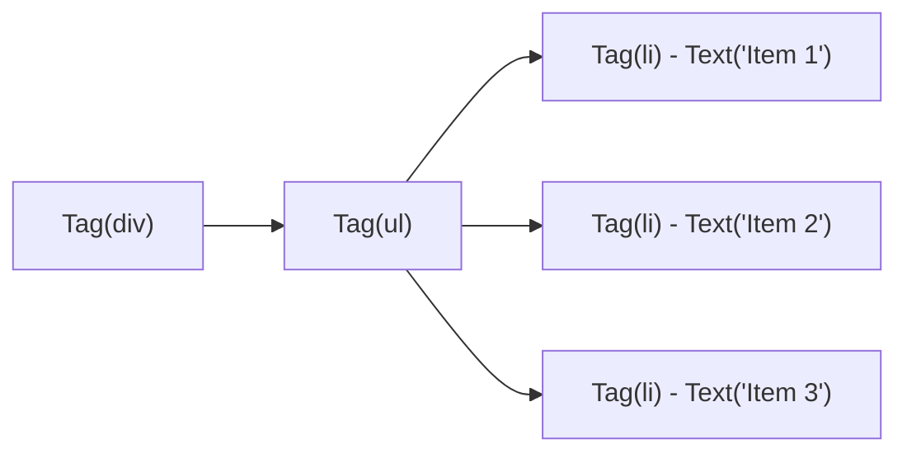

### Applier 동작 순서

1. Tag()로 요소 생성 → ComposeNode 사용
2. DomApplier가 트리에 요소 삽입
3. Text()는 ReusableComposeNode로 텍스트 노드 생성
4. DOM 요소는 Compose가 추적 가능하도록 트리로 구성

## 정리

- Compose는 멀티플랫폼으로 확장되어 **HTML DOM 구조도 구성 가능**
- 핵심은 Applier 구현과 ComposeNode를 통해 트리 구성
- 구조상 React와 유사한 방식 (컴포저블 기반의 UI 트리 구성)
    

# Standalone Compose Runtime 만들기 – Kotlin/JS 기반


이 장에서는 **Compose UI 없이 Compose Runtime만**으로 컴포지션을 실행하는 법을 다룹니다. HTML DOM을 기반으로 직접 트리를 구성하고, setContent 없이도 Compose가 동작하는 예제를 구성합니다.

## 목표

- Compose UI 없이도 Compose Runtime으로 컴포지션을 구성
- 브라우저 DOM을 직접 다루는 Applier를 구현해 트리 구성
- React 없이 Compose 기반 UI 렌더링 구조 이해하기

## Mermaid: 구성 요소 흐름

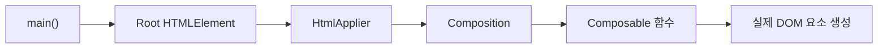


## 구성 핵심 요소

### 1. Composition 생성

```kotlin
val root = document.getElementById("root")!!
val applier = HtmlApplier(root)
val recomposer = Recomposer(coroutineContext)
val composition = Composition(applier, recomposer)
```

- root: HTML에서 지정된 요소 (ex: `<div id="root">` )
- applier: DOM에 대해 작동하는 Applier
- recomposer: Compose의 변경 감지를 관리
- composition: 컴포지션 전체 구조

### 2. Content 설정

```kotlin
composition.setContent {
  Tag("div") {
    Tag("ul") {
      Tag("li") { Text("Hello!") }
    }
  }
}
```

이 코드는 setContent 블록 안에서 트리 구조를 선언하며, 내부적으로 DOM에 반영됩니다.


## Mermaid: Compose 없이 HTML 구성

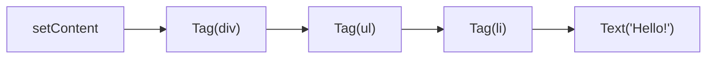

  

## 핵심 요약

- Jetpack Compose Runtime은 UI 계층 없이도 사용할 수 있음
- Composition + Applier + Recomposer 조합으로 동작
- DOM 환경에서는 HtmlApplier만 있으면 커스텀 렌더러 작성 가능
- Kotlin/JS를 통해 Compose를 웹에 적용 가능
- 실질적으로 React를 대체할 수 있는 구조를 학습

# Compose를 브라우저에서 수동으로 구동하기 – 고급 구성


## 목적

- setContent나 자동 recomposition 없이 직접 Composition을 제어
- Recomposer.runRecomposeAndApplyChanges()를 명시적으로 호출
- 수동으로 invalidate → recompose → applyChanges 흐름 구성


## 주요 흐름 요약

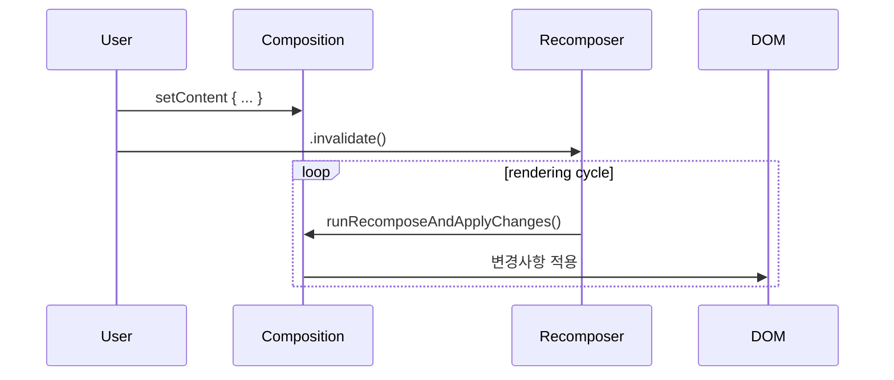

## 핵심 구성

### 1. Composition 구성

```kotlin
val composition = Composition(HtmlApplier(root), recomposer)
composition.setContent {
  App() // 사용자 정의 composable
}
```

### 2. Recomposer 수동 실행

```kotlin
launch {
  recomposer.runRecomposeAndApplyChanges()
}
```

- 이는 suspend 함수로, Compose의 무한 루프 내에서 작동
- 브라우저에서는 window.requestAnimationFrame을 활용해 프레임 기반 렌더링도 가능
    


## Mermaid: 전체 구성 흐름

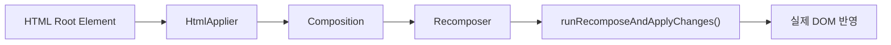

## 실제 적용 예: 애니메이션, 타이머, 사용자 입력

- 사용자 입력이나 타이머 등의 상태 변화가 발생하면 MutableState가 변경됨
- 변경 감지를 통해 invalidate → recompose가 발생
- runRecomposeAndApplyChanges()가 이를 캐치하고 UI를 업데이트

## 요약

- Compose는 setContent 없이도 동작 가능
- Composition, Recomposer, Applier만 있으면 Compose 실행 환경 구축 가능
- 재컴포지션을 수동으로 트리거할 수 있어 브라우저에서 프레임 기반 애니메이션 등에 활용 가능

# Compose DOM 구성 마무리

## 핵심 요약

- Compose는 UI 프레임워크가 아니라 **런타임 트리 구성 엔진**이다.
- 실제로 UI 요소는 **Applier**에 의해 구체화되며, Compose 자체는 트리 구조를 구성하고 상태를 관리하는 역할을 한다.
- setContent 없이도 동작 가능하며, Composition, Applier, Recomposer만으로 **순수한 상태 기반 시스템**을 만들 수 있다.

## Compose Runtime의 역할

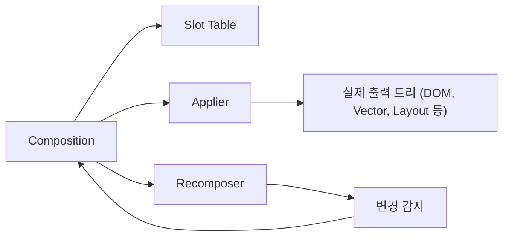


## 다양한 출력을 위한 확장성

- DOM (HtmlApplier)
- Canvas 기반 벡터 (VectorApplier)
- Android UI (LayoutNodeApplier)
- Desktop Skia 렌더링
- 향후 가능성: 게임 엔진, 3D 씬 그래프, 오디오 그래프 등
    
## Compose가 제공하는 것

- 선언형 트리 구성 (Composables)
- 상태 기반 업데이트 (State, remember, mutableStateOf)
- Recomposition
- Composition Lifecycle
- Slot 기반 메모리 최적화 구조 (SlotTable)

## Compose가 직접 다루지 않는 것

- 실제 렌더링 (Applier가 담당)
- 플랫폼 별 이벤트 처리
- 쓰레딩 및 동시성 제어 (Coroutine으로 처리)
    
## 결론

- Compose는 UI 도구가 아닌 **트리 기반 상태 동기화 엔진**이다.
- HTML, Vector, Android, Canvas 등 무엇이든 트리로 구성된다면 Compose는 그것을 구성하고 관리할 수 있다.
- Kotlin/JS에서도 Compose Runtime만으로 강력한 UI 프레임워크를 구현할 수 있다.
- 더 나아가, Compose는 **범용 선언형 시스템**으로서의 잠재력을 지닌다.
    


