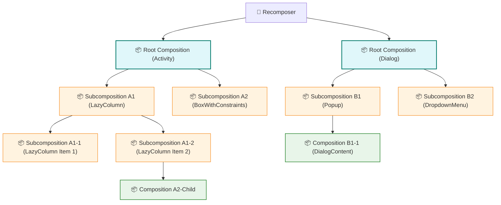

# Composition

- `setContent` → 루트 Composition 생성 → ReusableComposeNode로 노드 구성
- 각 Composition은 **독립적인 Composable 트리**를 가지며, 서로 영향을 주지 않음
- 내부적으로는 변화 감지, 노드 생명주기, Replaceable Group 등 복잡한 로직으로 구성됨

## setContent의 역할
- `setContent`는 새로운 **루트 Composition (Root Composition)** 을 생성합니다.
- Compose UI 라이브러리가 **런타임(Compose Runtime)** 과 만나는 가장 일반적인 진입 지점입니다.
- 이 루트 Composition은 가능한 경우 **재사용**되며, **각기 다른 Composable 트리를 독립적으로** 관리합니다.

## 루트 Composition의 특징
- 각 루트 `Composition`은 **서로 연결되어 있지 않음**.
- **Fragment 예시**:
  - Fragment 1 → `setContent()` 호출
  - Fragment 2 → XML 내 여러 `ComposeView` → 각자 `setContent()` 호출
  - Fragment 3 → `setContent()` 호출
=> 위 예시에서는 **총 5개의 루트 Composition**이 생기며, 모두 **독립적**입니다.

## LayoutNode

- `LayoutNode`는 Compose UI에서 **실제 UI 구조를 구성하는 핵심 노드**입니다.  
- `ReusableComposeNode`를 통해 생성되며, **화면에 그려질 Composable 트리의 실질적인 기반이 되는 객체**입니다.  
- 이 노드는 `MeasurePolicy`, `Modifier`, `LayoutDirection` 등의 정보를 포함하며, **레이아웃 측정 및 배치**에 사용됩니다.

아래는 `Layout()` 컴포저블 내부에서 `LayoutNode`가 어떻게 생성되고 설정되는지를 보여주는 예시입니다:


### 예시: Layout 

```kotlin
@Composable
@UiComposable
inline fun Layout(
    content: @Composable @UiComposable () -> Unit,
    modifier: Modifier = Modifier,
    measurePolicy: MeasurePolicy
) {
    val compositeKeyHash = currentCompositeKeyHashCode.hashCode()
    val localMap = currentComposer.currentCompositionLocalMap
    val materialized = currentComposer.materialize(modifier)
    ReusableComposeNode<ComposeUiNode, Applier<Any>>(
        factory = ComposeUiNode.Constructor,
        update = {
            set(measurePolicy, SetMeasurePolicy)
            set(localMap, SetResolvedCompositionLocals)
            set(compositeKeyHash, SetCompositeKeyHash)
            set(materialized, SetModifier)
        },
        content = content
    )
}
```
[Layout.kt](https://cs.android.com/androidx/platform/frameworks/support/+/androidx-main:compose/ui/ui/src/commonMain/kotlin/androidx/compose/ui/layout/Layout.kt)

### ReusableComposeNode 동작 과정
1. **노드 생성**: factory 함수로 생성
2. **초기화**: `update` 람다로 초기화
3. **Replaceable Group 생성**:
   - 콘텐츠를 감싸는 그룹
   - 고유 키를 통해 식별 가능
   - 그룹 내부에서 실행된 `content`는 해당 노드의 **자식 노드**로 간주됨

### update 블록의 set 호출
- `set` 호출은 다음 조건에서만 실행:
  - 노드가 **처음 생성될 때**
  - 해당 속성의 값이 **이전과 다를 때**
- 성능 최적화를 위한 **변화 감지 메커니즘**

# Subcomposition


- Composition은 루트 레벨뿐만 아니라, **Composable 트리의 더 깊은 위치**에서도 생성될 수 있음
- 이 경우 해당 Composition은 **부모 Composition과 연결**되며, 이를 **Subcomposition(하위 Composition)** 이라고 부름

### 구조




- 각 Composition은 자신의 **부모 CompositionContext**에 대한 참조를 가짐. 단, 루트 Composition만 예외적으로 부모가 Recomposer임
- **CompositionLocal** 값을 상위에서 하위로 전파할 수 있음
- **Invalidation**(상태 변경 감지)도 트리 구조에서 자연스럽게 전파됨
- 결과적으로 마치 **단일 Composition처럼 동작**함

### 용도

#### 1. 초기 Composition 지연

- 어떤 정보가 **먼저 계산되어야 하는 경우**, 해당 정보를 기준으로 하위 UI를 구성해야 할 때 사용
- 일반적인 [[#예시 Layout|Layout]]과 유사하지만, **레이아웃 단계에서 독립적인 Composition**을 생성하고 실행함.
- 트리 구조 덕분에, **자식 Composable이 상위에서 계산된 값**에 의존할 수 있음.
- `BoxWithConstraints`가 내부적으로 사용함

#### 2. 특정 서브트리가 다른 종류의 노드를 생성
- 하위 Composable 트리가 **기존 노드 구조와 다른 타입의 노드**를 만들어야 할 때 Subcomposition을 사용
- 노드 트리의 유연한 구성 및 관리에 유리

### 예시: SubcomposeLayout

```kotlin
@Composable
@UiComposable
fun SubcomposeLayout(
    state: SubcomposeLayoutState,
    modifier: Modifier = Modifier,  
    measurePolicy: SubcomposeMeasureScope.(Constraints) -> MeasureResult // ✅ Subcompose용 MeasurePolicy

) {
    val compositeKeyHash = currentCompositeKeyHashCode.hashCode()
    val compositionContext = rememberCompositionContext() // ✅ 별도 CompositionContext 생성
    val materialized = currentComposer.materialize(modifier)
    val localMap = currentComposer.currentCompositionLocalMap
    ReusableComposeNode<LayoutNode, Applier<Any>>( // ✅ LayoutNode 사용 (하위 Composition 지원)
        factory = LayoutNode.Constructor,
        update = {
            set(state, state.setRoot) // ✅ SubcomposeLayoutState 등록
            set(compositionContext, state.setCompositionContext) // ✅ 하위 Composition 연결
            set(measurePolicy, state.setMeasurePolicy)
            set(localMap, SetResolvedCompositionLocals)
            set(materialized, SetModifier)
            set(compositeKeyHash, SetCompositeKeyHash)
        }
    )
    // ✅ Subcomposition 재구성을 강제로 트리거
    if (!currentComposer.skipping) {
        SideEffect { state.forceRecomposeChildren() }
    }
}
```
[SubcomposeLayout.kt](https://cs.android.com/androidx/platform/frameworks/support/+/androidx-main:compose/ui/ui/src/commonMain/kotlin/androidx/compose/ui/layout/SubcomposeLayout.kt;l=122?q=SubcomposeLayout)

# Composition vs Subcomposition

- `Composition`은 기본 단위로 항상 사용되며,
- `Subcomposition`은 특별한 상황에서 **동적으로 자식 UI를 제어하기 위해 사용하는 별도 Composition 단위**입니다.

| 항목 | Composition | Subcomposition |
|------|-------------|----------------|
| **정의** | Composable 함수 실행 결과를 담는 **기본 Composition 단위** | 특정 목적을 가진 **동적/지연 Composition 단위** |
| **생성 방식** | `setContent`, 일반 Composable 내부에서 자동 생성 | `subcompose()`를 통해 **명시적 생성** |
| **생성 시점** | Composition 트리 구성 시 **즉시 실행** | **필요 시점까지 지연** 가능 (예: 레이아웃 계산 이후) |
| **노드 트리 연결** | 현재 Composition 트리에 노드들이 바로 연결됨 | **별도 노드 트리로 구성 가능** |
| **CompositionContext** | 상위 Composition의 Context를 **자동 상속** | **명시적으로 Context 설정 필요** |
| **Recomposition 처리** | 부모 Composition의 상태 변화에 따라 재구성됨 | `forceRecomposeChildren()` 등으로 **독립적 재구성 가능** |
| **사용 목적** | 기본적인 UI 구조 구성 | 자식 UI를 **상태/측정값/조건 기반으로 동적 구성** |
| **사용 예시** | `Column`, `Box`, 일반 Composable들 | `SubcomposeLayout`, `LazyColumn`, `Popup`, `Dialog`, `BoxWithConstraints` 등 |
| **slot table** | 루트 Composition 단위로 **독립적으로 존재** | 보통 **별도의 slot table 사용**, runtime이 따로 관리 |
| **구조 유연성** | 고정된 자식 구조 | **동적 구성, 유연한 배치** 가능 |
