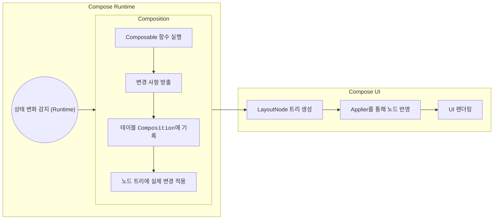

## Compose Runtime Client Library

| 라이브러리 이름                                                                  | 설명                                                                         | 지원 플랫폼                        | 유지 관리자                 | 참고 링크                                                            |
| ------------------------------------------------------------------------- | -------------------------------------------------------------------------- | ----------------------------- | ---------------------- | ---------------------------------------------------------------- |
| **Jetpack Compose**                                                       | Android 플랫폼에서 선언적 UI를 구축하기 위한 최신 도구 키트입니다.                                 | Android                       | Google                 | [공식 문서](https://developer.android.com/jetpack/compose)           |
| **Mosaic**                                                                | Jetpack Compose를 활용하여 콘솔 기반의 UI를 구축할 수 있도록 지원하는 라이브러리입니다.                  | 콘솔 애플리케이션                     | Jake Wharton           | [GitHub 저장소](https://github.com/JakeWharton/mosaic)              |
| [Compose Multiplatform](https://www.jetbrains.com/compose-multiplatform/) | JetBrains에서 개발한 라이브러리로, Compose를 데스크톱, 웹, iOS 등 다양한 플랫폼에서 활용할 수 있도록 지원합니다. | 데스크톱(W, macOS, Linux), 웹, iOS | JetBrains 및 오픈 소스 기여자들 | [GitHub 저장소](https://github.com/JetBrains/compose-multiplatform) |

## Compose UI와 Compose Runtime

_Compose UI는 사용자가 화면으로 확인할 수 있는 Layout Tree를 생성한다._

### 흐름도

1. [[The Compose Runtime - Slot Table and List of Changes|Compose Runtime]]이 상태 변화를 감지하고 Composition을 실행
2. [[The Compose Runtime - Composition|Composition]] 결과로 **LayoutNode** 트리 생성
3. [[The Compose Runtime - Applier|Applier]]가 LayoutNode에 변화를 적용
4. 최종적으로 **Compose UI**가 UI를 렌더링

### 주요 역할 정리

| 구성 요소                                                                     | 하위 요소                                | 역할 설명                                                                         |
| ------------------------------------------------------------------------- | ------------------------------------ | ----------------------------------------------------------------------------- |
| [[The Compose Runtime - Slot Table and List of Changes\|Compose Runtime]] |                                      | 상태 감지 및 Composition 수행                                                        |
| Compose UI                                                                |                                      | UI 트리 구성 및 렌더링 처리                                                             |
|                                                                           | [[Jetpack Compose Applier\|Applier]] | Composition 결과를 LayoutNode에 반영                                                |
|                                                                           | LayoutNode                           | Compose UI의 트리 구조, 실제 UI의 기반                                                  |
|                                                                           | Composition 테이블                      | Composable 실행 결과와 노드 트리 변경을 연결함 각 Composition은 하나의 노드 트리를 관리하며, 여러 개 존재 가능 |

#### 변경 작업 종류

| 작업 종류   | 설명                                    |
| ----------- | --------------------------------------- |
| 노드 추가   | 새 LayoutNode를 생성하여 트리에 삽입    |
| 노드 이동   | 기존 노드의 위치를 재조정               |
| 노드 제거   | 더 이상 필요 없는 노드를 삭제           |
| 전체 초기화 | 모든 노드를 제거하고 트리를 초기 상태로 |

