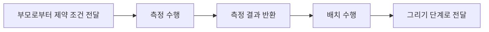
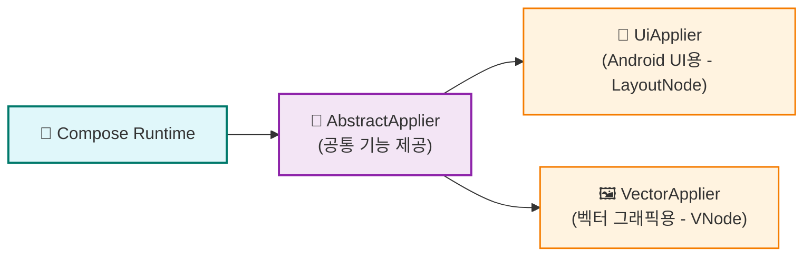
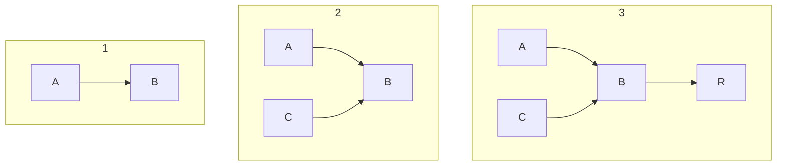
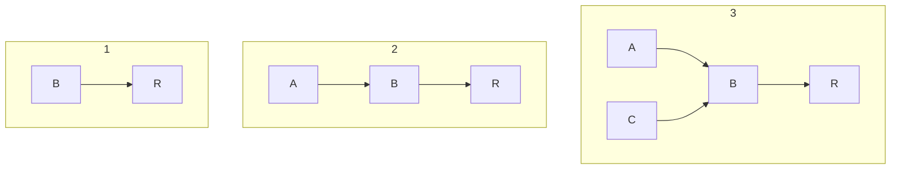
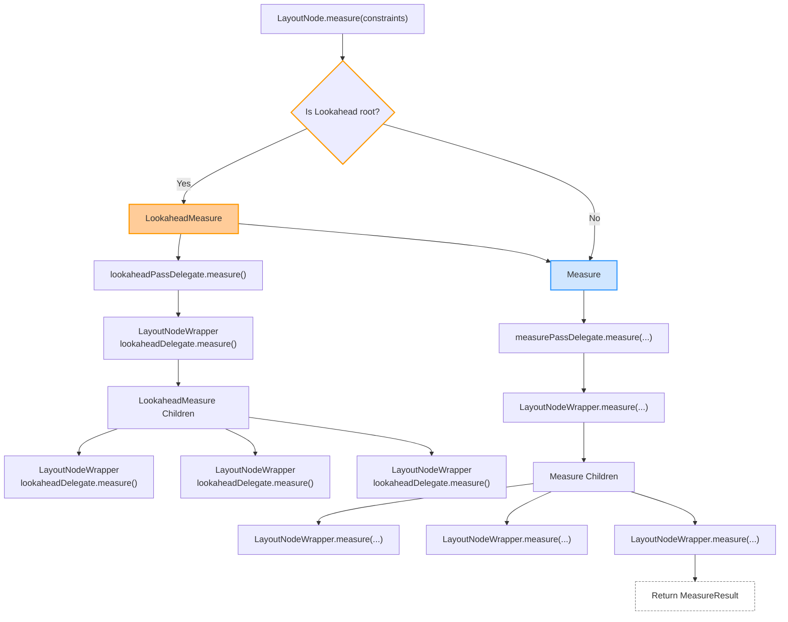
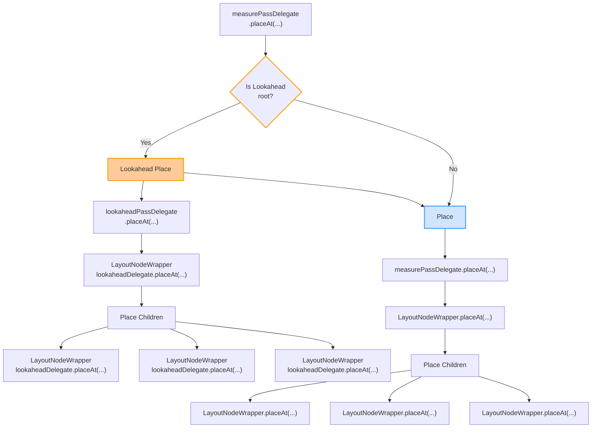

_생성된 변경 사항들을 **실제 UI에 반영**해야만 합니다.
이 과정을 우리는 흔히 **노드 트리의 구현(materialization)** 이라고 부릅니다._

# 레이아웃 처리 흐름

Compose UI의 레이아웃 시스템은 `측정` → `배치` → `그리기`의 단계를 따릅니다. 
각 LayoutNode는 부모의 제약 조건 하에서 크기를 측정하고, 위치를 결정합니다.




# Applier

💡 interface 에 대한 내용은 [[The Compose Runtime - Applier|Applier]]를 참고하세요!

## 계층 구조



- AbstractApplier는 Applier 구현체 간 **공통 동작(노드 스택 관리 등)** 을 제공하는 기본 클래스
- 각 구현체는 자신만의 **노드 타입**을 지정해 사용합니다.
	- UiApplier → LayoutNode
	- VectorApplier → VNode


## AbstractApplier의 작동 방식

- down(node) 호출 시:
	- 방문 중인 노드를 스택에 push
	- 현재 노드 참조를 업데이트
- up() 호출 시:
	- 마지막 노드를 pop → 부모로 돌아감
	- 이를 통해 노드 간 부모-자식 관계를 명시적으로 유지하지 않아도 **트리 순회**가 가능

### 예시: 조건부 노드 트리

```kotlin
Column {
  Row {
    Text("Some text")
    if (condition) {
      Text("Some conditional text")
    }
  }
  if (condition) {
    Text("Some more conditional text")
  }
}
```


`condition`이 바뀌면, Applier는 다음과 같은 호출 순서를 따릅니다:

1. down(Column)
2. down(Row)
3. 자식 Text 삭제/삽입
4. up() → Row → Column으로 이동
5. 마지막 Text 삭제/삽입

## 노드 트리 구성 전략

### UiApplier (LayoutNode 기반)


- **Bottom-Up 방식** 사용
- 매번 **직접 부모만 알림**, 중첩 구조에서 성능 효율적
- Android UI는 중첩이 깊기 때문에 이 전략이 적합

### VectorApplier (VNode 기반)




- **Top-Down 방식** 사용
- 각 삽입 시 **모든 조상에게 알림**
- 그러나 벡터 그래픽에서는 **알림 전파가 불필요**하여 전략 간 성능 차이 없음


❓ **여러 Applier가 동시에 사용될 수 있을까?**

<em><b>Yes</b></em> , LayoutNode로 구성된 루트 Composition과 VNode로 구성된 Subcomposition이 함께 존재할 경우, 둘의 Applier가 동시에 사용되어 전체 UI 트리를 materialize한다.

## UiApplier의 역할

- UiApplier는 Compose Runtime과 실제 UI(LayoutNode)를 연결해주는 **플랫폼별 물리화 도구
- LayoutNode는 플랫폼 독립적인 노드이며, Owner를 통해 Android View에 연결됨
- `AbstractApplier<LayoutNode>`를 상속하여 **노드 삽입/삭제/이동을 실제로 처리**함
- `insertTopDown()`은 무시되고, `insertBottomUp()`만 사용됨 
  → 즉 **트리를 하향(top-down)이 아닌 상향(bottom-up)** 방식으로 구성함
- 각 노드 작업은 `current`(현재 방문 중인 노드)에 위임됨

### LayoutNode 삽입: insertAt

```kotlin
internal fun insertAt(index: Int, instance: LayoutNode)
```

- 부모가 이미 있거나, owner가 있으면 예외 발생
- 자식 리스트 _foldedChildren에 추가
- foldedParent 설정 → 부모-자식 연결

### 노드 연결: attach(owner)

- 동일한 Owner를 강제 → 트리 전체가 같은 View 기반 구조를 공유하게 함
- 재귀적으로 자식 노드까지 attach
- Semantics가 있으면 onSemanticsChange() 호출
- attach 후 requestRemeasure()로 측정 요청 → **실제로 화면에 반영되는 핵심 단계**

### Owner의 역할

- LayoutNode 트리와 실제 플랫폼 View(Android View) 사이의 **연결자**
- 노드가 추가/삭제되면 invalidate, requestLayout 등을 통해 View에게 갱신 요청
- **View 시스템을 통해 변경 사항을 화면에 반영**함


### Z-Index 및 정렬

- 삽입된 노드는 Z 인덱스에 따라 정렬됨
- 정렬 리스트가 무효화되면 다시 정렬 → View 위/아래에 위치하는 순서에 영향  


# Measuring policies

_측정 정책(MeasurePolicy)은 LayoutNode가 자식 노드들을 어떻게 측정하고 배치할지를 정의합니다. 커스텀 레이아웃을 만들기 위해 반드시 필요합니다._

### 측정 정책이란?

- Compose에서 **Custom Layout**을 정의할 때 측정 및 배치 동작을 결정하는 핵심 요소
- `LayoutNode`가 `measure()`를 수행할 때 **외부에서 주입된 measurePolicy**를 통해 작동함

```kotlin
Layout(
  modifier = ...,
  measurePolicy = { measurables, constraints -> ... }
)
```
  
## 기본 구조

```kotlin
@Stable
@JvmDefaultWithCompatibility
fun interface MeasurePolicy {

    fun MeasureScope.measure(measurables: List<Measurable>, constraints: Constraints): MeasureResult

    fun IntrinsicMeasureScope.minIntrinsicWidth(
        measurables: List<IntrinsicMeasurable>,
        height: Int
    ): Int {
        val mapped =
            measurables.fastMap {
                DefaultIntrinsicMeasurable(it, IntrinsicMinMax.Min, IntrinsicWidthHeight.Width)
            }
        val constraints = Constraints(maxHeight = height)
        val layoutReceiver = IntrinsicsMeasureScope(this, layoutDirection)
        val layoutResult = layoutReceiver.measure(mapped, constraints)
        return layoutResult.width
    }
	// ...
}
```
[MeasurePolicy.kt](https://cs.android.com/androidx/platform/frameworks/support/+/androidx-main:compose/ui/ui/src/commonMain/kotlin/androidx/compose/ui/layout/MeasurePolicy.kt;l=58?q=MeasurePolicy&ss=androidx%2Fplatform%2Fframeworks%2Fsupport)

### measure()

- MeasureScope: 측정에 필요한 context 제공 (layout(), padding, etc.)
- measurables: 측정 대상 자식들
- constraints: 부모로부터 전달받은 제약 조건 (min/max width & height)
- MeasureResult: 측정 결과를 반환하는 객체 (자식 위치 정보 포함)

### intrinsic

1. minIntrinsicWidth(...) : 주어진 높이에서 콘텐츠를 그릴 수 있는 **최소 너비** 반환

```kotlin
fun IntrinsicMeasureScope.minIntrinsicWidth(measurables, height): Int
```

2. minIntrinsicHeight(...) : 주어진 너비에서 콘텐츠를 그릴 수 있는 **최소 높이** 반환

```kotlin
fun IntrinsicMeasureScope.minIntrinsicHeight(measurables, width): Int
```

3. maxIntrinsicWidth(...) : 주어진 높이에서 콘텐츠를 그릴 수 있는 **최대 너비** 반환

```kotlin
fun IntrinsicMeasureScope.maxIntrinsicWidth(measurables, height): Int
```

4. maxIntrinsicHeight(...) : 주어진 너비에서 콘텐츠를 그릴 수 있는 **최대 높이** 반환

```kotlin
fun IntrinsicMeasureScope.maxIntrinsicHeight(measurables, width): Int
```

## 예제 1: Spacer

```kotlin
private object SpacerMeasurePolicy : MeasurePolicy {
    override fun MeasureScope.measure(
        measurables: List<Measurable>,
        constraints: Constraints
    ): MeasureResult {
        return with(constraints) {
            val width = if (hasFixedWidth) maxWidth else 0
            val height = if (hasFixedHeight) maxHeight else 0
            layout(width, height) {}
        }
    }
}
```
[Spacer.kt](https://cs.android.com/androidx/platform/frameworks/support/+/androidx-main:compose/foundation/foundation-layout/src/commonMain/kotlin/androidx/compose/foundation/layout/Spacer.kt)
- 가장 기본적인 정책 구조
- 자식이 없는 Spacer는 고정된 사이즈가 없으면 (0, 0) 반환

## 예제 2: BoxMeasurePolicy

```kotlin
private data class BoxMeasurePolicy(
    private val alignment: Alignment,
    private val propagateMinConstraints: Boolean
) : MeasurePolicy {
    override fun MeasureScope.measure(
        measurables: List<Measurable>,
        constraints: Constraints
    ): MeasureResult {
        if (measurables.isEmpty()) {
            return layout(constraints.minWidth, constraints.minHeight) {}
        }

        val contentConstraints =
            if (propagateMinConstraints) {
                constraints
            } else {
                constraints.copyMaxDimensions()
            }

        if (measurables.size == 1) {
            val measurable = measurables[0]
            val boxWidth: Int
            val boxHeight: Int
            val placeable: Placeable
            if (!measurable.matchesParentSize) {
                placeable = measurable.measure(contentConstraints)
                // ✅ 자식의 크기와 부모 제약 중 더 큰 쪽을 Box 크기로 설정
                boxWidth = max(constraints.minWidth, placeable.width)
                boxHeight = max(constraints.minHeight, placeable.height)
            } else {
                boxWidth = constraints.minWidth
                boxHeight = constraints.minHeight
                placeable =
                    measurable.measure(
                        Constraints.fixed(constraints.minWidth, constraints.minHeight)
                    )
            }
            return layout(boxWidth, boxHeight) {
                placeInBox(placeable, measurable, layoutDirection, boxWidth, boxHeight, alignment)
            }
        }

        val placeables = arrayOfNulls<Placeable>(measurables.size)
        // First measure non match parent size children to get the size of the Box.
        var hasMatchParentSizeChildren = false
        var boxWidth = constraints.minWidth
        var boxHeight = constraints.minHeight
        measurables.fastForEachIndexed { index, measurable ->
            if (!measurable.matchesParentSize) {
                val placeable = measurable.measure(contentConstraints)
                placeables[index] = placeable
                boxWidth = max(boxWidth, placeable.width)
                boxHeight = max(boxHeight, placeable.height)
            } else {
                hasMatchParentSizeChildren = true
            }
        }

        // Now measure match parent size children, if any.
        if (hasMatchParentSizeChildren) {
            // The infinity check is needed for default intrinsic measurements.
        // ✅ 무한 제약 조건이 있는 경우 최소값을 0으로 설정하여 자식이 자체 판단하게 함
            val matchParentSizeConstraints =
                Constraints(
                    minWidth = if (boxWidth != Constraints.Infinity) boxWidth else 0,
                    minHeight = if (boxHeight != Constraints.Infinity) boxHeight else 0,
                    maxWidth = boxWidth,
                    maxHeight = boxHeight
                )
            measurables.fastForEachIndexed { index, measurable ->
                if (measurable.matchesParentSize) {
                    placeables[index] = measurable.measure(matchParentSizeConstraints)
                }
            }
        }

		// ✅ 최종적으로 Box 내부에 자식들을 배치
        // Specify the size of the Box and position its children.
        return layout(boxWidth, boxHeight) {
            placeables.forEachIndexed { index, placeable ->
                placeable as Placeable
                val measurable = measurables[index]
                placeInBox(placeable, measurable, layoutDirection, boxWidth, boxHeight, alignment)
            }
        }
    }
}
```
[Box.kt](https://cs.android.com/androidx/platform/frameworks/support/+/androidx-main:compose/foundation/foundation-layout/src/commonMain/kotlin/androidx/compose/foundation/layout/Box.kt;l=65?q=Box&sq=&ss=androidx)

1. 자식이 없을 경우
   - 부모 제약조건을 그대로 Box에 적용
2. 자식이 하나일 경우
   - 자식을 먼저 측정하고 그 결과를 바탕으로 Box 크기를 결정
3. 자식이 여럿일 경우
   - fillMaxSize() 등의 조건이 있는 자식은 나중에 측정
   - 나머지 자식을 먼저 측정하여 Box의 기본 크기 계산
   - 이후 matchesParentSize인 자식들을 해당 크기로 다시 측정

## 요약

| **항목**                | **설명**                      |
| --------------------- | --------------------------- |
| MeasurePolicy         | Custom Layout에서 자식 측정 방식 정의 |
| Spacer                | 간단한 (width, height) 설정용 정책  |
| Box                   | 자식 개수 및 조건에 따라 측정 방식 달라짐    |
| matchesParentSize     | 자식이 부모 사이즈를 따라야 하는 경우       |
| Unbounded Constraints | Infinity일 때 자식이 스스로 크기 결정   |

## 참고사항

- [[Compose UI - Composition and Subcomposition#ReusableComposeNode 동작 과정|ReusableComposeNode]] 내부에서 measurePolicy는 update = { set(...) } 구문을 통해 노드에 주입됨
- LayoutNode 자체는 policy에 대해 아무것도 모르고, 단지 위임받아 실행할 뿐


# Intrinsic measurements

_고유 크기(혹은 Intrinsic Size)는 자식 컴포저블이 부모의 제약 없이 원하는 최소/최대 크기를 측정하는 개념입니다._


- `MeasurePolicy`는 **제약 조건이 없을 때의 레이아웃 예상 크기**(intrinsic size)를 계산하는 메서드를 포함함
- 실제 측정 전에 자식의 대략적인 크기를 알아야 할 때 유용함
	- 예: 자식의 높이를 형제 중 가장 큰 항목에 맞추고 싶을 때
- Compose에서는 **Composable은 한 번만 측정 가능**하므로 측정 전 예측이 필요할 수 있음

## 사용 가능한 Intrinsic 측정 함수들

`LayoutNode`에는 다음 메서드들이 intrinsic 측정을 위해 존재함:

```kotlin
// 해당 높이로 콘텐츠를 그릴 수 있는 **최소 너비**
minIntrinsicWidth(height: Int)

// 해당 너비로 콘텐츠를 그릴 수 있는 **최소 높이**
minIntrinsicHeight(width: Int)

// 해당 높이로 콘텐츠를 그릴 수 있는 **최대 너비**
maxIntrinsicWidth(height: Int)

// 해당 너비로 콘텐츠를 그릴 수 있는 **최대 높이**
maxIntrinsicHeight(width: Int)
```
- 항상 **상대 축의 길이**를 입력받아야 함

→ ex: 너비를 구할 땐 높이를, 높이를 구할 땐 너비를 입력
- 이렇게 하면 **레이아웃이 콘텐츠를 그리기에 필요한 적절한 크기**를 추론할 수 있음


## 예제: IntrinsicSize.Max

```kotlin
Modifier.width(IntrinsicSize.Max)
```
- 내부적으로 `MaxIntrinsicWidthModifier가` 적용되어,
- 자식 중 가장 넓은 항목의 intrinsic width에 맞춰 **Column 등의 너비가 고정**됨

**구현 예시:**

```kotlin
val width = measurable.maxIntrinsicWidth(constraints.maxHeight)
return Constraints.fixedWidth(width)
```


## 실전 사례: DropdownMenuContent

```kotlin
Column(
    modifier = Modifier
        .padding(vertical = DropdownMenuVerticalPadding)
        .width(IntrinsicSize.Max)  // 👈 여기!
        .verticalScroll(rememberScrollState()),
    content = content
)
```
- Column의 너비를 자식 중 **가장 넓은 메뉴 항목**에 맞춰 조정
- 사용자가 펼친 DropdownMenu가 **내용에 꼭 맞는 너비**로 나타남


## 요약

|**항목**|**설명**|
|---|---|
|목적|측정 전에 콘텐츠 크기를 예측해 UI 배치 개선|
|주 사용처|Dropdown, TextField, Menu, Dialog 등|
|장점|정확한 콘텐츠 레이아웃 구현, 측정 중복 방지|
|주의|Modifier.width(dp) 와는 다름 – 이건 **“선호 크기 선언”**|

# Layout Constraints

_제약 조건은 **부모가 자식에게 전달하는 최소/최대 크기 범위**입니다. 자식은 이 범위 안에서만 측정되어야 합니다._

## 기본 전달

$$
\text{minWidth} \leq \text{measuredWidth} \leq \text{maxWidth}
$$
$$
\text{minHeight} \leq \text{measuredHeight} \leq \text{maxHeight}
$$

- 부모 `LayoutNode` 또는 Layout Modifier는 자식에게 **min/max width & height 제약 조건**을 전달합니다.
- 대부분의 레이아웃(`Box`, `Column` 등)은 이 제약 조건을 **수정하지 않고 그대로 자식에게 전달**합니다.
- 일부는 `minWidth`, `minHeight`를 0으로 설정하여 **더 유연하게** 만듭니다.

---

## 무한 제약

- 부모나 Modifier가 자식에게 크기를 **알아서 정하라**고 위임할 때 사용하는 방식입니다.
- `Constraints.Infinity`를 사용하여 무한한 max 값을 전달합니다.

### 예시

```kotlin
Box(Modifier.fillMaxHeight()) {
    Text("test")
}
```

- 일반 상황: Box는 가능한 최대 높이를 채움
- 하지만 LazyColumn 안에 위치하면, 자식에게 **무한 높이 제약**이 전달됨
- 이 경우 Box는 오히려 **내용물(Text)의 크기에 맞춰 wrapping**됩니다


## 고정 제약

$$
\text{minWidth} = \text{maxWidth}, \quad \text{minHeight} = \text{maxHeight}
$$

- 부모가 자식의 크기를 **정확히 고정하고자 할 때** 사용합니다.
- 자식은 해당 크기 이외로는 렌더링될 수 없습니다.

  

### 예시: LazyVerticalGrid 자식 셀

```kotlin
val width = span * columnSize + spacing * (span - 1)
measurable.measure(Constraints.fixedWidth(width))
```
- width를 정확히 고정
- 이 경우 Constraints는 다음과 같이 설정됩니다:
	```kotlin
	minWidth = width,
	maxWidth = width,
	minHeight = 0,
	maxHeight = Infinity
	```


## 지연 측정

- LazyColumn, LazyVerticalGrid 등은 **화면에 보이는 아이템만 구성**하기 위해 SubcomposeLayout을 사용합니다.
- SubcomposeLayout은 자식 구성 시점에 Constraints를 생성하고 전달합니다.

### 예시

```kotlin
val childConstraints = Constraints(
    maxWidth = if (isVertical) constraints.maxWidth else Constraints.Infinity,
    maxHeight = if (!isVertical) constraints.maxHeight else Constraints.Infinity
)
```
- 자식들은 위 제약조건에 따라 측정됨
- 특히 높이가 무한하면, 자식이 **스스로 높이를 결정**할 수 있게 됨
- 매우 동적인 리스트 UI에서 성능과 유연성을 함께 확보할 수 있는 전략입니다


## 요약

| **분류** | **설명**                              |
| ------ | ----------------------------------- |
| 기본전달   | 부모의 제약조건을 그대로 전달                    |
| 무한 제약  | 자식이 크기를 자유롭게 정하도록 위임                |
| 고정 제약  | 자식의 크기를 정확히 고정함                     |
| 지연 측정  | Subcomposition을 통해 나중에 제약조건을 정하고 측정 |


# LookaheadLayout

> [!abstract] LookaheadLayout
> - Compose의 레이아웃 및 측정 시스템을 미리 실행하여 애니메이션 대상의 위치와 크기를 예측할 수 있게 해주는 레이아웃입니다.
> - 주로 shared element transitions, 레이아웃 전환 애니메이션, morph animation 등에 사용됩니다.

## **예시 및 소개**


  
Doris Liu의 트윗 예시에서는 상하 단일 컬럼에서 2열 레이아웃으로 전환 시, 자연스러운 애니메이션이 적용된 화면이 등장합니다.

이는 LookaheadLayout을 사용하여 **미리 측정된 크기와 위치**를 기반으로 애니메이션을 적용한 결과입니다.

## 핵심 아이디어

LookaheadLayout은 하위 노드의 미래 위치와 크기를 미리 계산합니다.  
이 정보는 이후 애니메이션 적용에 사용되며, 해당 정보를 통해 자연스러운 전환을 구현할 수 있습니다.  
movableContentOf, movableContentWithReceiverOf 와 결합 시 상태를 유지한 채 요소를 재배치할 수 있습니다.

## Pre-calculation 방식 비교

| 방식              | 설명 |
|------------------|------|
| SubcomposeLayout | 지연된 컴포지션을 통해 공간을 판단하지만 복잡하고 일반 사용은 권장되지 않음 |
| Intrinsics        | 수학적으로 미리 크기 계산. LookaheadLayout과 비슷하지만 수학적 예측 기반 |
| LookaheadLayout  | 실측 측정과 배치를 선행 실행. 상태 변화에 따라 lookahead pass 발생 |

## 작동 방식

LookaheadLayout은 두 번의 측정과 배치 과정을 거칩니다:
1. Lookahead pass: 변경 감지 시 미리 측정 및 배치 실행 (애니메이션용)
2. 정상 pass: 실제 측정 및 배치

LookaheadLayoutScope를 통해 다음과 같은 modifier를 제공합니다:
- Modifier.intermediateLayout: pre-calculated size를 이용한 임시 배치
- Modifier.onPlaced: 부모 기준으로 배치 좌표를 얻고 상태 저장

```kotlin
fun Modifier.animateConstraints(lookaheadScope: LookaheadLayoutScope) =
    composed {
        var sizeAnimation: Animatable<IntSize, AnimationVector2D>? by remember {
            mutableStateOf(null)
        }

        var targetSize: IntSize? by remember { mutableStateOf(null) }

        LaunchedEffect(Unit) {
            snapshotFlow { targetSize }.collect { target ->
                if (target != null && target != sizeAnimation?.targetValue) {
                    sizeAnimation?.run {
                        launch { animateTo(target) }
                    } ?: Animatable(target, IntSize.VectorConverter).let {
                        sizeAnimation = it
                    }
                }
            }
        }

        with(lookaheadScope) {
            this@composed.intermediateLayout { measurable, _, lookaheadSize ->
                targetSize = lookaheadSize
                val (width, height) = sizeAnimation?.value ?: lookaheadSize
                val animatedConstraints = Constraints.fixed(width, height)

                val placeable = measurable.measure(animatedConstraints)
                layout(placeable.width, placeable.height) {
                    placeable.place(0, 0)
                }
            }
        }
    }
```


## 커스텀 애니메이션 구현 예시

### 크기 애니메이션 (animateConstraints)
pre-calculated lookahead size를 기반으로 크기를 부드럽게 변경합니다.  
snapshotFlow로 상태 추적 후 애니메이션을 적용합니다.


```kotlin
LookaheadLayout(
    content = {
        var fullWidth by remember { mutableStateOf(false) }

        Row(
            (if (fullWidth) Modifier.fillMaxWidth() else Modifier.width(100.dp))
                .height(200.dp)
                .animateConstraints(this@LookaheadLayout) // ✅
                .clickable { fullWidth = !fullWidth }
        ) {
            Box(
                Modifier
                    .weight(1f)
                    .fillMaxHeight()
                    .background(Color.Red)
            )
            Box(
                Modifier
                    .weight(2f)
                    .fillMaxHeight()
                    .background(Color.Yellow)
            )
        }
    }
) { measurables, constraints ->
    val placeables = measurables.map { it.measure(constraints) }
    val maxWidth: Int = placeables.maxOf { it.width }
    val maxHeight = placeables.maxOf { it.height }

    layout(maxWidth, maxHeight) {
        placeables.forEach {
            it.place(0, 0)
        }
    }
}
```

### 위치 애니메이션 (animatePlacementInScope)
onPlaced에서 얻은 위치 정보로 좌표 기반 애니메이션을 적용합니다.  
실제 배치는 intermediateLayout에서 실행됩니다.

```kotlin
fun Modifier.animatePlacementInScope(lookaheadScope: LookaheadLayoutScope) =
    composed {
        var offsetAnimation: Animatable<IntOffset, AnimationVector2D>? by remember {
            mutableStateOf(null)
        }

        var placementOffset: IntOffset by remember { mutableStateOf(IntOffset.Zero) }
        var targetOffset: IntOffset? by remember { mutableStateOf(null) }

        LaunchedEffect(Unit) {
            snapshotFlow { targetOffset }
                .collect { target ->
                    if (target != null && target != offsetAnimation?.targetValue) {
                        offsetAnimation?.run {
                            launch { animateTo(target) }
                        } ?: Animatable(target, IntOffset.VectorConverter).let {
                            offsetAnimation = it
                        }
                    }
                }
        }

        with(lookaheadScope) {
            this@composed
                .onPlaced { lookaheadScopeCoordinates, layoutCoordinates ->
                    // the *target* position of this modifier in local coordinates
                    targetOffset = lookaheadScopeCoordinates
                        .localLookaheadPositionOf(layoutCoordinates)
                        .round()

                    // the *current* position of this modifier in local coordinates
                    placementOffset = lookaheadScopeCoordinates
                        .localPositionOf(layoutCoordinates, Offset.Zero)
                        .round()
                }
                .intermediateLayout { measurable, constraints, _ ->
                    val placeable = measurable.measure(constraints)
                    layout(placeable.width, placeable.height) {
                        val (x, y) = offsetAnimation?.run { value - placementOffset }
                            ?: (targetOffset!! - placementOffset)
                        placeable.place(x, y)
                    }
                }
        }
    }
```

## 내부 동작 구조

### 측정 단계 (Measure Pass)

lookahead 루트 노드부터 측정 시작  
LookaheadPassDelegate#measure() 호출하여 lookahead 측정  
일반 측정과 유사하지만 lookaheadDelegate를 사용



### 배치 단계 (Layout Pass)

일반 레이아웃 pass와 동일하지만 placeAt(...) 호출을 통해 위치 지정  
lookahead 위치는 orange block에서 처리됨



## 최적화 및 유의사항

- 변화 없는 노드는 invalidate 되지 않도록 범위 최소화
- 루트가 아닌 노드엔 일반 measure/layout pass 사용
- 애니메이션 시 하나의 LookaheadScope가 계층적으로 공유됨
- Compose 1.3부터 정식 릴리즈됨

## 정리

| 기능                  | 설명 |
|-----------------------|------|
| LookaheadLayout       | 미리 측정/배치를 통해 애니메이션 타겟 정보 획득 |
| intermediateLayout    | 중간 크기 기반 배치 지정 가능 |
| onPlaced              | 부모 기준 좌표로 배치 위치 계산 가능 |
| movableContentOf      | 상태를 유지한 채 Composable 재배치 가능 |
| 사용 목적             | shared element, 화면 전환, layout morph 등 |
