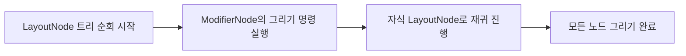

# Modifier 체인의 구성 방식

> [!abstract] Modifier
> 
> Compose UI에서 컴포저블에 장식이나 동작을 추가하기 위한 불변 요소(immutable element)의 컬렉션입니다.

Modifier는 다음과 같은 기능을 제공합니다:
- then: modifier를 연결(chain)할 수 있게 해주는 기능
- foldIn, foldOut: modifier 체인을 누적/전개하면서 값을 계산하는 기능
- any, all: 체인 내 modifier가 주어진 조건을 만족하는지 확인하는 기능

Modifier는 일종의 연결 리스트(linked list)처럼 동작하며, 체인의 시작(head)이 Modifier 타입 자체가 됩니다.


## foldIn과 foldOut

- Modifier 체인을 순회하며 값을 누적(accumulate)함
- Kotlin의 `fold` 함수와 유사한 방식
- Modifier.Element를 하나씩 방문하며 처리

| 함수명       | 순회 방향         | 순서                     | 주로 사용되는 경우                      |
|--------------|------------------|---------------------------|----------------------------------------|
| `foldIn`     | **바깥 → 안쪽**   | 첫 Modifier부터 시작      | Modifier 정보를 LayoutNode에 적용할 때 |
| `foldOut`    | **안쪽 → 바깥**   | 마지막 Modifier부터 시작 | LayoutNodeWrapper 체인 생성할 때       |


## modifier 체인

다음은 modifier 체인을 연결한 예시로, 
명시적(explicit) then과 암묵적(implicit) 체인을 혼합하여 사용하고 있습니다.

```kotlin
Box(
  modifier.then(indentMod)
    .fillMaxWidth()
    .height(targetThickness)
    .background(color = color)
)
```
  

위 코드에서 .fillMaxWidth() 등은 then을 명시하지 않았지만 내부적으로 then을 호출하는 확장 함수입니다.
이처럼 명시적(then)이든 암묵적(extension function)이든 둘 다 Modifier 체인을 형성하며, 결과적으로 동일하게 작동합니다.

실제 프로젝트에서는 extension function을 더 자주 사용하는 경향이 있습니다.

다음 코드는 확장 함수도 내부적으로는 then 을 사용하여 체인을 형성하고 있음을 보여줍니다. 

```kotlin
// Padding.kt
@Stable
fun Modifier.padding(
		horizontal: Dp = 0.dp,
		vertical: Dp = 0.dp
	) = this.then(
		PaddingModifier(
			start = horizontal,
			top = vertical,
			end = horizontal,
			bottom = vertical,
			// …
		)
	)
)
```

## CombinedModifier

위 코드처럼, then을 통해 modifier를 연결하면 CombinedModifier가 생성되며, modifier 체인이 형성됩니다.
CombinedModifier는 현재 modifier를 가리키는 outer와 다음 modifier를 가리키는 inner를 가지고 있으며, 이 구조는 재귀적으로 연결되어 전체 체인을 구성합니다.


```kotlin
// Modifier.kt

/**  
 * Concatenates this modifier with another.
 *
 * Returns a [Modifier] representing this modifier followed by [other] in sequence. */
infix fun then(other: Modifier): Modifier =  
    if (other === Modifier) this else CombinedModifier(this, other)

  
/**  
 * A node in a [Modifier] chain. A CombinedModifier always contains at least two elements; * a Modifier [outer] that wraps around the Modifier [inner].  
 */
 class CombinedModifier(  
    internal val outer: Modifier,  
    internal val inner: Modifier  
) : Modifier {  
    override fun <R> foldIn(initial: R, operation: (R, Modifier.Element) -> R): R =  
        inner.foldIn(outer.foldIn(initial, operation), operation)  
  
    override fun <R> foldOut(initial: R, operation: (Modifier.Element, R) -> R): R =  
        outer.foldOut(inner.foldOut(initial, operation), operation)  
  
    override fun any(predicate: (Modifier.Element) -> Boolean): Boolean =  
        outer.any(predicate) || inner.any(predicate)  
  
    override fun all(predicate: (Modifier.Element) -> Boolean): Boolean =  
        outer.all(predicate) && inner.all(predicate)  
  
    override fun equals(other: Any?): Boolean =  
        other is CombinedModifier && outer == other.outer && inner == other.inner  
  
    override fun hashCode(): Int = outer.hashCode() + 31 * inner.hashCode()  
  
}
```
  

정리하자면,
- Modifier는 연결 리스트 구조를 통해 체인으로 구성됩니다.
- 체인은 명시적 then 또는 확장 함수로 연결됩니다.
- 연결된 modifier는 CombinedModifier를 통해 관리되며, outer와 inner로 체인 트리를 구성합니다.

# LayoutNode에 Modifier를 적용하는 방식


## Layout 함수에서 modifier 할당

Layout 컴포저블 함수는 기본적으로 Modifier를 파라미터로 받으며, 이를 기반으로 LayoutNode에 Modifier 체인을 설정합니다.  

다음은 Layout 함수 정의 예시입니다.

```kotlin
@Composable inline fun Layout(  
  modifier: Modifier = Modifier, // 1. ✅
  measurePolicy: MeasurePolicy  
) {  
  val density = LocalDensity.current  
  val layoutDirection = LocalLayoutDirection.current  
  val viewConfiguration = LocalViewConfiguration.current  

  val materialized = currentComposer.materialize(modifier) // 2. ✅

  ReusableComposeNode<ComposeUiNode, Applier<Any>>(  
    factory = { LayoutNode() },  
    update = {  
      set(measurePolicy, { this.measurePolicy = it })  
      set(density, { this.density = it })  
      set(layoutDirection, { this.layoutDirection = it })  
      set(viewConfiguration, { this.viewConfiguration = it })  
      set(materialized, { this.modifier = it })  // 3. ✅
    }  
  )  
}
```

update 람다는 factory로 생성된 노드에 바로 호출되어, LayoutNode의 상태를 초기화하거나 업데이트합니다. 이때 modifier도 함께 적용됩니다.

## materialized modifier란?

materialized란 modifier는 Compose가 modifier를 "실제 적용 가능한 형태로 변환한 결과"입니다.  
다음과 같이 materialize 함수에서 생성됩니다.

```kotlin
// ComposedModifier.kt
val materialized = currentComposer.materialize(modifier)


@Suppress("ModifierFactoryExtensionFunction")
private fun Composer.materializeImpl(modifier: Modifier): Modifier {
    if (modifier.all { it !is ComposedModifier }) {
        return modifier
    }

    // This is a fake composable function that invokes the compose runtime directly so that it
    // can call the element factory functions from the non-@Composable lambda of Modifier.foldIn.
    // It would be more efficient to redefine the Modifier type hierarchy such that the fold
    // operations could be inlined or otherwise made cheaper, which could make this unnecessary.

    // Random number for fake group key. Chosen by fair die roll.
    startReplaceableGroup(0x48ae8da7)

    val result = modifier.foldIn<Modifier>(Modifier) { acc, element ->
        acc.then(
            if (element is ComposedModifier) {
                @Suppress("UNCHECKED_CAST")
                val factory = element.factory as Modifier.(Composer, Int) -> Modifier
                val composedMod = factory(Modifier, this, 0)
                materializeImpl(composedMod)
            } else {
                element
            }
        )
    }

    endReplaceableGroup()
    return result
}
```

이 함수는 전달된 modifier가 <u>표준(standard) modifier</u> 일 경우 그대로 반환합니다.  
즉, 별도 가공 없이 LayoutNode에 바로 전달될 수 있는 상태입니다.

## ComposedModifier

modifier가 Composition의 문맥(context) 내에서 동작해야 하는 경우, 즉 상태(state)를 가져야 하는 경우에는 composed modifier로 래핑됩니다.  
이러한 modifier는 LayoutNode에 바로 적용될 수 없고, 먼저 compose되어야 합니다.

ComposedModifier 클래스는 다음과 같이 정의됩니다.

```kotlin
// ComposedModifier.kt

private open class ComposedModifier(  
    inspectorInfo: InspectorInfo.() -> Unit,  
    val factory: @Composable Modifier.() -> Modifier  
) : Modifier.Element, InspectorValueInfo(inspectorInfo)

fun Modifier.composed(
    inspectorInfo: InspectorInfo.() -> Unit = NoInspectorInfo,
    factory: @Composable Modifier.() -> Modifier
): Modifier = this.then(ComposedModifier(inspectorInfo, factory))
```

compose 과정은 factory 람다 안에서 실행되며, Composition 문맥 내에서 실행되어야 하므로 LayoutNode가 직접 composed modifier를 다룰 수는 없습니다.


이에 대한 예시로 clickable modifier를 살펴보면,

```kotlin
// Clickable.kt
fun Modifier.clickable(
    enabled: Boolean = true,
    onClickLabel: String? = null,
    role: Role? = null,
    onClick: () -> Unit
) = composed( // ✅: ComposedModifier 를 생성하여 래핑
    inspectorInfo = debugInspectorInfo {
        name = "clickable"
        properties["enabled"] = enabled
        properties["onClickLabel"] = onClickLabel
        properties["role"] = role
        properties["onClick"] = onClick
    }
) {
    val localIndication = LocalIndication.current
    val interactionSource = if (localIndication is IndicationNodeFactory) {
        // We can fast path here as it will be created inside clickable lazily
        null
    } else {
        // We need an interaction source to pass between the indication modifier and clickable, so
        // by creating here we avoid another composed down the line
        remember { MutableInteractionSource() }// ✅: 상태를 저장
    }
    Modifier.clickable(
        enabled = enabled,
        onClickLabel = onClickLabel,
        onClick = onClick,
        role = role,
        indication = localIndication,
        interactionSource = interactionSource
    )
}
```

이처럼 composed modifier는 remember 등을 사용하여 상태를 저장할 수 있으며, Composition 내부에서 정의되어야만 사용할 수 있습니다.

## LayoutNode가 새로운 Modifier를 처리하는 과정

AndroidComposeView에서 루트 LayoutNode를 설정할 때도 modifier가 지정됩니다.

```kotlin
override val root = LayoutNode().also {  
  it.measurePolicy = RootMeasurePolicy  
  it.modifier = Modifier // ✅
    .then(semanticsModifier)  
    .then(_focusManager.modifier)  
    .then(keyInputModifier)  
  it.density = density  
}
```

modifier 체인이 새로 설정되면, 기존 LayoutNode의 modifier들은 캐시에 저장됩니다.  
이 캐시는 동일한 modifier 인스턴스를 재사용하기 위해 사용되며, foldIn 함수를 통해 modifier 체인을 순회합니다.

- 캐시에 동일한 modifier가 존재하면 재사용 가능하다고 판단하고, 해당 modifier와 그 상위 modifier들을 재사용 가능 상태로 표시합니다.
- 이후 LayoutNode는 LayoutNodeWrapper 체인을 재구성합니다. 이때 가장 바깥쪽 modifier부터 내부로 감싸며 체인을 만듭니다.

## 측정을 위한 Modifier 처리 과정

modifier 체인을 기반으로 LayoutNodeWrapper를 생성할 때는 아래 방향으로 foldOut을 수행합니다.  
다이어그램에서는 outer → inner 방향으로 감싸지며, 최종적으로 LayoutNode가 감싸는 구조가 완성됩니다.

- 각 modifier는 캐시 확인 후 재사용 가능하면 캐시에서 제거되고 체인에 연결됩니다.
- 재사용 불가능한 경우, LayoutNodeWrapper로 감싼 후 체인에 연결됩니다.
- 최종적으로 가장 바깥 modifier가 outerLayoutNodeWrapper가 되어 parent의 inner wrapper로 할당됩니다.
- 이후 attach()를 호출하여 새로운 wrapper들에 적용하고, 이전 modifier들은 무효화(invalidate) 됩니다.
- 필요시 부모 노드에 remeasure 요청이 전파됩니다.

# 노드 트리의 렌더링 과정



LayoutNodeWrapper 체인을 따라 노드를 순서대로 그리는 과정이 수행된다.  
현재 노드를 먼저 그린 다음, modifier를 그리고, 마지막으로 자식 노드를 그리는 방식으로 재귀적으로 수행된다.

Android 시스템에서도 draw pass는 measure/layout 이후에 발생하며, Compose도 동일하다.  
LayoutNode가 remeasure 요청 시 dirty 상태로 플래그 되며, 다음 draw pass에서 Owner (예: AndroidComposeView)가 이를 감지하고 다시 measure, layout, draw를 수행한다.

## draw의 시작

drawing은 루트 LayoutNode에서 시작되며, 다음 호출을 통해 실행된다.

root.draw(canvas)

이 호출은 내부적으로 outerLayoutNodeWrapper에 위임된다.  
각 LayoutNodeWrapper는 자신의 drawing layer를 가질 수 있으며, 아래 경우에 따라 그려진다:

1. drawing layer가 있을 경우 → 해당 wrapper에 dispatch 되어 node나 modifier를 그림  
2. drawing layer는 없지만 draw modifiers가 있을 경우 → modifier들을 직접 그림  
3. 둘 다 없을 경우 → 다음 wrapper로 위임하며 LayoutNode 전체를 그림

## Compose Canvas

> [!abstract] Compose Canvas
> Compose UI에서 사용하는 Canvas는 추상화된 타입입니다.
> Android에서는 native Canvas에 위임한다.

Compose Canvas는 Paint 객체를 직접 사용하지 않으며, 내부적으로 공유 가능한 Paint를 재사용하도록 설계되어 있다.

## Drawing Layer

### 종류

LayoutNode는 두 가지 타입의 Drawing Layer를 가질 수 있다.
둘 다 [하드웨어 가속을 지원]하며, Modifier.graphicsLayer 등에서 사용 가능하다.

#### RenderNodeLayer

**기본 구현**으로, Jetpack Compose에서 성능 좋은 하드웨어 드로잉을 위해 사용한다.
여러 번 재사용 가능하다.
#### ViewLayer

RenderNode를 사용할 수 없는 상황에서 **fallback으로 사용**. View를 RenderNode처럼 활용함.  
단, 퍼포먼스와 구현 복잡도에서 단점이 있음.

### 생성 시점

*새로운 노드가 attach 될 때 Drawing Layer가 생성된다.*

1. AndroidComposeView는 플랫폼이 지원하는 경우 [[#RenderNodeLayer|RenderNodeLayer]]를 우선 사용하고, 아니면 [[#ViewLayer|ViewLayer]]로 fallback한다.
2. [[#ViewLayer|ViewLayer]]는 내부에 Container View를 가진다.
	- 이 View가 drawing 트리거 역할을 한다.  
	- 이 View는 ViewGroup#drawChild를 통해 자식 layer를 그리게 된다.
	- [[#ViewLayer|ViewLayer]]는 elevation mode를 지원하며, 이를 통해 그림자나 z-index 효과를 줄 수 있다. 
	- elevation mode는 draw 후 자동으로 해제된다.

## dispatchDraw와 drawing 트리거

모든 wrapper가 chaining된 이후, AndroidComposeView는 dispatchDraw를 호출하여 dirty로 플래그된 layer들의 drawing을 수행한다.  
이 작업은 캔버스를 업데이트하며, 그릴 필요가 있는 노드들만 invalidate 상태로 바꾼다.

만약 snapshot 상태가 변하여 LayoutNode가 layer에 그려질 필요가 생기면, 다시 draw pass를 트리거해야 할 수도 있다.

## AndroidComposeView 예시

```kotlin
override val root = LayoutNode().also {
  it.measurePolicy = RootMeasurePolicy
  it.modifier = Modifier
    .then(semanticsModifier)
    .then(_focusManager.modifier)
    .then(keyInputModifier)
  it.density = density
}
```

RootMeasurePolicy는 자식 노드들을 측정/배치하며,  
placeable.placeRelativeWithLayer(0, 0)을 호출하여 (0, 0) 위치에 layer를 배치한다.

이때 graphic layer가 도입되며, snapshot 상태 변화에 따라 자동으로 그려지는 구조가 설정된다.
