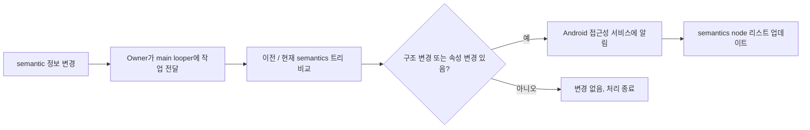
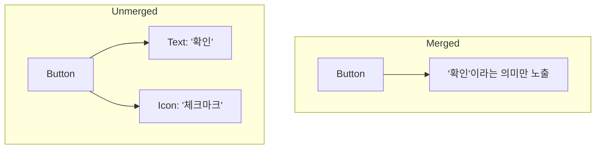

Jetpack Compose에서는 UI를 기술하는 Composition 트리 외에, 접근성 서비스와 테스트 프레임워크가 이해할 수 있도록 의미론적(semantic) 의미를 전달하는 또 하나의 트리가 존재한다.  

각 LayoutNode는 이 semantic 트리에 메타데이터를 제공하게 되며, 이를 통해 UI의 구조 외에도 의미를 전달할 수 있다.

## Owner와 접근성

LayoutNode의 계층은 accessibility delegate를 가지며, Android SDK로 semantics를 전달한다.  
노드가 attach, detach 되거나 semantics가 변경될 때마다 Owner를 통해 semantic 트리로 전달된다.

AndroidComposeView가 생성될 때(setContent 호출 시), 루트 LayoutNode는 기본 modifier들과 함께 초기화된다.

```kotlin
// AndroidComposeView.android.kt

internal class AndroidComposeView(
    // ...
    override val semanticsOwner: SemanticsOwner = SemanticsOwner(root, rootSemanticsNode)
    private val composeAccessibilityDelegate =
        AndroidComposeViewAccessibilityDelegateCompat(this) // ✅


    private val rootSemanticsNode = EmptySemanticsModifier()
    private val semanticsModifier = EmptySemanticsElement(rootSemanticsNode)

    // ...
    override val root = LayoutNode().also {
        it.measurePolicy = RootMeasurePolicy
        it.density = density
        // Composed modifiers cannot be added here directly
        it.modifier = Modifier
            .then(semanticsModifier) // ✅
            .then(rotaryInputModifier)
            .then(keyInputModifier)
            .then(focusOwner.modifier)
            .then(dragAndDropModifierOnDragListener.modifier)
    }
    // ...
```

이 modifier들은 접근성과 semantics에 관련된 역할을 한다.

- semanticsModifier: 기본 semantics 트리를 구성
- focusOwner: 키보드 포커스를 위한 Modifier 설정
- keyInputModifier: 키보드 입력 이벤트를 처리

## semantics modifier 직접 사용

다른 노드에 semantics를 추가할 땐 Modifier.semantics 블록을 사용한다.

```kotlin
// SemanticsModifier.kt
fun Modifier.semantics(
    mergeDescendants: Boolean = false,
    properties: (SemanticsPropertyReceiver.() -> Unit)
): Modifier = this then AppendedSemanticsElement(
    mergeDescendants = mergeDescendants,
    properties = properties
)
```

~~각 semantics modifier는 고유한 id를 가지며, Composition context에서 remember로 유지된다. 이 modifier는 composed modifier로 구현되어 있으므로 Composition 문맥이 필요하다. 향후 리팩터링을 통해 Composition context 없이 생성될 예정.~~

=> 현재는 `remember`를 사용하지 않음


## semantics 변경 알림



다음의 순서로 동작이 수행된다:

1.	LayoutNode의 semantics 속성이 변경되면, 해당 노드를 소유하고 있는 Owner는 이 변경 사항을 Android 접근성 서비스에 반영하기 위해, 관련 작업을 **main looper에 등록(post)**합니다. 이 작업은 비동기로 처리되며, AndroidComposeView에서 수행됩니다.
2.	main looper에 등록된 작업이 실행되면, AndroidComposeView는 현재 semantics 트리를 다시 생성한 후, 이전에 캐시해 둔 semantics 트리와 비교하여 트리 구조 또는 semantics 속성의 변경 여부를 분석합니다. 이때 SemanticsOwner는 SemanticsNode 간의 식별자(id)를 기준으로 변화 여부를 판단합니다.
3.	트리 구조에 변경이 감지되었거나, 특정 semantics property 값(예: contentDescription, stateDescription, role, enabled 등)에 변경이 있을 경우, AndroidComposeView는 ViewCompat#notifySubtreeAccessibilityStateChanged 또는 유사한 접근성 알림 API를 호출하여, **Android 접근성 서비스(TalkBack 등)**에 해당 변경을 알립니다.
4.	마지막으로, SemanticsOwner는 현재 semantics 트리를 새롭게 캐싱하여, 다음 변경 비교 시점까지 참조할 수 있도록 이전 상태를 업데이트합니다. 이를 통해 불필요한 알림을 방지하고 성능을 최적화합니다.

```kotlin
// AndroidComposeView.android.kt
    override fun onSemanticsChange() {
        composeAccessibilityDelegate.onSemanticsChange() // ✅
        contentCaptureManager.onSemanticsChange()
    }

// AndroidComposeViewAccessibilityDelegateCompat.kt
    internal fun onSemanticsChange() {
        // When accessibility is turned off, we still want to keep
        // currentSemanticsNodesInvalidated up to date so that when accessibility is turned on
        // later, we can refresh currentSemanticsNodes if currentSemanticsNodes is stale.
        currentSemanticsNodesInvalidated = true

        if (isEnabled && !checkingForSemanticsChanges) {
            checkingForSemanticsChanges = true
            handler.post(semanticsChangeChecker) // ✅
        }
    }
```

## semantics 트리의 병합

Jetpack Compose에는 병합된(merged) semantics 트리와 병합되지 않은(unmerged) 트리 두 가지가 존재한다.  


병합은 Modifier.semantics 블록 내 mergeDescendants = true 로 활성화된다.

| 구분    | 병합된 트리 (Merged)             | 병합되지 않은 트리 (Unmerged)        |
| ----- | --------------------------- | ---------------------------- |
| 구성    | 상위 노드가 하위 노드의 정보를 흡수        | 각 노드가 자신의 정보를 개별적으로 유지       |
| 사용 시점 | 일반적인 접근성 API 사용 시           | 테스트나 디버깅 목적으로 더 구체적인 정보 필요 시 |
| 예시    | Button 내부의 텍스트가 하나의 의미로 표현됨 | Button과 Text 각각의 의미가 분리됨     |

### 내부 구현

```kotlin
MyButton(  
  modifier = Modifier.semantics { contentDescription to "Add to favorites" }  
)
```

contentDescription은 다음과 같이 정의된다.

```kotlin
object SemanticsProperties {
    val ContentDescription = AccessibilityKey<List<String>>(
        name = "ContentDescription",
        mergePolicy = { parentValue, childValue ->
            parentValue?.toMutableList()?.also { it.addAll(childValue) } ?: childValue
        }
    )
```

mergePolicy는 semantics property 병합 방법을 정의한다.  
contentDescription은 하위 노드들의 값을 리스트로 병합하는 방식이다.  
기본 병합 정책은 대부분 "부모 값 유지, 자식 무시"이다.


### 시각적 흐름

```kotlin
@Composable
fun MergedButton() {
    Button(
        onClick = { /* TODO */ },
        modifier = Modifier.semantics(mergeDescendants = true) {} // 하위 semantics 병합
    ) {
        Icon(Icons.Default.Check, contentDescription = null)
        Text("확인")
    }
}
```

```kotlin
@Composable
fun UnmergedButton() {
    Button(
        onClick = { /* TODO */ },
        modifier = Modifier // 병합 X
    ) {
        Icon(Icons.Default.Check, contentDescription = "체크마크") // 별도 semantics
        Text("확인") // 별도 semantics
    }
}
```



## 요약

- Composition 외에도 semantics tree가 병렬로 존재
- semanticsModifier는 기본 접근성을 위한 modifier
- Modifier.semantics 블록으로 사용자 정의 semantics 추가 가능
- semantics 변경 시 Owner를 통해 Android 접근성 시스템에 알림
- mergeDescendants 속성으로 semantics 트리 병합 여부 설정 가능

