# Compose UI와 런타임 통합

## 구조 흐름도

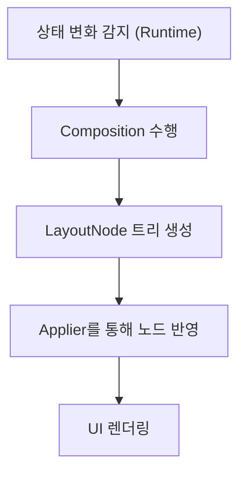

## 주요 역할 정리

| 구성 요소       | 역할 설명                              |
| --------------- | -------------------------------------- |
| Compose Runtime | 상태 감지 및 Composition 수행          |
| Compose UI      | UI 트리 구성 및 렌더링 처리            |
| Applier         | Composition 결과를 LayoutNode에 반영   |
| LayoutNode      | Compose UI의 트리 구조, 실제 UI의 기반 |

## 핵심 요약

- **Runtime**이 상태 변화를 감지하고 Composition을 실행
- **Composition** 결과로 **LayoutNode** 트리 생성
- **Applier**가 LayoutNode에 변화를 적용
- 최종적으로 **Compose UI**가 UI를 렌더링

# 변경 사항 적용 과정

## 적용 흐름도

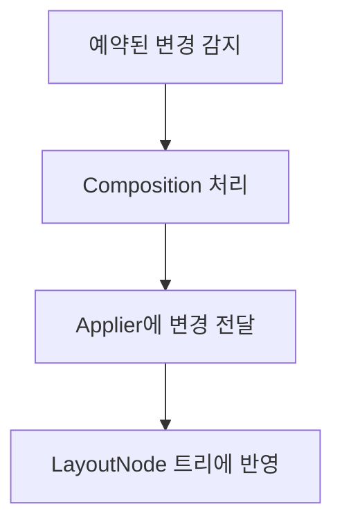

## 주요 변경 유형

| 변경 유형   | 설명                           |
| ----------- | ------------------------------ |
| 노드 추가   | 새로운 UI 요소를 트리에 추가   |
| 노드 이동   | 기존 노드의 순서를 변경        |
| 노드 제거   | 더 이상 필요 없는 노드를 삭제  |
| 전체 초기화 | 모든 노드를 제거하고 새로 구성 |

## 핵심 요약

- 변경 사항은 Composition 단계에서 감지됨
- Applier를 통해 실제 LayoutNode 트리에 적용
- Compose UI는 이 변경을 UI에 즉시 반영

## 노드 추가, 이동, 제거, 초기화

### 변경 작업 흐름

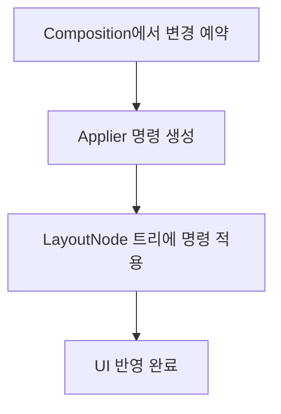

### 변경 작업 종류

| 작업 종류   | 설명                                    |
| ----------- | --------------------------------------- |
| 노드 추가   | 새 LayoutNode를 생성하여 트리에 삽입    |
| 노드 이동   | 기존 노드의 위치를 재조정               |
| 노드 제거   | 더 이상 필요 없는 노드를 삭제           |
| 전체 초기화 | 모든 노드를 제거하고 트리를 초기 상태로 |

### 핵심 요약

- 변경은 예약 → 명령 생성 → 트리에 반영 → UI 업데이트 순으로 진행
- 각 작업은 Applier에 의해 실행되며, LayoutNode를 직접 수정

# Composition과 Subcomposition

## 개념 요약

- **Composition**: Composable 함수들을 실행해 UI 트리를 구성하는 과정
- **Subcomposition**: 부모 Composition 내에서 자식에 대해 별도로 Composition을 수행하는 것

## 흐름 비교

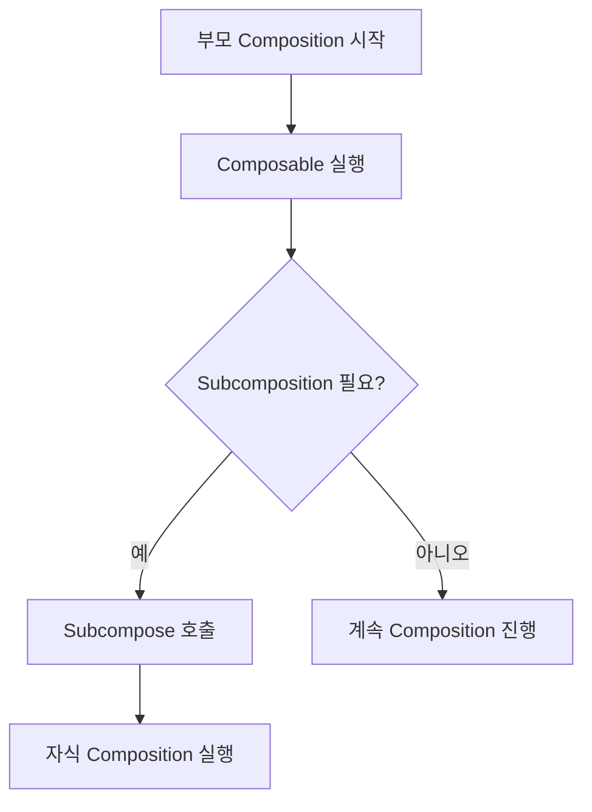

## 차이점 정리

| 항목 | Composition                    | Subcomposition                                |
| ---- | ------------------------------ | --------------------------------------------- |
| 정의 | UI를 구성하는 기본 단위        | 중첩 Composition을 위한 별도 Composition 호출 |
| 위치 | 루트 또는 부모 Composable 내부 | 특정 Composable 내부에서 조건부로 수행됨      |
| 목적 | 전체 UI 구조 생성              | 자식 콘텐츠를 동적으로 제어하기 위함          |

## 예시 상황

- LazyColumn의 각 아이템 콘텐츠를 별도로 Composition 해야 할 때
- 조건에 따라 UI가 바뀌는 블록 내부에서 다른 UI를 구성할 때

# 측정과 레이아웃

## 개요

Compose UI의 레이아웃 시스템은 `측정` → `배치` → `그리기`의 단계를 따릅니다. 각 LayoutNode는 부모의 제약 조건 하에서 크기를 측정하고, 위치를 결정합니다.

## 레이아웃 처리 흐름

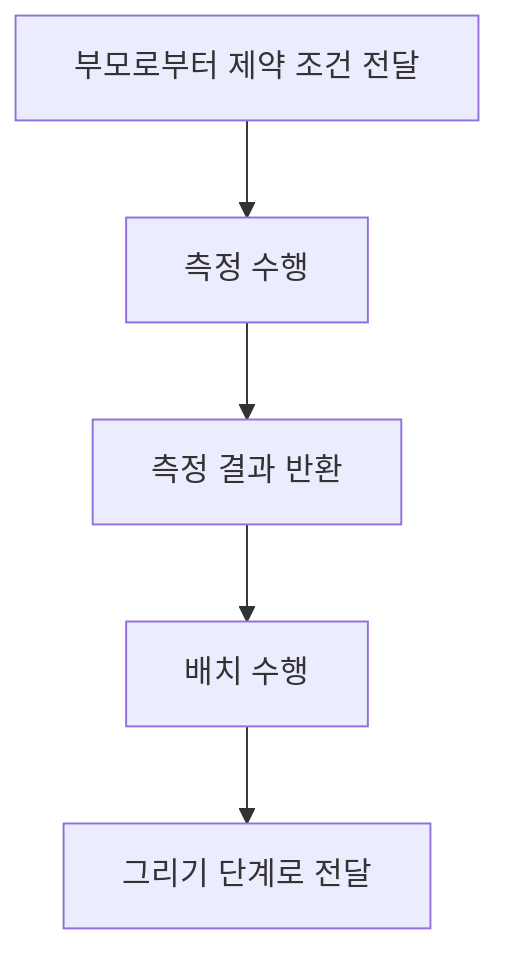

## 주요 개념 요약

| 개념            | 설명                                                  |
| --------------- | ----------------------------------------------------- |
| 측정 정책       | 자식의 크기를 계산하기 위한 로직                      |
| 고유 크기       | 자식이 원하는 최소/최대 크기 측정 방법                |
| 제약 조건       | 부모로부터 전달받는 최대/최소 크기 제한               |
| LookaheadLayout | 예상 크기와 위치를 미리 측정하여 애니메이션 등에 활용 |

## LookaheadLayout

### 개요

LookaheadLayout은 애니메이션이나 상태 변화가 발생하기 전, **앞으로 일어날 레이아웃 변경을 예측**하여 미리 측정하고 배치하는 고급 레이아웃 기능입니다.

### 처리 흐름

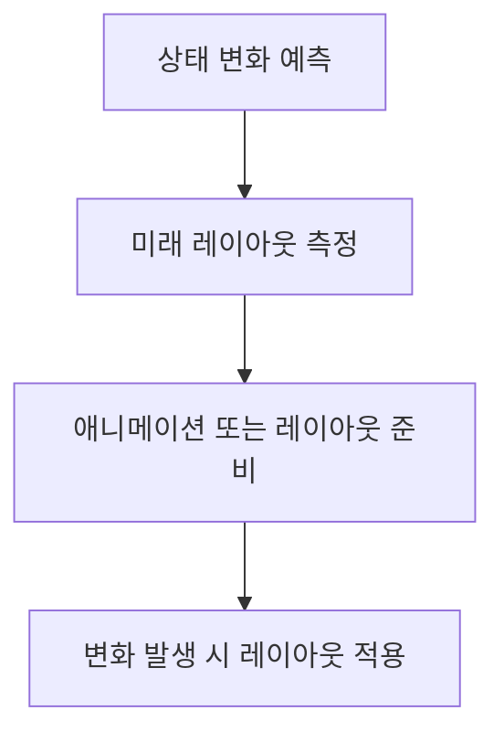

### 활용 사례

- 크기나 위치가 변하는 UI에 자연스러운 애니메이션을 적용할 때
- LazyColumn 항목의 추가/제거 등 레이아웃이 바뀌기 전에 미리 배치 준비

### 핵심 요약

- LookaheadLayout은 미래 레이아웃을 **미리 측정**
- 사용자 경험을 자연스럽게 유지하기 위한 **애니메이션 기반 레이아웃 전략**

## 고유 크기

### 개요

고유 크기(혹은 Intrinsic Size)는 자식 컴포저블이 부모의 제약 없이 원하는 최소/최대 크기를 측정하는 개념입니다.

### 동작 방식

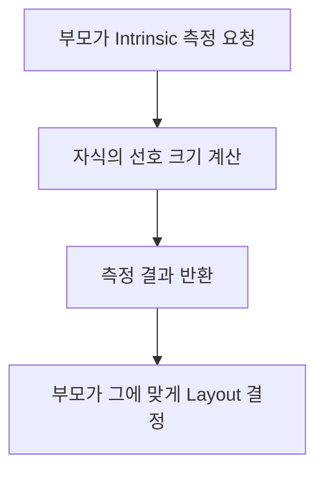

### 관련 API

- `minIntrinsicWidth()`, `maxIntrinsicWidth()`
- `minIntrinsicHeight()`, `maxIntrinsicHeight()`

### 활용 예시

- 버튼 안의 텍스트 크기에 따라 버튼 크기를 자동으로 결정할 때
- 동적으로 텍스트 길이에 맞는 레이아웃을 구성할 때

### 핵심 요약

- 고유 크기는 **제약 조건이 없는 상태**에서의 자식의 **선호 크기**
- 복잡한 동적 레이아웃에서 유용하게 사용됨

## 핵심 요약

- 각 LayoutNode는 상위 제약에 따라 측정 및 배치를 수행
- 측정 정책과 고유 크기 계산은 커스텀 레이아웃 구현에 핵심
- LookaheadLayout은 변화 예측 기반의 고급 레이아웃 기능

## 측정 정책

### 개요

측정 정책(MeasurePolicy)은 LayoutNode가 자식 노드들을 어떻게 측정하고 배치할지를 정의합니다. 커스텀 레이아웃을 만들기 위해 필수적인 개념입니다.

### 역할 흐름

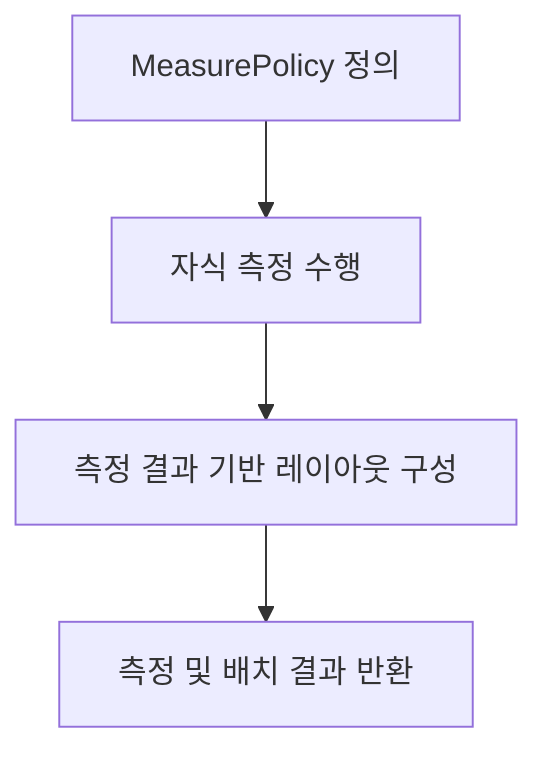

### 핵심 메서드

- `measure()`: 자식들을 주어진 제약조건 하에서 측정
- `layout()`: 측정된 결과를 바탕으로 자식들을 배치

### 핵심 요약

- 모든 커스텀 레이아웃은 MeasurePolicy를 제공해야 함
- 자식 측정, 위치 계산, 최종 크기 산출이 이 안에서 정의됨

## 제약 조건

### 개요

제약 조건(Constraints)은 부모가 자식에게 전달하는 최소/최대 크기 범위입니다. 자식은 이 범위 안에서만 측정되어야 합니다.

### 동작 구조

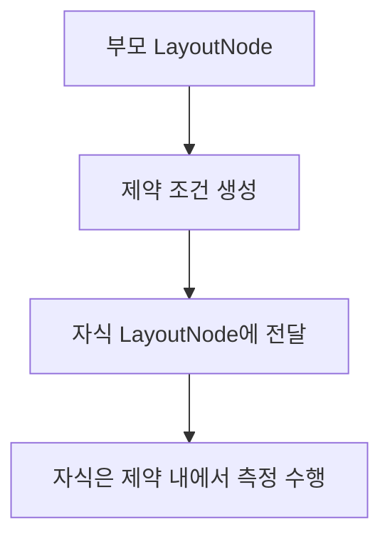

### 주요 속성

- `minWidth`, `maxWidth`
- `minHeight`, `maxHeight`

### 예시

- Column 내부에서 Text에 가로 최대값을 200dp로 제한할 경우
- Box 안에 있는 요소의 크기를 비율로 제한할 경우

### 핵심 요약

- 제약 조건은 **부모 → 자식** 방향으로 전달됨
- 자식은 이 범위 안에서만 측정 및 배치 가능
- LayoutNode 간의 레이아웃 계산을 연결하는 핵심 매개체

# Modifier 체인 처리

🧩 개요

Modifier는 동작, 스타일, 레이아웃, 입력 등 UI 요소의 특성을 부여하는 구성 요소입니다.
이들은 체인 형태로 연결되어 처리됩니다 (Modifier.then(...)).

⚙️ 처리 흐름

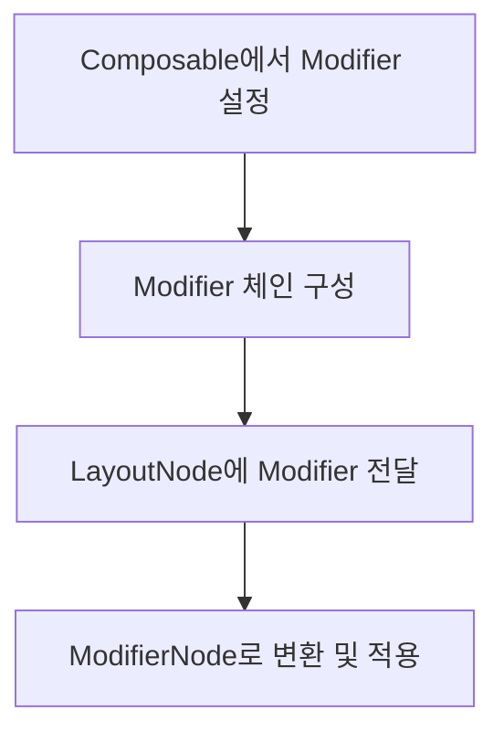

🧠 처리 방식 요약

단계 설명
체인 구성 Modifier가 순차적으로 연결됨
적용 LayoutNode가 Modifier를 순회하면서 ModifierNode로 변환
실행 ModifierNode는 레이아웃, 그리기, 입력 처리 등을 담당

✨ 핵심 요약

- Modifier는 순차적으로 연결되는 체인 구조
- 각 Modifier는 LayoutNode에 의해 ModifierNode로 변환되어 실행
- ModifierNode는 실제 UI 동작을 구현하는 단위

## Modifier 적용 과정

### 개요

Modifier는 체인 형태로 결합되며, 각 Modifier는 ModifierNode로 변환되어 LayoutNode에 적용됩니다. 이 과정은 순차적이며, 각 ModifierNode는 UI에 다양한 기능을 추가합니다.

### 처리 단계

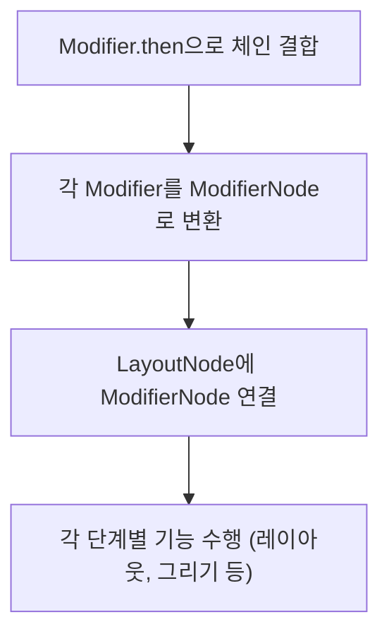

### 주요 특징

- Modifier는 선언 순서대로 실행됨
- ModifierNode는 기능별 콜백을 통해 동작 (e.g. `onDraw`, `measure`)
- 필요에 따라 ModifierNodeElement로 재사용성 확보 가능

### 핵심 요약

- Modifier는 순차적이고 명확한 처리 단계를 거쳐 UI 기능을 조립
- ModifierNode는 UI의 실제 동작을 담당하는 핵심 단위

## 노드 트리 그리기

### 개요

Compose는 LayoutNode 트리를 순회하며 각 노드의 그리기 명령을 실행합니다. Modifier에 정의된 그리기 동작(onDraw 등)도 함께 적용됩니다.

### 그리기 흐름

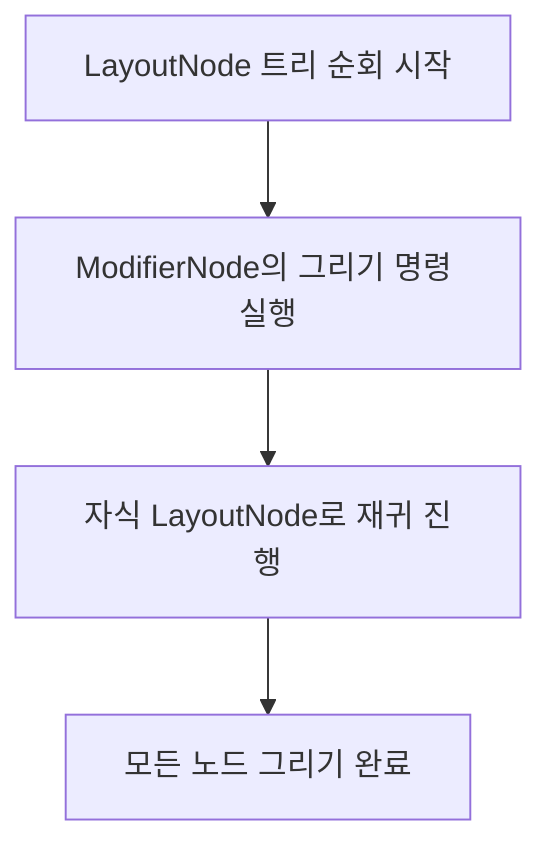

### 처리 방식

- ModifierNode의 `DrawModifier`는 `onDraw()` 등을 통해 그리기 명령 제공
- LayoutNode는 자신의 ModifierChain을 따라 순차적으로 그리기 실행
- 자식 노드에 대해 재귀적으로 같은 과정 수행

### 핵심 요약

- 모든 그리기는 Modifier + LayoutNode에 의해 정의됨
- 그리기는 트리 구조를 따라 재귀적으로 수행
- `DrawModifier`가 그리기 커스터마이징의 핵심 역할

## 의미 정보(Semantics)

### 개요

Semantics는 UI 요소에 **의미**를 부여하여 접근성(Accessibility) 및 테스트 도구 등이 요소를 이해하고 조작할 수 있도록 돕는 기능입니다.

### 처리 흐름

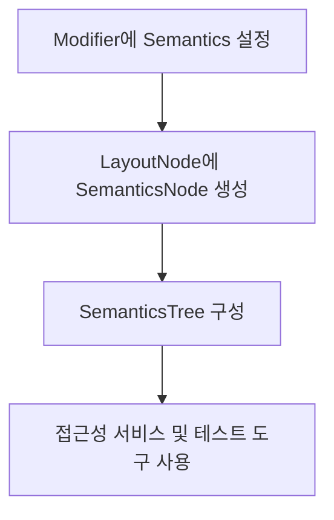

## 병합된 트리와 병합되지 않은 트리

### 개요

Semantics 트리는 접근성과 테스트 시스템이 UI를 이해하도록 돕기 위한 구조입니다. 이 트리는 **병합된 형태(Merged)** 또는 **병합되지 않은 형태(Unmerged)**로 표현될 수 있습니다.

### 병합 방식 비교

| 구분      | 병합된 트리 (Merged)                        | 병합되지 않은 트리 (Unmerged)                     |
| --------- | ------------------------------------------- | ------------------------------------------------- |
| 구성      | 상위 노드가 하위 노드의 정보를 흡수         | 각 노드가 자신의 정보를 개별적으로 유지           |
| 사용 시점 | 일반적인 접근성 API 사용 시                 | 테스트나 디버깅 목적으로 더 구체적인 정보 필요 시 |
| 예시      | Button 내부의 텍스트가 하나의 의미로 표현됨 | Button과 Text 각각의 의미가 분리됨                |

### 시각적 흐름 예시

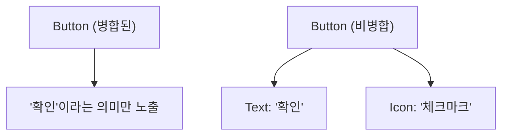

### 핵심 요약

- 병합 여부는 접근성 제공의 **정확도와 단순성**에 영향을 줌
- Compose는 상황에 따라 Merged/Unmerged 트리를 선택적으로 사용

## 변경 알림

### 개요

Semantics 변경이 발생하면 Compose는 이를 감지하고 시스템에 알려야 합니다. 이 과정은 접근성 도구 및 테스트 시스템의 동작에 매우 중요합니다.

### 처리 흐름

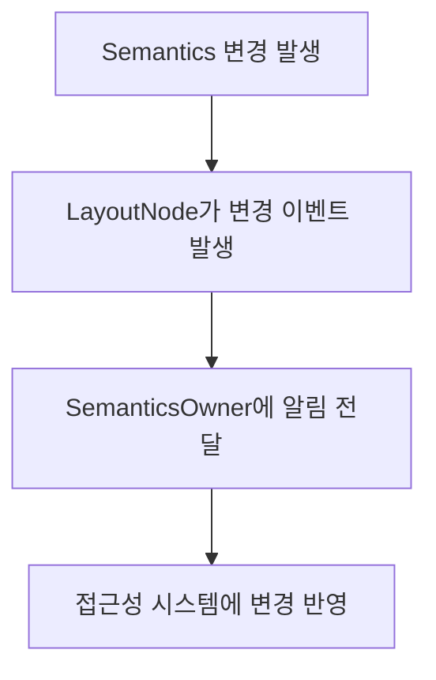

### 핵심 포인트

- `SemanticsModifierNode`에서 변경이 감지됨
- `SemanticsOwner`가 변경을 수신하고 시스템에 전파
- 예: 텍스트가 바뀌면 스크린 리더에 즉시 반영됨

### 핵심 요약

- Semantics 변경은 Compose 내부에서 감지 및 전달됨
- 접근성과 관련된 UI 상태 동기화를 위한 필수 메커니즘
