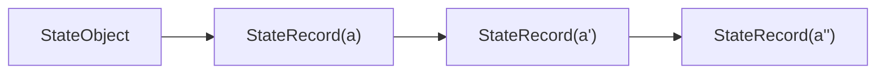
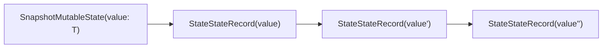
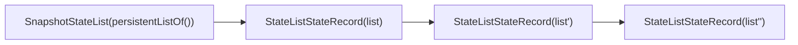
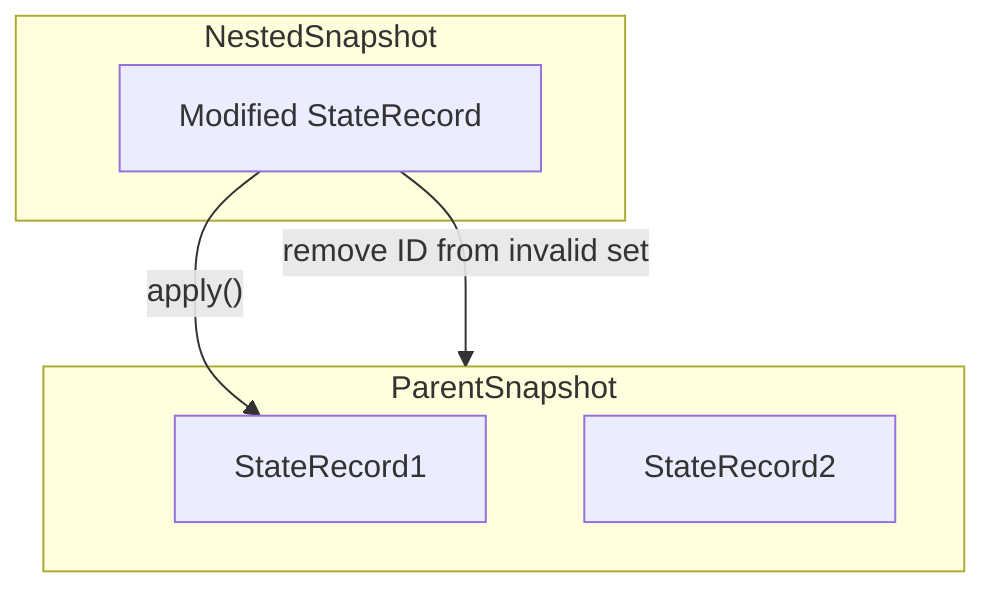

Jetpack Compose는 상태(state)를 표현하고 상태 변경을 전파하는 독특한 방식을 가지고 있으며, 이는 Compose의 핵심인 리액티브 경험을 가능하게 하는 **스냅샷 상태 시스템(state snapshot system)** 으로 구현됩니다.

입력값의 변화에 따라 컴포넌트가 **필요한 경우에만 자동으로 recomposition**되기 때문에, 이전의 Android View 시스템처럼 변화가 있을 때마다 직접 수동으로 알리는 보일러플레이트 코드를 작성할 필요가 없습니다.

# 스냅샷 상태
  
Jetpack Compose는 상태(state)를 표현하고 상태 변경을 전파하는 고유한 방식인 **State Snapshot System**을 통해 궁극적인 리액티브 경험을 제공합니다. 이 시스템은 코드의 재사용성을 높이고 보일러플레이트를 줄이며, UI 재구성을 자동화해줍니다.


## Snapshot State란?

  
**Snapshot state**란 **기억되고 변화 감지가 가능한 독립된 상태(isolated state)** 를 의미합니다. Compose에서 다음과 같은 함수들을 호출할 때 얻는 상태가 이에 해당합니다:

```kotlin
mutableStateOf(), mutableStateListOf(), mutableStateMapOf(),
derivedStateOf(), produceState(), collectAsState()
```

이들은 모두 State<T\> 타입을 반환하며, 일반적으로 snapshot state라고 부릅니다.

## Snapshot State의 구성

- **Jetpack Compose runtime**이 정의한 시스템의 일부로, 상태 변경 및 전파를 조정함.
- [[디커플링된 구조]]이므로 다른 라이브러리에서 상태 관찰에 사용할 수도 있음.
- **자동 상태 추적 기능**:
    ```kotlin
    @Composable
    fun Example() {
        val name = remember { mutableStateOf("Jetpack") }
        Text(name.value)
    }
    ```
	위 코드에서 name.value를 Compose 컴파일러가 감지하고, 이 값이 바뀌면 자동으로 [[The Compose Runtime - Composer#RecomposeScope|RecomposeScope]]가 무효화되어 UI를 다시 그립니다.
    

## Compose에서의 상태 전파 메커니즘

- Compose UI는 상태 변경 전파, 무효화 처리 등에 대해 전혀 몰라도 됨.
- Composable 함수들은 오직 **상태를 기반으로 작동하는 building block**을 제공하는 데 집중.
    

## Snapshot State와 상태 격리 (State Isolation)

Snapshot state는 단순히 자동 UI 업데이트에 그치지 않고, **병렬 환경에서도 안전한 상태 격리(state isolation)** 를 지원합니다.

- 여러 스레드에서 공유 상태를 사용할 때, 병렬 구성 가능성에 주의해야 함.
- Jetpack Compose는 이 문제를 해결하기 위해 snapshot system을 사용하고 있으며, 이는 [[Actor Model|Actor]]에 가깝고, 각각의 스레드가 상태의 복사본을 갖는 방식을 취함.
    


## 동시성 제어 시스템 (Concurrency Control System)

Snapshot state 시스템은 안전하게 상태를 공유하고 조정하기 위해 **동시성 제어(concurrency control)** 시스템을 기반으로 합니다.

> 즉, **mutable state를 여러 스레드에서 안전하게 다루는 문제**를 일반화하여 해결하고자 설계된 시스템입니다.


## SnapshotState의 코드 예시

```kotlin
@Stable
interface State<out T> {
    val value: T
}
```

### **이 계약에서 보장해야 할 조건:**

- equals 결과가 일관성 있게 동일함 (같은 인스턴스를 비교 시 항상 true).
- value 속성이 바뀌면 **Composition이 자동으로 감지됨**.
- 모든 public 속성은 **stable**해야 함.


# 동시성 제어 시스템

Jetpack Compose의 state snapshot system은 **concurrency control system**을 기반으로 구현됨.

### Concurrency Control이란?
동시 작업에서 올바른 결과를 보장하기 위한 **조정 및 동기화 메커니즘**. 시스템의 일관성을 보장하기 위해 일련의 규칙을 따르며, 이는 보통 성능과 트레이드오프 관계가 있음. 따라서 성능 저하 없이 가능한 효율적으로 설계하는 것이 핵심.

### 대표적인 예: 데이터베이스 트랜잭션 시스템
- 데이터 무결성을 지키면서 동시에 처리되는 트랜잭션을 안전하게 처리.
- **안전성(safety)** 은 다음을 포함:
  - 트랜잭션이 **원자적(atomic)** 임
  - 실패 시 **되돌릴 수 있음(revert)**
  - 중단된 트랜잭션이 **영향을 남기지 않음**

### Jetpack Compose에서의 적용
- 상태 변경은 **단일 원자적 작업(as a single atomic operation)** 으로 처리됨.
- 여러 상태 변경을 그룹핑하여 원자적 수행 → 병렬 환경에서 읽기/쓰기 조정이 간단해짐.
- **재현 가능한 변경 기록(history)** 을 통해 특정 상태를 쉽게 재생 가능.


## Concurrency Control System의 유형

- **Optimistic**
  - 읽기/쓰기 차단 없음.
  - 규칙 위반 시 트랜잭션을 중단(abort)하고 재시도.
  - 중단된 트랜잭션이 적을 경우 효과적.
  - Jetpack Compose가 사용하는 방식.
- **Pessimistic**
  - 규칙 위반 가능성 있을 경우 트랜잭션을 즉시 차단.
  - 데드락 위험 증가.

- **Semi-optimistic**
  - 하이브리드 접근.
  - 일부 작업은 pessimistic, 일부는 optimistic.

### “트랜잭션 차단(Blocking)” vs “트랜잭션  중단(Abort/Rollback)

- **차단**은 _“잠깐 기다렸다가_* 계속할 기회”* 를 주는 것이고,
- **중단**(Abort)은 _“이번 시도는 실패로 간주하고 처음부터 다시”_ 시작하게 만드는 것입니다.

> 즉, **차단 = 일시 정지**, **중단 = 완전 취소**라고 기억하면 이해가 쉽습니다.


| **구분**         | **차단(Blocking) =** **“잠깐 멈춰 서 기다림”**                                                          | **중단(Abort/Rollback) =** **“실패로 간주하고 되돌림”**                                    |
| -- |  |  |
| **목적**         | 충돌(잠금 충돌, 버전 충돌 등)을 해소할 때까지 _안전하게 대기_                                                         | 더 이상 진행해도 일관성을 보장할 수 없다고 판단될 때 _실행 취소_                                         |
| **상태**         | - 트랜잭션은 _활성(Active)_ 상태 유지<br>- 변경 내용은 아직 유효                                                  | - 트랜잭션은 _비활성(Aborted)_ 상태로 전환<br>- 지금까지의 변경 내용 전부 Rollback                     |
| **리소스(잠금) 처리** | 잠금을 그대로 보유한 채 잠시 멈춤 → 충돌 조건이 해소되면 계속 진행                                                       | 보유 잠금 즉시 해제 → 다른 트랜잭션이 자원 사용 가능                                                |
| **영향 범위**      | 주로 _성능_ 이슈 (대기 시간 증가)                                                                         | _정합성_ 보호 + 성능 영향(다시 시도 필요)                                                     |
| **예시 상황**      | ‑ 두 개의 트랜잭션이 같은 행(Row)을 2PL 잠금 방식으로 쓰기 시도 → 한쪽이 _BLOCK_ ‑ Oracle WAIT 모드, SQL Server LCK_M 대기 | ‑ 교착상태(Deadlock) 탐지 후 희생자 선정 → 한쪽 _ABORT_ ‑ MVCC에서 커밋 직전 “버전 충돌” 발견 → 롤백 후 재시도 |


## Jetpack Compose의 접근 방식

- **Optimistic 방식** 사용:
  - 충돌은 최종 변경 전파 시 감지됨.
  - 충돌이 발생하면 병합하거나 무시(abort).
- DBMS보다 단순한 시스템:
  - 오직 **정확성(correctness)** 만 유지.
  - 복구 가능성(recoverability), 내구성(durability), 분산(distribution) 등은 없음.
- Compose snapshot은 **in-memory, in-process**에서만 작동.
- [[ACID]] 중 "D(durability)"는 없음.
- 하지만 **Atomic, Consistent, Isolated**는 충족.


## MVCC: Multiversion Concurrency Control

Jetpack Compose의 snapshot system은 **MVCC**(Multiversion Concurrency Control)를 사용.

- 상태 객체를 수정할 때마다 새로운 버전을 생성.
- 여러 버전의 객체를 유지함으로써 **이전의 유효한 버전들을 읽을 수 있음**.
- 이를 통해 동시성과 성능 향상.

# MVCC

Jetpack Compose는 상태 스냅샷 시스템을 구현하기 위해 **MVCC (Multiversion Concurrency Control, 다중 버전 제어 시스템)** 를 사용합니다.

### 기본 개념
- Compose의 글로벌 상태는 여러 Composition에서 **스레드를 통해 공유**됨.
- Composable 함수는 병렬로 실행되므로, 상태를 **안전하게 읽고 수정하기 위한 격리(isolation)** 가 필요.

### MVCC의 격리 전략

- 각 스레드가 **자신만의 스냅샷 복사본**을 사용.
- 즉, 스레드는 특정 시점의 상태를 기반으로 작업하며, 작업 중인 변경은 다른 스레드에 **보이지 않음**.
- 변경은 **로컬에서 완료 후 전파됨**.
- 이를 **snapshot isolation**이라 부르며, 트랜잭션마다 어떤 버전을 볼지 결정하는 격리 수준을 설정.

### MVCC의 특징
- **불변성(immutability)** 기반: 상태를 수정할 때마다 **새로운 복사본**이 생성됨.
- 동일한 데이터에 대해 **여러 버전**이 메모리에 존재하게 됨.
  - Compose에서는 이를 **state records**라고 부름.
- 변경 이력을 통해 특정 시점으로 되돌리거나 이전 상태 참조가 가능.

### 일관성 있는 스냅샷
- MVCC는 **지정 시점의 일관된 상태(point-in-time consistent views)** 를 보장.
  - 각 스냅샷은 **고유 ID**를 가짐.
  - 이 ID는 단조 증가(monotonically increasing) 값으로 정렬됨.
  - 덕분에 읽기/쓰기 작업 간 충돌 없이 분리된 상태 유지가 가능 (락 없이 안전하게 수행).

### 정리
MVCC는 병렬 구성에서 성능과 정확성을 모두 충족시키는 Jetpack Compose의 핵심 기술입니다.
- 격리된 스냅샷으로 병렬 안전성 확보
- 복수 버전으로 상태 이력 유지 가능
- 락을 사용하지 않고도 안정적인 상태 읽기/쓰기 처리 가능

# 스냅샷
## 역할

- 각각의 Snapshot은 **ID**를 가짐.
- ID를 통해 다른 Snapshot들과의 버전 구분 가능 → 상태의 일관성 유지([[#MVCC|MVCC]] 기반).
    
## 코드 예시

```kotlin
val snapshot = Snapshot.takeSnapshot()
// snapshot의 값은 snapshot.dispose()가 호출되기 전까지 유지됨
```

- Snapshot.dispose()를 호출해야 Snapshot의 생명주기를 종료할 수 있음.
- 호출하지 않으면 해당 Snapshot이 차지하는 리소스를 계속 보유함 → 메모리 누수 가능성.

```kotlin
fun main() {
    val dog = Dog()
    dog.name.value = "Spot"
    val snapshot = Snapshot.takeSnapshot()
    dog.name.value = "Fido"

    println(dog.name.value) // Fido
    snapshot.enter {
        println(dog.name.value) // Spot
    }
    println(dog.name.value) // Fido
}
```

- enter 블록은 **해당 Snapshot의 컨텍스트 안에서 람다 실행**.
- Snapshot이 생성될 당시의 상태를 기준으로 값 읽기.
- takeSnapshot()은 **읽기 전용(read-only)** 이며, 내부 상태를 수정할 수 없음.

## 유형

```kotlin
sealed class Snapshot

/**
 * 읽기 전용. 상태 객체 수정 불가.
 */
class ReadonlySnapshot : Snapshot

/**
 * 읽기 및 쓰기 가능.
 */
class MutableSnapshot : Snapshot

/**
 * 부모 Snapshot 아래에 중첩되는 형태.
 * Snapshot은 트리 구조를 이룸.
 */
class NestedReadonlySnapshot : Snapshot
class NestedMutableSnapshot : MutableSnapshot

/**
 * 글로벌 상태를 포함하는 루트 Snapshot.
 */
class GlobalSnapshot : MutableSnapshot

/**
 * 상태 격리를 적용하지 않음.
 * 읽기/쓰기 감지를 위해 사용.
 * 모든 기록은 무효 처리됨.
 * 부모 Snapshot과 같은 ID 사용 → 부모에서 수행된 것처럼 동작.
 */
class TransparentObserverMutableSnapshot : MutableSnapshot
```


## 요약

- Snapshot은 임의 시점의 프로그램 상태(모든 [[#스냅샷 상태|snapshot state]] 객체)를 반영하는 데이터 구조.
- Snapshot을 **여러 개 동시에 생성할 수 있으며**, 각 Snapshot은 프로그램 상태의 **격리된 복사본**을 가짐.
- 이를 통해 한 Snapshot에서의 상태 수정이 다른 Snapshot에는 영향을 주지 않음.


# 스냅샷 트리

## 트리 구조의 Snapshot

- 모든 Snapshot은 **트리 구조**를 형성함.
- `GlobalSnapshot`이 루트이며, 그 아래에 `MutableSnapshot`이 생성되고, 다시 그 아래에 `NestedSnapshot`이 붙음.
- 예: `NestedReadonlySnapshot`, `NestedMutableSnapshot`

```bash
GlobalSnapshot
├── MutableSnapshot(id=0)
│   ├── NestedMutableSnapshot(2)
│   └── NestedMutableSnapshot(3)
└── MutableSnapshot(id=1)
├── NestedMutableSnapshot(4)
└── NestedMutableSnapshot(5)
```

## 독립 해제와 격리

- Nested Snapshot은 부모와 독립적으로 **dispose** 가능.
- 부모 Snapshot은 그대로 유지 → [[Compose UI - Composition and Subcomposition#Subcomposition|subcomposition]] 상황에서 자주 사용됨.

## Subcomposition과 Snapshot

- Subcomposition: `BoxWithConstraints`, `LazyColumn`의 item, `VectorPainter`, `SubcomposeLayout` 등
- Subcomposition 시 **독립된 상태 격리**를 위해 Nested Snapshot 생성됨.
- Subcomposition이 종료되면 Nested Snapshot은 해제 가능.

## Snapshot 생성 방법

```kotlin
val nested = Snapshot.takeNestedSnapshot()
val nestedMutable = MutableSnapshot.takeNestedMutableSnapshot()
```

- Read-only Snapshot은 모든 Snapshot에서 생성 가능.
- Mutable Snapshot은 **다른 Mutable Snapshot 또는 GlobalSnapshot**에서만 생성 가능.

# 스냅샷과 쓰레딩

## Snapshot과 스레드의 관계

- Snapshot은 **스레드와 독립적으로 존재**하는 구조.
- 스레드가 Snapshot을 가질 수는 있지만, **Snapshot은 특정 스레드에 종속되지 않음**.
  - 하나의 스레드가 Snapshot을 생성하거나 진입(enter)할 수 있음.
  - 자식 스레드가 Snapshot에 진입하거나 독립적인 Snapshot을 생성할 수 있음.
- Snapshot의 주요 사용 목적 중 하나가 **병렬 작업(parallel work)** 지원임.

## Mutable Snapshot과 병렬성

- 자식 Snapshot에서 변경된 사항은 **부모 Snapshot에 알림**으로써 일관성을 유지.
- **모든 스레드의 변경 사항은 서로 격리**되어 있으며, 충돌 시 감지되고 처리됨.
- Nested Snapshot은 작업을 재귀적으로 나누어 병렬 구성(parallel composition)을 가능하게 함.

## 현재 Snapshot 조회

- 현재 스레드의 Snapshot은 `Snapshot.current`를 통해 조회 가능:

```kotlin
val current = Snapshot.current
```

- 현재 스레드에 Snapshot이 있으면 해당 Snapshot 반환, 없으면 GlobalSnapshot 반환.

# Reads,  Writes 관찰하기

## Reads 관찰

- `ReadonlySnapshot`은 `Snapshot.takeSnapshot()`으로 생성된 Snapshot.
- 이 Snapshot은 상태를 **읽기만 가능**하며, 내부 상태는 `dispose()` 호출 전까지 유지됨.
- `takeSnapshot` 함수는 **readObserver**를 전달받을 수 있음

    ```kotlin
    val snapshot = Snapshot.takeSnapshot { readSet.add(it) }
    snapshot.enter { /* state reads */ }
    ```
- readObserver는 enter 블록 내에서 상태가 읽힐 때마다 호출됨.
### 예: snapshotFlow

```kotlin
fun <T> snapshotFlow(block: () -> T): Flow<T> {
    snapshot.takeSnapshot { readSet.add(it) }
    // ...
}
```

- State<T\>를 Flow로 바꾸는 기능
- 상태가 변경되면 block 재실행을 위해 읽힌 상태들을 추적

## Writes 관찰

- 쓰기를 관찰하려면 MutableSnapshot 필요
- Snapshot.takeMutableSnapshot() 사용 시 writeObserver 전달 가능:
    
```kotlin
val snapshot = Snapshot.takeMutableSnapshot(
    readObserver = { ... },
    writeObserver = { ... }
)
```

## Compose 내부에서의 활용

### Recomposer

- [[The Compose Runtime - Recomposer|Recomposer]] 는 읽기/쓰기 추적을 통해 컴포지션의 변경 여부를 판단하고 **자동으로 recomposition** 트리거함.

```kotlin
private fun readObserverOf(...) = { value -> composition.recordReadOf(value) }
private fun writeObserverOf(...) = { value -> composition.recordWriteOf(value) }
```

```kotlin
val snapshot = Snapshot.takeMutableSnapshot(
    readObserverOf(composition),
    writeObserverOf(composition, modifiedValues)
)
snapshot.enter(block)
applyAndCheck(snapshot)
```

- applyAndCheck는 Snapshot 내 변경 사항을 전파
- Snapshot에 읽히거나 쓰인 상태는 RecomposeScope에 트래킹되고, 이후 해당 상태가 변경되면 recomposition 발생
    
### Snapshot.observe()
- 읽기/쓰기를 관찰하는 유틸리티 함수:
	```kotlin
	Snapshot.observe(readObserver, writeObserver) {
	    // 상태 접근
	}
	```
- `derivedStateOf` 등의 내부 구현에서 사용됨
- 내부적으로 TransparentObserverMutableSnapshot을 사용하여 오직 옵저버를 위한 Snapshot 생성

# MutableSnapshots
## Snapshot 변경 전파 흐름

- 하위 Snapshot에서 시작해 상위 Snapshot 또는 GlobalSnapshot까지 **Bottom-up으로 전파**.
- 변경 사항은 `NestedMutableSnapshot#apply()` 또는 `MutableSnapshot#apply()` 호출을 통해 전파됨.

```kotlin
val snapshot = Snapshot.takeMutableSnapshot()
snapshot.enter {
    // 상태 수정
}
snapshot.apply() // 변경사항을 실제 반영
```

- 적용이 실패하면 모든 변경 사항은 폐기되며 **새 composition이 스케줄됨**.

## 공식 설명 (Jetpack Compose runtime kdocs 발췌)

```
Compose는 mutable snapshot을 사용해, Composable 함수에서 변경된 내용을 글로벌 상태로부터 임시로 격리하며 저장하고,
composition이 완료되었을 때 global state에 적용함.
```

## Snapshot 변경은 atomic하게 전파됨

- apply()는 변경 사항을 **단일 원자적 변경**으로 전파.
- 상태 변경 이력을 단순화하여 재현, 되돌리기, 에러 복구 등을 용이하게 함.
    
### 예시

```kotlin
val snapshot = Snapshot.takeMutableSnapshot()
snapshot.enter {
    address.streetname.value = "Another street"
}
println(address.streetname.value) // 여전히 이전 값 출력됨
snapshot.apply()
println(address.streetname.value) // 이제야 변경된 값 출력됨
```

또는 단축 문법:

```kotlin
Snapshot.withMutableSnapshot {
    address.streetname.value = "Another street"
}
```

## **기타 기능**

- Snapshot.registerApplyObserver를 통해 변경 적용 시점을 관찰 가능
- 모든 변경 사항은 반드시 enter 블록 안에서 일어나야 전파됨
    
## 요약

- `MutableSnapshot`은 상태 변경(writes)을 감지하고 **자동으로 recomposition**을 트리거하기 위한 Snapshot 타입.
- Snapshot 생성 시점의 상태를 복사하고, 변경은 해당 Snapshot에 **국소적으로(locally)** 저장됨.
- 변경 사항은 `apply()`를 호출하기 전까지 **다른 Snapshot에 전파되지 않음**.
- 변경 감지를 위한 핵심 Snapshot 타입
- enter에서 상태 수정 → apply로 반영
- 격리된 상태 변경을 나중에 **한 번에 적용(atomic)** 하는 것이 MVCC 및 트랜잭셔널 메모리와 유사

# 글로벌 스냅샷과 중첩 스냅샷

## GlobalSnapshot

- `GlobalSnapshot`은 글로벌 상태를 보관하는 **유일한 MutableSnapshot**이다.
- 트리의 루트 노드이며, 중첩될 수 없음.
- 직접 `apply()` 또는 `dispose()`를 호출할 수 없음.

### 변경 반영 방법

- `GlobalSnapshot`의 변경은 `apply()` 대신 `advanceGlobalSnapshot()`을 통해 반영됨:
    ```kotlin
    Snapshot.advanceGlobalSnapshot()
    ```

- 이전 global snapshot을 제거하고 새 snapshot을 생성.
- 이전 상태에서 유효한 데이터만 유지됨.
- apply 관찰자(observer)도 이 시점에 호출됨.
    
### **Jetpack Compose에서의 GlobalSnapshot 생성 시점**

- SnapshotKt.class가 JVM에 의해 초기화될 때 생성됨.
- 실제 사용 시점은 Composer 생성 중.
- 이후 초기 composition 또는 recomposition 마다 다음 로직 실행됨:

```kotlin
private inline fun <T> composing(...) {
    val snapshot = Snapshot.takeMutableSnapshot(
        readObserverOf(composition),
        writeObserverOf(composition, modifiedValues)
    )
    try {
        return snapshot.enter(block)
    } finally {
        applyAndCheck(snapshot)
    }
}
```

### Subcomposition과 Snapshot

- 각 [[Compose UI - Composition and Subcomposition#Subcomposition|subcomposition]] 은 **자신만의 nested snapshot**을 생성함.
- 부모 Snapshot은 유지하면서 독립적인 변경 감지를 지원.
- snapshot 트리 구조 완성: GlobalSnapshot → MutableSnapshot → NestedSnapshot
    
### **GlobalSnapshotManager**

- [[The Compose Runtime - Composer|Composer]] 생성 시 `GlobalSnapshotManager.ensureStarted()` 호출됨.
- 이는 AndroidUiDispatcher.Main 컨텍스트에서 실행되며:
    1. 글로벌 상태에 대한 쓰기를 관찰
    2. Snapshot apply 알림을 주기적으로 디스패치


# 상태 객체 및 상태 기록

## 기본 개념

Jetpack Compose의 상태 스냅샷 시스템은 **Multiversion Concurrency Control**에 따라,
상태가 쓰일 때마다 **복사된 새로운 버전(StateRecord)** 을 생성합니다(copy-on-write).

- 상태 객체(StateObject)는 여러 버전을 관리.
- 각 버전은 `StateRecord`로 저장되며, 스냅샷에서는 **해당 시점의 가장 최신이면서 유효한 Record**를 사용함.

## 퍼포먼스 최적화 설계

- Snapshot 생성 비용: O(1)
- Snapshot 적용 비용: O(N), N은 수정된 객체 수
- 상태 목록 전체를 저장하지 않음 → GC에 의한 해제 가능

## 유효한 StateRecord의 조건

유효성은 스냅샷 ID 기준으로 판단:
	- 스냅샷 ID ≤ 현재 스냅샷 ID
	- `invalid` set에 포함되지 않아야 함
	- 또는 명시적으로 invalid되지 않아야 함


**Invalid 처리되는 경우:**

- 이후에 만들어진 스냅샷에 속한 record
- 이미 열려있던 스냅샷에서 만들어졌으나 나중 스냅샷에서 감지됨
- `dispose`된 Snapshot에서 만들어짐

## 구조도 (StateObject - Record 연결)



## **StateObject 인터페이스**

```kotlin
interface StateObject {
    val firstStateRecord: StateRecord
    fun prependStateRecord(value: StateRecord)
    fun mergeRecords(
        previous: StateRecord,
        current: StateRecord,
        applied: StateRecord
    ): StateRecord?
}
```

- firstStateRecord: 레코드 체인의 시작점
- prependStateRecord: 새로운 레코드를 맨 앞에 추가
- mergeRecords: 병합 전략 (자동 충돌 해결 시 사용)
    
## **StateRecord 클래스**

```kotlin
abstract class StateRecord {
    internal var snapshotId: Int = currentSnapshot().id
    internal var next: StateRecord? = null
    abstract fun assign(value: StateRecord)
    abstract fun create(): StateRecord
}
```

- 각 레코드는 snapshot ID와 연결됨
- 연결 리스트 구조를 가지며 next 포인터 존재
    
### 예시: mutableStateOf

```kotlin
fun <T> mutableStateOf(
    value: T,
    policy: SnapshotMutationPolicy<T> = structuralEqualityPolicy()
): MutableState<T> =
    createSnapshotMutableState(value, policy)
```

- 반환 타입은 SnapshotMutableState<T\> → StateObject 구현체
- 내부적으로 StateStateRecord<T\> 형태의 레코드 목록을 관리
    



### 예시: mutableStateListOf

- 반환 타입은 SnapshotStateList
- 내부적으로 StateListStateRecord 타입 사용
- 상태 리스트는 Kotlin의 PersistentList 구조 사용
    


# 읽기와 쓰기 상태

## Snapshot에서의 상태 읽기

- 객체를 읽을 때, `StateObject`에 연결된 `StateRecord` 리스트를 순회하며,
  현재 Snapshot에 대해 **가장 최신의 유효한 레코드**를 찾음.

### 예시: `TextField`

```kotlin
@Composable
fun TextField(...) {
    var textFieldValueState by remember { mutableStateOf(TextFieldValue(text = value)) }
}
```

- mutableStateOf는 내부적으로 SnapshotMutableState<T\>를 생성
- 해당 객체는 StateObject이며, StateRecord 리스트를 유지
    
## **value**

###  프로퍼티의 정의 (읽기/쓰기)

```kotlin
internal open class SnapshotMutableStateImpl<T>(...) {
    override var value: T
        get() = next.readable(this).value
        set(value) = next.withCurrent {
            if (!policy.equivalent(it.value, value)) {
                next.overwritable(this, it) { this.value = value }
            }
        }
}
```

### 읽기 흐름

- get() 호출 시 readable() 함수 호출
- 해당 Snapshot에 대해 가장 최신의 유효한 Record 반환
- 읽힌 시점에 등록된 readObserver에게 알림 전송
### 쓰기 흐름

- withCurrent {} 블록에서 현재 Snapshot 기준 유효한 record를 가져옴
- policy로 비교하여 값이 다르면, overwritable()을 통해 실제 변경 수행
- 새 레코드를 만들어 prepend할 수도 있음
- writeObserver에게 알림 전송

### 쓰기 과정 요약

1. 유효한 최신 레코드 선택
2. 유효하다면 그 위에 덮어씀
3. 유효하지 않다면 새 레코드 생성 후 prepend
4. 변경 후 write observer에게 알림
    

이 과정을 통해 SnapshotMutableState는 읽기와 쓰기 모두에서

현재 Snapshot에 대한 정합성과 반응성을 유지합니다.
# 오래된 기록 제거와 재사용

## 문제점

- MVCC 구조에서는 상태의 여러 버전이 `StateRecord`로 저장됨.
- 시간이 지나면서 **더 이상 읽히지 않을 기록들**이 쌓임 → 성능 저하 위험.
- 따라서 Compose는 **쓸모없는 레코드를 제거하거나 재사용**하는 메커니즘을 도입함.

## Open Snapshot의 개념

- 새 Snapshot이 생성되면 **open snapshot set**에 추가됨.
- Snapshot이 **열려 있는 동안**, 그 안에서 생성된 상태 기록은 다른 Snapshot에 대해 **무효(invalid)** .
- Snapshot을 닫으면(close), 그 안의 기록은 **자동으로 유효(valid)** 상태가 됨.

## 폐기/재사용 전략

1. **가장 낮은(open된) Snapshot ID**를 추적함
   - Snapshot ID는 단조 증가함.
2. **레코드가 유효하지만 가장 낮은 open snapshot에서 보이지 않는 경우**
   - 어떤 Snapshot에서도 읽히지 않으므로 **안전하게 재사용 가능**

## 성능 효과

- 일반적으로 하나의 `StateObject`에 1~2개의 Record만 존재하도록 유지됨.
- Snapshot이 `apply`되면 가려진 레코드는 **다음 Snapshot에 재사용**됨.
- Snapshot이 `apply`되지 않고 `dispose`되면:
  - 그 안의 모든 레코드는 **무효 처리**되어 즉시 재사용 가능

## 요약

Compose의 레코드 재사용 전략은 다음을 통해 성능을 크게 향상시킴:
- 불필요한 기록 제거
- 기존 레코드의 안전한 재사용
- 레코드 수를 최소화하여 GC 및 메모리 부하 감소

# 변경사항 전파하기

## Snapshot 닫기(closing)와 전진(advancing)

- **닫기(closing)** : 해당 Snapshot의 ID를 open snapshot set에서 제거
  - 그 Snapshot에 속한 모든 StateRecord는 **다른 Snapshot에서도 읽을 수 있게(valid)** 됨
- **전진(advancing)** : 기존 Snapshot을 닫고 새 Snapshot을 만들며, ID를 증가시킴

```kotlin
Snapshot.advanceGlobalSnapshot()
```

- GlobalSnapshot은 항상 advance를 통해 갱신됨 (apply 불가)
    
## **변경 전파 방식**

- snapshot.apply()를 호출하면 **모든 로컬 변경 사항**이 상위 Snapshot 또는 global snapshot으로 전파됨
- apply는 Snapshot의 생명 주기를 끝냄
    - 이후 dispose() 호출 가능
    - 반대로 dispose() 후 apply() 호출은 예외 발생

## **전파 원리**

- Snapshot이 생성되면 현재 열린 스냅샷 집합이 invalid set으로 복사됨
- apply() 시에는 해당 Snapshot을 이 집합에서 제거 → 다른 Snapshot에서 해당 Record 읽기 가능
## **충돌 처리 및 병합 전략**

### **변경 사항이 없을 때**

- Snapshot은 proactive하게 close됨
- Global snapshot은 advance되어 적용됨
- 변경 사항이 있으면 apply observers에게 알림

### **변경 사항이 있을 때**

- **충돌 감지 및 병합**:
    - 낙관적 병합(optimistic merge) 방식 사용
    - 충돌된 값이 동일하면 무시
    - 다르면 이전 값, 현재 값, 적용된 값 중 하나 또는 병합된 새 레코드 선택
        
- 새 레코드 생성:
    - 불변성을 위해 새로운 레코드 생성 후 prepend
    - 해당 레코드에 Snapshot ID 할당
        
- 병합 실패 시 fallback:
    - snapshot을 close → 새 global snapshot으로 advance
    - 이 시점의 변경사항을 모두 global snapshot에 반영
    - apply observer에게 변경 사항 알림
        
## Nested Snapshot의 경우

- GlobalSnapshot이 아니라 **부모 Snapshot으로 전파**
- 수정된 상태는 부모의 modified set에 포함됨
- 전파 시 nested snapshot은 **부모의 invalid set에서 자신의 ID를 제거**하여 부모에서 읽히도록 만듦
    



# 쓰기 충돌 병합하기

## 병합 절차

`MutableSnapshot`은 로컬 변경 사항 목록을 순회하며, 각 변경에 대해 다음을 수행:

1. 부모 스냅샷 혹은 글로벌 상태로부터 **현재 값**을 얻음
2. 변경 전의 **이전 값**을 확보
3. 변경 후의 **예상 값**을 계산
4. 세 가지를 기준으로 병합을 시도 (`merging policy`를 사용)

> 병합은 `StateObject`가 담당하며 `SnapshotMutationPolicy`를 통해 병합 전략이 정의됨.

## Compose 기본 정책의 한계

- 현재 Compose runtime에서 **충돌 병합을 완전하게 지원하는 정책은 없음**.
- 충돌이 발생하면 런타임 예외 발생.
- 이를 방지하기 위해 보통 `StateObject`는 Composable 내부에서 고유하게 생성됨 (키 충돌 없음 보장).
- 예: `mutableStateOf`는 기본적으로 `StructuralEqualityPolicy` 사용 → 값 전체를 비교하여 충돌 회피.

## 병합 정책 예시: 카운터 정책

```kotlin
fun counterPolicy(): SnapshotMutationPolicy<Int> =
    object : SnapshotMutationPolicy<Int> {
        override fun equivalent(a: Int, b: Int) = a == b
        override fun merge(previous: Int, current: Int, applied: Int): Int =
            current + (applied - previous)
    }
```

- 이전 값과 새 값의 차이만큼 누적
- 예: A에서 10 증가, B에서 20 증가 → 병합 결과는 30 증가
    

```kotlin
val state = mutableStateOf(0, counterPolicy())
val snapshot1 = Snapshot.takeMutableSnapshot()
val snapshot2 = Snapshot.takeMutableSnapshot()

try {
    snapshot1.enter { state.value += 10 }
    snapshot2.enter { state.value += 20 }
    snapshot1.apply().check()
    snapshot2.apply().check()
} finally {
    snapshot1.dispose()
    snapshot2.dispose()
}

// 결과: state == 30
```


## 병합 정책 확장 가능성

- 병합 충돌을 허용하는 대신 merge 함수를 통해 해결하는 커스텀 정책도 정의 가능
- 예: 추가만 가능하고 제거는 불가능한 Set, 충돌 가능성이 없는 구조체(Rope 등) 등
    

> Compose는 기본적으로 병합 충돌을 피하도록 설계되어 있지만, 고급 시나리오에서는 병합 정책 커스터마이징이 유용할 수 있음.

# 참고 문서
- [Zach Klipp/snapshot state 개념 소개](https://zachklipp.github.io/compose/snapshot-state)