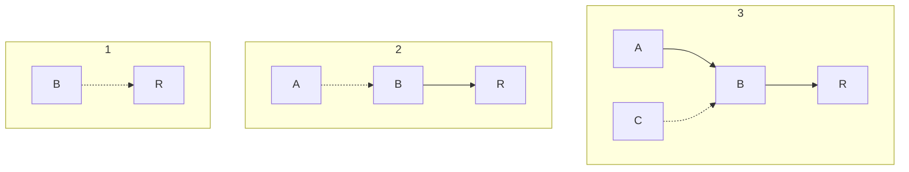
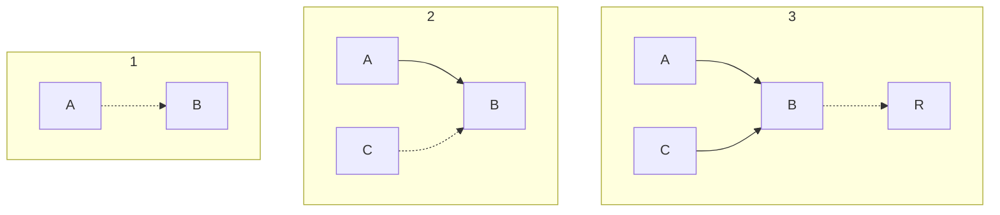
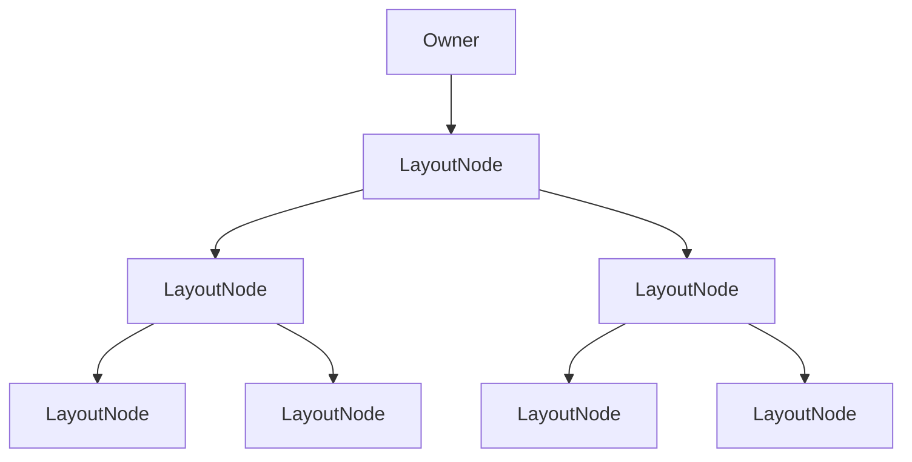

> [!abstract] Applier
> - Applier는 Compose와 실제 플랫폼 UI 트리 사이의 연결 지점이다.
> - Composition에서 계산된 변경사항을 기반으로 실제 렌더링 구조를 갱신한다.

# Applier의 역할과 적용 과정

## Applier의 역할

- Composition 이후의 **변경사항을 실제 UI 트리에 적용하는 역할**을 담당한다.
- [[The Compose Runtime - Composer|Composer]]는 Applier에 변경 목록을 실행하고 materialize(구체화) 작업을 위임한다.
- 이 과정에서 [[The Compose Runtime - Slot Table and List of Changes#슬롯 테이블|Slot Table]]이 갱신되고 [[The Compose Runtime - Composition|Composition]] 결과가 실제 화면에 반영된다.

## 구현 방식

- Runtime은 Applier의 내부 구현을 몰라도 되며, 플랫폼별로 클라이언트 라이브러리(Android 등)가 구현한다.
- 이를 위해 `Applier<N>` 인터페이스를 제공하며, N은 적용 대상 노드의 타입이다.

## 인터페이스 주요 함수

- `onBeginChanges()` / `onEndChanges()`  
  변경 적용 시작과 종료 시 호출된다.
- `down(node: N)` / `up()`  
  트리 탐색 시 자식 노드로 이동하거나 부모로 돌아간다.
- `insertTopDown()` / `insertBottomUp()`  
  노드를 트리에 삽입한다 (위/아래 방향).
- `remove()` / `move()` / `clear()`  
  노드 삭제, 이동, 전체 초기화 등에 사용된다.

## Applier의 특징

- 어떤 노드 타입이든 다룰 수 있도록 제네릭으로 설계되어 있다.
- 노드의 내부 내용이나 동작 방식은 Applier가 아니라 노드 자신에게 위임된다.
- 트리를 위에서 아래로(top-down), 혹은 아래에서 위로(bottom-up) 탐색하며 모든 노드에 변경을 적용한다.
- 현재 노드를 참조 상태로 유지하여 그 위치 기준으로 동작한다.

# 노드 트리 구축 시 성능

- 성능은 사용하는 Applier의 구현 방식에 따라 달라짐
- 어떤 전략을 사용할지는 트리 구조 및 변경 알림 전파 방식에 따라 결정됨
- 중요한 점: 한 방향 전략(top-down 또는 bottom-up)만 사용해야 하며, 혼합은 피해야 한다

## Top-Down 방식

- 루트부터 자식 방향으로 순차 삽입
- 예시: R → B → A, C 삽입
- 각 노드가 삽입될 때, 조상 노드들이 이미 트리에 붙어 있어 알림이 전파됨
- 자식 하나를 추가할 때마다 부모, 조부모 등 연쇄적으로 여러 노드를 알림
- 깊이가 깊어질수록 알림 비용이 **지수적으로 증가**할 수 있음

## Bottom-Up 방식

- 자식 노드부터 삽입하고 마지막에 부모를 트리에 연결
- 예시: A, C → B → R 순으로 삽입
- 각 삽입 시에는 부모가 아직 트리에 붙지 않았기 때문에 상위 노드를 알릴 필요 없음
- 항상 **직접 부모에게만 알림**으로 비용이 일정하게 유지됨

---

**🔍 왜 Top-down 방식이 여전히 사용될까?**

1. 의도한 트리 구조 유지 용이
	Top-down은 **부모가 먼저 존재**해야 자식을 삽입할 수 있기 때문에, 트리의 구조를 명확히 **순차적으로 구성**할 수 있습니다. 특히 Compose UI처럼 선언적 UI 트리 구조가 중요할 때, 이 흐름이 코드를 더 **자연스럽고 명시적으로** 만들어줍니다.
2. 구성 순서와 알림 전파가 명확
	알림은 성능 비용이 있지만, **컴포넌트 간 의존성**을 명확히 다룰 수 있습니다.
	예: remember, CompositionLocal 등이 루트에서 정의되고 하위에 전달되는 상황에서는 Top-down이 더 자연스러움.
3. UI 트리에서는 실제로 깊이가 깊지 않음
	일반적인 Compose UI 트리는 그렇게 깊지 않고, 구성도 많은 부분이 **재사용**되거나 slot table에 의해 최적화됨.
	즉, 이론상 지수적이지만 실제 상황에서는 **크게 문제되지 않음**.

---

**✅ Bottom-up이 더 유리한 경우**
1. 성능이 절대적으로 중요한 **비UI 환경** (예: Compose를 사용하는 다른 DSL)
2. 또는 컴포넌트 트리를 직접 제어해야 하는 low-level 코드

---

**🚫 혼합 전략은 왜 위험할까?**
1. Top-down은 상위가 먼저 만들어지고 하위가 알림을 받는 구조.
2. Bottom-up은 하위가 먼저 만들어지고 상위가 마지막에 트리에 붙음.
3.  둘을 섞으면 **중간 상태에서 알림이 누락되거나 중복될 수 있음** → 버그 유발 위험

---

# 변경 적용 방식: UiApplier

## UiApplier란?

- Android Compose에서 UI 변경을 적용하기 위한 `Applier` 구현체이다.
- 제네릭 타입 N은 `LayoutNode`로 고정되어 있으며, 실제 화면에 렌더링되는 노드를 의미한다.
- `AbstractApplier`를 상속하며, 방문한 노드를 스택에 저장하는 기본 동작을 갖는다.

## 구현 요약

- `insertTopDown`: 무시됨 (Android는 bottom-up 전략 사용)
- `insertBottomUp`: 자식 노드를 현재 노드의 자식 목록에 삽입
- `remove`: 자식 노드를 특정 위치에서 제거
- `move`: 자식 노드를 다른 위치로 이동
- `onClear`: 모든 자식 노드 제거
- `onEndChanges`: 변경 적용 완료 후 `AndroidComposeView`의 invalid observation 정리

## 주요 특징

- 변경은 모두 노드 자체(`LayoutNode`)에게 위임된다.
  - 삽입: 부모 노드의 특정 위치에 자식 노드 추가
  - 이동: 부모 내 자식 리스트 순서 변경
  - 제거: 자식 리스트에서 해당 노드 제거
- `insertTopDown`이 무시되는 이유는 알림 중복을 피하기 위해 하나의 전략만 사용해야 하기 때문이며, Android에서는 bottom-up 방식이 적합하다.

## 변경 완료 후 동작

- `onEndChanges()`가 호출되면 snapshot 관찰 정보가 정리되고, layout이나 draw에 영향을 주는 값 변경이 반영됨.
- 이 시점 이후 레이아웃이나 그리기 연산이 재실행될 수 있음.

# 노드 연결 및 그리기

> Compose에서 노드를 삽입하면 LayoutNode가 스스로 처리하며, 이 과정은 Platform(View)과의 통합 지점에서 완성된다.

## 노드를 어떻게 화면에 보이게 할까?

- 트리에 노드를 삽입하는 것은 결국 해당 노드를 화면에 보이게(render) 하는 것이다.
- 답은 간단하다: **노드(LayoutNode) 자신이 스스로 attach되고 draw하는 법을 안다.**

## LayoutNode의 attach 과정

[[#변경 적용 방식 UiApplier|UiApplier]]가 삽입을 위임하면 LayoutNode 내부에서 아래와 같은 과정이 실행된다:

1. 노드가 이미 다른 부모에 붙어 있는지 확인 (중복 방지)
2. Z-index 순서를 기반으로 자식 노드 리스트 무효화 → 다시 정렬
3. 부모 노드와 [[#Owner란?|Owner]]에 연결
4. invalidate 호출 → 그리기 요청 발생

## Owner란?

- `AndroidComposeView`가 Owner 역할을 하며, View 시스템과 Compose 간 연결 지점이다.
- 트리 최상단에 존재하며 Layout, Draw, Input, 접근성 등 이벤트 처리의 핵심이다.
- LayoutNode가 화면에 보이려면 반드시 Owner에 attach되어 있어야 한다.

## 전체 흐름 요약

- `setContent` 호출 시 `AndroidComposeView`가 생성되고 View에 붙는다.
- 이를 Owner로 설정하고, 이후 생성되는 LayoutNode들이 여기에 연결된다.
- LayoutNode는 부모와 연결되면 자동으로 invalidation을 통해 재그리기를 유도한다.

# 참고 문서
- [Applier.kt](https://android.googlesource.com/platform/frameworks/support/+/f06c7ce26e29f15792b54490e4c2f77197d1222f/compose/runtime/src/main/java/androidx/compose/Applier.kt)
- [[Jetpack Compose Applier]]
