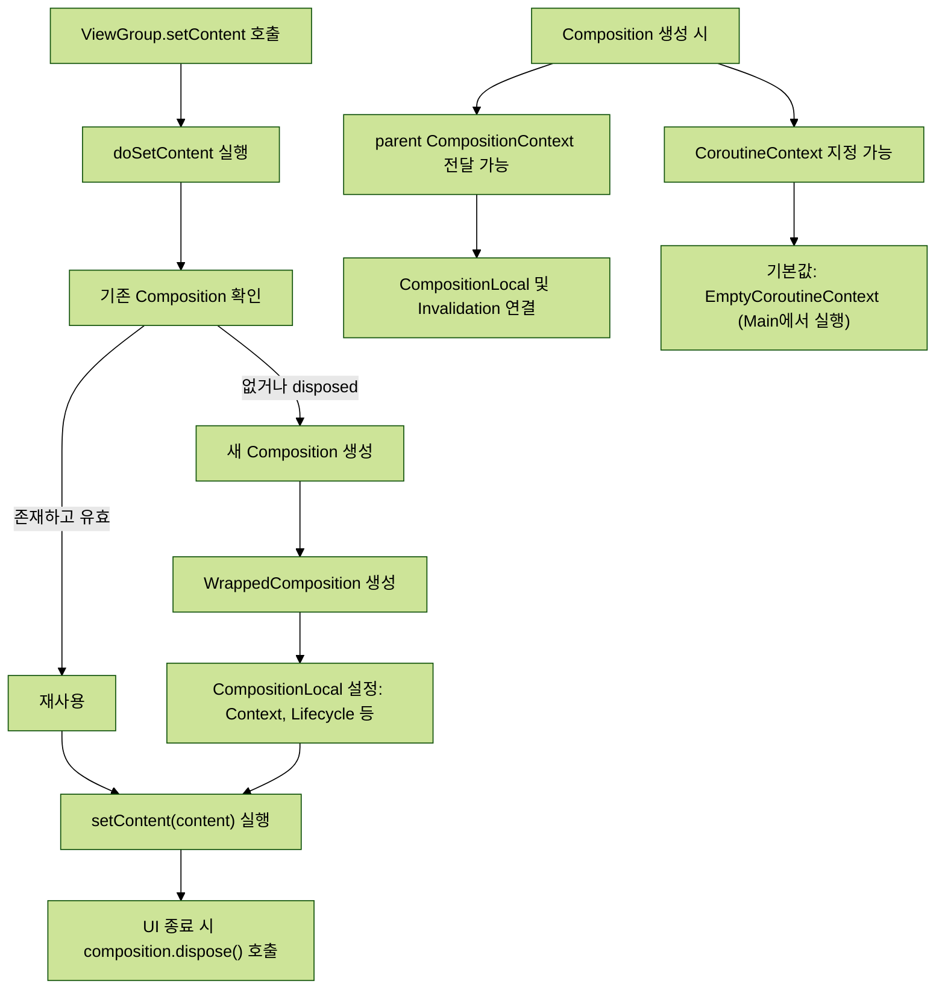
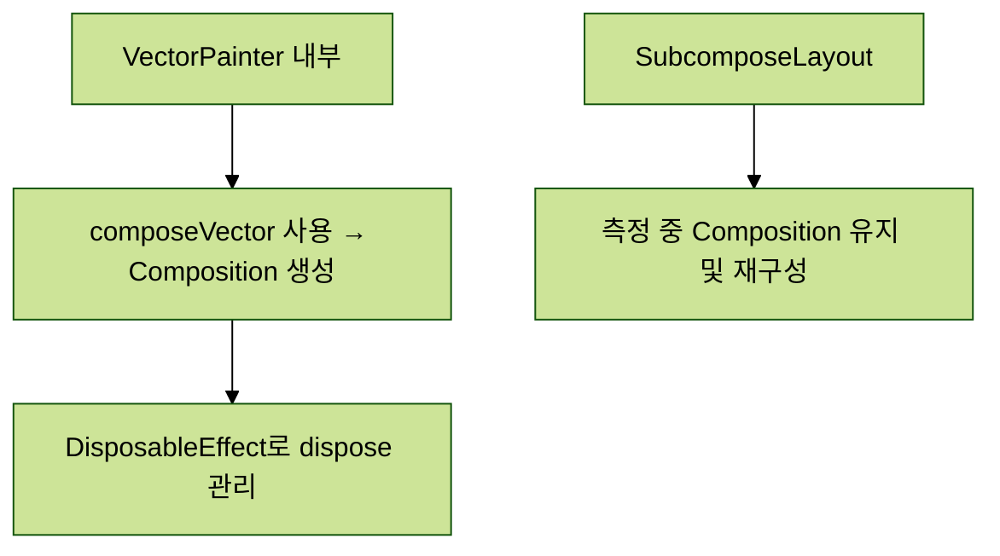

> [!abstract] Composition
>
> - **WHAT**: Compose에서 상태 기반 UI를 구성하고 재구성하는 단위이다.
> - **WHO**: ViewGroup, Recomposer, Composer, Applier, RememberObserver 등이 관여한다.
> - **WHEN**: setContent 호출 시 생성되고, 상태 변경 시 재구성된다.
> - **WHERE**: AndroidComposeView 내부에서 동작하며 Compose Runtime이 이를 관리한다.
> - **WHY**: 상태 변경에 따라 UI를 자동으로 갱신하고 효율적으로 처리하기 위해 필요하다.
> - **HOW**: Composable 실행 → 상태 스냅샷 → 변경사항 적용 → 생명주기 처리 흐름으로 작동한다.

# 생성하기

## ViewGroup.setContent

- Android에서는 ViewGroup.setContent를 통해 새로운 Composition이 생성됨.
- 내부적으로 doSetContent가 호출되어 AndroidComposeView와 parent CompositionContext, content(@Composable)를 전달함.
- 기존 Composition이 있는 경우 재사용하고, 없거나 disposed 상태이면 새로운 Composition을 생성함.
- 최종적으로 composition.setContent(content)를 호출해 내용을 설정함.

## WrappedComposition

- Composition과 AndroidComposeView를 연결해주는 데코레이터 역할.
- 키보드 상태, 접근성, Context 등의 정보들을 CompositionLocal로 전달함.
- 이를 통해 Composable 함수들이 Context 정보에 접근 가능하게 됨.
- root LayoutNode에 대한 UiApplier 인스턴스를 Composition에 전달함.

## 예시

### VectorPainter

- VectorPainter 내부에서도 자신의 Composition을 관리함.
- composeVector를 통해 Composition을 만들고, content를 설정함.
- DisposableEffect를 통해 Composition이 더 이상 필요 없을 때 dispose 처리함.

### SubcomposeLayout

- Layout 중 자신의 Composition을 가지는 컴포넌트.
- 측정 단계에서 자식 요소의 측정을 위해 별도로 구성(subcompose) 가능함.

## CompositionContext

- Composition 생성 시 parent CompositionContext를 함께 전달할 수 있음.
- null이 아니면 기존 Composition과 논리적으로 연결되어 CompositionLocal이나 invalidation이 이어질 수 있음.

## Recompose Context

- Composition 생성 시 CoroutineContext를 지정할 수 있음.
- 기본적으로는 Recomposer가 제공하는 EmptyCoroutineContext를 사용.
- Android에서는 기본적으로 AndroidUiDispatcher.Main에서 recomposition이 발생함.

## Composition의 소멸

- 더 이상 필요하지 않으면 composition.dispose()를 호출해 정리함.
- Composition은 소유자(owner)에 종속되며, 소유자가 사라지면 Composition도 같이 사라져야 함.

# 초기 Composition 과정

## composition.setContent(content)의 동작

- Composition이 처음 만들어질 때 항상 호출됨.
- parent Composition을 통해 `composeInitial(this, content)`가 실행됨.
- parent는 다른 Composition이거나, 루트 Composition의 경우 Recomposer가 됨.

## composeInitial 내부 흐름

- 현재 State 객체들의 값을 스냅샷(snapshot)으로 복사함.
- snapshot은 mutable하며 thread-safe함.
- 변경 감지를 위해 snapshot에는 State 읽기/쓰기 관찰자가 함께 설정됨.
- `snapshot.enter { composition.composeContent(content) }` 호출로 실제 content가 구성됨.
- snapshot이 끝나면 변경된 내용을 전역 shared state로 적용하기 위해 `snapshot.apply()` 호출.

## 실제 Composition 과정 (Composer에게 위임됨)

- Composition이 이미 실행 중이면 예외 발생, 중첩 실행 불가.
- pending invalidation이 있다면, 이를 가져와 Composer의 리스트에 추가함.
- isComposing 플래그를 true로 설정.
- startRoot() 호출로 Composition의 루트 그룹 시작.
- startGroup()으로 content 그룹 시작.
- content 람다 실행 (Composable 함수 실행).
- endGroup()으로 content 그룹 종료.
- endRoot() 호출로 Composition 종료.
- isComposing을 false로 되돌림.
- 임시 데이터를 유지하던 구조들 정리.

# 초기 Composition 후 변경 사항 적용

## composition.applyChanges()

- 초기 Composition 후, Applier에게 변경 사항 적용을 지시함.
- Composition이 `applier.onBeginChanges()`를 호출해 변경 준비를 시작함.
- 기록된 변경 목록을 순회하며 각 변경을 Applier와 SlotWriter를 통해 적용함.
- 모든 변경 적용 후, `applier.onEndChanges()`를 호출하여 완료를 알림.

## RememberedObservers 알림

- Composition에 등록된 모든 RememberObserver 구현 클래스에 대해 진입/이탈 이벤트를 전달함.
- 예: LaunchedEffect, DisposableEffect 등은 Composition의 생명주기에 맞춰 동작하도록 구현되어 있음.

## SideEffect 실행

- 모든 SideEffect는 기록된 순서대로 실행됨.

# Composition에 대한 추가 정보

## Composition의 상태 인식

- Composition은 **자신의 재구성이 필요한 상태(Invalidation)** 를 인지할 수 있음.
- 현재 **컴포지션 중인지 여부**도 알고 있음.
- 이 정보는:
  - 컴포지션 중일 때 즉시 invalidation을 적용하거나,
  - 그렇지 않으면 나중으로 연기 가능하게 함.
- Recomposer는 이 정보를 바탕으로 **불필요한 재구성을 생략**할 수 있음.

## ControlledComposition

- Composition의 변형으로, 외부에서 제어할 수 있도록 몇 가지 함수가 추가됨.
- 예시: `composeContent`, `recompose` 등.
- Recomposer는 이들을 사용해 컴포지션에 재구성이나 업데이트를 지시할 수 있음.

## Composition의 관찰 기능

- Composition은 자신이 특정 객체들을 **관찰 중인지 확인** 가능.
- 이를 통해 해당 객체가 변경될 때 **재구성이 필요함을 감지**함.
- 예: 부모 Composition에서 CompositionLocal이 바뀌면, 자식 Composition에 재구성을 유도.
- Composition 간에는 `CompositionContext`를 통해 연결되어 있음.

## 오류 처리

- 컴포지션 중 오류가 발생하면 **중단(abort)** 가능.
  - Composer와 그 내부 상태(스택, 참조 등)를 초기화함.

## 스마트한 재구성

다음 조건이 만족되면 **재구성을 건너뜀(skipping)**:

- 삽입도 재사용도 하지 않음
- 무효화된 provider 없음
- 현재 [[The Compose Runtime - Composer#RecomposeScope|RecomposeScope]]에서 재구성이 요구되지 않음
