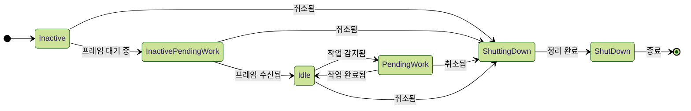

> [!abstract] Recomposer
> 언제, 어떤 스레드에서 recomposition을 수행하고, 
> 언제 변경 사항을 적용할지를 결정하는 Compose Runtime의 핵심 컴포넌트.

# 생성

- Recomposer는 Composition의 부모로 생성되며, Android에서는 `View`의 생명주기와 밀접하게 연결되어 관리됩니다.
- Compose UI가 플랫폼과 통합되는 방식의 대표적인 예로, 일반적으로 window 단위로 하나의 Recomposer가 생성됩니다.

## Recomposer 생성 시점

- Jetpack Compose의 진입점은 `setContent` 호출이며, 이 시점에 루트 Composition과 함께 Recomposer도 생성됩니다.
- Compose Runtime과 플랫폼(Android) 사이를 연결하는 client 라이브러리가 Recomposer 생성을 처리합니다.

## Android에서의 예시

- `ViewGroup.setContent`가 호출되면 내부적으로 `WindowRecomposerFactory.createRecomposer`를 통해 Recomposer가 생성됩니다.
- 생성된 Recomposer는 `ViewTreeLifecycleOwner`에 연결되어 lifecycle-aware하게 동작합니다.
- CompositionContext는 이 Recomposer를 부모로 설정하여 Composition 트리를 구성합니다.

## 생성에 사용되는 주요 요소

- `PausableMonotonicFrameClock`: suspend 기반 프레임 동기화를 지원하며, 중단/재개 기능을 가짐.
- `CoroutineContext`: 일반적으로 `AndroidUiDispatcher`와 프레임 클럭이 결합되어 구성됨.
- 이 context는 composition 및 recomposition 중 발생하는 효과들을 제어하고 실행하는 데 사용됨.

## Lifecycle과의 연결

`viewTreeLifecycleOwner.lifecycle.addObserver`를 통해 생명주기 이벤트에 반응함:
  - `ON_CREATE`: recomposition 루프 시작 (`runRecomposeAndApplyChanges`)
  - `ON_START`: 프레임 클럭 재개
  - `ON_STOP`: 프레임 클럭 일시 정지
  - `ON_DESTROY`: Recomposer 취소 (`cancel()` 호출)

## 효과 처리

- `LaunchedEffect`와 같은 SideEffect는 Recomposer가 제공하는 **CoroutineContext에서 실행**되며, 일반적으로 Main thread에서 실행됨.
- 생명주기와 연동되어 안전하게 실행될 수 있음.

# Recomposition 과정

## 1. 시작

- `recomposer.runRecomposeAndApplyChanges()`는 상태 변경을 관찰하고, 변경 시 자동으로 recomposition을 수행하는 suspend 함수입니다.
- snapshot 변경을 감지하는 옵저버를 등록하여 변경이 발생하면 필요한 Composition에 invalidation을 전파합니다.

## 2. 초기 상태 정리

- 초기 실행 시 모든 Composition을 invalid 처리하여 강제로 recomposition을 유도합니다.
- 이후 `withFrameNanos`를 사용해 다음 프레임을 대기합니다.

## 3. 프레임 수신

- 프레임이 발생하면 `MonotonicFrameClock`을 통해 작업이 수행되며, animation 등에서 발생한 추가 invalidation도 함께 수집됩니다.

## 4. 실제 재구성

- invalid된 Composition을 기반으로 slot table 및 Applier 트리를 갱신하고,
- `applyChanges`를 호출해 변경 사항을 실제 UI에 적용합니다.

## 5. 추가 재구성 처리

- CompositionLocal 변경 등으로 인해 연쇄적으로 영향을 받는 Composition을 추가로 감지하여 재구성을 수행합니다.

## 6. 마무리

- 모든 Composition에 대해 상태를 갱신하고, snapshot 상태도 commit하여 안정화시킵니다.

# Recomposition 동시성

- Recomposer는 `runRecomposeConcurrentlyAndApplyChanges` 함수를 통해 동시 재구성을 지원합니다.
- 이 함수는 외부에서 전달된 `CoroutineContext`를 사용하여 병렬적으로 invalid된 Composition의 재구성을 수행합니다.

```kotlin
suspend fun runRecomposeConcurrentlyAndApplyChanges(
    recomposeCoroutineContext: CoroutineContext
) { /* ... */ }
````

• 병렬 recomposition은 CompositionCoroutineScope 내에서 하위 작업들을 분리해 동시에 수행되도록 orchestration합니다.

  

# Recomposer 상태 다이어그램


