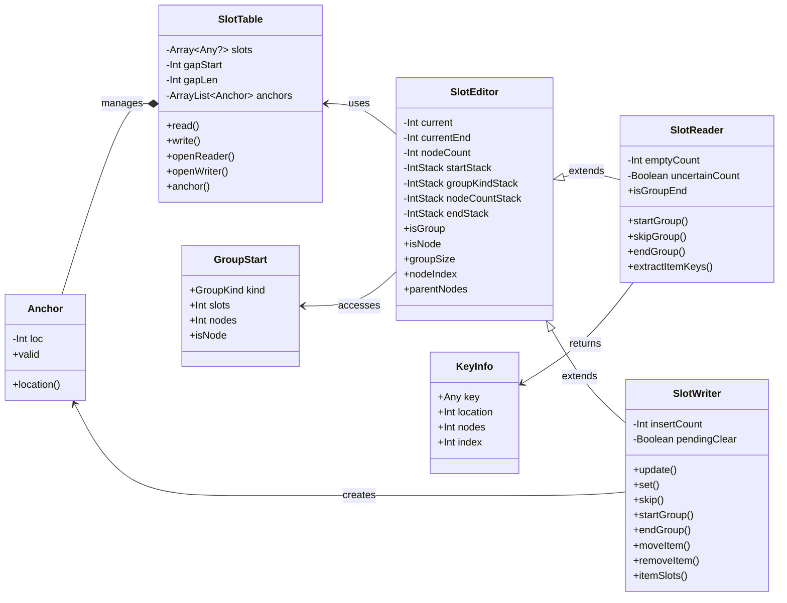

Jetpack Compose Runtime에서 사용하는 핵심 자료 구조는 크게 두 가지입니다.  
바로 **슬롯 테이블(Slot Table)** 과 **변경 목록(List of Changes)** 입니다.

---

# 슬롯 테이블

> [!abstract] 슬롯 테이블 (Slot Table)  
> [[The Compose Runtime - Composition|Composition]]의 현재 상태를 추적하기 위해 사용되며, 선언형 UI의 상태를 최적화된 선형 구조로 저장합니다

## 구조

슬롯 테이블은 **갭 버퍼(Gap Buffer)** 개념에 기반하여, 두 개의 배열로 구성됩니다:
- **Group 배열**: 그룹 간 계층 관계와 메타데이터 (Int 형태)를 선형적으로 저장
- **Slot 배열**: 각 그룹에 속한 실제 데이터 (Any?)를 저장

이 구조 덕분에 삽입, 삭제가 빈번한 Compose 구조에 최적화된 성능을 보입니다

## 갭(Gap)의 개념
- 갭은 데이터를 읽고 쓸 위치를 추적하는 **슬라이딩 가능한 포인터 범위(span)**입니다.
- 작성자는 갭의 시작/끝 위치를 추적하고, 삽입 시 이 위치로 데이터를 밀어넣거나 덮어씁니다.
- 조건문 등으로 Composable이 교체되면, 갭은 그룹의 시작 위치로 이동하여 기존 데이터를 덮어씁니다.

---

## SlotReader

- 여러 개의 SlotReader가 동시에 존재할 수 있으며, [[Visitor|Visitor Pattern]]을 기반으로 작동합니다.
- 현재 읽고 있는 그룹, 부모 그룹, 시작/끝 위치, 슬롯 수 등을 추적합니다.
- 그룹을 건너뛰거나 슬롯을 읽고, 특정 인덱스를 참조하는 등의 기능을 수행합니다.

## SlotWriter

- SlotWriter는 Composition의 상태를 슬롯 테이블에 기록하는 역할을 합니다.
- Any? 타입의 값을 쓰며, 쓰기 위치는 내부적으로 관리되는 갭을 통해 결정됩니다.
- SlotWriter는 그룹 및 슬롯을 추가, 삭제, 이동하는 등 구조 변경 작업을 직접 수행합니다.
- 빠른 위치 참조를 위해 Anchor들을 사용하고, 그룹 위치 역시 Anchor를 통해 추적합니다.
- Anchor는 참조 위치 이전의 변경(이동, 삽입, 제거 등)이 발생할 경우 자동으로 업데이트됩니다.

SlotWriter는 동시에 하나만 활성 상태일 수 있으며, 쓰기 작업 중에는 SlotReader 또한 동작하지 못하도록 잠금이 걸립니다.
이는 동기화 문제와 경쟁 상태(race condition)를 방지하기 위함입니다.

---

# 변경 목록

슬롯 테이블은 상태를 저장하지만, 실제로 UI 노드 트리에 변경을 적용하는 것은 변경 목록의 역할입니다.
이 목록은 패치 파일(patch) 처럼 작동하며, 변경이 기록되고 순차적으로 적용됩니다.

**동작 방식**

1. Composition 시작

- Composable 함수가 실행되며 UI 요소가 방출됩니다.
- 이 과정에서 발생한 변경 사항이 List<Change\> 형태로 저장됩니다.
- 슬롯 테이블의 상태를 기반으로, 새로운 변경 목록이 생성됩니다.

2. Composition 종료

- 변경 목록에 기록된 작업이 실제로 수행되어 트리에 적용됩니다.
- 완료 후 Applier가 트리를 구체화(materialize)합니다.

변경 목록은 SlotTable이 보관한 상태 정보를 기반으로 동작합니다.
따라서, 어떤 변경 사항도 항상 현재 Composition 상태를 기준으로 계산됩니다.

---

# 구조

---

# 참고 문서

- [The Slot Table | Under the hood of Jetpack Compose](https://medium.com/androiddevelopers/under-the-hood-of-jetpack-compose-part-2-of-2-37b2c20c6cdd)

[code-slot-table]: https://android.googlesource.com/platform/frameworks/support/+/f06c7ce26e29f15792b54490e4c2f77197d1222f/compose/runtime/src/main/java/androidx/compose/SlotTable.kt
[slot-table-example-0]: https://miro.medium.com/v2/resize:fit:1400/format:webp/0*0GgJdY76c_Kz0hs-
[slot-table-example-1]: https://miro.medium.com/v2/resize:fit:1400/format:webp/0*teYGDHH5HGvaFQQa
[slot-table-example-2]: https://miro.medium.com/v2/resize:fit:1400/format:webp/0*4JJ1bDFfJYtpL96B
[slot-table-example-3]: https://miro.medium.com/v2/resize:fit:1400/format:webp/0*cSQX5tAFDpSScpkA
[slot-table-example-4]: https://miro.medium.com/v2/resize:fit:1400/format:webp/0*ur0n0gAvzrkKvwwz
[composer-change]: https://android.googlesource.com/platform/frameworks/support/+/f06c7ce26e29f15792b54490e4c2f77197d1222f/compose/runtime/src/main/java/androidx/compose/Composer.kt#21
