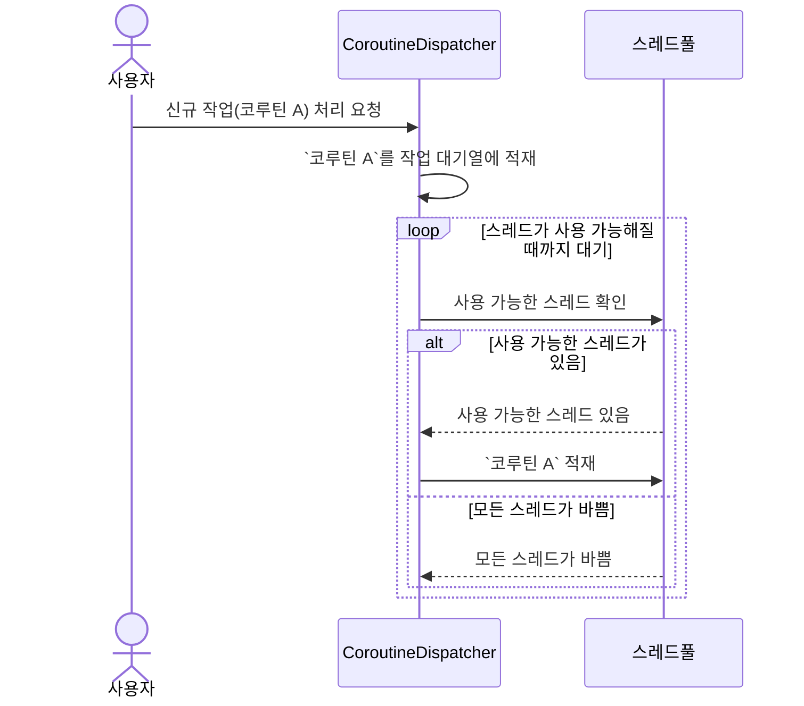

> [!cite]- Glossary: 펼쳐서, 본 챕터에 사용된 용어들을 모아 볼 수 있습니다.
> | 한국어 표기      | 영문 표기                  | 기타     |
> |-------------|------------------------|--------|
> | 코루틴 디스패처    | [[#11-coroutinedispatcher-란\|CoroutineDispatcher]]    |        |
> | 제한된 디스패처    | [[Confined Dispatcher]]    |        |
> | 무제한 디스패처    | [[Unconfined Dispatcher]]  |        |
> | 구조적 동시성     | [[Structured Concurrency]] |        |
> | IO 바운드      | [[IO Bound]]               |        |
> | CPU 바운드     | [[CPU Bound]]              |        |

# 1. 주요 개념 정리

## 1.1. CoroutineDispatcher 란?

> [!NOTE] `CoroutineDispatcher` 란?
> _코루틴을 **스레드로 보내주는 역할**을 하는 객체_

## 1.2. CoroutineDispatcher 의 동작 방식

### 1.2.1 CoroutineDispatcher 의 동작 다이어그램




1. 사용자가 `CoroutineDispatcher`에게 `코루틴 A` 라는 작업을 요청한다.
2. `CoroutineDispatcher`는 작업 대기열에 `코루틴 A` 를 적재한다.
3. `CoroutineDispatcher`는 `스레드 풀`에 사용 가능한 스레드가 있는지 확인한다.
	1. 사용 가능한 스레드가 있다면,
		1. 해당 스레드에 `코루틴 A`를 적재한다.
	2. 모든 스레드에 작업이 할당되어 있다면,
		1. 사용 가능한 스레드가 생길 때까지 대기한다.

## 1.3. CoroutineDispatcher 의 종류

디스패처는 제공 가능한 스레드 개수 제한 여부를 기준으로 크게 두 가지로 나눈다.
스레드 생성 비용은 매우 비싸기 때문에, 가능한 제한된 디스패처를 사용하는 것이 좋다.
무제한 디스패처를 사용할 경우, 주의를 기울이는 것이 필요하다.

| 종류                              | 생성 가능한 스레드 개수 |
|---------------------------------|---------------|
| 제한된 디스패처(Confined Dispatcher)   | 제한 **있음**     |
| 무제한 디스패처(Unconfined Dispatcher) | 제한 **없음**     |

## 1.4. CoroutineDispatcher 생성 방법

### 1.4.1. 단일 스레드 디스패처 만들기

함수 `newSingleThreadContext` 를 사용하여 만들 수 있다. 

```kotlin
val dispatcher: CoroutineDispatcher = newSingleThreadContext(
	name = "SingleThread",
)
```

### 1.4.1. 멀티 스레드 디스패처 만들기

함수 `newFixedThreadPoolContext` 을 사용하여 만들 수 있다. 
이 때, 단일 스레드 디스패처와는 다르게 최대 가용 스레드의 개수를 지정해줄 수 있다.

```kotlin
val multiThreadDispatcher: CoroutineDispatcher = newFixedThreadPoolContext(
	nThreads = 2, // 최대 가용 스레드의 개수
	name = "MultiThread",
)
```


## 1.5. 이미 선언된 CoroutineDispatcher 종류

사실, [4. CoroutineDispatcher 생성 방법](#4-coroutinedispatcher-생성-방법)에 등장한 방법으로 
CoroutineDispatcher를 직접 만들어 사용하는 것은 위험할 수 있다. 

실제 코드로 작성해보면 IDE에서 다음과 같은 경고 창을 띄운다. 

![[Chapter03-Warning-delicate-API.png]]

> This is a delicate API and its use requires care. Make sure you fully read and understand documentation of the declaration that is marked as a delicate API.

`newSingleThreadContext`는 섬세한 주의가 필요한 API이니, 문서를 정독한 후 사용할 것을 권유한다. `newFixedThreadPoolContext` 도 마찬가지다. 
개발자가 Dispatcher 를 직접 선언 할 경우, `newFixedThreadPoolContext` 함수를 사용해 CoroutineDispatcher 객체를 만들게 되면 특정 CoroutineDispatcher
객체에서만 사용되는 스레드풀이 생성되며, 스레드풀에 속한 스레드의 수가 너무 적거나 많이 생성돼 비효율적으로 동작할 수 있다. 
또한 협업을 진행하는 경우, 다른 개발자가 선언한 디스패처의 존재를 몰라 새로운 Dispatcher를 생성하여 리소스가 낭비되는 오류를 범하기도 쉽다.

따라서, CoroutineDispatcher를 직접 선언하기 보다는 후술할 미리 선언된 Dispatcher를 사용하는 것이 좋다.

**미리 선언된 Dispatcher 간단 요약**

| Dispatcher             | 제한 여부    | 용도           | 특이사항                                                | `limitedParallelism` 사용 시, 발생하는 일 |
|------------------------|----------|--------------|-----------------------------------------------------|-----------------------------------|
| Dispatchers.IO         | 제한된 디스패처 | IO bound 작업  | 최대 64개 (1.7.2 버전 기준) 혹은 JVM 최대 범위만큼만 스레드를 생성할 수 있다. | 신규 스레드를 생성한다.                     |
| Dispatchers.Default    | 제한된 디스패처 | CPU bound 작업 | 코루틴 사용 여부와 관계없이 처리 속도는 일정하다.                        | 공유 스레드 풀에 있는 스레드를 사용한다.           |
| Dispatchers.Main       | 제한된 디스패처 | UI bound 작업  | UI 표시와 관련된 별도의 의존성 추가가 필요하다.                        | -                                 |
| Dispatchers.Unconfined | 무제한 디스패처 | -            | -                                                   | -                                 |

### 1.5.1. Dispatchers.IO

Dispatchers.IO 는 제한된 디스패처로 서버와 통신을 하거나 파일 입출력 등 대기 시간이 긴 작업에 사용되는 디스패처입니다.

Dispatchers.IO 를 사용하여 애플리케이션 외부에 응답 요청하는 코루틴 작업을 수행하면, 
응답이 도착하기 전까지 다른 작업들에게 자신이 사용하던 스레드 양도합니다. 
이러한 특징 덕분에 입출력 작업 시, 다른 스레드를 막지 않아 애플리케이션 연산이 전반적으로 빨라집니다. 

Dispatchers.IO 는 최대로 사용 가능한 스레드의 개수가 코틀린 버전 1.7.2 기준 64개, 혹은 JVM 최대 가용 갯수 중 큰 수만큼  스레드를 사용합니다.

공유 스레드 풀에서 사용할 스레드를 선택합니다. 

### 1.5.2. Dispatchers.Default

Dispatchers.Default 는 무거운 연산을 처리할 때에 주로 사용하는 코루틴 디스패처입니다.

Dispatchers.Default는 연산 요청이 들어오면, Dispatchers.IO 와 공유하는 스레드 풀에서 사용할 스레드를 선택하여 작업을 처리합니다.
만약, 연산 요청이 크면 클수록, 디스패처는 스레드를 많이 점유하여 사용하려고 합니다.

공유 스레드 풀에 있는 스레드 자원을 아끼기 위해서는 `limitedParallelism` 으로, 최대 사용 가능한 스레드의 개수를 제한해야합니다.

```kotlin
fun main() = runBlocking<Unit > {
	launch(Dispatchers.Default.limitedParallelism(2)){
		repeat (10) {
			launch {
				printIn("[${Thread.rrentThread(n)}]")
			}
		}
	}
}
```


> [!WANING] Dispatchers.IO에도 `limitedPrallelism` 을 사용할 수 있나요?
> 네. 그러나, Dispatchers.Default 와는 다르게 Dispatchers.IO에서 `limitedPrallelism`를 호출할 경우, 
> 인자로 전달된 숫자만큼 신규 스레드를 공유 풀에 생성합니다. 
> 스레드를 생성하는 작업은 비싸기 때문에, 충분한 고려 후 Dispatchers.IO에서 `limitedPrallelism`를 호출하는 것이 좋습니다.

### 1.5.3. Dispatchers.Main

Dispatchers.Main 는 화면에 요소를 표시하는 작업에 주로 사용됩니다.

따라서, Android 환경에서 많이 사용되며, 
별도의 의존성([`kotlin-coroutine-android`][kotlin-coroutine-android]) 을 추가해야 사용할 수 있습니다.

# 3. 질의 응답

> [!question] Dispatchers.IO 는 최대 가용 스레드 수가 제한되어있는데, 왜 limitedParallelism을 사용할까요?

> [!note] limitedParallelism(1) 과 newSingleThreadContext() 사용 가능한 최대 스레드 개수는 1개지만, limitedParallelism 는 실행 중간에 스레드가 바뀔 수 있다.

> [!note] 오래 걸리는 작업을 생성하는 데에는 Thread.sleep()이 좋다. 

> [!note] 실전 적용. 이미지 변환 작업을 수행할 때, Dispatchers.Default를 사용하면 어떤 문제가 발생할 수 있을까요?

# 2. 코드 예제

> 예시: [eunice-hong/read-kotlin-coroutine/Chapter03Activity](https://github.com/eunice-hong/read-kotlin-coroutine/blob/main/app/src/main/java/com/eunicehong/readkotlincoroutine/chapter03/Chapter03Activity.kt)

### 문제 상황 1: 네트워크 요청이 UI 성능에 미치는 영향

**상황**

어떤 모바일 애플리케이션에서 사용자가 버튼을 눌렀을 때 서버에서 데이터를 가져와 화면에 표시하는 기능을 구현해야 합니다. 처음에는 이 작업이 메인 스레드에서 동기적으로 이루어졌습니다. 그러나 사용자가 버튼을 눌렀을 때 네트워크 요청이 지연되면 UI가 멈추거나 "앱이 응답하지 않음(ANR)" 상태가 발생하는 문제가 생겼습니다. 이로 인해 사용자 경험이 크게 저하되었습니다.

**해결책**

이 문제를 해결하기 위해 `Dispatchers.IO`를 사용하여 네트워크 요청을 백그라운드 스레드에서 비동기적으로 처리하고, 응답이 완료되면 `Dispatchers.Main`을 사용하여 UI를 업데이트하는 방식으로 변경했습니다. 이로 인해 메인 스레드가 네트워크 요청에 의해 블로킹되지 않으면서도, UI는 사용자가 원활하게 조작할 수 있게 되었습니다.

**실전 적용 결과**

네트워크 요청이 백그라운드에서 처리되어 UI 응답성이 크게 향상되었습니다. 사용자는 버튼을 눌러도 UI가 멈추지 않고 자연스럽게 데이터가 로드되는 것을 확인할 수 있었습니다.

### 문제 상황: CPU 집약적인 데이터 처리로 인한 애플리케이션 느려짐

**상황**

한 데이터 분석 애플리케이션에서 사용자로부터 입력된 대량의 데이터를 처리해야 하는 기능이 있었습니다. 초기 구현에서는 이 데이터 처리 작업이 메인 스레드에서 동기적으로 수행되었습니다. 결과적으로, 데이터 처리 중 애플리케이션이 느려지고, 다른 작업을 수행할 수 없는 상황이 발생했습니다.

**해결책**

이 문제를 해결하기 위해 `Dispatchers.Default`를 사용하여 CPU 집약적인 데이터 처리를 백그라운드 스레드에서 수행하도록 코드를 리팩토링했습니다. 이 디스패처는 기본적으로 여러 코어를 활용하여 CPU 집약적인 작업을 병렬로 처리하기 때문에, 메인 스레드의 부하를 줄이면서도 효율적인 작업 처리가 가능해졌습니다.

**실전 적용 결과**

애플리케이션의 응답성이 크게 개선되었으며, 데이터 처리 중에도 다른 UI 작업이 원활하게 이루어졌습니다. 사용자는 데이터가 처리되는 동안에도 앱을 계속 사용할 수 있게 되었습니다.


### 문제 상황 3: 한정된 리소스 환경에서의 스레드 관리 문제

**상황**

한 서버 애플리케이션에서 동시에 많은 사용자의 요청을 처리해야 했습니다. 처음에는 각 요청마다 새로운 코루틴이 생성되었고, 이 코루틴들은 모두 `Dispatchers.IO`에서 실행되었습니다. 그러나 서버 자원이 한정되어 있어, 너무 많은 요청이 동시에 처리되면서 시스템이 과부하 상태에 빠졌습니다.

**해결책**

이 문제를 해결하기 위해 `limitedParallelism`을 사용하여, `Dispatchers.IO`에서 동시에 처리할 수 있는 스레드의 수를 제한했습니다. 이를 통해 한정된 자원을 효과적으로 관리할 수 있었고, 과부하 상태를 방지할 수 있었습니다. 동시에, 코루틴이 과도하게 생성되는 상황에서도 서버가 안정적으로 동작하도록 하였습니다.

**실전 적용 결과**

서버의 안정성이 크게 향상되었으며, 높은 트래픽 상황에서도 서버는 더 이상 과부하 상태에 빠지지 않았습니다. 사용자는 안정적인 서비스를 경험할 수 있었고, 서버 자원도 효율적으로 사용되었습니다.
#11-coroutinedispa# 3. 실전 응용

> [!TODO]  해야할 일
> 1. 실제 사용 사례: 실전에서 어떻게 사용될 수 있는지 사례를 소개합니다.
> 2. 장단점 및 한계: 실전에서 사용할 때의 장점과 단점을 정리하고, 어떤 상황에서 주의가 필요한지 논의합니다.

## 장점
1. 비동기 처리의 용이성
	코루틴은 비동기 작업을 쉽게 처리할 수 있게 해줍니다. 스레드 풀을 관리할 필요 없이, launch와 async 같은 코루틴 빌더를 사용하여 비동기 작업을 간단하게 구현할 수 있습니다.
2. 메모리 효율성
	코루틴은 경량의 스레드처럼 동작하며, 실제로는 스레드보다 훨씬 적은 메모리를 사용합니다. 수천 개의 코루틴을 생성하더라도 시스템 자원을 효율적으로 사용할 수 있습니다.
3. 코드 가독성
	코루틴을 사용하면 비동기 코드도 동기 코드처럼 직관적으로 작성할 수 있습니다. 이는 콜백 지옥(callback hell)이나 복잡한 스레드 관리 코드를 피할 수 있게 합니다.

## 주의사항
1. 스레드 관리
	코루틴이 경량이기는 하지만, 실제로는 스레드 풀에서 실행됩니다. Dispatchers.Default와 같은 디스패처는 기본적으로 제한된 스레드를 사용하며, 너무 많은 코루틴이 동시에 실행되면 스레드 풀 고갈이나 성능 저하가 발생할 수 있습니다. 이럴 때는 limitedParallelism을 사용하여 동시 실행되는 코루틴 수를 제한하는 것이 중요합니다.
2. 메모리 누수
	코루틴이 잘못된 컨텍스트에서 실행되거나, 종료되지 않고 계속 유지되면 메모리 누수가 발생할 수 있습니다. 특히, 안드로이드에서는 액티비티나 프래그먼트의 생명주기에 따라 코루틴을 관리해야 합니다.
3. 무제한 디스패처의 위험성
	Dispatchers.Unconfined는 제한 없이 실행되기 때문에, 예기치 않은 동시성 문제나 리소스 고갈이 발생할 수 있습니다. 이 디스패처는 주로 가벼운 작업이나 특별한 상황에서만 사용해야 하며, 대부분의 경우 Dispatchers.IO나 Dispatchers.Default를 사용하는 것이 더 안전합니다.
# 4. 질의 응답

> [!TODO]  해야할 일
> 1. 예상 질문 준비: 발표 내용을 기반으로 예상될 수 있는 질문을 미리 생각해보고 답변을 준비합니다. 질문을 받는 연습을 통해 발표 후 Q&A 세션에 대비합니다.
> 2. 스터디 멤버와 토론: 발표 후에는 스터디 멤버들과 자유롭게 토론을 유도합니다. 멤버들의 이해도를 높이고 다양한 시각을 공유할 수 있습니다.

> [!question]- 1. limitedPararellism 숫자를 줄이니 OOM 발생. 이유는?
> `limitedParallelism` 숫자를 줄였을 때 OOM(Out Of Memory) 오류가 발생하는 이유는 병렬로 실행되는 코루틴의 수가 제한되면서, 작업이 더 많은 시간을 걸려 완전히 처리되기 때문입니다. 이로 인해, 메모리 자원이 과도하게 소비되는 상황이 발생할 수 있습니다. 아래에서 자세히 설명드리겠습니다.
> 
> ### 문제 설명
> 
> 1. 병렬 처리의 감소:
>    - `limitedParallelism` 숫자를 줄이면, 동시에 실행되는 코루틴의 수가 줄어듭니다. 예를 들어, `limitedParallelism(2)`로 설정하면 최대 두 개의 코루틴만 병렬로 실행됩니다.
> 
> 2. 작업 처리 시간 증가:
>    - 병렬로 실행되는 코루틴의 수가 줄어들면, 작업이 순차적으로 처리되므로 전체 처리 시간이 길어집니다. 각 코루틴이 완료될 때까지 대기 시간이 증가하고, 메모리에서 오래 머물러야 할 데이터나 작업이 많아집니다.
> 
> 3. 메모리 사용 증가:
>    - 코루틴이 작업을 처리하는 동안 메모리를 점유하고 있게 됩니다. 병렬 처리가 줄어듦에 따라, 대기 중인 작업들이 메모리에 오래 머물게 되고, 이로 인해 메모리 사용량이 증가합니다.
>    - 특히, 각 코루틴이 작업을 수행하는 동안 데이터를 메모리에 계속해서 유지해야 하는 경우, 메모리 누적이 발생하여 OOM이 발생할 수 있습니다.
> 
> 4. 메모리 누수 가능성:
>    - 코루틴이 종료되지 않고 계속 메모리를 점유하거나, 코루틴 내부에서 메모리 집약적인 작업이 길어지면, 메모리 누수와 같은 문제가 발생할 수 있습니다. 이는 제한된 병렬 처리와 맞물려 메모리 고갈로 이어질 수 있습니다.
> 
> ### 왜 병렬성을 줄이는 것이 OOM을 유발할 수 있을까?
> 
> 1. 메모리 누적:
>    - 제한된 병렬성으로 인해, 모든 작업이 즉시 처리되지 못하고 메모리에 남아있게 됩니다. 이로 인해 한꺼번에 많은 작업이 메모리를 점유하게 되면서 OOM이 발생할 수 있습니다.
> 
> 2. 큐의 증가:
>    - 병렬로 처리할 수 있는 코루틴의 수가 줄어들면, 나머지 작업들이 대기 상태에 있게 됩니다. 이러한 대기 상태의 작업들이 메모리에 머물면서 메모리 사용량이 늘어나고, 이로 인해 메모리 부족 문제가 발생할 수 있습니다.
> 
> 3. GC의 한계:
>    - Java/Kotlin의 가비지 컬렉터(GC)가 메모리 관리를 수행하지만, 작업이 길어지면서 메모리 사용량이 계속 증가하면 GC가 메모리를 회수하기 전에 OOM이 발생할 수 있습니다.
> 
> ### 해결 방법
> 
> 1. 코루틴의 메모리 사용 최적화:
>    - 코루틴이 사용하는 데이터의 크기나 라이프사이클을 조정하여 메모리 사용을 줄일 수 있습니다. 필요한 데이터만 메모리에 올리고, 불필요한 데이터는 바로바로 해제하는 방법을 사용할 수 있습니다.
> 
> 2. 작업의 청크 단위 처리:
>    - 한꺼번에 많은 작업을 수행하는 대신, 작업을 청크 단위로 나눠서 처리하면 메모리 사용량을 줄일 수 있습니다. 예를 들어, 100개의 작업을 한 번에 실행하는 대신 10개씩 나누어 처리하는 방법입니다.
> 
> 3. 적절한 병렬성 설정:
>    - `limitedParallelism`의 값을 너무 낮추지 않도록 합니다. 애플리케이션이 처리할 수 있는 병렬성 수준을 고려하여 적절한 값을 설정해야 합니다. 동시에 실행되는 코루틴의 수가 너무 적으면 작업이 지연되면서 메모리 사용량이 증가할 수 있습니다.
> 
> ### 결론
> 
> `limitedParallelism`을 줄이는 것은 병렬 처리를 제한하여 스레드나 CPU 리소스를 보호할 수 있지만, 동시에 더 많은 작업이 메모리에서 대기하게 만들 수 있습니다. 이로 인해 메모리 누수가 발생하거나, OOM으로 이어질 수 있습니다. 이를 해결하기 위해서는 병렬성 수준을 적절히 조정하고, 코루틴이 사용하는 메모리를 효율적으로 관리하는 전략이 필요합니다.

> [!question]- 2. CPU 집약적인 처리가 필요한 경우인지 어떻게 판단할 수 있나요?
> 
> `Dispatchers.Default`를 사용해야 할 상황, 즉 CPU 집약적인 처리가 필요한 경우를 판단하는 데에는 몇 가지 기준이 있습니다. CPU 집약적인 작업이란, 주로 프로세서의 연산 능력을 많이 사용하는 작업을 의미합니다. 이를 판단하는 기준을 설명드리겠습니다.
> 
> ### 1. CPU 사용 비율이 높은 작업
>    - 복잡한 계산: 대량의 수치 연산, 예측 모델 계산, 비트 조작 등의 작업이 해당됩니다. 예를 들어, 이미지 처리, 데이터 암호화/복호화, 과학적 계산 등은 CPU 자원을 많이 사용합니다.
>    - 루프 기반 연산: 대량의 데이터를 반복문을 통해 처리하거나, 재귀적으로 복잡한 계산을 수행하는 경우입니다. 예를 들어, 행렬 연산, 그래프 탐색 알고리즘, 소팅 알고리즘 등이 있습니다.
> 
> ### 2. I/O 작업과 대비되는 특성
>    - 작업이 주로 CPU에서 이루어지는 경우: 이와 대비되는 작업이 I/O 바운드 작업입니다. I/O 바운드 작업은 파일 읽기/쓰기, 네트워크 요청, 데이터베이스 접근 등 주로 CPU 외부 리소스(디스크, 네트워크 등)의 응답을 기다리는 작업을 의미합니다. CPU 집약적인 작업은 이와 반대로, 주로 CPU가 지속적으로 연산을 수행해야 하는 작업입니다.
> 
> ### 3. 병렬 처리에 의한 성능 개선 가능성
>    - 병렬 연산이 가능한 작업: 많은 작업을 동시에 나눠서 처리할 수 있는 경우입니다. 예를 들어, 이미지 필터링을 여러 CPU 코어에서 동시에 처리하거나, 병렬로 데이터 분석을 수행하는 경우입니다. 이 경우 `Dispatchers.Default`를 사용하여 CPU 코어를 최대한 활용할 수 있습니다.
>    - 멀티코어 활용 가능성: 작업이 자연스럽게 병렬화되어 여러 코어에서 동시에 처리할 수 있는 경우, `Dispatchers.Default`가 적합합니다. 이는 작업이 각 코어에 고르게 분배되어 처리 속도가 향상될 수 있는 경우입니다.
> 
> ### 4. 작업의 비동기성 여부
>    - 주기적인 작업이 아닌 경우: 주기적으로 짧은 간격으로 발생하는 작업이라면, `Dispatchers.Default`보다는 다른 디스패처를 사용하는 것이 나을 수 있습니다. `Dispatchers.Default`는 길고 복잡한 계산 작업에 적합하며, 비동기적으로 실행되어야 하는 CPU 집약적인 작업에 적합합니다.
> 
> ### 5. 예시 코드
>    ```kotlin
>    suspend fun performHeavyComputation(): Int = withContext(Dispatchers.Default) {
>        // 복잡한 연산 작업 예시: 대량의 데이터 소팅
>        val data = (1..1000000).shuffled()
>        data.sorted().first() // CPU 집약적인 정렬 작업
>    }
>    ```
> 
> ### 6. 추가 고려 사항
>    - 작업의 특성을 분석: 작업이 CPU에서 대부분의 시간을 보내는지, 아니면 I/O를 기다리는 시간이 많은지 분석해야 합니다. CPU 시간을 많이 소모하는 작업이라면 `Dispatchers.Default`가 적합합니다.
>    - 코드 프로파일링: 코드를 실제로 프로파일링하여 CPU 사용량을 확인할 수 있습니다. CPU 사용이 높은 작업이면 `Dispatchers.Default`를 사용하는 것이 적합합니다.
> 
> ### 결론:
> **CPU 집약적인 작업**인지 판단하는 가장 중요한 기준은 작업이 **대부분 CPU 연산에 집중**되는지, 그리고 **병렬화**를 통해 성능 개선이 가능한지 여부입니다. 이러한 기준을 통해 `Dispatchers.Default`를 사용해야 할 상황을 명확하게 판단할 수 있습니다.


> [!question]- 3. Dispatchers.Default.limitedParallelism(2) 를 사용하면 동기 처리할때보다 속도가 2배 빨라져야하지 않나요? 거의 차이가 없는 이유는 뭘까요?
> 
> # Dispatchers.Default.limitedParallelism(2)를 사용한 성능 향상 분석
> 
> `Dispatchers.Default.limitedParallelism(2)`를 사용했을 때, 동기 처리보다 속도가 2배 빨라지지 않는 이유는 여러 가지 요인에 의해 결정됩니다. 이 요인들은 작업의 특성, CPU 사용, 스레드 관리 및 기타 시스템 리소스와 관련이 있습니다. 아래에서 이를 자세히 설명하겠습니다.
> 
> ## 1. 작업의 특성
> 
> ### 1.1 병렬 처리 가능성
> `limitedParallelism(2)`는 동시에 2개의 작업을 실행할 수 있도록 병렬성을 제한하지만, 각 작업이 완전히 병렬로 실행되지 않는다면 성능 향상이 크지 않을 수 있습니다. 예를 들어, 작업이 서로 의존적이거나, I/O 바운드 작업이라면 병렬 처리의 이점이 거의 없을 수 있습니다.
> 
> ### 1.2 CPU 집약적 작업 여부
> 작업이 CPU 집약적이지 않고, I/O 바운드 작업이거나 대기 시간이 많은 작업이라면, `limitedParallelism`을 높여도 큰 성능 향상을 기대하기 어렵습니다.
> 
> ## 2. 스레드 관리 및 컨텍스트 스위칭
> 
> ### 2.1 컨텍스트 스위칭 오버헤드
> 여러 코루틴이 동시에 실행되면서 스레드 간의 컨텍스트 스위칭이 발생할 수 있습니다. 이 스위칭은 오버헤드가 발생하여 성능 이점이 상쇄될 수 있습니다. 스레드 간 전환이 잦을수록 성능 향상은 기대에 미치지 못할 수 있습니다.
> 
> ### 2.2 스레드풀의 활용도
> `Dispatchers.Default`는 기본적으로 CPU 코어 수에 맞춰 스레드를 할당합니다. `limitedParallelism(2)`를 사용하면 이 중 2개의 스레드만 활용하게 됩니다. 이 경우, 특정 작업이 다른 스레드에 의존적이거나, 스레드가 충분히 사용되지 않으면 병렬 처리의 이점이 줄어듭니다.
> 
> ## 3. 작업의 효율성
> 
> ### 3.1 작업의 부하 분산
> 작업이 균등하게 분산되지 않으면 일부 스레드는 유휴 상태에 머물게 되어 병렬 처리의 장점이 감소할 수 있습니다. 예를 들어, 2개의 병렬 작업 중 하나가 다른 것보다 훨씬 오래 걸리는 경우, 전체 작업 시간은 더 긴 작업의 시간이 됩니다.
> 
> ### 3.2 싱글 스레드에서의 최적화
> 동기 처리가 이미 최적화되어 있거나, 단일 스레드에서 효율적으로 실행되는 작업이라면, 병렬 처리의 이점이 제한적일 수 있습니다. 병렬 처리의 이점은 작업이 여러 스레드에서 효율적으로 분산되어야만 발휘됩니다.
> 
> ## 4. 시스템 리소스 제한
> 
> ### 4.1 CPU 코어 수
> 시스템에 사용 가능한 CPU 코어의 수가 2개 이하이거나, 다른 작업들이 이미 CPU를 점유하고 있는 경우, 병렬 처리가 실질적인 성능 향상으로 이어지지 않을 수 있습니다.
> 
> ### 4.2 메모리 및 캐시 사용
> 병렬 작업이 많아지면 메모리 사용량이 증가할 수 있고, CPU 캐시 효율이 떨어질 수 있습니다. 이러한 요인들이 성능 향상을 제한할 수 있습니다.
> 
> ## 5. 테스트 환경과 코드 프로파일링
> 
> ### 5.1 테스트 코드와 환경
> 작업의 성능을 비교할 때, 동일한 조건에서 테스트해야 합니다. 예를 들어, 테스트 중에 다른 백그라운드 작업이 CPU 리소스를 많이 사용하는 경우, 병렬 처리의 이점이 감소할 수 있습니다.
> 
> ### 5.2 프로파일링 도구 사용
> 실제로 성능 차이가 미미한 이유를 파악하기 위해 프로파일링 도구를 사용하여 작업의 CPU 사용률, 메모리 사용량, 스레드 활동 등을 분석할 수 있습니다. 이를 통해 병목 현상이 발생하는 부분을 식별할 수 있습니다.
> 
> ## 결론
> `Dispatchers.Default.limitedParallelism(2)`를 사용해도 동기 처리에 비해 성능 향상이 미미한 이유는 작업의 특성, 스레드 관리 오버헤드, 시스템 리소스 제한 등 다양한 요인이 복합적으로 작용하기 때문입니다. 병렬 처리가 성능을 향상시키려면 작업이 서로 독립적이고, CPU를 효율적으로 사용할 수 있는 조건을 갖춰야 합니다. 이를 위해 작업의 특성을 분석하고, 적절한 병렬성 수준을 선택하는 것이 중요합니다.


# 5. 참고 자료

- [[Notes/Summary/Reading/코틀린-코루틴의-정석/04장 코루틴 빌더와 Job|04장 코루틴 빌더와 Job]]


[structured-concurrency]: https://vorpus.org/blog/notes-on-structured-concurrency-or-go-statement-considered-harmful/
[structured-concurrency-kr]: https://jaeyeong951.medium.com/structured-concurrency-%EC%9D%B4%ED%95%B4%ED%95%98%EA%B8%B0-392cc45d01df
[kotlin-coroutine-android]: https://developer.android.com/kotlin/coroutines
