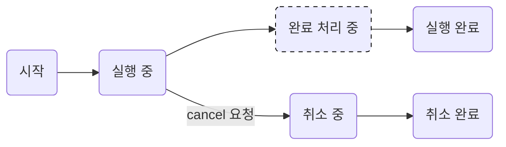

# 1. 주요 개념 정리

모든 코루틴 빌더 함수는 코루틴을 만들고 코루틴을 추상화한 [`Job`][job_docs] 객체를 생성합니다.
`launch` 함수 또한 코루틴 빌더이므로 launch 함수를 호출하면 코루틴 이 만들어지고, Job 객체가 생성돼 반환됩니다.
반환된 Job 객체는 코루틴의 상태를 추적하고 제어하는 데 사용합니다.

## 1.1. 코루틴 실행 정렬하기

```kotlin
package chapter4.code2

import kotlinx.coroutines.*

fun main() = runBlocking<Unit> {
  val updateTokenJob = launch(Dispatchers.IO) {
    println("[${Thread.currentThread().name}] 토큰 업데이트 시작")
    delay(100L)
    println("[${Thread.currentThread().name}] 토큰 업데이트 완료")
  }
  val networkCallJob = launch(Dispatchers.IO) {
    println("[${Thread.currentThread().name}] 네트워크 요청")
  }
}
```

위 코드는 토큰 업데이트 후, 해당 토큰을 사용해 네트워크 요청을 하는 상황을 상정하고 있습니다.

하지만, 실행 결과를 보면 "토큰 업데이트 완료"와 "네트워크 요청"이 출력되는 순서가 코드 작성 순서와 다릅니다.

의도한대로, 토큰 업데이트가 먼저 실행되고, 네트워크 요청이 실행되도록 하려면 어떻게 해야 할까요?

### 1.1.1 `join` 를 사용한 순차처리

```kotlin
package chapter4.code3

import kotlinx.coroutines.*

fun main() = runBlocking<Unit> {
  val updateTokenJob = launch(Dispatchers.IO) {
    println("[${Thread.currentThread().name}] 토큰 업데이트 시작")
    delay(100L)
    println("[${Thread.currentThread().name}] 토큰 업데이트 완료")
  }
  updateTokenJob.join() // updateTokenJob이 완료될 때까지 일시 중단
  val networkCallJob = launch(Dispatchers.IO) {
    println("[${Thread.currentThread().name}] 네트워크 요청")
  }
}

```

```sh
/*
// 결과:
[DefaultDispatcher-worker-1 @coroutine#2] 토큰 업데이트 시작
[DefaultDispatcher-worker-1 @coroutine#2] 토큰 업데이트 완료
[DefaultDispatcher-worker-1 @coroutine#3] 네트워크 요청
*/
```

%% 위 문제를 해결하기 위해 join 함수를 사용한 예제 코드 %%
`join` 함수는 `updateTokenJob`이 완료될 때까지 자신이 실행되는 코루틴을 일시 중단합니다.
따라서, `updateTokenJob`이 완료된 후에 `networkCallJob`이 실행되도록 할 수 있습니다.

### 1.1.2 `joinAll` 를 사용한 순차처리

```kotlin
package chapter4.code5

import kotlinx.coroutines.*

fun main() = runBlocking<Unit> {
  val convertImageJob1: Job = launch(Dispatchers.Default) {
    Thread.sleep(1000L) // 이미지 변환 작업 실행 시간
    println("[${Thread.currentThread().name}] 이미지1 변환 완료")
  }
  val convertImageJob2: Job = launch(Dispatchers.Default) {
    Thread.sleep(1000L) // 이미지 변환 작업 실행 시간
    println("[${Thread.currentThread().name}] 이미지2 변환 완료")
  }

  joinAll(convertImageJob1, convertImageJob2) // 이미지1과 이미지2가 변환될 때까지 대기

  val uploadImageJob: Job = launch(Dispatchers.IO) {
    println("[${Thread.currentThread().name}] 이미지1,2 업로드")
  }
}
```

```sh
/*
// 결과:
[DefaultDispatcher-worker-1 @coroutine#2] 이미지1 변환 완료
[DefaultDispatcher-worker-2 @coroutine#3] 이미지2 변환 완료
[DefaultDispatcher-worker-1 @coroutine#4] 이미지1,2 업로드
*/
```

`joinAll` 함수는 여러 개의 Job 객체를 받아, 모든 Job 객체가 완료될 때까지 대기합니다.
따라서, `convertImageJob1`과 `convertImageJob2`가 모두 완료된 후에 `uploadImageJob`이 실행됩니다.


## 1.2. 코루틴 실행 지연 시작하기

### 1.2.1  실행 시간을 확인하는 함수 선언

```kotlin
fun getElapsedTime(startTime: Long): String = 
    "지난 시간: ${System.currentTimeMillis() - startTime}ms"
```
코루틴 실행이 실제로 지연되었는지 확인하기 위해, 이런 함수를 선언했습니다. 
`getElapsedTime` 함수는 시작 시간을 받아 현재 시간과의 차이를 계산해 반환합니다.

### 1.2.2 CoroutineStart.LAZY 사용해 지연 실행하기

```kotlin
fun main() = runBlocking<Unit> {
    val startTime = System.currentTimeMillis()
    val lazyJob: Job = launch(start = CoroutineStart.LAZY) {
        println("[${Thread.currentThread().name}][${getElapsedTime(startTime)}] 지연 실행")
    }
    delay(1000L) // 1초간 대기
    lazyJob.start() // 코루틴 실행
}
```

`launch` 함수의 `start` 매개변수를 `CoroutineStart.LAZY`로 설정하면, 코루틴이 시작되지 않고 대기 상태로 생성됩니다.
결과로 프린트 되는 내용이 없습니다. 1초간 대기 후 `lazyJob.start()` 함수를 호출하여 코루틴을 실행하면, 아래와 같이 "지연 실행"이 출력됩니다.

```shell
/*
// 결과:
[main @coroutine#2][지난 시간: 1014ms] 지연 실행
*/
```


## 1.3. 코루틴 취소하기

코루틴 지연하는 방법은 간단하게 알아보았습니다. 그렇다면, 실행되고 있는 코루틴을 중단시키는 방법은 무엇일까요?

### 1.3.1. 코루틴 취소하기

`cancel` 함수를 사용하면 실행 중인 코루틴을 취소할 수 있습니다. 

아래 코드는 1초마다 반복하며, 10번 반복 후에 코루틴을 취소하는 코드입니다.
실행 결과를 보면, 반복문 회당 소요시간이 정확히 1000밀리초는 아니고 1000밀리초 이상이 걸리는 것을 확인할 수 있습니다.

```kotlin
fun main() = runBlocking<Unit> {
    val startTime = System.currentTimeMillis()
    val longJob: Job = launch(Dispatchers.Default) {
        repeat(10) { repeatTime ->
            delay(1000L) // 1000밀리초 대기
            println("[${getElapsedTime(startTime)}] 반복 횟수 $repeatTime")
        }
    }
    delay(10 * 1000L) // 10,00밀리초(10초)간 대기
    longJob.cancel() // 코루틴 취소
}
```

```shell
/*
// 결과:
[지난 시간: 1016ms] 반복횟수 0
[지난 시간: 2021ms] 반복횟수 1
[지난 시간: 3027ms] 반복횟수 2
...
[지난 시간: 8067ms] 반복횟수 7
[지난 시간: 9071ms] 반복횟수 8
*/
```

따라서, 코루틴 시작 후, 10초 후 `longJob.cancel()`을 실행했을 때, 마지막으로 출력되는 반복횟수가 9가 아닌 8이었습니다. 


### 1.3.2. 코루틴의 취소 확인

작업을 취소해도, 코루틴이 바로 종료되지 않습니다.


```kotlin
fun main() = runBlocking<Unit> {
    val startTime = System.currentTimeMillis()
    val longJob: Job = launch(Dispatchers.Default) {
        repeat(10) { repeatTime ->
            delay(1000L) // 1000밀리초 대기
            println("[${getElapsedTime(startTime)}] 반복 횟수 $repeatTime")
        }
    }
    delay(10 * 1000L) // 10,00밀리초(10초)간 대기
    longJob.cancel() // 코루틴 취소
    print("취소됨: $longJob")
}
```

```shell
/*
// 결과:
[지난 시간: 1016ms] 반복횟수 0
[지난 시간: 2021ms] 반복횟수 1
[지난 시간: 3027ms] 반복횟수 2
...
[지난 시간: 8067ms] 반복횟수 7
[지난 시간: 9071ms] 반복횟수 8
취소됨: StandaloneCoroutine{Cancelling}@711f39f9
*/
```

`longJob.cancel()` 함수 호출 직후, `longJob` 객체를 단순 출력하면 `Cancelling` 상태로 출력됩니다.
종료되지 않았다는 것이죠.


```kotlin
fun main() = runBlocking<Unit> {
  val longJob: Job = launch(Dispatchers.Default) {
// 작업 실행
  }
  longJob.cancelAndJoin() // longJob이 취소될 때까지 runBlocking 코루틴 일시 중단
  executeAfterJobCancelled()
}

fun executeAfterJobCancelled() {
  // 작업 실행
}
```

`cancelAndJoin` 함수는 코루틴을 취소하고, 취소될 때까지 대기하는 함수입니다.
`cancelAndJoin` 를 사용하면, `longJob`이 취소될 때까지 `runBlocking` 코루틴이 일시 중단되고,
취소 작업이 완료되면 `executeAfterJobCancelled` 함수가 실행됩니다.

## 1.4. 코루틴의 상태와 Job의 상태 변수

### 1.4.1 코루틴 상태 별 Job 상태



코루틴은 시작, 실행 중, 완료 처리 중, 실행 완료, 취소 중, 취소 완료의 여섯 가지 상태를 가집니다.
코루틴이 실행되면 시작 상태에서 실행 중 상태로 전환되며, 실행 중 상태에서 완료 처리 중 상태로 전환됩니다.
완료 처리 중 상태에서 실행 완료 상태로 전환되며, 취소 요청이 들어오면 취소 중 상태로 전환됩니다.
취소 중 상태에서 취소 완료 상태로 전환됩니다.

### 1.4.2 코루틴 상태별 Job 상태

| 코루틴 상태            | isActive | isCancelled | isCompleted |
|-------------------|----------|-------------|-------------|
| New(생성)           | false    | false       | false       |
| Active(실행 중)      | true     | false       | false       |
| Completed(실행 완료)  | false    | false       | true        |
| Cancelling(취소 중)  | false    | true        | false       |
| Cancelled(취소 완료)  | false    | true        | true        |

코루틴의 상태에 따른 Job 객체의 상태를 나타낸 표입니다.
코루틴이 생성된 직후에는 활성화되지 않았기 때문에, 모두 false로 표시됩니다.
코루틴이 실행 중이면 isActive가 true이고, isCancelled와 isCompleted는 false입니다.
코루틴이 실행 완료되면 isCompleted가 true가 되며, isActive와 isCancelled는 false가 됩니다.
코루틴이 취소 중이면 isCancelled가 true가 되며, isActive와 isCompleted는 false가 됩니다.

### 1.4.3 Job 상태 확인하기

```kotlin
fun printJobState(job: Job) {
  println(
    "Job State\n" +
        "isActive >> ${job.isActive}\n" +
        "isCancelled >> ${job.isCancelled}\n" +
        "isCompleted >> ${job.isCompleted} "
  )
}
```

이와 같은 job 객체의 상태를 확인하기 위해서는 `isActive`, `isCancelled`, `isCompleted` 같은 getter 함수를 사용합니다.
이 함수들은 각각 job 객체가 활성화되어 있는지, 취소되었는지, 완료되었는지를 확인합니다.

%%  [!question]- Thread.sleep 과 delay의 차이점은 무엇인가? %%
%%  [!question]- while 외에 실행 대기 시점이나 일시 중단 점을 알 수 없는 경우는? %%


# 2. 참고 자료

- [[Notes/Summary/Reading/코틀린-코루틴의-정석/03장 CoroutineDispatcher|03장 CoroutineDispatcher]]
- [[Notes/Summary/Reading/코틀린-코루틴의-정석/05장 async와 Deferred|05장 async와 Deferred]]

[job_docs]: https://kotlinlang.org/api/kotlinx.coroutines/kotlinx-coroutines-core/kotlinx.coroutines/-job/