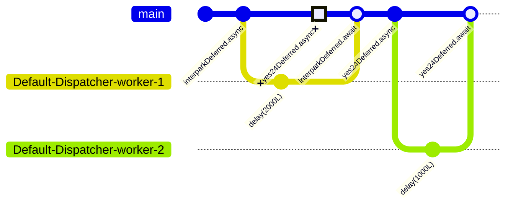
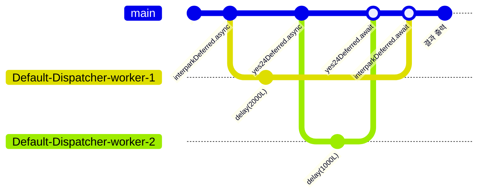

## 1. 주요 개념 정리

### 1.1 `async` 함수란?

> `Deferred`를 반환하는 코루틴 빌더 함수.

```kotlin
public fun CoroutineScope.launch(  
    context: CoroutineContext = EmptyCoroutineContext,  
    start: CoroutineStart = CoroutineStart.DEFAULT,  
    block: suspend CoroutineScope.() -> Unit  
): Job {  
    val newContext = newCoroutineContext(context)  
    val coroutine = if (start.isLazy)  
        LazyStandaloneCoroutine(newContext, block) else  
        StandaloneCoroutine(newContext, active = true)  
    coroutine.start(start, coroutine, block)  
    return coroutine  
}

public fun <T> CoroutineScope.async(  
    context: CoroutineContext = EmptyCoroutineContext,  
    start: CoroutineStart = CoroutineStart.DEFAULT,  
    block: suspend CoroutineScope.() -> T  
): Deferred<T> {  
    val newContext = newCoroutineContext(context)  
    val coroutine = if (start.isLazy)  
        LazyDeferredCoroutine(newContext, block) else  
        DeferredCoroutine<T>(newContext, active = true)  
    coroutine.start(start, coroutine, block)  
    return coroutine  
}
```

`launch`와 유사한 코루틴 빌더 함수입니다. 둘은 반환하는 값의 유형이 다르다는 큰 차이점이 있습니다. 
`launch`의 경우 `Job` 을 반환하고, `async` 는 `Job`의 일종인 `Deferred` 를 반환합니다. 
그렇다면 `Deferred`는 무엇일까요?


### 1.2 `Deferred` 란?

> 실행 결과를 받아 볼 수 있는 `Job`


```kotlin
public interface Deferred<out T> : Job {  
  
    public suspend fun await(): T  
  
    public val onAwait: SelectClause1<T>  
  
    @ExperimentalCoroutinesApi  
    public fun getCompleted(): T  
    
    @ExperimentalCoroutinesApi  
    public fun getCompletionExceptionOrNull(): Throwable?  
}
```

`Deferred`는 `Job` 을 상속받아 만들어진 interface 입니다.
`Job`의 경우, 코루틴 작업 결과를 반환할 수 없고, 작업 종료, 취소 정도의 상태만 파악할 수 있죠.
`Deferred<T>`는 결과값을 한번 감싸는 역할을 하여, 코루틴 작업 결과가 어떻게 끝났는지 알 수 있게 해줍니다.


# 2. 코루틴 결과값 받기

### 2.1. `async`-`await` 를 사용하여, 코루틴 결과값 받기

```kotlin
fun main() = runBlocking<Unit> {  
    val networkDeferred: Deferred<String> = async(Dispatchers.IO) {  
        delay(1000L)  
        return@async "서버: \"OK!\""  
    }  
    val result = networkDeferred.await()  
    println(result)  
}
```

```sh
서버: "OK!"
```

앞서 배웠던 `async` 함수를 통해서 `String` 을 반환하는 함수를 만들어봤습니다. 
네트워크 요청을 보낸 상황을 가정하고 만들었는데요. 1초 뒤에 "서버: "OK!""라는 문구를 반환하도록 했습니다. 
`async` 함수 context에 `Dispatchers.IO` 를 넣어, 입출력 환경에서 실행되게 하고, 
`delay(1000L)` 을 사용해 약 1초간 지연이 발생하는 상황을 재현했습니다. 

`await` 를 실행하는 시점에 위 코루틴이 실행되고, 결과는 1초 뒤에 출력됩니다.

# 3. 코루틴 결과값 **여러개** 받기

만약 여러 코루틴 작업 결과물을 한번에 받으려면 어떻게 해야할까요? 
예를 들어서, 여러 네트워크 요청을 보내고, 모든 응답을 받아야 하는 경우를 생각해보겠습니다.

### 3.1. `await` 를 사용하여, 코루틴 결과값 받기

```kotlin
fun main() = runBlocking<Unit> {  
    val startTime = System.currentTimeMillis()  
    val interparkDeferred: Deferred<Array<String>> = async(Dispatchers.IO) {  
        delay(2000L)  
        arrayOf("장원영", "안유진")  
    }  
    val participantList1: Array<String> = interparkDeferred.await()  
  
    val yes24Deferred: Deferred<Array<String>> = async(Dispatchers.IO) {  
        delay(1000L)  
        arrayOf("카리나")  
    }  
    val participantList2: Array<String> = yes24Deferred.await()  
  
    val participantCount = participantList1.size + participantList2.size  
    println("[${getElapsedTime(startTime)}] 참여자 수: $participantCount")  
}
```

여러 티켓 판매 사이트 서버에 콘서트 참여자 목록을 요청한 상황을 예시로 코드를 만들어 보았습니다. 
첫번째 코루틴에서는 파티 참여자가 누구인지 찾는데에 2초간 지연이 있고, 두번째 코루틴에서는 1초간 지연이 발생하도록 설정했습니다. 
각 `Deferred`에 await 를 걸어, 마지막 줄에서 참여자 수를 출력하도록 했습니다. 
동시에, `getElapsedTime` 함수를 통해 각 코루틴이 실행된 시간을 출력하도록 했습니다.

```sh
[지난 시간: 3018ms] 참여자 수: 3
```

결과는 총 세분이 참석하시는 걸로 보이네요. 
그리고 소요시간은 2000ms 가 아닌, 3018ms 였습니다. 




await 함수는 결과값을 받을 때까지 코루틴을 일시 중단시키기 때문에,
`participantList1` 을 받은 이후에 다음 `yes24Deferred.await()` 가 실행되었습니다.


### 3.2. `await` 를 사용하여, 코루틴 결과값 받기

```kotlin
fun main() = runBlocking<Unit> {  
    val startTime = System.currentTimeMillis()  
    val interparkDeferred: Deferred<Array<String>> = async(Dispatchers.IO) {  
        delay(2000L)  
        arrayOf("장원영", "안유진")  
    }  
    val yes24Deferred: Deferred<Array<String>> = async(Dispatchers.IO) {  
        delay(1000L)  
        arrayOf("카리나")  
    }  
  
    val participantList1: Array<String> = interparkDeferred.await()  
    val participantList2: Array<String> = yes24Deferred.await()  
  
    val participantCount = participantList1.size + participantList2.size  
    println("[${getElapsedTime(startTime)}] 참여자 수: $participantCount")  
}
```

이번에는 `await` 함수 호출 위치를 변경해보았습니다. 
두 코루틴이 실행된 이후에 `await` 함수를 호출하여, 결과값을 받도록 변경하였습니다.

```sh
[지난 시간: 2012ms] 참여자 수: 3
```

이번에는 3018ms 가 아닌, 2012ms 가 걸렸습니다.
runBlocking 블록 흐름을 일시 중단시키는 `await` 함수를 코루틴 실행 이후로 미루었기 때문에,
두 코루틴이 동시에 실행되었고, 결과값을 받는 시간이 줄어든 것입니다.


위 코드를 순서로 나타내면, 다음과 같습니다.




위와 같이 확인해야할 서버가 두 곳이라면 좋겠지만, 열 군데라면 어떨까요?
백 군데, 혹은 그 이상이라면, `await`를 줄줄이 나열하는 것은 코드 가독성을 해칠게 뻔합니다.

`awaitAll` 을 통해, 여러 개의 `Deferred` 를 받아 한번에 결과값을 받을 수 있습니다.


### 3.2. `awaitAll` 을 사용하여, 코루틴 결과값 받기

`awaitAll` 함수는 여러 개의 `Deferred` 를 받아, 모든 결과값을 받을 때까지 기다립니다.

```kotlin
public suspend fun <T> awaitAll(vararg deferreds: Deferred<T>): List<T> =  
    if (deferreds.isEmpty()) emptyList() else AwaitAll(deferreds).await()
```


```kotlin
fun main() = runBlocking<Unit> {  
    val startTime = System.currentTimeMillis()  
    val interparkDeferred: Deferred<Array<String>> = async(Dispatchers.IO) {  
        delay(2000L)  
        arrayOf("장원영", "안유진")  
    }  
    val yes24Deferred: Deferred<Array<String>> = async(Dispatchers.IO) {  
        delay(1000L)  
        arrayOf("카리나")  
    }  
  
    val participantLists: List<Array<String>> = awaitAll( interparkDeferred, yes24Deferred)  
    val participantCount = participantLists.flatMap { it.toSet() }.size  
  
    println("[${getElapsedTime(startTime)}] 참여자 수: $participantCount")  
}
```

이전 코드에서 `await` 함수의 나열을 `awaitAll` 함수로 대체하였습니다.
`awaitAll` 함수는 여러 개의 `Deferred` 를 받아, 모든 결과값을 받을 때까지 기다립니다.

위 코드를 실행한 결과는 다음과 같습니다.

```sh
[지난 시간: 2007ms] 참여자 수: 3
```

처리 시간도 2007ms 로, 이전과 동일한 결과를 얻었습니다.

`awaitAll` 함수를 사용하면, 여러 개의 `Deferred` 를 한번에 받을 수 있어 코드 가독성이 높아지니,
여러 개의 결과값을 받아야 할 때는 `awaitAll` 함수를 사용하는 것이 좋습니다.

# 4. [withContext][with_context_docs]

지금까지 `async`-`await` 를 통해 코루틴 결과값을 받는 방법을 알아보았습니다.


### 4.1. `withContext` 로 `async`-`await` 대체하기
<style>
    .multi-layout {           
        column-count: 2;
    }    
</style>
<div class="multi-layout">
<p>

```kotlin
fun main() = runBlocking<Unit> {  
    val networkDeferred: Deferred<String> = async(Dispatchers.IO) {  
        delay(1000L)  
        return@async "서버: \"OK!\""  
    }  
    val result = networkDeferred.await()  
    println(result)  
}
```
```sh
서버: "OK!"
```

`async`-`await` 를 사용하여, 코루틴 결과값을 받는 방법은 우리가 지금까지 사용해왔던 방법입니다.
`async` 함수로 코루틴을 생성하면, `CoroutineDispatcher`가 작업 대기열에 해당 코루틴을 보관하다가
실행할 스레드가 생기면 해당 스레드에 코루틴을 실행시킵니다.

다만, `await` 함수를 실행하고 있기 때문에, 순차적으로 실행되는 것을 볼 수 있습니다.

</p>

<p>

```kotlin
fun main() = runBlocking<Unit> {  
    val result: String = withContext<String>(Dispatchers.IO) {  
        delay(1000L)  
        "서버: \"OK!\""  
    }  
    println(result)  
}

```

```sh
서버: "OK!"
```

`withContext` 함수를 사용하여, `async`-`await` 와 비슷한 기능을 구현할 수 있습니다. 
하지만 동작 방식은 완전히 다릅니다.

`withContext` 함수는 새로운 코루틴을 생성하지 않고, 새로 실행하게 된 [[Notes/Summary/Reading/코틀린-코루틴의-정석/06장 CoroutineContext|CoroutineContext]]에 따라 코드 블록을 실행합니다.
즉, `withContext` 의 람다는 현재 코루틴을 유지한 채로 새로운 스레드에서 실행됩니다. 

<p>
</div>


### 4.2. `withContext` 와 `async`-`await` 비교


| Feature                      | `withContext`                                         | `async`-`await`                                    |
|------------------------------|-------------------------------------------------------|----------------------------------------------------|
| **기본 목적**                | 컨텍스트 전환을 통한 코루틴 블록 내에서의 작업 처리    | 비동기 작업을 시작하고 결과를 기다리기 위해 사용  |
| **반환 값**                  | 지정된 컨텍스트에서 실행된 블록의 결과 반환             | `Deferred<T>` 객체 반환, `await()` 호출 시 결과 반환 |
| **사용 형태**                | `withContext(Dispatchers.IO) { ... }` 형식             | `async { ... }`와 `await()` 형식                    |
| **동작 방식**                | 새로운 코루틴을 생성하지 않고, 지정된 디스패처에서 실행 | 새로운 코루틴을 생성하여 비동기 작업 수행          |
| **병렬 처리**                | 기본적으로 병렬 처리를 하지 않음                       | 병렬로 여러 비동기 작업을 수행 가능                |
| **오버헤드**                 | 새로운 코루틴을 생성하지 않아 오버헤드가 적음           | 코루틴 생성 오버헤드가 있음                        |
| **코드 가독성**              | 간단한 컨텍스트 전환에 적합                             | 여러 비동기 작업이 있을 때 가독성이 좋음           |
| **사용 예시**                | I/O 작업이나 특정 스레드에서 실행할 때 사용              | 여러 비동기 작업의 결과를 동시에 받아야 할 때 사용 |
| **에러 처리**                | `try-catch` 블록을 통해 일반적인 예외 처리 가능           | `await()` 사용 시 예외를 처리해야 함               |
| **컨텍스트 전환**            | 스레드를 전환하여 코드 블록을 실행                       | `async`로 생성된 각 코루틴이 비동기적으로 실행됨   |
| **공유 자원 접근**           | `withContext` 블록 내에서 안전하게 공유 자원 접근 가능   | `async` 블록 내에서 안전하게 접근하되 동기화 필요  |


# 5. Q&A

## 5.1. `withContext`에서는 왜 블록 내에서 안전하게 공유 자원 접근 가능한가?

>   • 각 작업은 sharedList에 요소를 추가하지만, 동기화가 되어 있지 않습니다.
>   
>   • 이 경우, 여러 코루틴이 동시에 sharedList에 접근하여 요소를 추가하기 때문에, 예상한 1000개의 요소가 리스트에 추가되지 않을 수 있습니다.
>   
>   • 결과적으로 리스트의 크기가 1000이 아닌 작은 값이 나올 수 있으며, 이는 동시 접근으로 인해 발생하는 문제입니다.

<script src="https://gist.github.com/eunice-hong/4bf560c435e66cec7bc185dd541a5126.js"></script>


[with_context_docs]: https://kotlinlang.org/api/kotlinx.coroutines/kotlinx-coroutines-core/kotlinx.coroutines/with-context.html


- [[Notes/Summary/Reading/코틀린-코루틴의-정석/04장 코루틴 빌더와 Job|04장 코루틴 빌더와 Job]]
- [[Notes/Summary/Reading/코틀린-코루틴의-정석/06장 코루틴 빌더와 Job|06장 코루틴 빌더와 Job]]

<!-- **에러 처리** | `try-catch` 블록을 통해 일반적인 예외 처리 가능           | `await()` 사용 시 예외를 처리해야 함  상세 설명 8강에서 계속한다. -->
