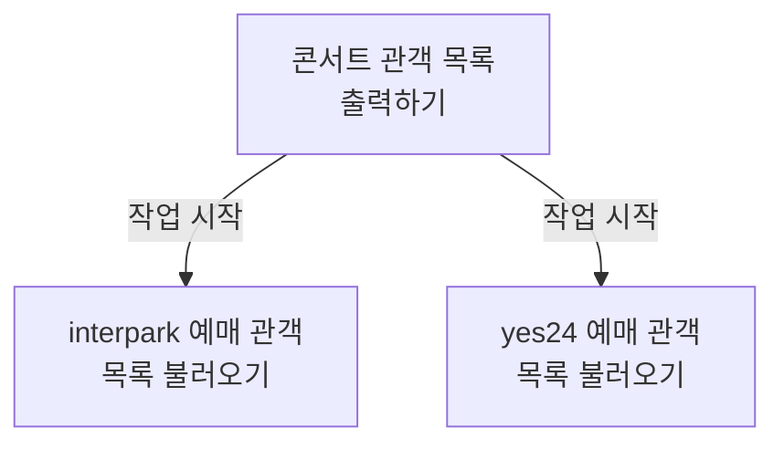
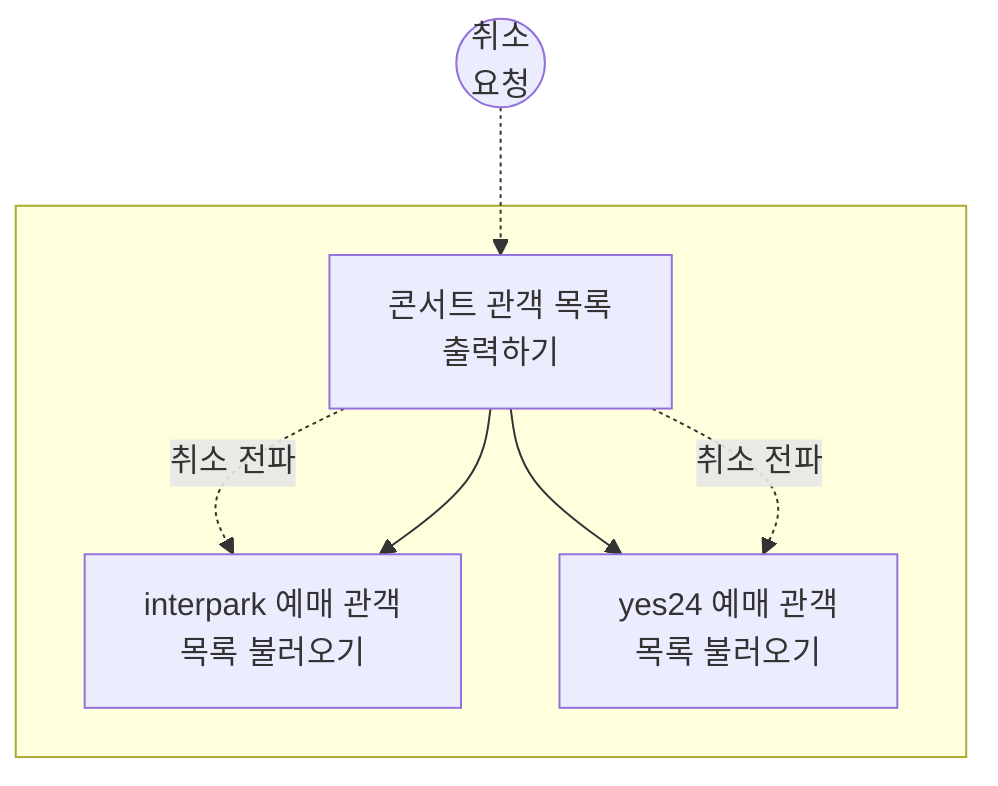
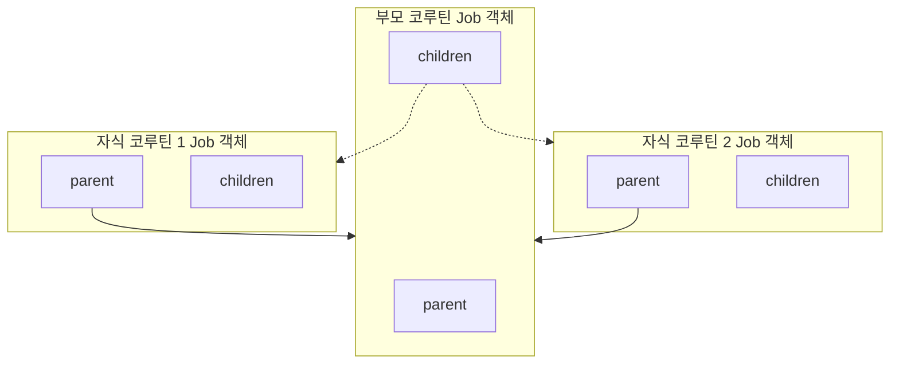
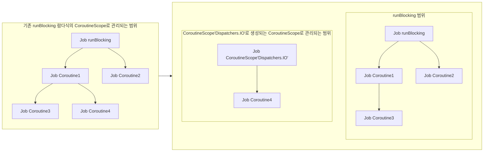

# 1. 구조화된 동시성

오늘은 코틀린 코루틴에서 동시성 구조화가 어떻게 구현되었는지 알아보겠습니다.

## 1.1. Structured Concurrency

> 프로그램에서 동시 실행되는 작업들을 계층 구조로 보아,
>  시작과 종료가 명확하게 관리하는 동시성 패러다임

우선, "Structured Concurrency", 구조화된 동시성이란 무엇일까요? 여러 작업들을 동시에 처리해야하는 프로그램에서 각 작업을 계층 구조로 두어, 시작과 끝을 명확하게 관리할 수 있도록 하는 동시성 패러다임입니다. 

"구조화된 동시성" 패러다임에는 두가지 큰 원칙이 있는데요.

## 1.2. 동시성 구조화 원칙

두 비동기 작업이 계층 관계일 때,
1. 자식(child) 작업이 모두 끝나야, 부모(parent) 작업을 끝낼 수 있다.
2. 부모 작업이 취소되면, 자식 작업도 취소된다.

하나는 자식의 작업이 모두 끝나야 부모 작업을 끝낼 수 있다는 것이고, 나머지 하나는 부모 작업이 취소될 경우 자식 작업에도 취소가 전파된다는 것입니다.

지난 시간 책 예시로 나왔던, "콘서트 관객 목록 출력하기"를 예시로 들어보겠습니다.

### 1.2.1. 동시성 구조화 원칙 - 예시 1

콘서트 관객 목록을 출력하기 위해서는 각 예매 사이트에 관객 목록을 요청해야합니다. 모든 예매 사이트에 있는 관객 목록을 불러온 다음에야, 출력 작업을 완료할 수 있죠. 즉, 이전 예시 코드로 이미 살펴본 바, 코틀린 코루틴에도 "구조화된 동시성" 패러다임이 적용되었다고 볼 수 있겠습니다.

그 다음 원칙 또한 마찬가지입니다.

### 1.2.2. 동시성 구조화 원칙 - 예시 2

"관객 목록 출력하기" 작업 진행 중에 누군가 출력을 취소한다면, 우리는 더 이상 interpark 에서도, yes24에서도 관객 목록을 불러올 필요가 없습니다. 다시 말해, 두번째 원칙에 따라 부모 작업이 취소되었을 때, 자식 작업에도 취소 요청이 전파된다는 것을 확인할 수 있습니다.

그렇다면, 코틀린 코루틴은 구체적으로 어떻게 서로를 계층화하고 있을까요?

# 2. 코루틴의 동시성 구조

코루틴은 Job 객체를 중심으로 계층 구조를 형성합니다. 

그래서 우리는 먼저 Job 을 가지고 코틀린 코루틴이 어떻게 구조화된 동시성을 구현했는지 알아보도록 하겠습니다.

## 2.1. Job 동시성 구조

사실 정확히 말하면, Job 끼리 계층 관계를 형성하고 있습니다. 하나의 코루틴은 하나의 Job을 갖고, 각 Job 은 하나의 parent, 여러 개의 child Job 을 갖습니다.

## 2.1.1. Job 계층 구조

다시 말해, 코루틴은 그 자체로 계층을 형성하지 않고 Job 을 기준으로 부모-자식 관계를 구분하고 있습니다. 

아래 코드를 통해 구체적으로 Job의 관계를 살펴보도록 하죠.

<iframe width="100%" height="100%" src="https://pl.kotl.in/zx9U9dYhC?from=5&to=14"></iframe>

이 코드를 통해 우선 Job 객체에서 부모, 자식 Job 을 확인하는 방법을 알 수 있습니다. 
1. `childJob`에서 `parent` 속성을 사용해서 부모 Job 을 불러와 `parentJob` 과 비교해보면, 둘은 같다는 것을 확인할 수 있습니다. 
2. 두번째, `parentJob.children` 을 통해 `parentJob` 의 자식 Job 을 불러와 그 안에 `childJob`이 포함되었다는 것을 확인할 수 있습니다. 
3. 마지막으로 `runBlocking` 에서 생성된 Job 객체와 `launch` 로 생성된 Job 객체를 비교해보면 둘은 다르다는 것을 확인할 수 있습니다. 즉, Job 은 서로 계층이 나뉠 뿐 상속 관계를 갖지는 않는다는 점입니다.

그렇다면, Job 객체는 동시성 구조화 원칙을 따르고 있을까요?

### 2.1.1.1. Job - 동시성 구조화 원칙 1

<iframe width="100%" height="100%" src="https://pl.kotl.in/dQ7laKZSK"></iframe>

위 코드에 `launch` 로 생성된 코루틴들이 있습니다. 기본적으로 `parentJob` 속에 child Job 두개가 포함되어있는 구조입니다. `parentJob.join()` 을 통해 `parentJob` 이 종료되기까지 기다려보면, `childJob1` 과 `childJob2` 코루틴이 종료된 후에야 `parentJob`코루틴이 종료되었다는 콜백이 호출됨을 확인 할 수 있습니다. 

두번째 원칙은 어떨까요?

### 2.1.1.2. Job - 동시성 구조화 원칙 2

<iframe width="100%" height="100%" src="https://pl.kotl.in/sxFVLykDx"></iframe>

`infiniteJob` 이라는 부모 코루틴 아래, 무한히 홀수와 짝수를 출력하는 코루틴을 만들어두었습니다. 그리고 각 코루틴이 종료되면 종료되었다는 메시지를 출력하도록 콜백 함수를 작성해두었습니다. 참고로 이 `invokeOnCompletion`는 코루틴이 "취소 완료" 상태로 변경된 경우에도 호출됩니다.
`infiniteJob` 을 약 3000ms 실행한 뒤 취소해보면, 홀수, 짝수도 부모 코루틴이 취소됨에 따라 종료되었음을 확인할 수 있습니다. 

## 2.2.2. CoroutineScope 사용하기

CoroutineScope.launch 함수 톺아보며 함수에 스코프가 실행 환경을 어떻게 전달하는지 알아보겠습니다.

### 2.2.2.1. CoroutineScope를 사용해 코루틴 실행 환경 구성하기

<iframe width="100%" height="250px" src="https://pl.kotl.in/AGp-sFyIm?readOnly=true"></iframe>

위 코드는 실제 CoroutineScope 의 확장함수 `launch`입니다. 인자로 코루틴 실행환경을 설정할 수 있도록 CoroutineContext 를 받고 있음을 확인할 수 있습니다. 그리고 받은 CoroutineContext를 코루틴을 실행하는데에 사용하고 있네요.

### 2.2.2.2. 코루틴 간 CoroutineScope 상속

<iframe width="100%" height="100%" src="https://pl.kotl.in/aGbzMqZEs?from=7&to=19"></iframe>

위 코드를 실행해보면, 현재 코루틴과 newScope 코루틴 모두 동일한 이름과 CoroutineDispatcher 를 사용하고 있는 것을 확인할 수 있습니다. 다시 말해, 별도의 조치가 없는 한, 한 스코프 내에서 생성된 코루틴은 모두 같은 실행환경을 사용합니다.

<iframe width="100%" height="100%" src="https://pl.kotl.in/kXCp_S-M2?from=7&to=19"></iframe>

이전 코드에서 자식 코루틴에 CoroutineName 이름을 설정하는 것으로 코루틴 컨텍스트 요소를 변경할 수 있습니다. 그 외 항목들은 위와 마찬가지로 유지되는 것을 확인할 수 있습니다.

## 2.2.3. CoroutineScope 상속 관계 탈출하기

<iframe width="100%" height="30%" src="https://pl.kotl.in/jWYGiXzY6?from=8&to=22"></iframe>

<iframe width="100%" height="30%" src="https://pl.kotl.in/rRqgls-IG?from=8&to=22"></iframe>

### 2.2.3.1. CoroutineScope 취소 전파

<iframe width="100%" height="100%" src="https://pl.kotl.in/JzpztJyvr?from=8&to=26"></iframe>

# 3. 참고 자료

- [[Notes/Summary/Reading/코틀린-코루틴의-정석/06장 CoroutineContext|06장 CoroutineContext]]
- [[Notes/Summary/Reading/코틀린-코루틴의-정석/08장 예외 처리|08장 예외 처리]]