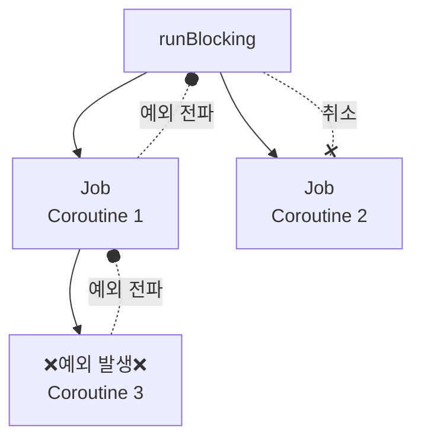
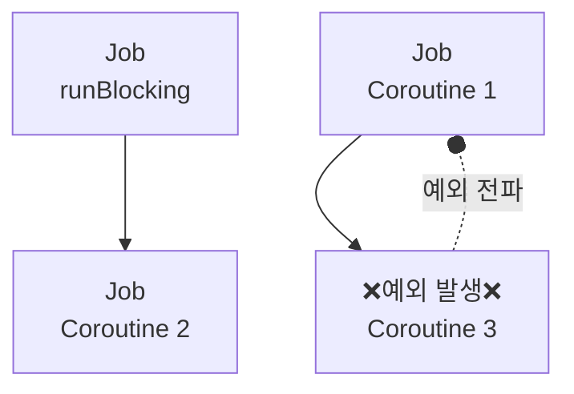
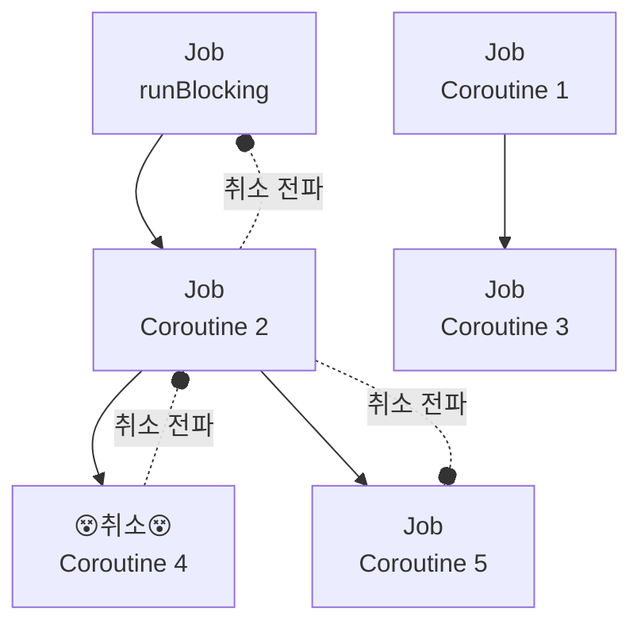
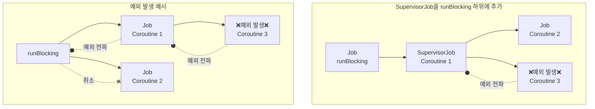
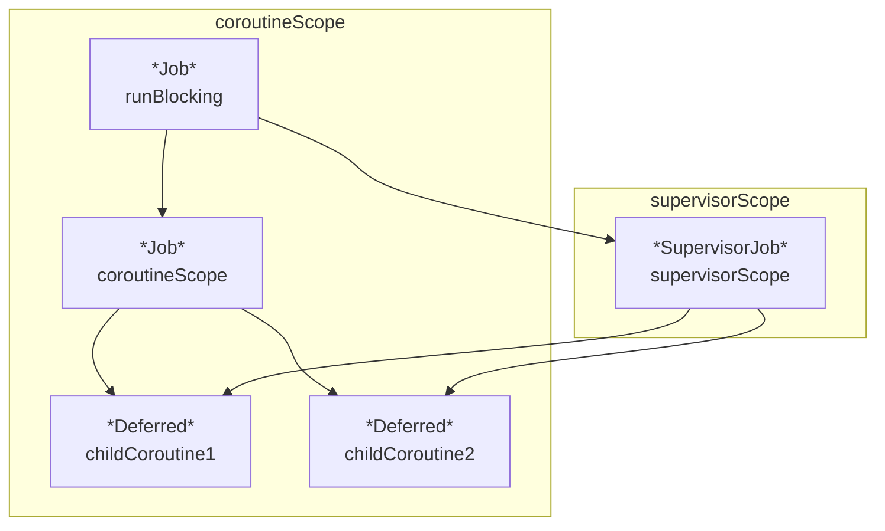

애플리케이션은 다양한 예외 상황에 노출되며, 예외를 적절히 처리해 애플리케이션의 안정성을 확보할 수 있습니다. 
코루틴에서 예외가 발생한다면 어떤 일이 벌어질까요?

# 1. 코루틴에서 예외가 발생하면?

<iframe width="100%" height="260px" src="https://pl.kotl.in/C9cGoFuO3?from=6&to=19"></iframe>

코루틴은 비동기 작업을 실행할 때 사용되기 때문에 애플리케이션의 안정성을 위해 예외 처리가 필수죠.
일례로, 중첩된 코루틴에서 예외가 발생하는 상황을 재현해보았습니다.
위 코드는 언뜻 보기에 "Coroutine3"의 코루틴에서 예외가 발생하였으니, 나머지 코루틴 속 `println` 이 문제없이 실행 될 것처럼 보입니다.

하지만, 실행해보면 `Coroutine3`에서 발생한 예외가 상위 코루틴까지 전파되어, 모든 코루틴이 취소되는 것을 확인할 수 있습니다.

코루틴에서 발생한 예외는 부모 코루틴으로 전파되며, 적절히 처리되지 않으면 최상위 루트 코루틴까지 전파됩니다.
예외를 전파받은 코루틴이 취소되면 해당 코루틴의 모든 자식 코루틴에 취소가 전파됩니다.
즉, 루트 코루틴이 예외로 취소되면 구조화된 모든 코루틴이 취소되어 프로그램이 종료됩니다.

이렇게 코루틴에서 발생한 예외가 전파되는 것을 막으려면 어떻게 해야할까요? 우선, 코루틴에서 발생하지만, 부모 코루틴으로 전파되지 않는 예외에 대해 알아보겠습니다.

# 2. 전파되지 않는 코루틴 예외

1. `CancellationException`
2. `TimeoutCancellationException`

코루틴에서 발생한 예외는 부모 코루틴으로 전파되지만, 일부 예외는 전파되지 않습니다.
그 중 대표적인 예외로 `CancellationException`과 `TimeoutCancellationException`이 있습니다.

<iframe width="100%" height="260px" src="https://pl.kotl.in/ntiXczkfk?from=8&to=21"></iframe>

`CancellationException`은 다른 예외와 달리 부모 코루틴으로 전파되지 않습니다.
`CancellationException`이 전파되지 않는 이유는 `CancellationException` 은 코루틴을 취소하기 위한 특별한 예외이기 때문이죠.

<iframe frameborder="0" scrolling="no" style="width:100%; height:436px;" allow="clipboard-write" src="https://emgithub.com/iframe.html?target=https%3A%2F%2Fgithub.com%2FKotlin%2Fkotlinx.coroutines%2Fblob%2Fd8d6f8f37978b8e202d93b34f23f101df9c5724d%2Fkotlinx-coroutines-core%2Fcommon%2Fsrc%2FTimeout.kt%23L163-L179&style=intellij-light&type=code&showBorder=on&showLineNumbers=on&showFileMeta=on&showFullPath=on&showCopy=on"></iframe>

`TimeoutCancellationException`은 코루틴 실행 시간이 예상을 초과한 경우, 발생하는 예외입니다.
`TimeoutCancellationException`의 상세 구현을 보면 `CancellationException`의 서브 클래스라는 것을 확인할 수 있습니다.
이 경우도 마찬가지로 예외가 발생한 코루틴만 취소한다.

그렇다면, 코루틴에 실행 예상 시간을 어떻게 설정할 수 있을까요? 바로 `withTimeout` 을 사용하면 됩니다.

## 2.1. `withTimeout` 으로 `TimeoutCancellationException` 생성하기

<iframe width="100%" height="420px" src="https://pl.kotl.in/5nSRNvYnB?from=11&to=32"></iframe>

`withTimeout` 함수를 사용해 코루틴의 실행 시간을 제한할 수 있습니다.
`withTimeout` 함수는 실행 시간 초과 시 `CancellationException`의 서브 클래스인 `TimeoutCancellationException`을 발생시켜 해당 코루틴만 취소합니다.
추가로 `withTimeoutOrNull`을 사용하면 실행 시간 초과 시 null이 반환되도록 할 수 있습니다.

<iframe width="100%" height="400px" src="https://pl.kotl.in/_8EuJgMDJ?from=10&to=30"></iframe>

`withTimeoutOrNull`을 사용하면 실행 시간 초과 시 결과값을 null로 반환하도록 할 수 있습니다.

이외에, 전파되는 예외들을 제어하려면 어떻게 해야할까요?

# 2. 코루틴 예외 전파를 막으려면?

## 2.1. 코루틴 예외 전파 차단 - `Job` 

새로운 루트 `Job` 객체를 생성하여 코루틴의 구조화를 깨서 코루틴의 예외 전파를 제한할 수 있습니다.

<iframe width="100%" height="260px" src="https://pl.kotl.in/NEGBtTs26?from=7&to=20"></iframe>

코루틴 예외 관련 이야기 서두에 등장한 예시 코드와 동일한 코드를 사용하여 예시를 만들어 보았습니다.
`Coroutine 1` 생성 시, `Job` 객체를 새로 만들어 `runBlocking`에서 이어지는 구조를 끊어보았습니다.
실행해보면, `Coroutine 3`에서 발생한 예외가 `Coroutine 1`까지는 전파되지만, `Coroutine 2`는 실행되어 종료되는 것을 확인할 수 있습니다.

위 코드를 이와 같이 그래프로 나타낼 수 있습니다.

`Coroutine 3`에서 발생한 예외는 `Coroutine 1`까지 전파되지만,
`runBlocking` 과 관계 없이 새로 생성한 `Job` 객체를 사용한 `Coroutine 1`까지만 전파되고, `Coroutine 2`는 실행되어 종료됩니다.

Job 객체를 생성해 코루틴의 구조화를 깨는 것은 예외 전파를 제한하는 것뿐만 아니라 취소 전파도 제한시킵니다.
일반적으로 코루틴의 구조화는 큰 작업을 연관된 작은 작업으로 나누는 과정을 통해 일어나는데,
만약 작은 작업의 구조화가 깨진다면 큰 작업에 취소가 요청되더라도 작은 작업은 취소되지 않으며 이는 비동기 작업을 불안정하게 만듭니다.

## 2.2. 코루틴 예외 전파 차단 - `SupervisorJob`

<iframe width="100%" height="280px" src="https://pl.kotl.in/2mfUGkC92?from=8&to=22"></iframe>

`SupervisorJob` 객체를 사용해 예외 전파를 제한할 수 있다. `SupervisorJob` 객체는 예외를 전파받지 않는 특수한 `Job` 객체입니다.
`SupervisorJob` 객체는 자식 코루틴으로부터 예외를 전파받지 않는 특수한 `Job` 객체로 하나의 자식 코루틴에서 발생한 예외가 다른 자식 코루틴에게 영향을 미치지 못하도록 만드는 데 사용됩니다.

일반적인 `Job` 객체는 자식 코루틴에서 예외가 발생하면 예외를 전파받아 취소되지만 `SupervisorJob` 객체는 예외를 전파 받지 않아 취소되지 않습니다.
SupervisorJob 생성 함수를 parent 인자 없이 사용하면 Supervisorjob 객체를 루트 Job으로 만들 수 있으며, parent 인자로 Job 객체를 넘기면 부모 Job이 있는 Supervisorjob 객체를 만들 수 있습니다.

그래프를 통해 비교해보도록 하겠습니다.

 `SupervisorJob` 객체를 사용한 경우, `Coroutine 3`에서 발생한 예외는 `Coroutine 1`까지만 전파되고, `Coroutine 2`는 문제없이 실행되어 종료됩니다.
즉, 일반 `Job` 객체와는 다르게, `SupervisorJob` 을 사용하면 작업의 구조를 깨지 않으면서도 예외 전파를 제한할 수 있습니다.

# 3. 코루틴 예외 처리 방법

## 3.1. 코루틴 예외 처리 방법 - `try`-`catch`

<iframe width="100%" height="240px" src="https://pl.kotl.in/kiMEAhF55?from=8&to=20"></iframe>

코루틴 내부에서 `try`-`catch`문을 사용해 예외를 처리할 수 있습니다. 

이 때, 우리가 염두에 두어야할 것은 코루틴 빌더 함수에 대한 `try`-`catch`문은 코루틴이 실행될 때 발생하는 예외를 잡지 못한다는 것입니다.

<iframe width="100%" height="320px" src="https://pl.kotl.in/SCoYAlYg1?from=8&to=20"></iframe>

이 코드를 보면 Coroutine1 코루틴을 만드는 `launch` 코루틴 빌더 함수를 `try`-`catch`문으로 감싸지만 
이 `try`-`catch`문은 Coroutine1 코루틴에서 발생하는 예외 를 잡지 못한다. 

`launch`는 코루틴을 생성하는 데 사용되는 함수일 뿐으로 람다식의 실행은 생성된 코루틴이 `CoroutineDispatcher`에 의해 스레드로 분배되는 시점에 일어나기 때문이다. 
즉, 이 `try`-`catch`문은 launch 코루틴 빌더 함수 자체의 실행만 체크하며, 람다식은 예외 처리 대상이 아니다.

## 3.2. 코루틴 예외 처리 방법 - `CoroutineExceptionHandler`

코루틴 실행 중 발생한 예외를 처리하는 두번째 방법은 `CoroutineExceptionHandler` 객체를 사용하는 것입니다. 
`CoroutineExceptionHandler` 객체는 코루틴에서 발생한 예외를 처리하는 핸들러로, `launch` 함수의 두번째 인자로 넘겨줄 수 있습니다.

### 3.2.1. `CoroutineExceptionHandler` - 예외 전파

여기서 우리가 기억할만한 점은 `CoroutineExceptionHandler` 객체는 예외 전파를 제한하지 않는다는 점입니다.

<iframe width="100%" height="260px" src="https://pl.kotl.in/RkyVQgXTM?from=9&to=22"></iframe>

이 코드를 실행하면, `Coroutine 1`에 `exceptionHandler`를 설정하였음에도, 
상위 코루틴으로 예외가 전파되는 것을 막지 못해 `Coroutine 2`의 실행 내용이 출력되지 않음을 확인할 수 있습니다.

### 3.2.2 `CoroutineExceptionHandler` - 예외 처리

<iframe width="100%" height="420px" src="https://pl.kotl.in/1n33zaZwF?from=9&to=30"></iframe>

이 코드를 실행하면, `Coroutine 3`에서 발생한 예외가 `Coroutine 1`에서 처리되어 프로그램이 종료되지 않음을 확인할 수 있습니다.
동시에 `Coroutine 3`은 취소되어, `CoroutineExceptionHandler`를 사용할 수 없었지만, 
`Coroutine 1`에서 예외를 처리하여 `CoroutineExceptionHandler`에 선언한대로 메시지가 출력되는 것을 확인할 수 있습니다. 

# 4. 코루틴 예외 처리

## 4.1. 코루틴 예외 처리 - `async`-`await`

<iframe width="100%" height="220px" src="https://pl.kotl.in/_MJ4i31AE?from=7&to=18"></iframe>

async 함수로 생성된 코루틴에서 발생한 예외는 await 호출 시 노출됩니다.
async 코루틴에서 발생한 예외 또한 부모 코루틴으로 전파됩니다.

## 4.2. 코루틴 예외 처리 - `coroutineScope`

<iframe width="100%" height="760px" src="https://pl.kotl.in/ak2PQnxyJ?from=9&to=47"></iframe>

이전 코드에서 관람객 목록을 가져오는 함수 중 하나에서 예외가 발생하는 상황을 예로 들어, coroutineScope 의 예외 전파에 대해 알아보겠습니다.
이 코드에서 `getParticipantList2` 함수에서 예외가 발생하여, `getParticipantList1` 관람객 목록만 출력하고 프로그램이 종료될까요?

안타깝게도, `coroutineScope` 함수는 일반 `Job` 객체를 생성하기 때문에, 하위 코루틴에서 발생한 예외가 상위 코루틴으로 전파되어 프로그램이 종료됩니다.
위와 같은 상황을 방지하기 위해 `supervisorScope` 함수를 사용할 수 있습니다.

## 4.2. `supervisorScope` 예외 전파 막기

`supervisorScope`는 `coroutineScope`와 동일하게 일시 중단 함수 내에서 상위 코루틴 환경을 가져와 사용할 수 있게 도와줍니다.
다만 한가지 차이가 있다면, 생성되는 `Job`이 일반 `Job`이 아닌 `SupervisorJob`라는 점입니다.
그 덕분에 하위 코루틴에서 오류가 발생하더라도 상위 코루틴으로 예외가 전파되는 것을 방지 할 수 있습니다.

## 4.2. `supervisorScope` 예외 전파 막기 - 코드

<iframe width="100%" height="740px" src="https://pl.kotl.in/V9QXA3eEp?from=9&to=46"></iframe>

이번에는 `getParticipantList2` 함수에서 예외가 발생하더라도, `getParticipantList1` 함수의 결과를 출력하고 프로그램이 종료되지 않음을 확인할 수 있습니다.

# 참고 자료
- [[Notes/Summary/Reading/코틀린-코루틴의-정석/07장 구조화된 동시성|07장 구조화된 동시성]]
- [[Notes/Summary/Reading/코틀린-코루틴의-정석/09장 일시 중단 함수|09장 일시 중단 함수]]

- [[Kotlin] Coroutine suspend function 은 대체 뭐야?](https://nuritech.tistory.com/16)

