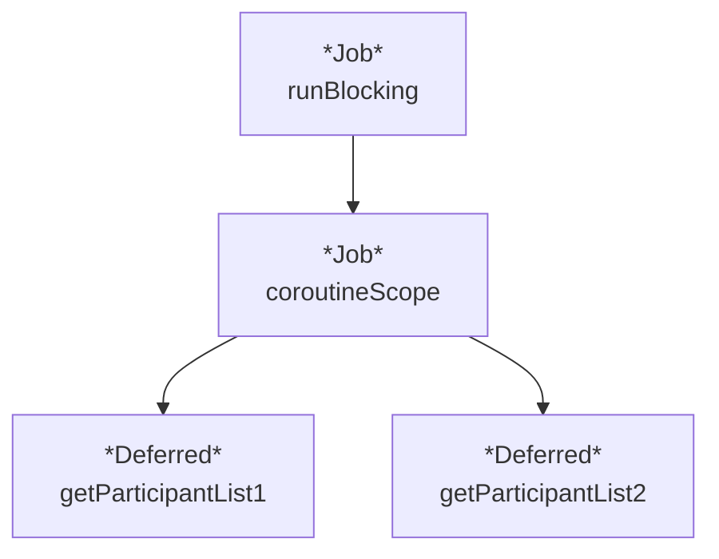
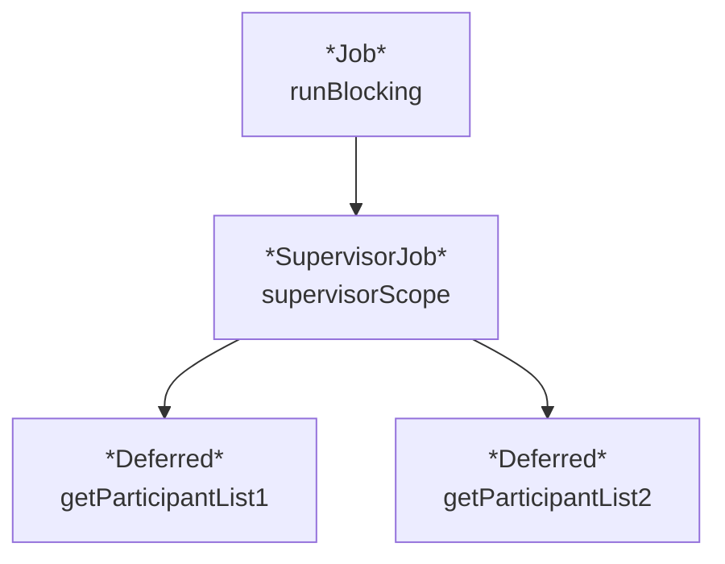

코루틴 관련 주요 개념 중 하나인 "일시 중단 함수"에 대해 알아보도록 하겠습니다.

# 1. 일시 중단 함수란?

> 일시 중단 지점이 있는 함수

일시 중단 함수는 `suspend` 라는 키워드로 정의되는 함수로, 동작 실행을 일시 중단하고 나중에 재개할 수 있는 함수를 의미합니다.
일시 중단 함수는 비동기 작업을 동기식 코드처럼 작성할 수 있게 해줍니다. 

전통적인 콜백(callback) 기반 비동기 코드를 생각해보시죠.
콜백 방식은 흔히 콜백 지옥(callback hell)을 만들어 가독성이 떨어지며 유지보수를 어렵게 할 수 있습니다. 
코루틴과 일시 중단 함수를 사용하면 다음과 같이 비동기 작업을 마치 동기식 코드처럼 작성할 수 있죠.

일시 중단 함수의 일례로 `delay`를 들 수 있습니다.

<iframe frameborder="0" scrolling="no" style="width:100%; height:268px;" allow="clipboard-write" src="https://emgithub.com/iframe.html?target=https%3A%2F%2Fgithub.com%2FKotlin%2Fkotlinx.coroutines%2Fblob%2Fd8d6f8f37978b8e202d93b34f23f101df9c5724d%2Fkotlinx-coroutines-core%2Fcommon%2Fsrc%2FDelay.kt%23L121-L129&style=intellij-light&type=code&showBorder=on&showLineNumbers=on&showFileMeta=on&showFullPath=on&showCopy=on"></iframe>

`delay` 함수도 일시 중단 함수로, 본인이 실행되는 동안 호출부의 흐름을 잠시 멈춥니다.
그 외에도 스레드 사용을 양도하는 [`yield` 함수](https://github.com/Kotlin/kotlinx.coroutines/blob/d8d6f8f37978b8e202d93b34f23f101df9c5724d/kotlinx-coroutines-core/common/src/Yield.kt#L25-L46),
네트워크 요청이나 파일 입출력 작업 같은 시간이 오래 걸리는 작업을 할 때, 
코루틴은 해당 작업이 완료될 때까지 기다리는 대신 본인이 실행되고 있던 스레드가 다른 작업을 처리하도록 실행을 일시 중단할 수 있습니다.

# 2. 일시 중단 함수 사용 방법

일시 중단 함수는 두가지 환경에서 호출 할 수 있습니다. 

1. 코루틴 내부
2. 일시 중단 함수 내부

첫번째는 코루틴 내부이고, 나머지 하나는 일시 중단 함수 내부입니다.

## 2.1. 일시 중단 함수 사용 방법 - 코루틴

<iframe width="100%" height="300px" src="https://pl.kotl.in/GQVoYlxza?from=10&to=25"></iframe>

이 코드는 `runBlocking` 안에서 코루틴 빌더 함수 `launch` 를 사용하여 코루틴을 만들고, 그 안에서 `delayPrint` 라는 일시 중단 함수를 실행합니다. 
이 때, `delayPrint` 에서는 1초 일시 중단된 후, 메시지를 출력합니다.

맨 처음 언급했듯, 일시 중단 함수는 코루틴 내에서 비동기 함수를 동기 함수처럼 순차적으로 처리할 수 있게 합니다. 
따라서 위와 같이 하나의 코루틴 내에서 여러 개의 일시 중단 함수를 실행하면, 결과값이 순차적으로 출력됨을 확인 할 수 있습니다.

## 2.2. 일시 중단 함수 사용 방법 - 일시 중단 함수

<iframe width="100%" height="520px" src="https://pl.kotl.in/CqYem9bbr?from=8&to=34"></iframe>

이번에는 이전 챕터에서 자주 사용하던 티켓 예매 사이트에서 공연 관람객 목록 가져오기를 예로 들겠습니다. 
1번 서버에서 관람객 목록을 가져오는 데에 2,000ms, 2번 서버에서는 데에 1,000ms 가 필요하다고 가정하겠습니다. 

두 서버에서 가져온 목록을 프린트하는 일시 중단 함수 `delayPrint` 를 실행해보면 약 3,000ms 실행 시간이 소요되는 것을 확인할 수 있습니다. 
이는 두 서버에서 가져온 목록을 순차적으로 출력하기 때문입니다.

이번에는 각 일시 중단 함수를 동시에 실행하여 대기 시간을 줄여보려고 합니다.
최대 실행 시간을 2,000ms 대로 줄이기 위해, 함수를 각기 다른 코루틴 범위에서 호출해보도록 하겠습니다.

# 3. 일시 중단 함수 사용 방법 - 병렬 실행

<iframe width="100%" height="500px" src="https://pl.kotl.in/V9rGYCx6C?from=9&to=34"></iframe>

이전 코드의 `delayPrint` 함수 대신 각 함수를 서로 다른 코루틴 안에서 호출하도록 변경했습니다. 
실행 결과에서 알 수 있다시피, `getParticipantList*` 함수가 
서로 다른 코루틴, 서로 다른 스레드에서 실행되었기 때문에, 전체 실행 시간은 3,000ms가 아닌 2,000ms 가 되었습니다.

그렇다면, 우리는 일시 중단 함수를 사용하려면 늘 코루틴을 함수 외부에 두는 수 밖에 없을까요?

# 4. `coroutineScope`를 사용하여 일시 중단 함수 내에서 코루틴 실행하기 

`coroutineScope` 함수를 사용하면, 일시 중단 함수 내에서 코루틴 환경을 설정하고 사용할 수 있습니다.

<iframe width="100%" height="400px" src="https://pl.kotl.in/AZ0S5EQFR?from=10&to=30"></iframe>

`coroutineScope` 함수는 `CoroutineScope` 확장 람다 함수를 인자로 받아, 람다식 내에서 코루틴 작업을 실행할 수 있게 해줍니다. 
이전 코드에서 `runBlocking` 람다식에 속해 있던 코루틴 함수를 일시 중단 함수 내부로 가져오도록 하였습니다. 실행해보면, 결과는 동일합니다.

내부 구조는 어떻게 되어있을까요?

`coroutineScope` 함수는 새로운 `Job` 객체를 생성하고, 생성된 곳 상위에 있는 CoroutineContext 부모로 삼도록 만들어 줍니다. 

<iframe src="https://pl.kotl.in/Vyc2TGjp2?from=11&to=37"></iframe>

실제 코드를 통해 확인해보면, 각 코루틴 `Job`의 부모가 `coroutineScope` 이 만들어 낸 `Job`이라는 것을 확인할 수 있습니다.
또한, `coroutineScope` 함수는 자신이 생성된 `runBlocking`의 `Job`을 부모로 삼아, 자신이 생성한 코루틴을 관리합니다.

## 5. `coroutineScope` 예외 전파

<iframe src="https://pl.kotl.in/ak2PQnxyJ?from=9&to=47"></iframe>

이전 코드에서 관람객 목록을 가져오는 함수 중 하나에서 예외가 발생하는 상황을 예로 들어, coroutineScope 의 예외 전파에 대해 알아보겠습니다.
이 코드에서 `getParticipantList2` 함수에서 예외가 발생하여, `getParticipantList1` 관람객 목록만 출력하고 프로그램이 종료될까요?  

안타깝게도, `coroutineScope` 함수는 일반 `Job` 객체를 생성하기 때문에, 하위 코루틴에서 발생한 예외가 상위 코루틴으로 전파되어 프로그램이 종료됩니다.
위와 같은 상황을 방지하기 위해 `supervisorScope` 함수를 사용할 수 있습니다.

## 5.1. `supervisorScope`로 예외 전파 막기

`supervisorScope`는 `coroutineScope`와 동일하게 일시 중단 함수 내에서 상위 코루틴 환경을 가져와 사용할 수 있게 도와줍니다. 
다만 한가지 차이가 있다면, 생성되는 `Job`이 일반 `Job`이 아닌 `SupervisorJob`라는 점입니다. 
그 덕분에 하위 코루틴에서 오류가 발생하더라도 상위 코루틴으로 예외가 전파되는 것을 방지 할 수 있습니다. 

앞선 코드의 `coroutineScope`를 `supervisorScope`로 변경해보도록 하겠습니다.

<iframe width="100%" height="740px" src="https://pl.kotl.in/V9QXA3eEp?from=9&to=46"></iframe>

이번에는 `getParticipantList2` 함수에서 예외가 발생하더라도, `getParticipantList1` 함수의 결과를 출력하고 프로그램이 종료되지 않음을 확인할 수 있습니다.

# 6. 참고 자료

- [[Notes/Summary/Reading/코틀린-코루틴의-정석/08장 예외 처리|08장 예외 처리]]
- [[Notes/Summary/Reading/코틀린-코루틴의-정석/10장 코루틴의 이해|10장 코루틴의 이해]]