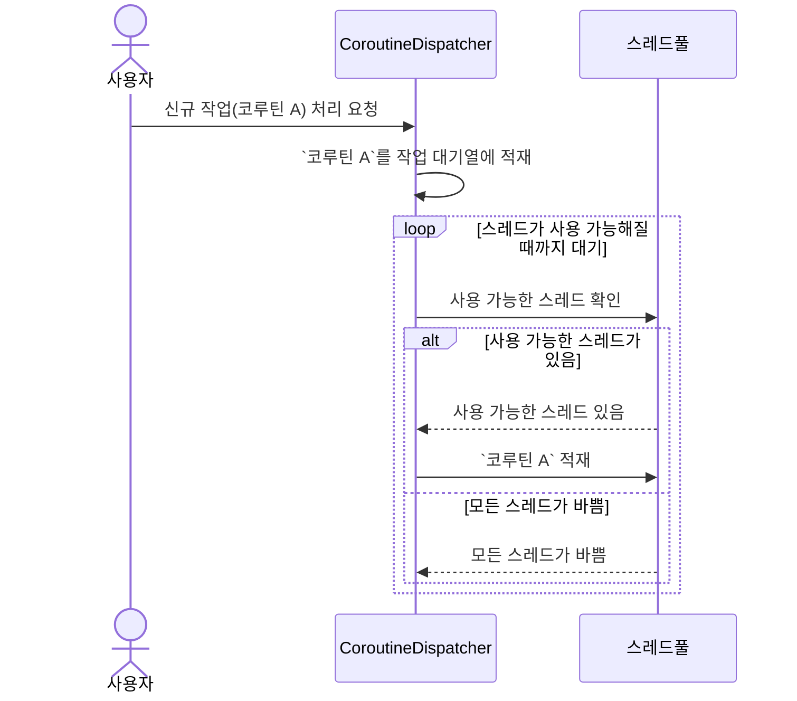

![[bg-image.jpg]]
# CoroutineDispatcher

### 홍은진
### 2024.08.25.
---
# 목차

1. CoroutineDispatcher란?
2. CoroutineDispatcher 의 동작 방식
3. CoroutineDispatcher 사용방법
4. 미리 선언된 CoroutineDispatcher
5. Q&A
---
# 1. CoroutineDispatcher란?
note: 코루틴을 **스레드로 보내주는 역할**을 하는 객체

---
# 2. CoroutineDispatcher 의 동작 방식



note: CoroutineDispatcher이 코루틴, 스레드와 작용하는지 알아보자.
1. 사용자가 `CoroutineDispatcher`에게 `코루틴 A` 라는 작업을 요청한다.
2. `CoroutineDispatcher`는 작업 대기열에 `코루틴 A` 를 적재한다.
3. `CoroutineDispatcher`는 `스레드 풀`에 사용 가능한 스레드가 있는지 확인한다.
	1. 사용 가능한 스레드가 있다면, 해당 스레드에 `코루틴 A`를 적재한다.
	2. 모든 스레드에 작업이 할당되어 있다면, 사용 가능한 스레드가 생길 때까지 대기한다.

---
# 3. CoroutineDispatcher 사용방법
- Single Thread Dispatcher 만들기
- Multi-Thread Dispatcher 만들기

note: <!-- TODO -->

--
## 3.1. Single Thread Dispatcher 만들기

```kotlin
val dispatcher: CoroutineDispatcher = newSingleThreadContext(
	name = "SingleThread",
)
```

note: 함수 `newSingleThreadContext` 를 사용하여 만들 수 있다.

--
## 3.2. Multi-Thread Dispatcher 만들기

```kotlin
val multiThreadDispatcher: CoroutineDispatcher = newFixedThreadPoolContext(
	nThreads = 2, // 최대 가용 스레드의 개수
	name = "MultiThread",
)
```

note: 함수 `newFixedThreadPoolContext` 을 사용하여 만들 수 있다. 
이 때, 단일 스레드 디스패처와는 다르게 최대 가용 스레드의 개수를 지정해줄 수 있다.

--
## 3.3. CoroutineDispatcher 비교

| 항목                 | `newSingleThreadContext`     | `newFixedThreadPoolContext` |
| ------------------ | ---------------------------- | --------------------------- |
| **스레드 수**          | 1개의 스레드만 생성                  | 고정된 개수의 스레드 풀을 생성           |
| **병렬 처리 가능성**      | 병렬 처리가 불가능, 하나의 작업만 순차적으로 처리 | 병렬 처리 가능, 여러 작업을 동시에 처리     |
| **사용 사례**          | 순차적으로 작업을 처리해야 할 때           | 병렬로 여러 작업을 동시에 처리해야 할 때     |
| **성능**             | 성능이 낮음 (단일 스레드)              | 병렬 처리로 인해 성능이 향상될 수 있음      |
| **자원 사용**          | 자원 사용이 적음                    | 생성된 스레드 수만큼 자원을 사용          |
| **스레드 간의 경합**      | 경합이 없으며, 순차적으로 작업이 수행됨       | 스레드 간의 경합이 발생할 수 있음         |
| **컨텍스트 전환 오버헤드**   | 거의 없음                        | 스레드 간의 컨텍스트 전환 오버헤드 발생 가능   |
| **추천되는 사용 시나리오**   | 단일 작업 또는 순차적 작업 처리           | CPU 집약적인 작업이나 다중 작업이 필요한 경우 |
| **코루틴 실행 순서 보장**   | 보장됨                          | 보장되지 않음 (스레드 풀에 따라 결정)      |
| **코루틴 실행의 공평성 보장** | 스레드가 하나이므로 공평성이 자동 보장됨       | 공평성이 보장되지 않을 수 있음           |

note: <!-- TODO -->


---
# 4. 미리 선언된 CoroutineDispatcher

--
## 이미 선언된 CoroutineDispatcher?

![[Chapter03-Warning-delicate-API.png|500]]

> This is a delicate API and its use requires care. Make sure you fully read and understand documentation of the declaration that is marked as a delicate API.

note: `newSingleThreadContext`는 섬세한 주의가 필요한 API이니, 문서를 정독한 후 사용할 것을 권유한다. `newFixedThreadPoolContext` 도 마찬가지다. 
개발자가 Dispatcher 를 직접 선언 할 경우, `newFixedThreadPoolContext` 함수를 사용해 CoroutineDispatcher 객체를 만들게 되면 특정 CoroutineDispatcher
객체에서만 사용되는 스레드풀이 생성되며, 스레드풀에 속한 스레드의 수가 너무 적거나 많이 생성돼 비효율적으로 동작할 수 있다. 
또한 협업을 진행하는 경우, 다른 개발자가 선언한 디스패처의 존재를 몰라 새로운 Dispatcher를 생성하여 리소스가 낭비되는 오류를 범하기도 쉽다.

따라서, CoroutineDispatcher를 직접 선언하기 보다는 후술할 미리 선언된 Dispatcher를 사용하는 것이 좋다.

--
## Confined Dispatchers

#### confine

1. [Verb] to limit an activity, person, or problem in some way
2. [Verb] to keep someone closed in a place, often by force

--
## Confined Dispatchers

1. CoroutineDispatchers.IO
2. CoroutineDispatchers.Default
3. CoroutineDispatchers.Main
4. CoroutineDispatchers.Unconfinded

---
## CoroutineDispatchers.IO


--

## CoroutineDispatchers.IO


<code style="font-size: 20px; background-color: rgb(240, 241, 241); padding: 2rem">
<공유 스레드 풀>

Dispatchers.Default 의 스레드 -> [🧵🧵🧵🧵...🧵🧵]

🧵🧵🧵🧵🧵🧵🧵🧵🧵🧵🧵🧵🧵...🧵🧵🧵🧵🧵🧵🧵🧵🧵🧵🧵🧵

Dispatchers.IO 의 스레드 -> [🧵🧵🧵🧵...🧵🧵🧵🧵🧵]
</code>

note: <!-- TODO -->

---
## CoroutineDispatchers.Default

Dispatchers.Default.limitedParallelism(2)


<code style="font-size: 20px; background-color: rgb(240, 241, 241); padding: 2rem">
<b>공유 스레드 풀</b>
</br></br>
Dispatchers.Default 의 스레드 -> [🧵🧵🧵🧵...🧵🧵]
</br> 
🧵🧵🧵🧵🧵🧵🧵🧵🧵🧵🧵🧵🧵...🧵🧵🧵🧵🧵🧵🧵🧵🧵🧵🧵🧵
</br>
Dispatchers.IO 의 스레드 -> [🧵🧵🧵🧵...🧵🧵🧵🧵]
</code>

Dispatchers.IO.limitedParallelism(2)

note: <!-- TODO -->


---
## CoroutineDispatchers.Main
note: Dispatchers.Main은 일반적으로 UI가 있는 애플리케이션에서 UI를 업데이 트하는 데 사용된다.

---
## 미리 선언된  Dispatchers 간단 요약

| Dispatcher             | 제한 여부    | 용도           | 특이사항                                                | `limitedParallelism` 사용 시, 발생하는 일 |
|------------------------|----------|--------------|-----------------------------------------------------|-----------------------------------|
| Dispatchers.IO         | 제한된 디스패처 | IO bound 작업  | 최대 64개 (1.7.2 버전 기준) 혹은 JVM 최대 범위만큼만 스레드를 생성할 수 있다. | 신규 스레드를 생성한다.                     |
| Dispatchers.Default    | 제한된 디스패처 | CPU bound 작업 | 코루틴 사용 여부와 관계없이 처리 속도는 일정하다.                        | 공유 스레드 풀에 있는 스레드를 사용한다.           |
| Dispatchers.Main       | 제한된 디스패처 | UI bound 작업  | UI 표시와 관련된 별도의 의존성 추가가 필요하다.                        | -                                 |
| Dispatchers.Unconfined | 무제한 디스패처 | [[11장 코루틴 심화]] | -                                        | -                      |


note: <!-- TODO -->


---
## Q&A

--
> [!question]- 1.limitedPararellism 숫자를 줄이니 OOM 발생. 이유는?

--
> [!question]- 1.limitedPararellism 숫자를 줄이니 OOM 발생. 이유는?
> `limitedParallelism` 숫자를 줄였을 때 OOM(Out Of Memory) 오류가 발생하는 이유는 병렬로 실행되는 코루틴의 수가 제한되면서, 작업이 더 많은 시간을 걸려 완전히 처리되기 때문입니다. 이로 인해, 메모리 자원이 과도하게 소비되는 상황이 발생할 수 있습니다.

--

> [!question]- 2.CPU 집약적인 처리가 필요한 경우인지 어떻게 판단할 수 있나요?

--


> [!question]- 2.CPU 집약적인 처리가 필요한 경우인지 어떻게 판단할 수 있나요?
> 
> `Dispatchers.Default`를 사용해야 할 상황, 즉 CPU 집약적인 처리가 필요한 경우를 판단하는 데에는 몇 가지 기준이 있습니다. CPU 집약적인 작업이란, 주로 프로세서의 연산 능력을 많이 사용하는 작업을 의미합니다. 이를 판단하는 기준을 설명드리겠습니다.


--

> [!question]- Dispatchers.Default.limitedParallelism(2) 를 사용하면 동기 처리할때보다 속도가 2배 빨라져야하지 않나요? 거의 차이가 없는 이유는 뭘까요?
> 

--

> [!question]- Dispatchers.Default.limitedParallelism(2) 를 사용하면 동기 처리할때보다 속도가 2배 빨라져야하지 않나요? 거의 차이가 없는 이유는 뭘까요?
> 

---


# 끝

