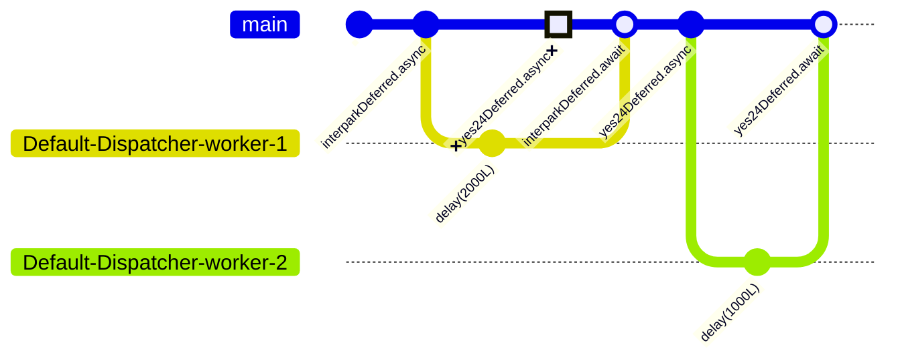
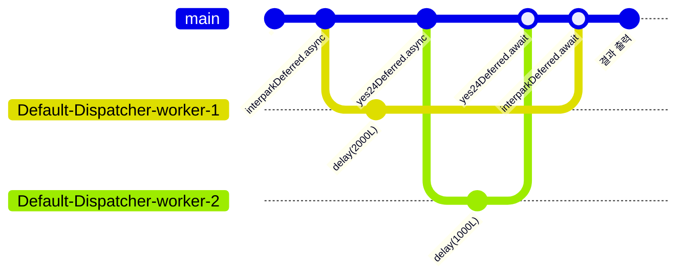

<!-- slide bg="[[bg-image.jpg]]" data-background-opacity="0.2" -->

# Coroutine 결과값 처리하기

### 홍은진
### 2024.08.25.

--

## 지금까지 배운 내용

- CoroutineDispatcher
- CoroutineBuilder
- Job

--

## 응답 받기
![[Chapter05-launch-cannot-return-result.png]]

---

# 0. 용어 정리

--
## 0.0 `launch`

```kotlin
public fun CoroutineScope.launch(  
    context: CoroutineContext = EmptyCoroutineContext,  
    start: CoroutineStart = CoroutineStart.DEFAULT,  
    block: suspend CoroutineScope.() -> Unit  
): Job {  
    val newContext = newCoroutineContext(context)  
    val coroutine = if (start.isLazy)  
        LazyStandaloneCoroutine(newContext, block) else  
        StandaloneCoroutine(newContext, active = true)  
    coroutine.start(start, coroutine, block)  
    return coroutine  
}
```

--


## 0.1 `async` 함수란?

> `Deferred`를 반환하는 Coroutine Builder 함수.

```kotlin
public fun <T> CoroutineScope.async(  
    context: CoroutineContext = EmptyCoroutineContext,  
    start: CoroutineStart = CoroutineStart.DEFAULT,  
    block: suspend CoroutineScope.() -> T  
): Deferred<T> {  
    val newContext = newCoroutineContext(context)  
    val coroutine = if (start.isLazy)  
        LazyDeferredCoroutine(newContext, block) else  
        DeferredCoroutine<T>(newContext, active = true)  
    coroutine.start(start, coroutine, block)  
    return coroutine  
}
```

note: `launch`와 유사한 코루틴 빌더 함수입니다. 둘은 반환하는 값의 유형이 다르다는 큰 차이점이 있습니다. `launch`의 경우 `Job` 을 반환하고, `async` 는 `Job`의 일종인 `Deferred` 를 반환합니다. 그렇다면 `Deferred`는 무엇일까요?

--

## 0.2 `Deferred` 란?

> 실행 결과를 받아 볼 수 있는 `Job`

note: `Deferred`는 `Job` 을 상속받아 만들어진 interface 입니다. `Job`의 경우, 코루틴 작업 결과를 반환할 수 없고, 작업 종료, 취소 정도의 상태만 파악할 수 있죠. `Deferred<T>`는 결과값을 한번 감싸는 역할을 하여, 코루틴 작업 결과가 어떻게 끝났는지 알 수 있게 해줍니다. 

--
0.2 `Deferred` 란?

```kotlin
public interface Deferred<out T> : Job {  
  
    public suspend fun await(): T  
  
    public val onAwait: SelectClause1<T>  
  
    @ExperimentalCoroutinesApi  
    public fun getCompleted(): T  
    
    @ExperimentalCoroutinesApi  
    public fun getCompletionExceptionOrNull(): Throwable?  
}
```


---

# 1. 코루틴 결과값 받기

--
## 1.1. `async`- `await` 를 사용하여, 코루틴 결과값 받기

```kotlin
fun main() = runBlocking<Unit> {  
    val networkDeferred: Deferred<String> = async(Dispatchers.IO) {  
        delay(1000L)  
        return@async "서버: \"OK!\""  
    }  
    val result = networkDeferred.await()  
    println(result)  
}
```

```sh

서버: "OK!"


```

note: 
1. 상황 설명: 1초 뒤에 "서버: "OK!""라는 문구를 반환하는 네트워크 요청을 보낸 상황입니다. 
2. 요소 설명:
	1. async
	2. Deferred
	3. await

---

# 2. 코루틴 결과값 **여러개** 받기

note: 
1. 만약 여러 코루틴 작업 결과물을 한번에 받으려면 어떻게 해야할까요? 
2. 예시: 콘서트를 할 예정입니다. 여러 티켓 사이트에서 공연 티켓을 판매하게 하고, 지금 각 티켓 사이트 서버에서 관객 목록 명부를 가져와, 총 몇명의 관객이 있는지 확인하려고하는 상황을 가정해보도록하겠습니다. 

--
## 2.1. `await` 를 사용하여, 코루틴 결과값 받기

```kotlin
fun main() = runBlocking<Unit> {  
    val startTime = System.currentTimeMillis()  
    val interparkDeferred: Deferred<Array<String>> = async(Dispatchers.IO) {  
        delay(2000L)  
        arrayOf("장원영", "안유진")  
    }  
    val participantList1: Array<String> = interparkDeferred.await()  
  
    val yes24Deferred: Deferred<Array<String>> = async(Dispatchers.IO) {  
        delay(1000L)  
        arrayOf("카리나")  
    }  
    val participantList2: Array<String> = yes24Deferred.await()  
  
    val participantCount = participantList1.size + participantList2.size  
    println("[${getElapsedTime(startTime)}] 참여자 수: $participantCount")  
}
```

note: 
1. 총 세 파트로 나눈다.
	1. 첫번째 코루틴에서는 2초간 지연이 있고,  `Deferred`에 await 를 걸어, 인터파크에서 티켓을 구매한 사람의 목록을 가져옵니다.
	2. 두번째 코루틴에서는 1초간 지연이 있고,  `Deferred`에 await 를 걸어, yes24에서 티켓을 구매한 사람의 목록을 가져옵니다.
	3. 마지막 부분에서는 
		1. 콘서트 전체 관객 수
		2. 지금까지의 연산에 소요된 시간

--
## 2.1. `await` 를 사용하여, 코루틴 결과값 받기-결과
```sh


[지난 시간: 3018ms] 참여자 수: 3


```




note: 
[결과]
결과는 총 3명으로 알맞게 나왔습니다. 그런데 참여시간을 보면, 두 사이트의 지연시간을 합한 3000ms 가 나왔습니다. 
[그래프 설명]
1. interpark.async 코루틴이 시작하고 나서 2000ms 지연되는동안
2. yes24는 async 를 시도할 수 없다.
3. interpark.await 가 yes24.async 보다 선행하기 때문이다.
[다음장 설명]
- 그렇다면, await 의 위치를 모든 코루틴 생성 이후로 변경하면 어떨까?
--
## 2.2. `await` 를 사용하여, 코루틴 결과값 받기

```kotlin
fun main() = runBlocking<Unit> {  
    val startTime = System.currentTimeMillis()  
    val interparkDeferred: Deferred<Array<String>> = async(Dispatchers.IO) {  
        delay(2000L)  
        arrayOf("장원영", "안유진")  
    }  
    val yes24Deferred: Deferred<Array<String>> = async(Dispatchers.IO) {  
        delay(1000L)  
        arrayOf("카리나")  
    }  
  
    val participantList1: Array<String> = interparkDeferred.await()  
    val participantList2: Array<String> = yes24Deferred.await()  
  
    val participantCount = participantList1.size + participantList2.size  
    println("[${getElapsedTime(startTime)}] 참여자 수: $participantCount")  
}
```

note:
1. 단순히 interpark.await 의 위치를 yes24.async 뒤로 옮겼습니다.

--
## 2.2. `await` 를 사용하여, 코루틴 결과값 받기-결과

```sh


[지난 시간: 2012ms] 참여자 수: 3


```


note: 
[결과]
시간은 2000ms 로 가장 긴 지연시간만큼만 소요된 것을 확인할 수 있습니다.
[동작원리]
1. 앞선 코드에서 자신이 실행되던 메인 스레드의 실행을 일시 중단 await 가 뒤로 이동하니, 
2. 짧은 시간에 응답을 할 수 있었던 yes24.async 가 응답을 그 사이에 가져올 수 있었다.
[다음장 설명]
1. 이번에 본 것은 2곳에서 정보를 가져와야하는 간단한 작업이었다.
2. 만약 서로 다른 100개의 외부 자원을 가져와야한다면?
3. 이럴때는 awaitAll이라는 함수를 사용할 수 있다.


--
## 2.2. `awaitAll` 을 사용하여, 코루틴 결과값 받기


```kotlin

public suspend fun <T> awaitAll(vararg deferreds: Deferred<T>): List<T> =  
    if (deferreds.isEmpty()) emptyList() else AwaitAll(deferreds).await()

	
```

```kotlin
fun main() = runBlocking<Unit> {  
    val startTime = System.currentTimeMillis()  
    val interparkDeferred: Deferred<Array<String>> = async(Dispatchers.IO) {  
        delay(2000L)  
        arrayOf("장원영", "안유진")  
    }  
    val yes24Deferred: Deferred<Array<String>> = async(Dispatchers.IO) {  
        delay(1000L)  
        arrayOf("카리나")  
    }  
  
    val participantLists: List<Array<String>> = awaitAll( interparkDeferred, yes24Deferred)  
    val participantCount = participantLists.flatMap { it.toSet() }.size  
  
    println("[${getElapsedTime(startTime)}] 참여자 수: $participantCount")  
}
```


note: 
[코드 설명]
1. 위 코드: awaitAll은 여러개의 Deferred 를 가변인자로 받아, 순차적으로 await 처리를 한다.
2. 아래 코드: 이전 것에서 await 목록을 awaitAll 로 치환한 것이다.

--
## 2.2. `awaitAll` 을 사용하여, 코루틴 결과값 받기 - 결과 

```sh


[지난 시간: 2007ms] 참여자 수: 3


```

note:
[결과값]
결과는 크게 다르지 않다. 값도 제대로 나오고, 소요 시간도 유사하다.
[다음장 소개]
- 보일러 플레이트처럼 사용할 `async`-`await` 를 하나의 함수로 묶어서 사용할 수 있습니다. 
- 바로 `withContext` 입니다. 

---

# 4. withContext


## ~`async`-`await`~ => `withContext`

note:
1. `withContext` 는 비동기 처리가 필요한 로직을 

--
## 4.1. `withContext` 로 `async`-`await` 대체하기

```kotlin
fun main() = runBlocking<Unit> {  
    val networkDeferred: Deferred<String> = async(Dispatchers.IO) {  
        delay(1000L)  
        return@async "서버: \"OK!\""  
    }  
    val result = networkDeferred.await()  
    println(result)  
}
```

```kotlin
fun main() = runBlocking<Unit> {  
    val result: String = withContext<String>(Dispatchers.IO) {  
        delay(1000L)  
        "서버: \"OK!\""  
    }  
    println(result)  
}
```

```sh


서버: "OK!"


```

note: 
[코드 소개]
1. async-await 를 사용하여 네트워크 요청을 순차처리하는 로직을 구현한 것
2. withContext 를 사용하여 네트워크 요청을 순차처리하는 로직을 구현한 것
3. 결과값은 둘이 동일하다.
[다음장 소개]
다만 둘의 동작방식에 차이가 있다.

--
## 4.2. 동작 원리: `async`-`await`


```sh


```

--
## 4.3. 동작 원리: `withContext`

```sh


```

--

## 4.4. `withContext` 와 `async`-`await` 비교


| Feature      | `withContext`                            | `async`-`await`                           |
| ------------ | ---------------------------------------- | ----------------------------------------- |
| **기본 목적**    | 컨텍스트 전환을 통한 코루틴 블록 내에서의 작업 처리            | 비동기 작업을 시작하고 결과를 기다리기 위해 사용               |
| **반환 값**     | 지정된 컨텍스트에서 실행된 블록의 결과 반환                 | `Deferred<T>` 객체 반환, `await()` 호출 시 결과 반환 |
| **사용 형태**    | `withContext(Dispatchers.IO) { ... }` 형식 | `async { ... }`와 `await()` 형식             |
| **동작 방식**    | 새로운 코루틴을 생성하지 않고, 지정된 디스패처에서 실행          | 새로운 코루틴을 생성하여 비동기 작업 수행                   |
| **병렬 처리**    | 기본적으로 병렬 처리를 하지 않음                       | 병렬로 여러 비동기 작업을 수행 가능                      |
| **오버헤드**     | 새로운 코루틴을 생성하지 않아 오버헤드가 적음                | 코루틴 생성 오버헤드가 있음                           |
| **코드 가독성**   | 간단한 컨텍스트 전환에 적합                          | 여러 비동기 작업이 있을 때 가독성이 좋음                   |
| **사용 예시**    | I/O 작업이나 특정 스레드에서 실행할 때 사용               | 여러 비동기 작업의 결과를 동시에 받아야 할 때 사용             |
| **컨텍스트 전환**  | 스레드를 전환하여 코드 블록을 실행                      | `async`로 생성된 각 코루틴이 비동기적으로 실행됨            |
| **공유 자원 접근** | `withContext` 블록 내에서 안전하게 공유 자원 접근 가능    | `async` 블록 내에서 안전하게 접근하되 동기화 필요           |


---

# 5. CoroutineContext란?

--

## 5.1 CoroutineContext란?

> 코루틴의 실행 환경을 설정하고 관리하는 인터페이스

note: 
1. CoroutineContext 는 코루틴의 실행 환경을 설정하고 관리하는 인터페이스입니다.
2. CoroutineContext 의 구성요소들, CoroutineName, CoroutineDispatcher, Job, CoroutineExceptionHandler 를 통해 코루틴의 실행 환경을 설정합니다. 

---

# 6. CoroutineContext 구성 요소

--

## 6.1 CoroutineContext 구성 요소

1. `CoroutineName`: 코루틴의 이름을 나타낸다.
2. `CoroutineDispatcher`: 코루틴을 스레드에 할당하여 실행시킨다.
3. `Job`: 코루틴의 추상체로 코루틴을 조작하는 데에 사용된다.
4. `CoroutineExceptionHandler`: 코루틴에서 예외가 발생했을 때 처리하는 핸들러이다.

note: 코루틴은 네가지 구성요소를 가지고 있습니다.
순서대로 `CoroutineName`, `CoroutineDispatcher`, `Job`, `CoroutineExceptionHandler` 입니다.
각 구성요소는 조합해서 사용할 수 있습니다. 즉, 모든 구성요소가 포함될 필요는 없습니다.
또한, 한 CoroutineContext에는 구성요소는 각각 하나씩만 사용할 수 있습니다. 
즉, 같은 구성요소 키에 여러개의 값을 할당할 수 없습니다.  

---

# 7. CoroutineContext 구성하기: CREATE

--
## 7.1 `+` 연산자를 사용해 CoroutineContext 생성하기

```kotlin
fun main() = runBlocking<Unit> {  
    val coroutineName = CoroutineName("Eunjin Coroutine")  
    val dispatcher = Dispatchers.IO  
    val coroutineContext: CoroutineContext = coroutineName + dispatcher  
  
    println(coroutineContext)  
}
``` 

note: 
[코드 설명]
1. CoroutineName 과 CoroutineDispatcher 를 사용하여 CoroutineContext 를 생성합니다.

--
## 7.1 `+` 연산자를 사용해 CoroutineContext 생성하기 - 결과

```sh


[CoroutineName(Eunjin Coroutine), Dispatchers.IO]


```


---

# 8. CoroutineContext 구성하기: READ

--

## 8.1 구성요소 자체를 사용해 CoroutineContext 구성 요소 읽기

```kotlin
@OptIn(ExperimentalStdlibApi::class)  
fun main() = runBlocking<Unit> {  
    val coroutineName = CoroutineName("Eunjin Coroutine")  
    val dispatcher = Dispatchers.IO  
    val coroutineContext: CoroutineContext = coroutineName + dispatcher  
  
    println(coroutineContext[CoroutineName])  
    println(coroutineContext[CoroutineDispatcher])  
    println(coroutineContext[Job])  
    println(coroutineContext[CoroutineExceptionHandler])  
}
``` 
note: 
1. 방금 코드에서 보셨던 방법 그대로 각 코루틴 컨텍스트 구성요소는 그 자체 싱글톤 객체를 키로 사용하여,
2. 해당 값을 읽을 수 있습니다.

--

## 8.1 구성요소 자체를 사용해 CoroutineContext 구성 요소 읽기

```sh


CoroutineName(Eunjin Coroutine)  
Dispatchers.IO  
null
null


```

--

## 8.2 싱글톤 키를 사용해 CoroutineContext 구성 요소 읽기

```kotlin
@OptIn(ExperimentalStdlibApi::class)  
fun main() = runBlocking<Unit> {  
    val coroutineName = CoroutineName("Eunjin Coroutine")  
    val dispatcher = Dispatchers.IO  
    val coroutineContext: CoroutineContext = coroutineName + dispatcher  
  
    println(coroutineContext[CoroutineName.Key])  
    println(coroutineContext[CoroutineDispatcher.Key])  
    println(coroutineContext[Job.Key])  
}
```

note: 
1. 이렇게 명시적으로 각 구성요소 싱글톤에 `Key` 를 사용하여 값을 읽을 수도 있습니다.
2. 앞선 코드에서 키가 들어갈 자리에 싱글톤 객체가 사용된 것처럼 보이지만, 자동으로 `Key` 가 들어간 것으로 연산 처리를 합니다.  

## 8.2 싱글톤 키를 사용해 CoroutineContext 구성 요소 읽기 - 결과

```sh


CoroutineName(Eunjin Coroutine)  
Dispatchers.IO  
null


```


--

## 8.3 구성요소의 key를 사용해 CoroutineContext 구성 요소 읽기

```kotlin
fun main() =  
    runBlocking<Unit> {  
        val coroutineName = CoroutineName("Eunjin Coroutine")  
        val dispatcher = Dispatchers.IO  
        val coroutineContext: CoroutineContext = coroutineName + dispatcher  
  
        println(coroutineContext[coroutineName.key])  
        println(coroutineContext[dispatcher.key])  
    }
```

note: 마지막으로, 각 구성요소의 key 를 사용하여 값을 읽을 수도 있습니다.
구성요소들은 `key` 를 가지고 있어, 이를 사용하여 값을 읽을 수 있습니다.
이 역시도, 방금 전 코드와 같이 결국 각 요소의 싱글톤 객체의 `Key` 를 사용하는 것과 같습니다.


--

## 8.3 구성요소의 key를 사용해 CoroutineContext 구성 요소 읽기 - 결과

```sh


CoroutineName(Eunjin Coroutine)  
Dispatchers.IO


```

---

# 9. CoroutineContext 구성하기: UPDATE

--
## 9.1 `+` 연산자를 사용해 CoroutineContext 구성 요소 덮어 씌우기

```kotlin
fun main() =  
    runBlocking<Unit> {  
        val coroutineName = CoroutineName("Eunjin Coroutine")  
        val dispatcher = Dispatchers.Default  
        val job1 = Job()  
        val coroutineContext: CoroutineContext = coroutineName + dispatcher + job1  
  
        println(coroutineContext[Job])  
  
        val job2 = Job()  
        val updatedCoroutineContext = coroutineContext + job2  
  
        println(coroutineContext[Job])  
        println(updatedCoroutineContext[Job])  
    }
```

note: `+` 연산자를 사용하여 코루틴 컨텍스트 구성요소를 덮어씌울 수 있습니다.
CoroutineName, CoroutineDispatcher, Job 의 구성요소를 사용하여 CoroutineContext 를 생성하고,
생성된 코루틴 컨텍스트에 Job 객체를 추가하면, Job 객체가 덮어 씌워진 것을 확인할 수 있습니다.
물론, 원본 코루틴 컨텍스트는 변경되지 않습니다.

--
## 9.1 `+` 연산자를 사용해 CoroutineContext 구성 요소 덮어 씌우기 - 결과

```sh


JobImpl{Active}@887af79  
JobImpl{Active}@887af79  
JobImpl{Active}@7fac631b


```


---

# 10. CoroutineContext 구성하기: DELETE

--
## 10.1 `minusKey` 를 사용해 구성 요소 제거하기

```kotlin
fun main() =  
    runBlocking<Unit> {  
        val coroutineName = CoroutineName("Eunjin Coroutine")  
        val dispatcher = Dispatchers.Default  
        val job = Job()  
        val coroutineContext: CoroutineContext = coroutineName + dispatcher + job  
  
        val deletedCoroutineContext = coroutineContext.minusKey(CoroutineName)  
  
        println(coroutineContext[coroutineName.key])  
        println(deletedCoroutineContext[coroutineName.key])  
        println(deletedCoroutineContext[dispatcher.key])  
        println(deletedCoroutineContext[job.key])  
    }
```


note: 다음과 같은 과 같은 코드가 있다고 가정해봅시다. 세 줄이 각각 출력하는 결과는 무엇일까요?
1. null 2. Dispatchers.IO 3. Job객체에 대한 정보가 나타납니다. 

--
## 10.1 `minusKey` 를 사용해 구성 요소 제거하기 - 결과

```shell


CoroutineName(Eunjin Coroutine)  
null  
Dispatchers.Default  
JobImpl{Active}@3108bc


```

note: 다음 코드를 살펴보도록 하곘습니다. 이 코드의 출력 결과 중 null 을 출력하는 것은 몇번째 줄일까요?
그렇죠. 답은 `없다` 입니다. `minusKey` 함수는 원본 `CoroutineContext` 를 변경하지 않는다.
연산자로서 인자로 받은 키를 사용하여, 해당 값이 제거된 CoroutineContext 를 반환한다.

---

# Q&A

--

> [!question]- CoroutineContext는 Map 인가? Dictionary 인가?
> 
--

<!--

> [!question]- CoroutineName의 용도는 무엇인가요?
> CoroutineName 은 코루틴의 이름을 나타내는 구성요소입니다. 코루틴의 이름을 설정하면, 디버깅 시 코루틴의 이름을 확인할 수 있습니다.

> [!question]- return@async 는 뭐라고 부르는가?

--
## 더 알아보기 

- Kotlin에서 제네릭을 사용하는 방법
- Deferred 함수 톺아보기
-->
--

## 0.2 `Deferred` 함수 톺아보기 - await

> 스레드 블로킹 없이, 코루틴 작업 완료를 기다리는 함수


이 중단 함수는 취소 가능합니다. 현재 코루틴의 Job 이 취소되거나 이 중단 함수가 대기 중일 때 완료된 경우, 이 함수는 즉시 CancellationException 과 함께 재개됩니다. 신속한 취소 보장이 있습니다. 이 함수가 중단된 동안 작업이 취소되면, 성공적으로 재개되지 않습니다. 저수준 세부 사항은 suspendCancellableCoroutine 문서를 참조하십시오.

이 값이 완료될 때까지 블로킹 없이 대기하고, Deferred 계산이 완료되면 결과 값을 반환하거나, Deferred가 취소된 경우 해 당 예외를 던집니다.

이 함수는 onAwait 절과 함께 select 호출에서 사용할 수 있습니다. isCompleted 를 사용하여 이 Deferred 값의 완료 여부를 기다리지 않고 확인할 수 있습니다.


---

# 끝