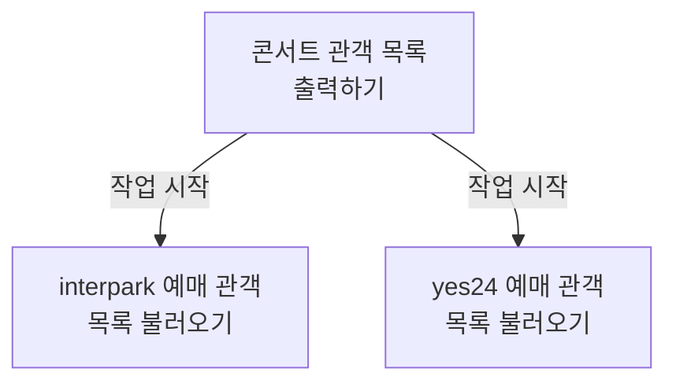
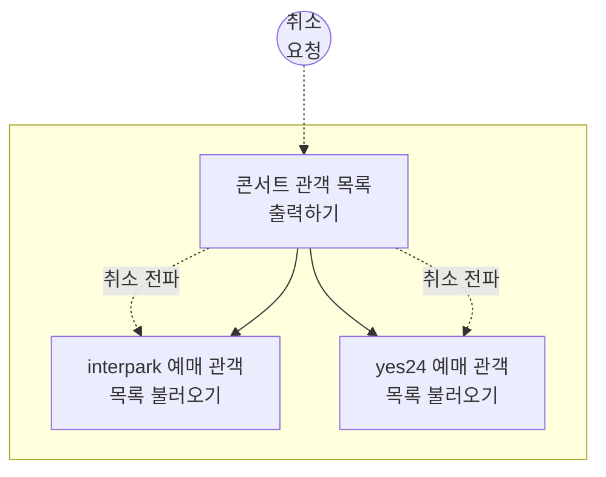
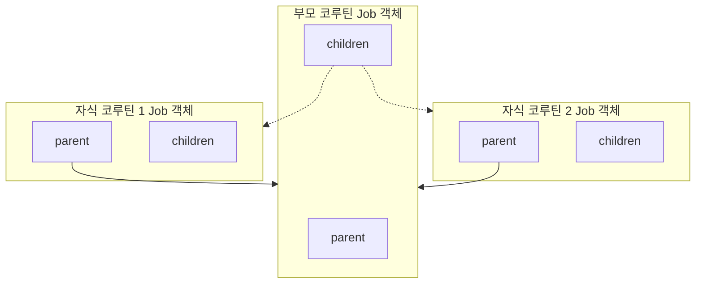
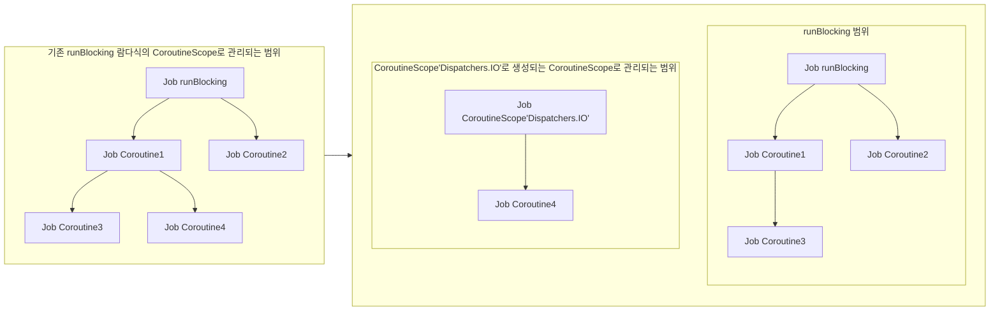

![[bg-image.jpg]]
# Structured Concurrency

## 홍은진
## 2024.09.08.

---

# 1. 구조화된 동시성

note: 오늘은 코틀린 코루틴에서 동시성 구조화가 어떻게 구현되었는지 알아보겠습니다.

--
## 1.1. Structured Concurrency

> 프로그램에서 동시 실행되는 작업들을 계층 구조로 보아,
>  시작과 종료가 명확하게 관리하는 동시성 패러다임

note: 우선, "Structured Concurrency", 구조화된 동시성이란 무엇일까요? 여러 작업들을 동시에 처리해야하는 프로그램에서 각 작업을 계층 구조로 두어, 시작과 끝을 명확하게 관리할 수 있도록 하는 동시성 패러다임입니다. 
다음: "구조화된 동시성" 패러다임에는 두가지 큰 원칙이 있는데요.
- [Kotlin/Coroutine/Structured Concurrency](https://kotlinlang.org/docs/coroutines-basics.html#structured-concurrency) 

--

## 1.2. 동시성 구조화 원칙

두 비동기 작업이 계층 관계일 때,
1. 자식(child) 작업이 모두 끝나야, 부모(parent) 작업을 끝낼 수 있다.
2. 부모 작업이 취소되면, 자식 작업도 취소된다.

note: 하나는 자식의 작업이 모두 끝나야 부모 작업을 끝낼 수 있다는 것이고, 나머지 하나는 부모 작업이 취소될 경우 자식 작업에도 취소가 전파된다는 것입니다.
다음: 지난 시간 책 예시로 나왔던, "콘서트 관객 목록 출력하기"를 예시로 들어보겠습니다.

--

## 1.2.1. 동시성 구조화 원칙 - 예시 1

note: 콘서트 관객 목록을 출력하기 위해서는 각 예매 사이트에 관객 목록을 요청해야합니다. 모든 예매 사이트에 있는 관객 목록을 불러온 다음에야, 출력 작업을 완료할 수 있죠. 즉, 이전 예시 코드로 이미 살펴본 바, 코틀린 코루틴에도 "구조화된 동시성" 패러다임이 적용되었다고 볼 수 있겠습니다.
다음: 그 다음 원칙 또한 마찬가지입니다.

--
## 1.2.2. 동시성 구조화 원칙 - 예시 2

note: "관객 목록 출력하기" 작업 진행 중에 누군가 출력을 취소한다면, 우리는 더 이상 interpark 에서도, yes24에서도 관객 목록을 불러올 필요가 없습니다. 다시 말해, 두번째 원칙에 따라 부모 작업이 취소되었을 때, 자식 작업에도 취소 요청이 전파된다는 것을 확인할 수 있습니다.
다음: 그렇다면, 코틀린 코루틴은 구체적으로 어떻게 서로를 계층화하고 있을까요?

---

# 2. 코루틴의 동시성 구조화

note: 코루틴은 Job 객체를 중심으로 계층 구조를 형성합니다. 
다음: 그래서 우리는 먼저 Job 을 가지고 코틀린 코루틴이 어떻게 구조화된 동시성을 구현했는지 알아보도록 하겠습니다.

---

## 2.1. Job 동시성 구조화

note: 사실 정확히 말하면, Job 끼리 계층 관계를 형성하고 있습니다. 하나의 코루틴은 하나의 Job을 갖고, 각 Job 은 하나의 parent, 여러개의 child Job 을 갖습니다.

--
## 2.1.1. Job 계층 구조

note: 다시 말해, 코루틴은 그 자체로 계층을 형성하지 않고 Job 을 기준으로 부모-자식 관계를 구분하고 있습니다. 
다음: 아래 코드를 통해 구체적으로 Job의 관계를 살펴보도록 하죠.

--
## 2.1.1. Job 계층 구조 - 코드 

<iframe width="100%" height="100%" src="https://pl.kotl.in/zx9U9dYhC?from=5&to=14"></iframe>

note: 이 코드를 통해 우선 Job 객체에서 부모, 자식 Job 을 확인하는 방법을 알 수 있습니다. 
1. `childJob`에서 `parent` 속성을 사용해서 부모 Job 을 불러와 `parentJob` 과 비교해보면, 둘은 같다는 것을 확인할 수 있습니다. 
2. 두번째, `parentJob.children` 을 통해 `parentJob` 의 자식 Job 을 불러와 그 안에 `childJob`이 포함되었다는 것을 확인할 수 있습니다. 
3. 마지막으로 `runBlocking` 에서 생성된 Job 객체와 `launch` 로 생성된 Job 객체를 비교해보면 둘은 다르다는 것을 확인할 수 있습니다. 즉, Job 은 서로 계층이 나뉠 뿐 상속 관계를 갖지는 않는다는 점입니다.
다음: 그렇다면, Job 객체는 동시성 구조화 원칙을 따르고 있을까요?

-- 

## 2.1.1.1. Job - 동시성 구조화 원칙 1

<iframe width="100%" height="100%" src="https://pl.kotl.in/dQ7laKZSK"></iframe>

note: 위 코드에 `launch` 로 생성된 코루틴들이 있습니다. 기본적으로 `parentJob` 속에 child Job 두개가 포함되어있는 구조입니다. `parentJob.join()` 을 통해 `parentJob` 이 종료되기까지 기다려보면, `childJob1` 과 `childJob2` 코루틴이 종료된 후에야 `parentJob`코루틴이 종료되었다는 콜백이 호출됨을 확인 할 수 있습니다. 
다음: 두번째 원칙은 어떨까요?

--

## 2.1.1.2. Job - 동시성 구조화 원칙 2

<iframe width="100%" height="100%" src="https://pl.kotl.in/sxFVLykDx"></iframe>

note: `infiniteJob` 이라는 부모 코루틴 아래, 무한히 홀수와 짝수를 출력하는 코루틴을 만들어두었습니다. 그리고 각 코루틴이 종료되면 종료되었다는 메시지를 출력하도록 콜백 함수를 작성해두었습니다. 참고로 이 `invokeOnCompletion`는 코루틴이 "취소 완료" 상태로 변경된 경우에도 호출됩니다.
`infiniteJob` 을 약 3000ms 실행한 뒤 취소해보면, 홀수, 짝수도 부모 코루틴이 취소됨에 따라 종료되었음을 확인할 수 있습니다. 
다음: 만약 자식 작업 중에 부모가 취소되더라도 취소되지 않게 하려면 어떻게 해야할까요? 데이터 동기화 작업을 예시로 한번 살펴보겠습니다. 

---
## 2.2.2. Job 계층 관계 탈출하기

--
## 2.2.2.1. 탈출해야하는 이유
<iframe width="100%" height="100%" src="https://pl.kotl.in/DTxCB-CKK?from=6&to=37"></iframe>

note: `launch` 함수로 부모 코루틴을 만들고, 그 안에 로그를 남기는 작업, 데이터를 동기화 시키는 작업을 만들어 두었습니다. 이 중, 로그를 남기는 작업은 부모 작업이 취소됨에 따라 함께 취소가 되어도 괜찮은 작업, 동기화 작업은 절대 취소되어서는 안되는 작업이라고 가정하겠습니다. 두 자식 코루틴은 명시적으로 공통 Job 을 부모로 공유하도록 만들었습니다. 
코드를 실행해보면, 약 200ms 동안 동작하는 부모 코루틴이 종료됨에 따라 `syncJob` 은 어떠한 흔적도 남기지 못하고 종료되었음을 확인할 수 있습니다.
다음: 

--

## 2.2.2.1. 탈출해야하는 이유 - 해결

<iframe width="100%" height="100%" src="https://pl.kotl.in/vVFsGk6kJ?from=7&to=38"></iframe>
 
note: TODO: CODE(백그라운드 작업의 안정성 보장해야하는 경우

--

## 2.2.2.2. 영원히 끝나지 않는 Job

<iframe width="100%" height="100%" src="https://pl.kotl.in/Mo8DPXBdA?from=7&to=16"></iframe>

note: 
- 실행 전: 위 작업의 코드를 언뜻 보면, `println("[${Thread.currentThread().name}] 코루틴 실행")` 실행 후, 작업이 끝날 것으로 보입니다. 
- 실행 후: 하지만, 실제로 실행해보면, main 스레드가 종료되었다는 문구가 출력되지 않습니다. 
- 이유: 왜냐하면, `launch`가 만들어낸 자식 코루틴의 Job은 종료되었지만, 그 부모로 선언된  newJob 코루틴은 종료되지 않았기 때문입니다. 실제로 `newJob` 의 상태를 확인해보면, "실행 중" 상태로 나타납니다.
next: 이를 해결하기 위해서는 간단합니다. 명시적으로 `newJob` 을 종료하면됩니다. 

--
## 2.2.3.2. 영원히 끝나지 않는 Job - 해결

<iframe width="100%" height="100%" src="https://pl.kotl.in/6DFFdz1mr?from=7&to=17"></iframe>

note: 자식 코루틴을 만들어낸 `launch`  함수 실행 후, `newJob.complete()` 을 실행하면, `newJob` 은 "실행 완료 중" 상태로 변경됩니다. 이에 따라 자식 Job 이 종료되면, ""

next: 

---

## 2.2. CoroutineScope 동시성 구조화

note:

---

## 2.2.1. CoroutineScope 란?

--

## 2.2.1 CoroutineScope

<iframe width="100%" height="200px" src="https://pl.kotl.in/mizkevi8s?readOnly=true"></iframe>

> 코루틴 작업 실행 환경 설정값([[Notes/Summary/Reading/코틀린-코루틴의-정석/06장 CoroutineContext|CoroutineContext]]) 모음

note: CoroutineScope는 **코루틴을 실행하고 관리하는 범위를 정의하는 객체**입니다. 코루틴이 시작되고 종료되는 범위를 관리하며, 해당 범위 내에서 실행되는 모든 코루틴의 수명 주기를 제어합니다. 
실제 CoroutineScope 코드를 까보면 안에 코루틴 환경 설정값인 CoroutineContext 를 포함하고 있는 것을 확인할 수 있습니다.
다음: CoroutineScope 를 생성하는 방법에는 크게 두가지가 있는데요. 하나는 CoroutineScope Interface 를 그대로 구현하는 것이고, 나머지하나는 CoroutineScope 생성함수를 이용하는 방법입니다.

--
## 2.2.1.1. CoroutineScope 생성하기 - Interface 구현

<iframe width="100%" height="200px" src="https://pl.kotl.in/zqbVYCs6A?from=8&to=22"></iframe>

note: 이 코드처럼  CoroutineScope 를 상속받아서 직접 원하는 스코프를 생성할 수 있습니다. 스코프 재활용이 필요한 상황에서는 이러한 방법이 유용합니다.

--
## 2.2.1.1. CoroutineScope 생성하기 - 함수 사용

<iframe width="100%" height="150px"  src="https://pl.kotl.in/Aq4onoYAX?from=6&to=13"></iframe>

note: 함수로 Scope 를 생성할때는 인자로 원하는 코루틴 실행 환경을 입력해주면 됩니다. 위 코드와 마찬가지로 코드를 실행해보면 `Dispatchers.IO` 를 사용했기 때문에, 백그라운드 스레드에서 코루틴이 실행되었다는 것을 확인할 수 있습니다. 
다음: 위 코드에서 이미 보았지만, CoroutineScope 를 사용해 코루틴 실행 환경을 구성하려면 어떻게 해야할까요? 위 코드의 `launch` 함수를 함께 보도록 하겠습니다. 

---
## 2.2.2. CoroutineScope 사용하기

note: 
다음: CoroutineScope.launch 함수 톺아보며 함수에 스코프가 실행 환경을 어떻게 전달하는지 본다.

--
## 2.2.2.1. CoroutineScope를 사용해 코루틴 실행 환경 구성하기

<iframe width="100%" height="250px" src="https://pl.kotl.in/AGp-sFyIm?readOnly=true"></iframe>

note: 

--
## 2.2.2.2. 코루틴 간 CoroutineScope 상속

<iframe width="100%" height="100%" src="https://pl.kotl.in/e3D0FsRgx?from=7&to=19"></iframe>

note: 그대로 상속되는 예시 

--
## 2.2.2.2. 코루틴 간 CoroutineScope 요소 변경하기

<iframe width="100%" height="100%" src="https://pl.kotl.in/H_MDMjz87?from=7&to=19"></iframe>

note:

---
## 2.2.3. CoroutineScope 상속 관계 탈출하기

--
### 2.2.3.1.  CoroutineScope 구조 깨기

note: 

--
### 2.2.3.2. CoroutineScope 구조 깨기 - 코드

<iframe width="100%" height="30%" src="https://pl.kotl.in/jWYGiXzY6?from=8&to=22"></iframe>

<iframe width="100%" height="30%" src="https://pl.kotl.in/rRqgls-IG?from=8&to=22"></iframe>

--
### 2.2.3.3. CoroutineScope 취소 전파

<iframe width="100%" height="100%" src="https://pl.kotl.in/JzpztJyvr?from=8&to=26"></iframe>

---

# 끝

[kotlin_sequence]: https://kotlinlang.org/docs/sequences.html 
[Structured Concurrency 이해하기]: https://jaeyeong951.medium.com/structured-concurrency-%EC%9D%B4%ED%95%B4%ED%95%98%EA%B8%B0-392cc45d01df