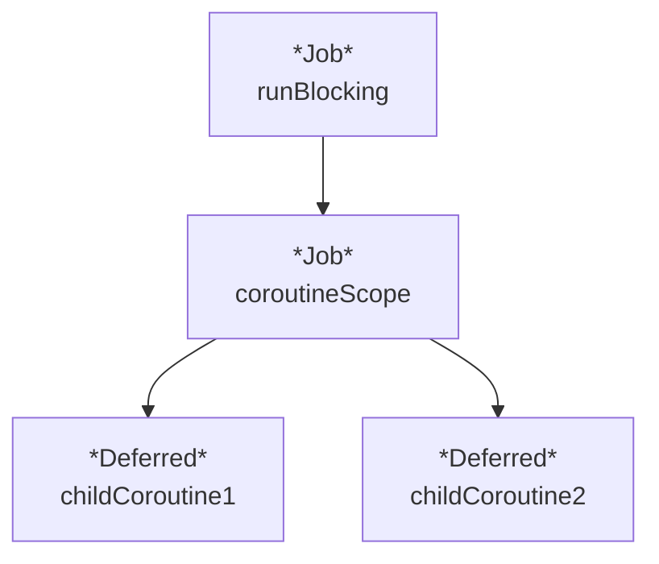
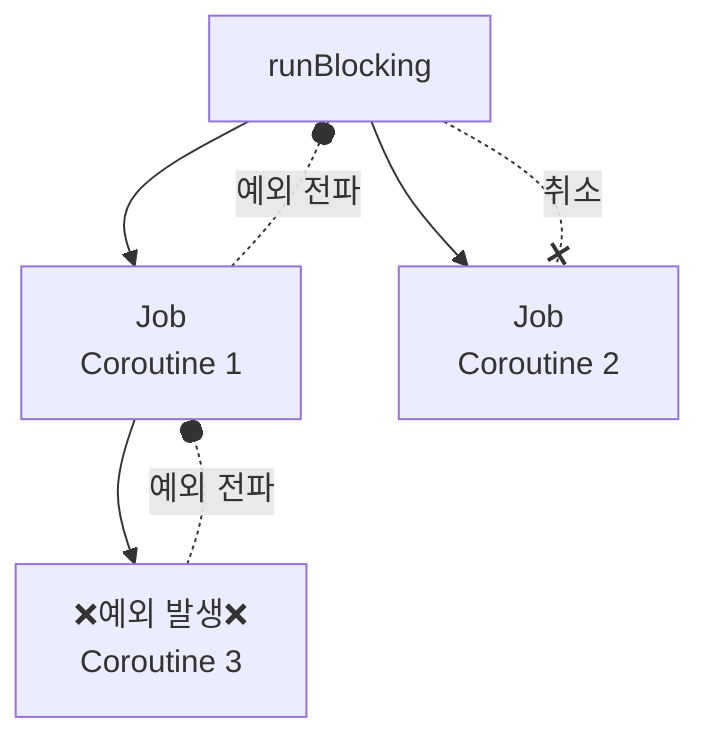
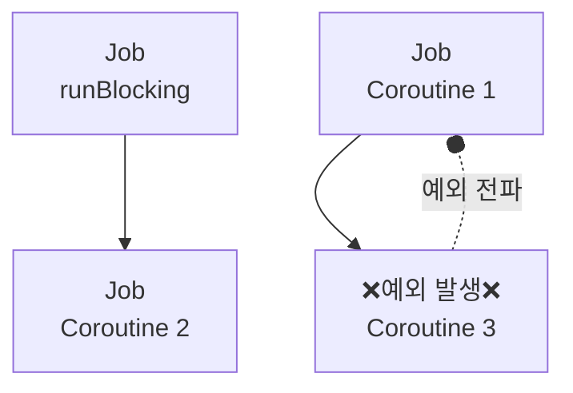
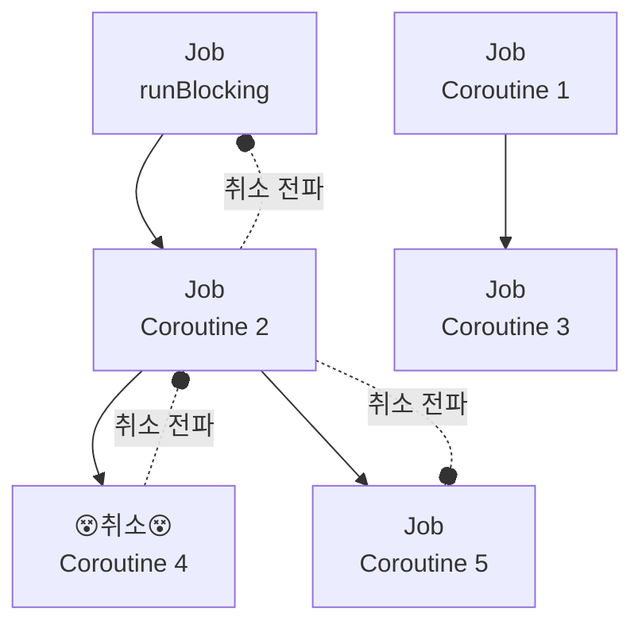
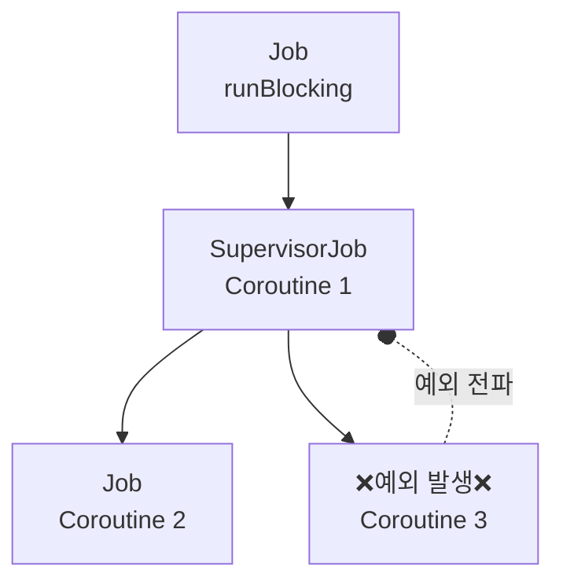
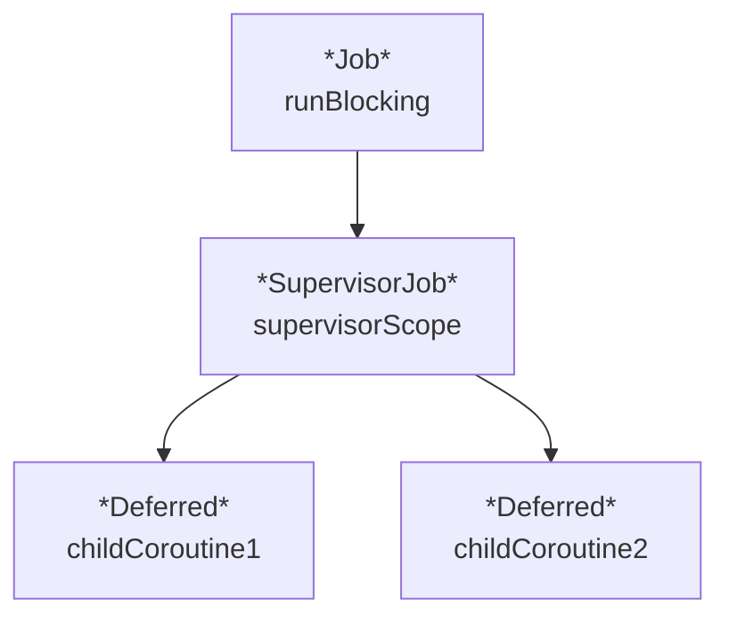

![[bg-image.jpg]]

# 코루틴과 예외

## 홍은진
## 2024.09.22.

note: 오늘은 코루틴을 사용하면서 발생하는 예외 상황과 예외 처리 방법에 대해 알아보겠습니다. next-코루틴의 예외에 대해 본격적으로 들어가기 앞서, 코루틴 관련 주요 개념 중 하나인 "일시 중단 함수"에 대해 먼저 알아보도록 하겠습니다.

---

#  일시 중단 함수 

## *suspending function*

--

# 1. 일시 중단 함수란?

> 일시 중단 지점이 있는 함수

note: 일시 중단 함수는 `suspend` 라는 키워드로 정의되는 함수로, 동작 실행을 일시 중단하고 나중에 재개할 수 있는 함수를 의미합니다.
일시 중단 함수는 비동기 작업을 동기식 코드처럼 작성할 수 있게 해줍니다. 
전통적인 콜백(callback) 기반 비동기 코드와 비교해볼까요? 
콜백 방식은 흔히 콜백 지옥(callback hell)을 만들어 가독성이 떨어지며 유지보수를 어렵게 할 수 있습니다. 
코루틴과 일시 중단 함수를 사용하면 다음과 같이 비동기 작업을 마치 동기식 코드처럼 작성할 수 있죠.

일시 중단 함수란 실행이 잠시 멈출 수 있는 구간을 갖고 있는 함수를 말합니다. 
next-여기서 '일시 중단 지점'이란

--

# 1.1. 일시 중단 지점이란?

> 일시 중단 함수가 실행을 멈출 수 있는 지점

<iframe frameborder="0" scrolling="no" style="width:100%; height:268px;" allow="clipboard-write" src="https://emgithub.com/iframe.html?target=https%3A%2F%2Fgithub.com%2FKotlin%2Fkotlinx.coroutines%2Fblob%2Fd8d6f8f37978b8e202d93b34f23f101df9c5724d%2Fkotlinx-coroutines-core%2Fcommon%2Fsrc%2FDelay.kt%23L121-L129&style=intellij-light&type=code&showBorder=on&showLineNumbers=on&showFileMeta=on&showFullPath=on&showCopy=on"></iframe>

note: 
- 정의: 일시 중단 함수가 실행을 멈출 수 있는 지점으로, 코루틴이 비동기적으로 작업을 처리하면서도 코드의 흐름을 직관적으로 유지할 수 있게 도와주는 개념이라고 이해하면 됩니다.
- delay 함수도 일시 중단 함수로, 본인이 실행되는 동안 호출부의 흐름을 잠시 멈춥니다.
- 그 외에도 네트워크 요청이나 데이터베이스 작업 같은 시간이 오래 걸리는 작업을 할 때, 코루틴은 해당 작업이 완료될 때까지 기다리는 대신 다른 작업을 처리하도록 일시 중단될 수 있습니다.
next-일시 중단 함수는 두가지 환경에서 호출 할 수 있습니다.

--

# 1.2. 일시 중단 함수 사용방법

1. 코루틴 내부
2. 일시 중단 함수 내부

note: 첫번째는 코루틴 내부이고, 나머지 하나는 일시 중단 함수 내부입니다.

--

## 1.2.1. 일시 중단 함수 사용방법 - 코루틴

<iframe width="100%" height="320px" src="https://pl.kotl.in/GQVoYlxza?from=10&to=25"></iframe>

note: 코드 설명 - 이 코드는 `runBlocking` 안에서 코루틴 빌더 함수 `launch` 를 사용하여 코루틴을 만들고, 그 안에서 `delayPrint` 라는 일시 중단 함수를 실행합니다. 이 때, `delayPrint` 에서는 1초 일시 중단된 후, 메시지를 출력합니다.
- 맨 처음 언급했듯, 일시 중단 함수는 코루틴 내에서 비동기 함수를 동기 함수처럼 순차적으로 처리할 수 있게 합니다. 따라서 위와 같이 하나의 코루틴 내에서 여러 개의 일시 중단 함수를 실행하면, 결과값이 순차적으로 출력됨을 확인 할 수 있습니다.
next - 또한 일시 중단 함수는 너무도 당연히 다른 일시 중단 함수에서 호출할 수 있습니다.

--

## 1.2.2 일시 중단 함수 사용방법 - 일시 중단 함수

<iframe width="100%" height="520px" src="https://pl.kotl.in/CqYem9bbr?from=8&to=34"></iframe>

note: 티켓 예매 사이트에서 공연 관람객 목록 가져오기를 예로 들겠습니다. 1번 서버에서 가져오는 데에 2000ms, 2번 서버에서 가져오는 데에 1000ms 가 필요하다고 가정하겠습니다. 두 서버에서 가져온 목록을 프린트하는 일시 중단 함수를 이렇게 만들 수 있습니다. 
실행해보면 약 3000ms 실행 시간이 소요되는 것을 확인할 수 있습니다. 
next-분리된 요청을 동시에 보내려면 어떻게 해야할까요?

--

## 1.2.1. 일시 중단 함수 사용방법 - 병렬 실행

<iframe width="100%" height="500px" src="https://pl.kotl.in/V9rGYCx6C?from=9&to=34"></iframe>

note: 답은 간단합니다. 각기 다른 코루틴 범위에서 함수를 호출하면 됩니다. 이전 코드의 `delayPrint` 함수 대신 각 함수를 서로 다른 코루틴 안에서 호출하도록 변경했습니다. 
실행결과에서 알 수 있다시피, `getParticipantList*` 함수가 서로 다른 코루틴에서 실행되었기 때문에, 전체 실행 시간은 3000ms가 아닌 2000ms 가 되었습니다.
next - 그렇다면, 우리는 일시 중단 함수를 사용하려면 늘 코루틴을 함수 외부에 두는 수 밖에 없을까요?

--

# 1.3. 일시 중단 함수 내에서 코루틴을 사용하려면?

### *`coroutineScope`*

note: `coroutineScope` 함수를 사용하면, 일시 중단 함수 내에서 코루틴 환경을 설정하고 사용할 수 있습니다. 
next-  `coroutineScope` 함수를 들여다보도록 하겠습니다. 

--

## 1.3.1. `coroutineScope` 

<iframe width="100%" height="400px" src="https://pl.kotl.in/AZ0S5EQFR?from=10&to=30"></iframe>

note: `coroutineScope` 함수는 `CoroutineScope` 확장 람다 함수를 인자로 받아, 람다식 내에서 코루틴 작업을 실행할 수 있게 해줍니다.
이전 코드에서 `runBlocking` 람다식에 속해 있던 코루틴 함수를 일시 중단 함수 내부로 가져오도록 하였습니다. 실행해보면, 결과는 동일합니다.
next - 내부 구조는 어떻게 되어있을까요?

--

## 1.3.3. `coroutineScope` 사용 시, 코루틴 구조

note: `coroutineScope` 함수는 새로운 `Job` 객체를 생성하고, 생성된 곳 상위에 있는 CoroutineContext 부모로 삼도록 만들어 줍니다.

--

## 1.3.3. `coroutineScope` 사용 시, 코루틴 구조 - 코드

<iframe width="100%" height="520px" src="https://pl.kotl.in/Vyc2TGjp2?from=11&to=37"></iframe>

note: 실제 코드를 통해 확인해보면, 각 코루틴 `Job`의 부모가 `coroutineScope` 이 만들어 낸 `Job`이라는 것을 확인할 수 있습니다.
또한, `coroutineScope` 함수는 자신이 생성된 `runBlocking`의 `Job`을 부모로 삼아, 자신이 생성한 코루틴을 관리합니다.
next-일시 중단 함수에 대해 알아보았으니, 이제 본격적으로 코루틴에서 발생하는 예외에 대해 알아보겠습니다.

---

# 2. 예외 처리

note: 애플리케이션은 다양한 예외 상황에 노출되며, 예외를 적절히 처리해 애플리케이션의 안정성을 확보할 수 있습니다.
next-코루틴에서 예외가 발생한다면 어떤 일이 벌어질까요?

--

# 2.1. 코루틴에서 예외가 발생하면?

<iframe width="100%" height="260px" src="https://pl.kotl.in/C9cGoFuO3?from=6&to=19"></iframe>

note: 코루틴은 비동기 작업을 실행할 때 사용되기 때문에 애플리케이션의 안정성을 위해 예외 처리가 필수죠. 
일례로, 중첩된 코루틴에서 예외가 발생하는 상황을 재현해보았습니다. 
위 코드는 언뜻 보기에 "Coroutine3"의 코루틴에서 예외가 발생하였으니, 나머지 코루틴 속 `println` 이 문제없이 실행 될 것처럼 보입니다.
하지만, 실행해보면 `Coroutine3`에서 발생한 예외가 상위 코루틴까지 전파되어, 모든 코루틴이 취소되는 것을 확인할 수 있습니다.

--
## 2.1.2. 코루틴에서 예외 발생 - 코루틴 구조

note: 코루틴에서 발생한 예외는 부모 코루틴으로 전파되며, 적절히 처리되지 않으면 최상위 루트 코루틴까지 전파됩니다.
예외를 전파받은 코루틴이 취소되면 해당 코루틴의 모든 자식 코루틴에 취소가 전파됩니다. 
즉, 루트 코루틴이 예외로 취소되면 구조화된 모든 코루틴이 취소된다.
next-이렇게 코루틴에서 발생한 예외가 전파되는 것을 막으려면 어떻게 해야할까요? 우선, 코루틴에서 발생하지만, 부모 코루틴으로 전파되지 않는 예외에 대해 알아보겠습니다.

---

# 2.2. 전파되지 않는 코루틴 예외

1. `CancellationException`
2. `TimeoutCancellationException`

note: 코루틴에서 발생한 예외는 부모 코루틴으로 전파되지만, 일부 예외는 전파되지 않습니다.
그 중 대표적인 예외로 `CancellationException`과 `TimeoutCancellationException`이 있습니다.

--

## 2.2.1. 전파되지 않는  코루틴 예외 - `CancellationException`

<iframe width="100%" height="260px" src="https://pl.kotl.in/ntiXczkfk?from=8&to=21"></iframe>

note: `CancellationException`은 다른 예외와 달리 부모 코루틴으로 전파되지 않습니다. 
`CancellationException`이 전파되지 않는 이유는 `CancellationException` 은 코루틴을 취소하기 위한 특별한 예외이기 때문이죠.

--

## 2.2.2. 전파되지 않는  코루틴 예외 - `TimeoutCancellationException`

<iframe frameborder="0" scrolling="no" style="width:100%; height:436px;" allow="clipboard-write" src="https://emgithub.com/iframe.html?target=https%3A%2F%2Fgithub.com%2FKotlin%2Fkotlinx.coroutines%2Fblob%2Fd8d6f8f37978b8e202d93b34f23f101df9c5724d%2Fkotlinx-coroutines-core%2Fcommon%2Fsrc%2FTimeout.kt%23L163-L179&style=intellij-light&type=code&showBorder=on&showLineNumbers=on&showFileMeta=on&showFullPath=on&showCopy=on"></iframe>

note: 코루틴 실행 시간이 예상을 초과한 경우, 발생하는 예외입니다. 
`TimeoutCancellationException`의 상세 구현을 보면 `CancellationException`의 서브 클래스라는 것을 확인할 수 있습니다.
이 경우도 마찬가지로 예외가 발생한 코루틴만 취소한다.
next-그렇다면 코루틴에 실행 예상 시간을 어떻게 설정할 수 있을까요? 바로 `withTimeout` 을 사용하면 됩니다.

--

## 2.2.2.1. `withTimeout` 으로 `TimeoutCancellationException` 생성하기

<iframe width="100%" height="420px" src="https://pl.kotl.in/5nSRNvYnB?from=11&to=32"></iframe>

note: `withTimeout` 함수를 사용해 코루틴의 실행 시간을 제한할 수 있습니다.
`withTimeout` 함수는 실행 시간 초과 시 `CancellationException`의 서브 클래스인 `TimeoutCancellationException`을 발생시켜 해당 코루틴만 취소합니다.
next: 추가로 `withTimeoutOrNull`을 사용하면 실행 시간 초과 시 null이 반환되도록 할 수 있습니다.

--

## 2.2.2.1. `withTimeoutOrNull` 로  `TimeoutCancellationException` 발생 시 결과값 없음 처리하기

<iframe width="100%" height="400px" src="https://pl.kotl.in/_8EuJgMDJ?from=10&to=30"></iframe>

note: `withTimeoutOrNull`을 사용하면 실행 시간 초과 시 결과값을 null로 반환하도록 할 수 있습니다.
next- 이외에, 전파되는 예외들을 제어하려면 어떻게 해야할까요?

---

# 2. 코루틴 예외 전파를 막으려면?

--

## 2.1. 코루틴 예외 전파 차단 - `Job`

<iframe width="100%" height="260px" src="https://pl.kotl.in/NEGBtTs26?from=7&to=20"></iframe>

note: 새로운 루트 `Job` 객체를 통해 코루틴의 구조화를 깨서 코루틴의 예외 전파를 제한할 수 있습니다.
코루틴 예외 관련 이야기 서두에 등장한 예시 코드와 동일한 코드를 사용하여 예시를 만들어 보았습니다.
`Coroutine 1` 생성 시, `Job` 객체를 새로 만들어 `runBlocking`에서 이어지는 구조를 끊어보았습니다.
실행해보면, `Coroutine 3`에서 발생한 예외가 `Coroutine 1`까지는 전파되지만, `Coroutine 2`는 실행되어 종료되는 것을 확인할 수 있습니다.

--

## 2.1. 코루틴 예외 전파 차단 - `Job`

note: 위 코드를 이와 같이 그래프로 나타낼 수 있습니다. 
`Coroutine 3`에서 발생한 예외는 `Coroutine 1`까지 전파되지만, 
`runBlocking` 과 관계 없이 새로 생성한 `Job` 객체를 사용한 `Coroutine 1`까지만 전파되고, `Coroutine 2`는 실행되어 종료됩니다.

--

## 2.2. 코루틴 예외 전파 차단 - `Job` 의 한계

note: Job 객체를 생성해 코루틴의 구조화를 깨는 것은 예외 전파를 제한하는 것뿐만 아니라 취소 전파도 제한시킵니다. 
일반적으로 코루틴의 구조화는 큰 작업을 연관된 작은 작업으로 나누는 과정을 통해 일어나는데, 
만약 작은 작업의 구조화가 깨진다면 큰 작업에 취소가 요청되더라도 작은 작업은 취소되지 않으며 이는 비동기 작업을 불안정하게 만듭니다.

--

## 2.3. 코루틴 예외 전파 차단 - `SupervisorJob`

<iframe width="100%" height="280px" src="https://pl.kotl.in/2mfUGkC92?from=8&to=22"></iframe>

note: `SupervisorJob` 객체를 사용해 예외 전파를 제한할 수 있다. `SupervisorJob` 객체는 예외를 전파받지 않는 특수한 `Job` 객체입니다.
`SupervisorJob` 객체는 자식 코루틴으로부터 예외를 전파받지 않는 특수한 `Job` 객체로 하나의 자식 코루틴에서 발생한 예외가 다른 자식 코루틴에게 영향을 미치지 못하도록 만드는 데 사용된다. 
일반적인 `Job` 객체는 자식 코루틴에서 예외가 발생하면 예외를 전파받아 취소되지만 `SupervisorJob` 객체는 예외를 전파 받지 않아 취소되지 않습니다.
SupervisorJob 생성 함수를 parent 인자 없이 사용하면 Supervisorjob 객체를 루트 Job으로 만들 수 있으며, parent 인자로 Job 객체를 넘기면 부모 Job이 있는 Supervisorjob 객체를 만들 수 있습니다.

--

## 2.3.2. 코루틴 예외 전파 차단 - `SupervisorJob` 사용 시, 구조

<split even>

</split>

note: 그래프를 통해 비교해보도록 하겠습니다. `SupervisorJob` 객체를 사용한 경우, `Coroutine 3`에서 발생한 예외는 `Coroutine 1`까지만 전파되고, `Coroutine 2`는 문제없이 실행되어 종료됩니다.
즉, 일반 `Job` 객체와는 다르게, `SupervisorJob` 을 사용하면 작업의 구조를 깨지 않으면서도 예외 전파를 제한할 수 있습니다.

--

## 2.3.3. `SupervisorJob` 사용 시, 예외 정보 전달

note:

---

# 3. 코루틴 예외 처리 방법

1. `try`-`catch`
2. `CoroutineExceptionHandler`

--

## 3.1. 코루틴 예외 처리 방법 - `try`-`catch`

note: 코루틴 내부에서 `try`-`catch`문을 사용해 예외를 처리할 수 있다.
1. 코루틴 빌더 함수에 대한 `try`-`catch`문은 코루틴이 실행될 때 발생하는 예외를 잡지 못한다.

--

## 3.2. 코루틴 예외 처리 방법 - `CoroutineExceptionHandler`

<iframe width="100%" height="160px" src="https://pl.kotl.in/TgjAxyW-t?from=8&to=16"></iframe>

note: `CoroutineExceptionHandler` 객체는 공통 예외 처리기로서 동작하며, 이미 처리된 예외에 대해서는 동작하지 않습니다. 
즉, 예외가 마지막으로 전파되는 또는 전달되는 위치에 설정되지 않으면 동작하지 않는다.
`CoroutineExceptionHandler` 객체는 예외 전파를 제한하지 않는다.

---

# 4. 코루틴 예외 처리

1. `async`-`await`
2. 일시 중단 함수

--

## 4.1. 코루틴 예외 처리 - `async`-`await`

<!-- async-await 사용 중 예외가 발생하는 코드 예시 추가-->

note: async 함수로 생성된 코루틴에서 발생한 예외는 await 호출 시 노출된다.
async 코루틴에서 발생한 예외 또한 부모 코루틴으로 전파된다.

--

## 4.2. 코루틴 예외 처리 - `coroutineScope`

<iframe width="100%" height="760px" src="https://pl.kotl.in/ak2PQnxyJ?from=9&to=47"></iframe>

note: 이전 코드에서 관람객 목록을 가져오는 함수 중 하나에서 예외가 발생하는 상황을 예로 들어, coroutineScope 의 예외 전파에 대해 알아보겠습니다.
이 코드에서 `getParticipantList2` 함수에서 예외가 발생하여, `getParticipantList1` 관람객 목록만 출력하고 프로그램이 종료될까요?

안타깝게도, `coroutineScope` 함수는 일반 `Job` 객체를 생성하기 때문에, 하위 코루틴에서 발생한 예외가 상위 코루틴으로 전파되어 프로그램이 종료됩니다.
위와 같은 상황을 방지하기 위해 `supervisorScope` 함수를 사용할 수 있습니다.

--

## 4.2. `supervisorScope` 예외 전파 막기

<split even>

</split>

note: `supervisorScope`는 `coroutineScope`와 동일하게 일시 중단 함수 내에서 상위 코루틴 환경을 가져와 사용할 수 있게 도와줍니다.
다만 한가지 차이가 있다면, 생성되는 `Job`이 일반 `Job`이 아닌 `SupervisorJob`라는 점입니다.
그 덕분에 하위 코루틴에서 오류가 발생하더라도 상위 코루틴으로 예외가 전파되는 것을 방지 할 수 있습니다.

--

## 4.2. `supervisorScope` 예외 전파 막기 - 코드

<iframe width="100%" height="740px" src="https://pl.kotl.in/V9QXA3eEp?from=9&to=46"></iframe>

note: 이번에는 `getParticipantList2` 함수에서 예외가 발생하더라도, `getParticipantList1` 함수의 결과를 출력하고 프로그램이 종료되지 않음을 확인할 수 있습니다.

---

# 끝

