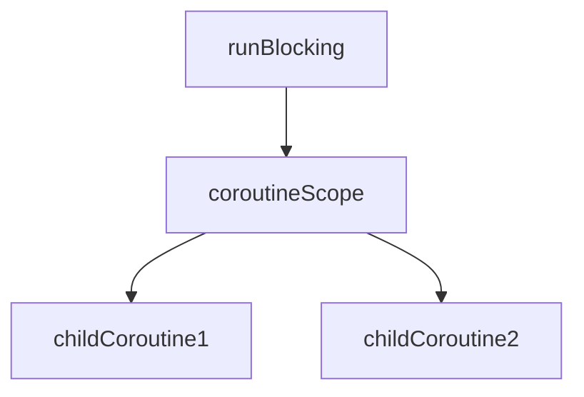
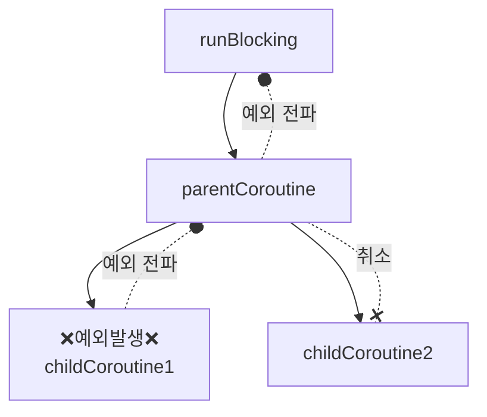

![[bg-image.jpg]]

# 코루틴 예외 처리

## 홍은진
## 2024.09.22.

note: 애플리케이션은 다양한 예외 상황에 노출되며, 예외를 적절히 처리해 애플리케이션의 안정성을 확보할 수 있다.

---
#  일시 중단 함수

note: 

--

# 1. 일시 중단 함수란?

> 일시 중단 지점이 있는 함수

note: 

--
# 1.1. 일시 중단 지점이란?

>일시 중단 함수가 실행을 멈출 수 있는 지점

<iframe width="100%" height="180px"src="https://pl.kotl.in/BexvsgiRO?readOnly=true&from=18&to=28"></iframe>

note: 
- 정의: 일시 중단 함수가 실행을 멈출 수 있는 지점으로, 코루틴이 비동기적으로 작업을 처리하면서도 코드의 흐름을 직관적으로 유지할 수 있게 도와주는 개념이라고 이해하면 돼.
- delay 함수도 일시 중단 함수로, 본인이 실행되는 동안 호출부의 흐름을 잠시 멈춘다.
- 예: 네트워크 요청이나 데이터베이스 작업 같은 시간이 오래 걸리는 작업을 할 때, 코루틴은 해당 작업이 완료될 때까지 기다리는 대신 다른 작업을 처리하도록 일시 중단될 수 있어.

--

# 1.2. 일시 중단 함수 사용방법

1. 코루틴 내부
2. 일시 중단 함수 내부

note: 

--

# 1.2.1. 일시 중단 함수 사용방법 - 코루틴

<!-- 코루틴 내에서 일시 중단 함수를 사용하는 코드 예시-->

note: 

--

## 1.2.2 일시 중단 함수 사용방법 - 일시 중단 함수

<!-- 일시 중단 함수 내에서 일시 중단 함수를 사용하는 코드 예시-->

note: 

--

# 1.3. 일시 중단 함수 내에서 코루틴을 사용하려면?

<!-- 일시 중단 함수 내에서 일시 중단 함수를 사용하는 코드 예시-->

note: 

--

## 1.3.1. `coroutineScope` 

<iframe width="100%" height="180px"src="https://pl.kotl.in/d68PHvYYY?from=35&to=44&readOnly=true"></iframe>

note: 

--
## 1.3.2. `coroutineScope` 사용 예시

<!-- coroutineScope 코드-->

note: 

--

## 1.3.3. `coroutineScope` 사용 시, 코루틴 구조

note: 

---

# 2. 예외 처리

note: 애플리케이션은 다양한 예외 상황에 노출되며, 예외를 적절히 처리해 애플리케이션의 안정성을 확보할 수 있습니다.
next: 코루틴에서 예외가 발생한다면 어떤 일이 벌어질까요?

--

# 2.1. 코루틴에서 예외가 발생하면?

note: 코루틴은 비동기 작업을 실행할 때 사용되기 때문에 애플리케이션의 안정성을 위해 예외 처리가 필수적이다.
1. 코루틴에서 발생한 예외는 부모 코루틴으로 전파되며, 적절히 처리되지 않으면 최상위 루트 코루틴까지 전파된다.
2. 예외를 전파받은 코루틴이 취소되면 해당 코루틴의 모든 자식 코루틴에 취소가 전파된다. 즉, 루트 코루틴이 예외로 취소되면 구조화된 모든 코루틴이 취소된다.

--
## 2.1.1. 코루틴에서 예외 발생 - 예시

<!-- 코루틴에서 예외 발생 - 예시 코드-->

note: 

--
## 2.1.2. 코루틴에서 예외 발생 - 코루틴 구조

<!-- 위 예시 코드에 맞춰 이름 바꾸기-->

note: 

---

# 2.2. 전파되지 않는 코루틴 예외

1. CancellationException
2. TimeoutCancellationException

--

## 2.2.1. 전파되지 않는  코루틴 예외 - CancellationException

<!-- CodeCancellationException 발생 코드 예시 추가-->

note: CancellationException은 다른 예외와 달리 부모 코루틴으로 전파되지 않는다.
1. CancellationException이 전파되지 않는 이유는 CancellationException 은 코루틴을 취소하기 위한 특별한 예외이기 때문이다. Job 객체에 cancel 함수를 호출하면 CancellcationException의 서브 클래스인 JobCancellationException이 발생해 코루틴이 취소된다.

--

## 2.2.2. 전파되지 않는  코루틴 예외 - TimeoutCancellationException

<iframe width="100%" height="260px" src="https://pl.kotl.in/PbdEZ3yOf?from=4&to=17&readOnly=true"></iframe>

note: 코루틴 실행 시간이 예상을 초과한 경우, 발생하는 예외입니다. 이 경우도 마찬가지로 예외가 발생한 코루틴만 취소한다.
next: 그렇다면 코루틴에 실행 예상시간을 어떻게 설정할 수 있을까요? 바로 `withTimeOut` 을 사용하면 됩니다.

--

## 2.2.2.1. withTimeOut 으로 TimeoutCancellationException 생성하기

<!-- TimeoutCancellationException 발생 코드 예시 추가-->

note: withTimeOut 함수를 사용해 코루틴의 실행 시간을 제한할 수 있다.
1. withTimeOut 함수는 실행 시간 초과 시 CancellationException의 서브 클래스인 TimeoutCancellationException을 발생시켜 해당 코루틴만 취소한다.
2. withTimeOutOrNull을 사용하면 실행 시간 초과 시 null이 반환되도록 할 수 있다.

---

# 2. 코루틴 예외 전파를 막으려면?

--

## 2.1. 코루틴 예외 전파 차단 - `Job`

<!-- Job 을 사용하여 예외 전파를 막는 코드 예시 추가-->

note: 새로운 루트 Job 객체를 통해 코루틴의 구조화를 깨서 코루틴의 예외 전파를 제한할 수 있다.

--

## 2.2. 코루틴 예외 전파 차단 - `Job` 의 한계

--

## 2.3. 코루틴 예외 전파 차단 - `SupervisorJob`

note: Supervisorjob 객체를 사용해 예외 전파를 제한할 수 있다. Supervisorjob 객체는 예외를 전파받지 않는 특수한 Job 객체이다.

--
## 2.3.1. 코루틴 예외 전파 차단 - `SupervisorJob`

note: 1. Supervisorjob 객체는 예외를 전파받지 않지만 예외 정보는 전달받는다.
2. 예외가 전파되거나 예외 정보가 전달된 경우 해당 코루틴에서 예외가 처리된 것으로 본다.
--

## 2.3.2. 코루틴 예외 전파 차단 - `SupervisorJob` 사용 시, 구조

note:

--

## 2.3.3. SupervisorJob 사용 시, 예외 정보 전달

note:

---

# 3. 코루틴 예외 처리 방법

1. try-catch
2. CoroutineExceptionHandler

--

## 3.1. 코루틴 예외 처리 방법 - `try`-`catch`

note: 코루틴 내부에서 try catch문을 사용해 예외를 처리할 수 있다.
1. 코루틴 빌더 함수에 대한 try catch문은 코루틴이 실행될 때 발생하는 예외를 잡지 못한다.

--

## 3.2. 코루틴 예외 처리 방법 - `CoroutineExceptionHandler`

note: CoroutineExceptionHandler 객체는 공통 예외 처리기로서 동작하며, 이미 처리된 예외에 대해서는 동작하지 않는다. 즉, 예외가 마지막으로 전파되는 또는 전달되는 위치에 설정되지 않으면 동작하지 않는다.
1. CoroutineExceptionHandler 객체는 예외 전파를 제한하지 않는다.
---

# 4. 코루틴 예외 처리

1. `async`-`await`
2. 일시 중단 함수

--

## 4.1. 코루틴 예외 처리 - `async`-`await`

<!-- async-await 사용 중 예외가 발생하는 코드 예시 추가-->

note: async 함수로 생성된 코루틴에서 발생한 예외는 await 호출 시 노출된다.
async 코루틴에서 발생한 예외 또한 부모 코루틴으로 전파된다.

--
## 4.2. 코루틴 예외 처리 - 일시 중단 함수

<!-- 일시 중단 함수에서 예외 발생 코드 예시 추가-->

--

## 4.2. `supervisorScope` 예외 전파 막기

<!-- supervisorScope를 사용하여, 일시 중단 함수에서 예외 발생 코드 예시 추가-->

---

# 끝

