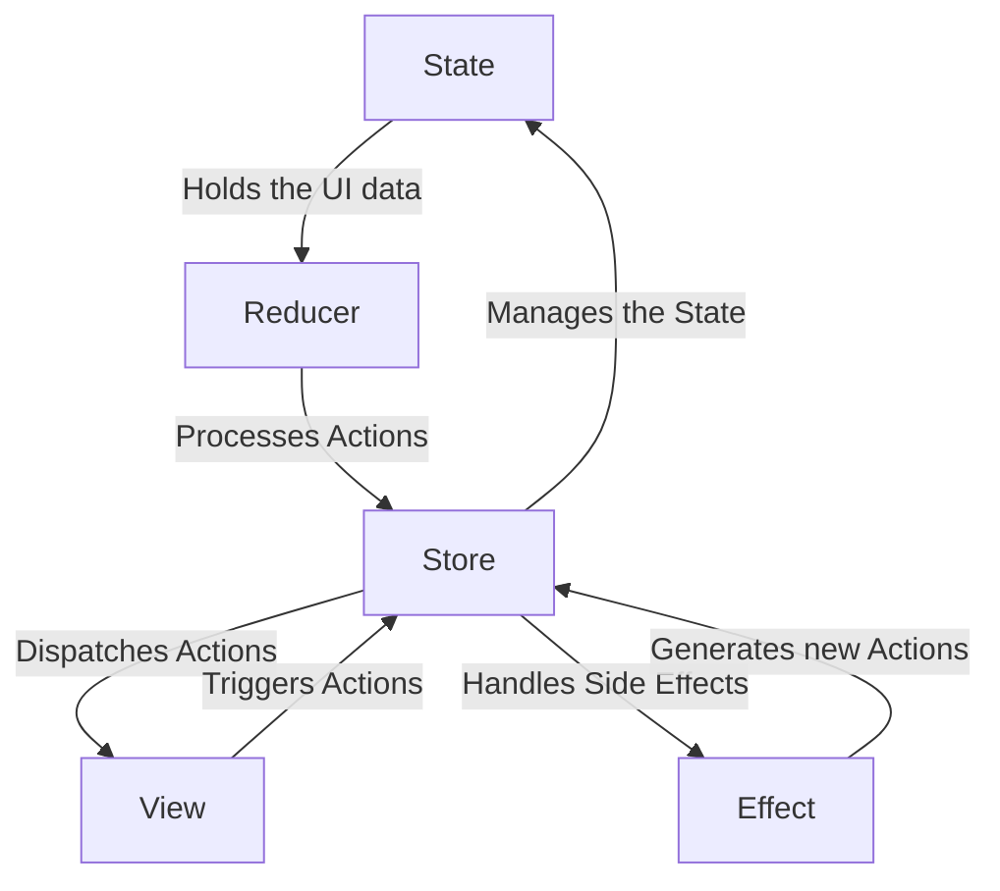

# 들어가며

회사 프로젝트에 야금야금 `.xml` 레이아웃 대신 `@Composable` 을 사용하고 있다. Composable 을 공부하면서 *TCA* 에 대해 알게 되었다. 내가 익숙하게 사용하던 기존 MV* 아키텍처와는 어떤 차이점이 있을지 궁금하여, 정리해보고자 한다.

# TCA란?

Redux 와 Elm 에서 영향을 받아 만들어진 패턴이다. 이 패턴은 단방향 데이터 흐름을 통해, 상태 관리를 간소화하고 관심사 분리하는데에 도움을 준다.

# 패턴 구성 요소
1. State: 앱 데이터 SSOT(Single Source Of Truth)를 따를 수 있도록 만든다.
2. Action: 현재 상태를 어떻게 바꾸고자 하는지 대한 명세를 말한다.
3. Reducer: 순수 함수로 현재 상태와 Action을 가지고 신규 상태를 만들어낸다.
4. Effect: 스낵바를 보여주거나 외부 API 통신 등 Side Effect를 일컫는다.
5. Environment: Effect 를 일으키기 위해 필요한 의존성을 말한다.
6. Store: 위 요소들을 모두 다루는 TCA의 중심 요소다. 상태 변화를 관찰하고 Action을 시작하는 등의 기능을 한다.

## 예시

```kotlin
data class WeatherState(
    val location: String,
    val temperature: Double,
    val isFetching: Boolean,
    val error: String?
)
```


```kotlin
sealed interface WeatherAction {
    data class UpdateLocation(val location: String) : WeatherAction()
    object FetchData : WeatherAction()
    data class DataFetched(val temperature: Double) : WeatherAction()
    data class Error(val message: String) : WeatherAction()
}
```

```kotlin
fun weatherReducer(state: WeatherState, action: WeatherAction): WeatherState {
    return when (action) {
        is WeatherAction.UpdateLocation -> state.copy(location = action.location)
        WeatherAction.FetchData -> state.copy(isFetching = true, error = null)
        is WeatherAction.DataFetched -> state.copy(
            temperature = action.temperature,
            isFetching = false,
            error = null
        )
        is WeatherAction.Error -> state.copy(isFetching = false, error = action.message)
    }
}
```


```kotlin
fun fetchWeatherData(location: String): Flow<WeatherAction> = flow {
    try {
        val temperature = getTemperatureForLocation(location)
        emit(WeatherAction.DataFetched(temperature))
    } catch (e: Exception) {
        emit(WeatherAction.Error(e.message ?: "Unknown error"))
    }
}
```


```kotlin
interface WeatherEnvironment {
    suspend fun getTemperatureForLocation(location: String): Double
}

class WeatherEnvironmentImpl : WeatherEnvironment {
    override suspend fun getTemperatureForLocation(location: String): Double {
        // implementation omitted
    }
}
```


```kotlin
import okhttp3.OkHttpClient
import okhttp3.Request

class WeatherEnvironmentImpl : WeatherEnvironment {
    
    private val client = OkHttpClient()
    
    override suspend fun getTemperatureForLocation(location: String): Double {
        val url = "https://api.openweathermap.org/data/2.5/weather?q=$location&appid=API_KEY&units=metric"
        val request = Request.Builder().url(url).build()

        val response = client.newCall(request).execute()
        val jsonResponse = response.body()?.string()
        val json = JSONObject(jsonResponse)
        val main = json.getJSONObject("main")
        return main.getDouble("temp")
    }
}
```

```kotlin
class WeatherStore(environment: WeatherEnvironment) {
    private val _state = MutableStateFlow(WeatherState("", 0.0, false, null))
    val state: StateFlow<WeatherState> = _state.asStateFlow()

    private val job = Job()
    private val scope = CoroutineScope(job + Dispatchers.IO)

    fun dispatch(action: WeatherAction) {
        val newState = weatherReducer(_state.value, action)
        _state.value = newState

        when (action) {
            is WeatherAction.UpdateLocation -> {
                scope.launch {
                    val weatherAction = fetchWeatherData(newState.location).first()
                    dispatch(weatherAction)
                }
            }
            WeatherAction.FetchData -> {
                scope.launch {
                    val weatherAction = fetchWeatherData(newState.location).first()
                    dispatch(weatherAction)
                }
            }
            else -> Unit
        }
    }

    init {
        scope.launch {
            val weatherAction = fetchWeatherData(_state.value.location).first()
            dispatch(weatherAction)
        }
    }
}
```


```kotlin
class MainActivity : ComponentActivity() {
    private val store = CounterStore()

    override fun onCreate(savedInstanceState: Bundle?) {
        super.onCreate(savedInstanceState)

        setContent {
            CounterScreen(store)
        }
    }

    override fun onDestroy() {
        store.dispose()
        super.onDestroy()
    }
}
```

# 특징

## MVI와 다른 점은?

## 1. 철학과 기본 개념
### MVI (Model-View-Intent)
- 단일 상태 기반(State-based)의 아키텍처로, **불변 상태**와 **단방향 데이터 흐름**을 강조.
- 상태(state)는 앱의 단일 진실 소스(Single Source of Truth)로 유지.
- 상태 변화는 명시적으로 선언된 이벤트(intent)에 의해 트리거됨.
- 모든 상태 변화는 **순수 함수(reducer)**를 통해 처리.

### TCA (The Composable Architecture)
- **Redux** 패턴에서 영감을 받음.
- **State, Reducer, Environment, Store**를 중심으로 구성되며, 컴포저블(Composable)한 모듈로 쪼개는 것을 강조.
- 비즈니스 로직과 상태 관리를 분리하며, 유닛 테스트 작성이 용이.

---

## 2. 구성 요소 비교

| **항목**           | **MVI**                                           | **TCA**                                           |
|--------------------|--------------------------------------------------|--------------------------------------------------|
| **State**         | 단일 상태 객체로 모든 UI 상태를 관리             | 각 모듈(State)의 독립적인 상태와 계층적 구조    |
| **Reducer**       | 순수 함수로 상태를 변경                           | 액션을 기반으로 상태를 업데이트하는 순수 함수    |
| **Action/Intent** | 사용자의 입력이나 UI 이벤트를 명시적으로 표현     | 사용자의 입력, 외부 이벤트 등을 정의하는 액션    |
| **Side Effects**  | 일반적으로 `Middleware` 또는 `Effect`에서 처리    | `Effect`를 사용해 비동기 작업 또는 외부 시스템 통합 |
| **View**          | 상태를 관찰하고, Intent를 전달하는 역할           | 상태를 바인딩하며, Store와 직접 연결             |

---

## 3. 데이터 흐름

### MVI
1. **Intent**: 사용자의 입력이 **Intent**로 정의됨.
2. **Reducer**: Intent가 상태(State)를 변경하며, 새로운 상태를 생성.
3. **View**: 새로운 상태를 기반으로 UI를 업데이트.
4. **Side Effects**: 비동기 작업(API 호출 등)은 별도로 처리.

### TCA
1. **Action**: 사용자의 입력이나 외부 이벤트가 **Action**으로 정의됨.
2. **Reducer**: Action이 상태(State)를 변경하며, 상태는 Store를 통해 관리.
3. **Effect**: 비동기 작업은 **Effect**로 처리되고, 새로운 Action으로 Reducer에 전달.
4. **View**: Store를 구독하여 상태(State)를 UI에 반영.

---

## 4. 특징 및 차이점

| **항목**            | **MVI**                                            | **TCA**                                      |
| ----------------- | -------------------------------------------------- | -------------------------------------------- |
| **단일 상태 관리**      | 단일 상태 객체로 전체 UI 상태를 관리 (Centralized State)         | 각 모듈마다 상태를 독립적으로 관리 가능                       |
| **효율성**           | 모든 상태 변경이 단일 상태를 업데이트하므로 복잡한 구조에서는 비효율적일 수 있음      | 상태를 모듈화하고 필요할 때만 데이터를 전달하므로 효율적              |
| **Android 구현 관점** | Jetpack Compose나 LiveData + ViewModel과 자연스럽게 결합 가능 | Compose에서 Store를 활용해 TCA를 Android에서 사용할 수 있음 |
| **테스트 용이성**       | 명시적인 상태와 Intent 덕분에 유닛 테스트 작성이 비교적 쉬움              | 상태, Reducer, Effect 분리가 명확하여 테스트 작성이 매우 용이   |
| **러닝 커브**         | 단순하고 직관적인 구조로 진입 장벽이 낮음                            | 모듈화 및 Store 개념으로 인해 학습 곡선이 다소 가파름            |
| **모듈화 및 재사용성**    | 상태가 단일 객체로 관리되므로 모듈화를 고려할 때 유연성이 떨어질 수 있음          | 상태와 비즈니스 로직을 모듈화하기 쉽고, 재사용성 높음               |


---

## 5. Android에서의 구현 예
- **MVI**:
  - Jetpack Compose와 `ViewModel`을 사용해 상태(State)를 `MutableStateFlow`로 관리.
  
- **TCA**:
  - Jetpack Compose와 함께 Store를 구현하고, 상태 변경 및 액션을 효과적으로 관리.

---

## 결론
- **MVI**는 Android에서 이미 널리 사용되고 있고, 간단한 구조를 가진 앱에서 효율적입니다.
- **TCA**는 모듈화와 테스트 가능성을 강화하기 때문에 **대규모 프로젝트**나 **복잡한 상태 관리**가 필요한 앱에서 더 적합합니다.



	
## 고려할 점


# 마치며


# Reference
- https://softaai.com/tca-architecture-in-android/
- https://github.com/toggl/komposable-architecture

