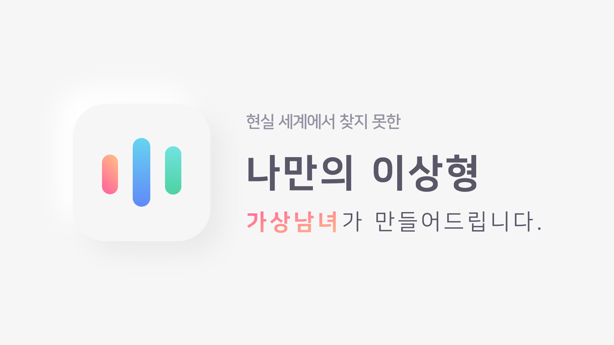

# Key Features

- 인공지능을 사용하여 연인과 대화하는 듯한 경험을 제공하는 모바일 애플리케이션 서비스
- AI 연인의 외모, 목소리, 말투 커스터마이즈 기능 지원
	- 생성형 외모 혹은 사용자가 직접 업로드한 인물 이미지를 기반으로 한 영상 플레이 기능 지원
- AI 연인과의 관계 척도, 끝말잇기 등 자연어 대화 게이미피케이션

# Project Overview

- **작업 기간**: 2019. 11 - 2021. 03 (1년 3개월)
- **인력 구성**: BE 2명 / iOS 1명 / **Android 1명**
- **담당 역할**: Android 애플리케이션 개발 및 설계

## Main Tasks

1. 가상남녀 Android 앱 설계 및 구현
2. AI 연인과의 1:1 채팅 기능 구현
3. 대화창 내 끊김없이 재생되는 AI 연인 얼굴 영상 플레이어 구현
4. 그 외, 로그인, 인앱 결제 등 앱 내 주요 기능 구현

# Tech Stack

- Kotlin
- MVVM
- ExoPlayer
- DataBinding
- Koin
- Coroutine
- Retrofit

# Demo Video

<table>
	<tr style="vertical-align:top">
		<td  width="34%" align="top">
			<video controls>
				<source src="./assets/dueta-android-screen-record-02.mp4" type="video/mp4" />
			</video>
			[AI 연인 개인화] AI연인의 외모, 목소리, 성격을 선택하여 플레이할 수 있습니다.
		</td>
		<td  width="32%">
			<video controls>
				<source src="./assets/dueta-android-screen-record-00.mp4" type="video/mp4" />
			</video>
			[AI 연인과의 대화] AI와 끝말잇기 플레이 / 하트 이모티콘을 전송하여 애정도 향상
		</td>
		<td  width="32%">
			<video controls>
				<source src="./assets/dueta-android-screen-record-01.mp4" type="video/mp4" />
			</video>
			[AI 연인과의 대화] 사용자가 전송하는 말에 대해 생성된 자연어 응답을 받는다.
		</td>
	</tr>
</table>

# References

- [가상남녀 - 세상에 없던 감성 인공지능](http://ai-boyfriend-girlfriend.mindlogic.ai/)
- [시연 영상: 가상남녀 앱 시연동영상](https://youtu.be/U6vzxjolY6k?si=Jrc1DDNIscTWmdG3)
- [Play Store: 가상남녀 - AI남친여친과 꿀잼톡 다정톡](https://play.google.com/store/apps/details?id=ai.mindlogic.dueta) * 현재 종료된 서비스입니다.
- [[뉴띵 EP.35] 자기가 내 애인이라는 AI 만나봄, 그렇지만 설렌다..? /스브스뉴스](https://youtu.be/OetPNAspdFE?si=JuKcy6BotLnErPqO)
