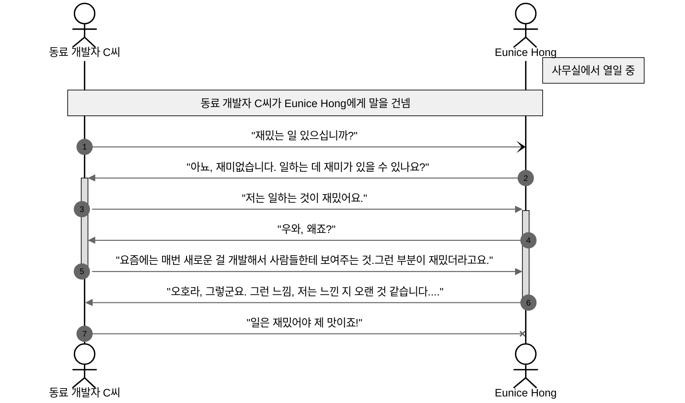

# 일은 하는데 재미가 없다.

다음은 2024년 8월 14일경 사무실에서 동료 개발자 C씨와 나의 대화이다.




분명 이전에는 나도 하루 하루 일상 생활이 재미있었다.
어느 순간부터, 일상이 지루해지고, 권태로움이 찾아왔다.

비슷한 이야기를 일전에도 친구나 동료들이랑 나눈 적이 있다. 
해야하는 일을 해야하니까 하는 의무감으로 하는 사람과 내가 하고 싶은 일이니까 하는 자신의 흥미를 좇는 사람이 있다.
누구나 후자가 되고 싶을 것이다. 나도 분명 후자였던 것 같다. 그런데, 어느 순간부터 후자에서 전자로 변해버린 것 같다.

권태로움을 이겨내고자 나는 더 부스팅을 했다. 일과 후며 주말이며 부단히 열을 내어 공부를 하거나 취미에 열중해보았다.
하지만, 오히려 그 권태로움이 깊어지고 있다.

<h2>왜 그럴까...?🌸</h2>

최근 "일론 머스크의 10시간 데이트 플랜"에 대해 알게 되고, 그 원인을 알게 되었다.

비결은 바로 **제대로 된 휴식**이다.


# 일론 머스크는 열일하면서 할 거 다한다

[일론 머스크](https://en.wikipedia.org/wiki/Elon_Musk)는 현재 테슬라, 스페이스X, 솔라시티 등 다양한 기업을 운영하는
사업가다. 내가 이름을 알고 있는 사람 중 가장 하고 싶은 일을 잘, 많이 하는 사람이다. 

그는 많은 회사들을 운영하기 위해 일주일에 100시간 이상을 일한다고 한다. 주말을 포함해서 하루 14시간 정도되는 셈이다.
그는 그렇다면 하루 남은 10시간을 어떻게 보내는 것일까? 그리고 "일론 머스크의 10시간 데이트 플랜"이란 무엇일까?


## "일론 머스크의 10시간 데이트 플랜"이란?

"일론 머스크의 10시간 데이트 플랜"의 출처인 블룸버그 인터뷰를 살펴보았다.
인터뷰 내용 중 워라밸에 대한 질문에 머스크는 다음과 같은 답변을 내놓았다.

> "_I think the time allocated to the businesses and the kids is going fine,_
> 
> _I would like to allocate more time to dating, though. I need to find a girlfriend._
>
> _How much time does a woman want a week?_
> 
> _Maybe 10 hours?_"
> 
> — [Elon Musk, the 21st Century Industrialist](https://www.bloomberg.com/news/articles/2012-09-13/elon-musk-the-21st-century-industrialist)

한국말로 바꿔보면,

```text
1. 내가 사업과 아이들에게 할당한 시간 분배는 적절하다.
2. 나는 현재 데이트에 더 많은 시간 할당해야한다.
3. 아마 주당 10시간 정도 데이트를 해야할 것이다.
4. 당시로서는 여자친구가 없으니, 여자친구를 찾기부터 해야한다.
```

위 인터뷰를 통해 알 수 있는 건 바쁘기로 소문난 머스크씨도 '데이트 하는 것'을 중요하게 생각한다는 것이다.
또한 주당 10시간이라는 큰 시간을 할당하고 싶어했다. 

실제 인터뷰를 찾아보기 전까지는 10시간을 딱 지켜서 데이트를 한다고 생각했는데,
일론 머스크에게도 10시간 데이트는 희망사항일 뿐이었다.
인터뷰 시점 이후로 머스크에게는 수많은 연인이 생겼다가 사라졌다.
"10시간 데이트 플랜"을 지켰는지는 알 수 없지만, 확실히 주당 10시간 정도 할당하는 것이 응당 당연하다고 머스크도 생각했다.

나 역시 데이트가 중요하다고 생각한다. 
데이트를 통해서 나 외에 다른 사람과 깊이 있는 소통을 하는 것이 삶에 큰 휴식과 의미가 준다고 여기기 때문이다. 
 

그 외에도, 여러 인터넷 기사를 통해 알게 된 일론 머스크의 자기 관리 루틴 규칙 몇 가지를 소개한다.

> **"카페인 프리" 다이어트 콜라를 마신다.**
> 
> "언제부턴가 시력이 급격히 떨어졌고, 앞이 보이지 않게 될까 걱정이 됐다. 그래서 지금은 사무실에 카페인 프리 콜라만 사둔다."
> 
> **하루 6시간의 수면 시간은 반드시 지킨다.**
> 
> "잠은 정말 중요하다. 덜 자면 더 일할 수 있겠지만, 제대로 잠을 자지 못하면 나는 멍해진다. 하루 6시간~6시간 반 수면이 내게 딱 알맞다"
> 
> **'패밀리타임' 사수하기**
> 
> 일주일 중 4일은 반드시 자녀들과 시간을 보낸다.
> 
> — [출처: Quartz][days_and_nights_of_musk]


# 1론 머스크는 못돼도 2.5론 머스크는 도전해볼만 할지도

머스크의 몇 가지 자기관리 방법을 보니, 그는 휴식 시간을 꽤 중요하게 생각한다.
일론 머스크처럼 하루 100시간을 일하지는 않지만, 휴식 플랜이라는 개념은 "손민수"해봐야겠다.

## 1. 카페인 줄이기

요즘들어 카페인을 많이 섭취하고 있다.
커피믹스 하루 네 잔은 기본이고, 드립커피에 카페인이 첨부된 콜라도 마신다.

카페인이 일시적인 효과로는 좋지만, 장기적으로는 안좋다는 것을 알고 있다.
실제로 아침마다 어깨 위에 곰이 올라탄 것 같은 피로감을 느낀다.

또한 일하는 중간에 카페인이 떨어지면 멍한 느낌이 든다. 이 느낌은 끊임없는 카페인 섭취를 유발한다. 

일단 콜드 터키법으로 카페인을 줄여보기로 했다. 
조금이라도 카페인이 그리워 질 때면, 요즘 내가 좋아하는 [[Random/추성훈 20분 루틴|추성훈 20분 운동법]]을 한다.
사이클 하나 돌리기도 전에 혈액 순환이 개선되어 활력을 되찾는다.

그럼에도 불구하고 카페인이 당긴다면, 
1. 카페인 프리 음료수를 마신다.
2. 그 날 저녁 일정은 모두 취소하고, 집가서 취침한다.

## 2. 수면 시간 지키기

나는 수면시간을 못 지킨다.
요즘에는 전자기기 하나만 손에 있으면, 온세상 재미있는 이야기를 보고 들을 수가 있다.
수면이라는 것이 스스로 의식을 잃는 상태가 되는 것이다. 
도파민이 샘솟는 세상을 등지고 잠에 들어 무의식의 세상으로 간다는 건 슬픈 일이다.  

하지만, 수면은 어떠한 약물보다 훌륭한 만병통치약이다.
수면을 통해 뇌가 휴식을 하고, 장기 기억을 만들어 낸다.

때문에 최근 애플워치를 사서, 나의 수면을 게이미피케이션 해보기로 했다.
스마트 워치로 수면 시간을 기록하여, 매일 기준 시간을 채우는 것을 목표로 한다.
일주일에 5일 이상 6시간 반 이상 수면을 취하면, 나에게 선물을 해주는 것이다.

워치를 구매한지 이제 3일이 지났다. 얼른 나에게 선물을 할 수 있는 날이 오기를 기대한다.


## 3. 'Relation Time' 사수하기

내가 사람들과 소통하는 것을 좋아하는 성격은 아니다. 
하지만, '가까운 사람들로부터 감정적인 지지를 받는 것은 인간의 삶을 풍요롭게 만들어준다.'는 말을 믿는다. 

때문에, 나는 주말에는 가족과 친구들, 연인과 시간을 보내기로 했다.
특히, 'Relation Time'에는 전자기기를 사용하지 않고, 외부 활동이나 대화를 통해 소통하는 것을 목표로 한다.


# 마치며

일론 머스크의 10시간 데이트 플랜을 보고, 나의 자기관리 방법을 다시 정립해보았다.
일론 머스크처럼 하루 100시간을 일하진 않지만, 휴식을 중요하게 생각하는 것은 나에게도 적용되는 것이다.

상기 휴식 플랜을 잘 지켜 남은 2024년은 더 행복하고, 더 풍요로운 삶을 살아보고 싶다.


[days_and_nights_of_musk]: https://qz.com/1000370/the-days-and-nights-of-elon-musk-how-he-spends-his-time-at-work-and-play