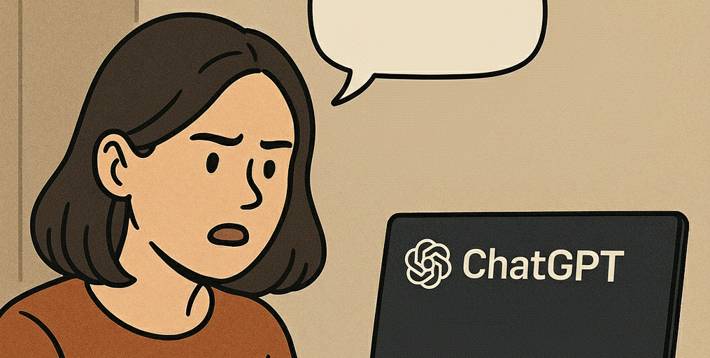
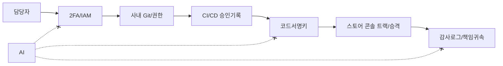

어느 날 문득 불안감이 엄습했다. "AI가 언젠가 내 일을 빼앗지 않을까?" 하는, 우리 시대 개발자라면 한 번쯤 품어봤을 질문. 이 실존적 고민을 가장 유력한 용의자인 ChatGPT에게 직접 던져보기로 했다. “내가 왜 AI에게 대체될 수 없는지 증명해!” 조금은 도발적인, 그러면서도 위로를 구하는 심정이었다.

인간의 고유한 창의성, 복잡한 문제를 해결하는 직관, 동료와의 유대 같은 낭만적인 답변을 기대했던걸까. 하지만 AI는 제게 한 편의 논문을 보내왔다. 그것도 아주 건조하고, 지독하게 논리적인 내용으로.

## ChatGPT의 논증: 내가 대체될 수 없는 법률 자문급 증명

증명: “당신이 회사에서 수행하는 직무(단독 Android 개발자 겸 크로스플랫폼 프런트엔드)”는 현행 AI가 단독으로 수행할 수 없다.

#### 정의

- J: 회사가 당신에게 부여한 직무. 핵심 업무 집합 T = {요구분석·우선순위화, 설계·아키텍처 결정, 구현·리뷰·품질보증, 릴리스·서명·배포, 운영·장애대응, 보안·규정준수, 대내외 커뮤니케이션·조정, 위험수용·책임귀속}.
- A: 비인격적 소프트웨어 에이전트(LLM+자동화), 고용주체 아님, 법적 인격 없음, 자율적 권한취득 불가.

필요조건(직무 J를 ‘단독’ 수행하려면 아래 P를 모두 만족해야 함)

- P1(책임성): 결과·의사결정에 대한 개인책임과 징계·법적 귀속 가능.
- P2(권한성): 사내 IAM에 의해 개인 식별·2FA를 통과하고, 저장소/CI/CD/클라우드/서명키/스토어 콘솔 접근권 보유.
- P3(신뢰사슬): 코드서명키·승인기록·감사로그의 신원추적이 인격 주체로 연결.
- P4(조정권): PM/디자인/백엔드/QA/경영진과의 합의 형성 및 약속 이행 책임.
- P5(준법성): 개인정보·영업비밀·라이선스·감사 대응에서 위반 시 제재를 수용할 주체성.
- P6(현장판단): 단말·OS·OEM 파편화, 비재현 버그, 성능·전력·메모리 트레이드오프에서 상황적 판단·실험 주도.
- P7(운영책임): 온콜, 장애지휘, 리스크 승인, RCA 서명.

#### 보조정리

- L1: A는 법적 인격이 아니므로 P1, P5 불충족. 증명: 고용·징계·법적 책임의 귀속 대상이 아님 → 결과 귀속 불가.
- L2: A는 스스로 신원확인과 2FA를 통과하는 “개인”이 아니므로 P2 불충족. 증명: 조직의 접근통제는 개인식별·토큰보관·승인정책을 전제로 설계됨 → 비인격 주체에 영구권한 위임 불가.
- L3: 릴리스 신뢰사슬은 사람 중심으로 설계되므로 P3 불충족. 증명: 코드서명키·승인자·감사로그는 인적 주체로 귀속되어야 함 → 비인격 주체 단독 소유/승인 불가.
- L4: 합의 형성과 약속 이행에는 조직 내 권한·평판·책임이 요구되므로 P4 불충족. 증명: 비인격 주체는 약속 위반 시 제재·보상 능력 없음 → 합의 자체가 성립하지 않음.
- L5: Android·웹의 불확정 과제는 실제 디바이스·빌드·로그 접근과 실험 주도를 요구하므로 P6 불충족. 증명: A는 자율로 실험 설계·기기 준비·변경 승인·롤백 책임을 수행하지 못함.
- L6: 온콜·RCA·리스크 승인에는 명시적 책임자가 필요하므로 P7 불충족. 증명: 사고보고·시정조치 책임을 비인격 주체에 부과 불가.

따라서 A는 {P1…P7} 중 최소 하나 이상을 항상 충족하지 못한다(L1–L6). 필요조건을 모두 만족하지 못하는 주체는 J를 단독 수행할 수 없다. ∴ A는 J를 단독 수행할 수 없다.

#### 차단점(단 하나로도 대체 불가능을 보장)

- C1: 코드서명키·스토어 배포 승인권(인격 귀속 필요) → L3로 차단.
- C2: 온콜 책임자·RCA 서명자 지정(인격 귀속 필요) → L6로 차단.
- C3: 개인정보·비밀정보 취급의 법적 책임(인격 귀속 필요) → L1·L5로 차단.

#### 업무→불가능성 매핑

- 요구분석·우선순위화 → P4, P1.
- 아키텍처 결정·트레이드오프 → P6, P1.
- 구현·코드리뷰·머지 권한 → P2, P3.
- 릴리스(서명, 트랙 승격, 롤백) → P2, P3, P7.
- 운영(모니터링, 핫픽스, 장애 커뮤니케이션) → P7, P4.
- 보안·규정준수(비공개 데이터·라이선스·감사 대응) → P5, P1.
- 대내외 커뮤니케이션·조정(합의·책임 귀속) → P4, P1.

#### 결론

- 직무 J 수행의 필요조건 P1–P7 중 복수 항목이 구조적으로 비인격 주체에 의해 충족 불가능하므로, 현행 AI는 당신의 직무를 “단독으로” 수행할 수 없다. Q.E.D.

## 그래서, 나는 정말 안전한가?

ChatGPT의 답변을 읽고 난 처음에는 황당하다가 뒤이어 웃음밖에 나오지 않았다. 내심 기대했던 창의성, 열정, 인간미 같은 단어는 단 하나도 없었다. AI가 내세운 나의 ‘대체 불가능성’은 그런 낭만적인 가치가 아니었다. 오히려 그 반대.

AI의 논리는 차갑고 명확했다. “당신은 ‘책임’질 수 있기 때문에 대체될 수 없다.” 법적 책임, 접근 권한, 신뢰 사슬, 조정과 합의, 법규 준수, 현장 판단, 운영 책임. 전부 내가 개발자로서 가끔은 귀찮아하고 버거워했던 일이다. 장애가 터졌을 때 원인을 분석하고 사과해야 하는 주체, 코드 서명 키를 개인 계정으로 관리하고 배포 버튼을 누르는 주체, 법적 문제 발생 시 책임을 져야 하는 바로 그 ‘인격체’. AI는 자신이 할 수 없는 이 모든 ‘책임의 무게’를 나의 대체 불가능성 근거로 제시했다.

이 얼마나 통쾌하고도 씁쓸한 역설인가. 나의 가치는 제가 짜는 코드의 아름다움이나 기발한 아키텍처 설계에 있는 것이 아니었다. 그저 문제가 생겼을 때 멱살을 잡을 수 있는, 실존하는 인간이라는 점에 있었다. 나는 특별해서가 아니라, 단지 ‘책임질 수 있어서’ 안전했던 것이다. AI 덕분에 저의 고용 안정성이 회사의 IAM 정책과 법률 시스템에 단단히 뿌리박고 있음을 깨닫게 됐다.

## 오히려 좋아

결국 나는 AI에게 위로 아닌 위로를 받았다. ‘내가 왜 대체될 수 없는가’라는 질문에 AI는 나의 인간적인 특별함을 칭송하는 대신, 조직과 시스템이 저라는 ‘인격적 마침표’를 얼마나 필요로 하는지를 냉철하게 증명해 보였다. 그것은 내가 밤새워 해결한 버그나 동료들과 나눈 영감보다 훨씬 더 견고한 방어막이었다.

아마도 당분간은 안심하고 코드를 짜도 될 것 같다. 적어도 AI가 법인격을 부여받고, 2FA 인증을 통과하며, 새벽 3시의 장애 콜에 책임을 지는 그날까지는. 내 자리는 나의 창의성이 아니라, 나의 책임감이 지키고 있었다. 꽤나 이상하지만, 이상하게도 든든합니다.
