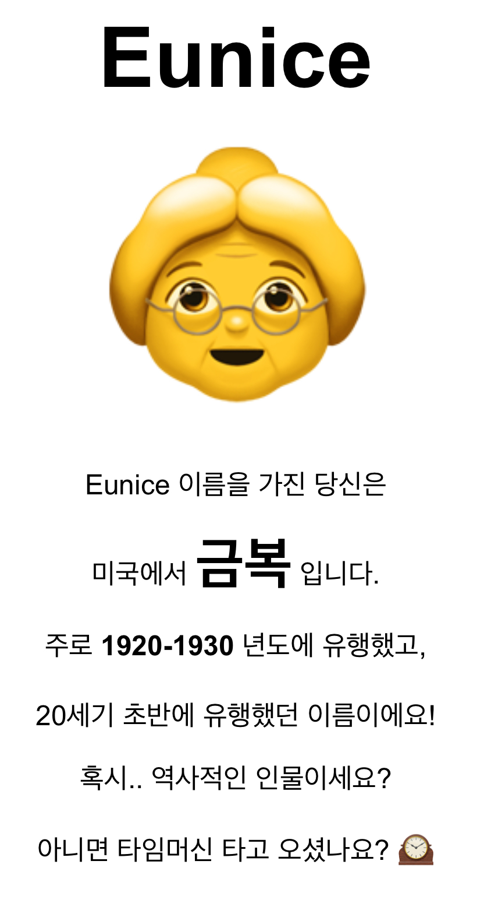

살면서 한국어 사용자가 아닌 사람에게 나를 소개할 일이 종종 있었다. 내 이름을 ‘은진’이라고 안내했을 때, 그들은 고개를 끄덕이지만 항상 나를 아래 이름 중 하나로 불렀다.

- 언진
- 윤진
- 운진
- 윤지
- 운진

그가 나의 이름을 부르더라도 나는 비로소 꽃이 되지 못한다.

그러던 중 고등학교 영어 수업 시간에 선생님께서 “이름에 ‘은’자 들어가는 사람은 영어 이름 Eunice라고 해라”라고 했던 일이 떠올랐다. 영어 이름이라고 해서 한국어 이름을 완전히 저버리는 것이 아닌 방식이라 썩 마음에 들었다.  또한 대부분 나라에서 무리없이 발음할 수 있도록 받침이나 거센소리가 없는 것도 마음에 들었다. 

물론, 영어 이름 변환기로 보니 100년전 이름이리는게 유쾌하지는 않았다. 그래도 금방 유행에 휩쓸려 버릴 이름보다는 낫겠다 생각하여 사용하게 되었다.