2014-03-03

The first encountered the Mongolian alphabet.

2015-08-24

Life in Ulaanbaatar began. 
Learned the “living” Mongolian language.

2018-08-16

Since the day I graduated from Mongolian Language department, there has been no chance to speak in Mongolian.

```mermaid
gantt
    title 나의 인생 연대기
    dateFormat  YYYY-MM-DD
    section 어린 시절
    태어남            :done, 1990-01-01, 1990-01-02
    첫 학교 입학      :done, 1996-03-01, 1996-03-02
    가족 이사         :done, 2000-06-15, 2000-06-16
    section 청소년기
    중학교 입학      :done, 2002-03-01, 2002-03-02
    첫 해외 여행      :done, 2005-08-20, 2005-08-21
    고등학교 졸업     :done, 2008-02-28, 2008-02-29
    section 대학 시절
    대학교 입학      :done, 2008-03-02, 2008-03-03
    전공 변경        :done, 2010-09-01, 2010-09-02
    첫 인턴십        :done, 2012-06-01, 2012-06-02
    대학 졸업        :done, 2013-02-28, 2013-03-01
    section 직장 생활
    첫 직장         :done, 2013-03-05, 2013-03-06
    직장 이동        :done, 2016-08-15, 2016-08-16
    승진            :done, 2019-07-01, 2019-07-02
    section 현재
    새로운 취미 시작 :done, 2020-01-01, 2020-01-02
    현재 직장        :done, 2021-05-01, 2021-05-02
```

