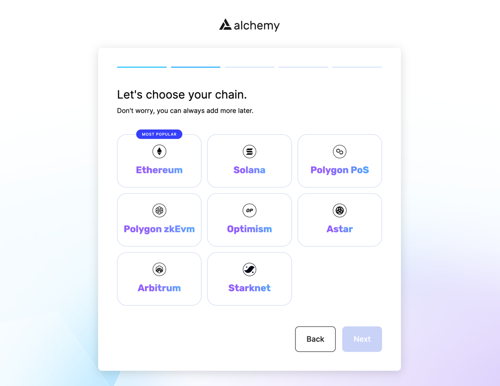
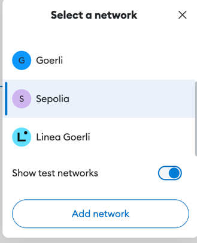
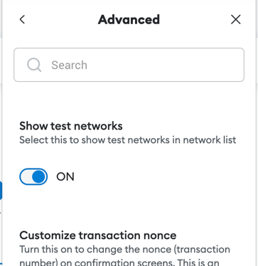
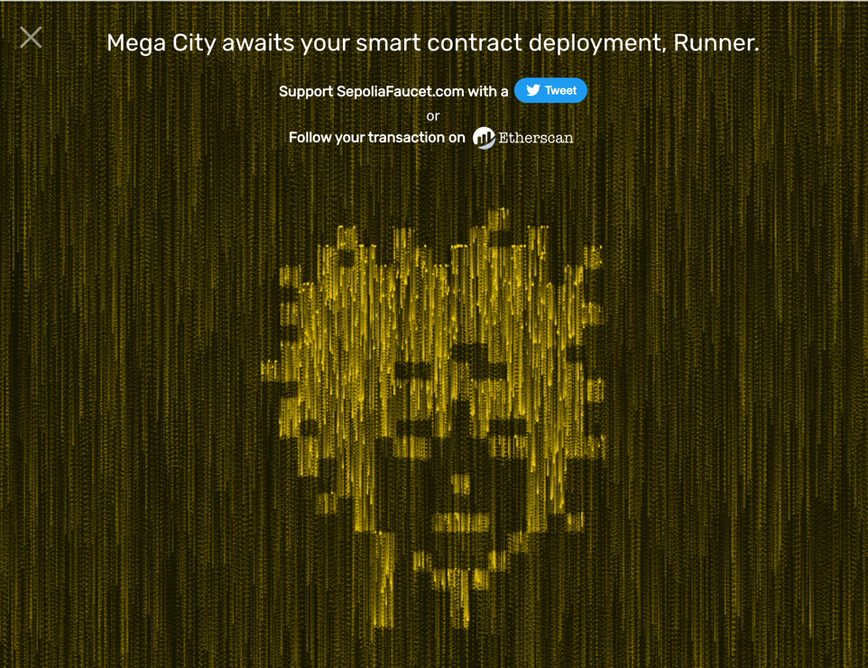

Solidity 스마트 계약을 처음부터 구축하는 직접적인 경험을 쌓았으니, 이제는 Remix로부터 벗어나 업계 표준에 적응해야할 때입니다. 
[Truffle][truffle]과 [Hardhat][hardhat](이하%20하드햇)은 업계를 선도하는 서비스로, 
단위 테스트, 노드 연결, 프론트엔드와의 통합 등을 위한 기능을 제공합니다. 
이번 글에서는 스마트 계약 개발자로서 유용하게 사용할 수 있는 하드햇의 몇 가지 멋진 기능을 설정해보고 살펴보겠습니다.

# 하드햇 환경 설정

이 튜토리얼을 최대한 활용하기 위해, 하드햇 환경을 자체 노드, MetaMask 지갑과 연결합니다. 
자체 노드는 [Alchemy][alchemy](이하%20알케미)를 이용합니다.

**기본 준비사항**

아래 링크를 통해 VSCode 및 NodeJS를 설치하세요:

1. [VSCode](https://code.visualstudio.com/) 는 권장 텍스트 편집기입니다.
2. [NodeJs](https://nodejs.org/en/) 은 권장 Javascript 런타임입니다.

# 알케미 앱 설정하기

알케미(Alchemy)는 이더리움 네트워크에 쉽게 연결할 수 있는 노드 서비스 제공업체입니다.
알케미는 인프라를 통해 블록체인에서 읽고 쓸 수 있는 기능을 제공합니다. 
우리의 시간과 돈을 절약하고 일을 효율적으로 진행시킬 수 있습니다. 
[알케미][alchemy], 에서 무료 계정을 얻고 아래의 지시사항을 따르세요.

무료 계정에 가입하고 앱을 만들 수 있습니다.


이 때,알케미 가입 시, Chain은 Etherium을 선택하세요.

당신의 API 키와 HTTP 주소가 중요하니, 일단은 어딘가에 잘 저장해 두었다가 나중에 프로젝트에 사용합시다.

# 🦊 메타마스크 지갑 만들기

메타마스크 지갑은 웹3 세계로 가는 열쇠입니다. 
메타마스크 계정을 통해 블록체인과 상호 작용할 수 있습니다. 
그리고 일반적인 웹3 세계에서 암호화폐, 토큰, NFT 및 기타 다양한 것들을 저장, 교환 및 구매할 때 사용되는 것이
바로 여러분의 디지털 지갑입니다.

메타마스크에는 모바일 애플리케이션과 크롬 브라우저 확장 기능도 있습니다. 
저는 개인적으로 대부분의 작업을 노트북에서 하기 때문에 크롬 브라우저 확장에서 메타마스크를 사용합니다.

아래는 메타마스크 크롬 브라우저 확장 설치 단계입니다:

1. [MetaMask.io][meta_mask] 으로 이동합니다 
2. Chrome Extension 다운로드 및 설치를 클릭합니다. 
3. 보안 암호를 설정합니다. 
4. (중요) 주어진 12개의 단어들을 잘 보관하고, 절대 다른 사람과 공유하지 마세요. 분실 시 계정을 복구할 방법이 없으니 어딘가에 적어 두세요.

축하합니다! 계정이 생성되었으며 공개 주소를 받아야합니다. 공개 주소는 다음과 같은 패턴으로 지정됩니다:


```text
예: 0x37EA9984481459885141F571907992e7261E837C
```

이 공개 주소를 사용하여 이더리움 기반 토큰, 크립토, NFT를 구입, 거래 및 저장할 수 있으며 
OpenSea와 같은 웹 사이트에 로그인하는 데도 사용할 수도 있습니다. 
흠.. 근데 이 긴 암호 주소를 여기저기 공유하는 것이 과연 안전할까요?

네, 완전 안전합니다! 이 주소를 공유하여 이더리움 기반 암호화를 수락, 구매, 거래 또는 저장할 수 있습니다.

### 메타마스크에서 네트워크 변경

계약을 구축하는 데 비용이 많이 들기 때문에 현재는 라이브/프로덕션 환경을 사용하지 않을 것입니다. 
라이브에서 사용하려면 진짜 ETH가 필요하거든요! 
그리고 물론, 학습을 목적으로 계약을 만들어서 배포하는 것은 지속 가능한 방법이 아닙니다.

우리는 이더리움 블록체인 생산 시뮬레이션인 테스트 네트워크인 세폴리아(Sepolia) 네트워크로 전환할 것입니다. 
MetaMask의 확장을 열고 네트워크를 Sepolia로 전환하기만 하면 됩니다.



 
위의 이미지와 같습니다. 

만약 세폴리아 네트워크가 보이지 않는 경우, 테스트 네트워크를 켜보세요.


1. Settings으로 이동
2. Advanced 열기
3. 아래로 스크롤하여 테스트 네트워크 표시(Show test networks) 켜기

### 가짜 ETH $$ 가져오기 🤑

아래 웹사이트에 들어가 가짜 ETH를 구해보세요. 
이 가짜 돈은 당신의 계약을 배포하고 당신의 계약에 대한 거래를 하는 데 사용될 것입니다. 
이것은 진짜 돈이 아닙니다. 당신은 이 ETH를 통해 NFT나 다른 자산을 살 수 없습니다.

다음 링크에서 공개 주소를 붙여넣기만 하면 ETH가 전송됩니다.
> [https://sepoliafaucet.com/](https://sepoliafaucet.com/)

위 링크에서 가짜 ETH 얻기 성공 시 보이는 화면입니다. 



### 🦊개인 메타마스크 키 가져오기

메타마스크 확장을 열어 개인 키를 찾습니다. 
계약서를 작성하고 배포하는 동안 개인 키로 각 계약서를 서명하여 블록체인에 실제 거래를 생성하는 합법적인 사람임을 알립니다. 
이제 해당 개인 키가 표시되면 해커는 사용자의 계정에 액세스할 수 있으며 나머지는 기록으로 남게 됩니다.

다음 단계에서 계정 및 개인 키를 안전하게 유지합니다. 지금은 개인 키를 내보내고 안전한 곳에 붙여넣습니다.

🚨 개인 키를 깃헙에 커밋하지 마십시오! 디스코드에 공유하지 마십시오! 어디에서도 공유하지 마십시오!

키가 공개된 경우 해커와 도둑이 당신의 모든 자금과 해당 계정과 연결된 모든 것을 가져갑니다.

🚨특별히 경계해야 합니다!!

# 하드햇 설정하기

블록체인은 공공 데이터베이스와 같고 우리의 스마트 계약은 그 데이터베이스에서 살아갑니다. 
이 데이터베이스는 공개적으로 사용되고 접근 가능합니다. 
우리 계약의 구성에 따라, 누구나 또는 특정한 사람들만 우리 계약을 가지고 놀 수 있습니다. 
우리가 블록체인에 대한 계약서를 발행할 때마다, 그것은 우리가 그것을 추적할 수 있는 디지털 발자국인 주소를 얻습니다. 
우리는 이 프로젝트를 위해 이더리움 블록체인에 모든 것을 구축하고 Solidity와 다른 라이브러리를 사용할 것입니다.

학습 목적으로 블록체인에 직접 계약을 게시하는 것은 비용이 많이 들 것입니다. 
새로운 계약을 만들거나, 계약을 편집하거나, 블록체인에 게시할 때마다 ETH, 즉 MATIC 형태의 비용이 발생합니다. 
이를 방지하고 계약을 제대로 테스트하기 위해 프로덕션 환경을 거의 복제하여, 
자유롭게 사용하고 접근하기 쉬운 테스트 환경을 만들 것입니다.

이를 위해 [하드햇][hardhat] 을 사용합니다.
하드햇은 빠른 개발을 위해 설계된 로컬 이더리움 네트워크를 제공합니다. 
이를 통해 계약을 배포하고 테스트를 실행하며 코드를 디버그할 수 있습니다. 
정말 멋지죠? 😊

아래 명령을 사용하여 설치합니다.

```bash
npm install --save-dev hardhat
```

[하드햇 문서](<https://hardhat.org/getting-started/>) 를 참고하여 설치에 대한 자세한 내용을 확인해보세요.

이제 프로젝트 폴더 내에서 이 명령을 실행하여 하드햇을 설정해 보겠습니다.

```bash
npx hardhat
```

우리는 이 프로젝트의 맨 처음부터 시작할 것이기 때문입니다. 설치하는 동안 **빈 하드 햇 구성파일** 을 생성하기만 하면 됩니다.

```bash
888    888                      888 888               888
888    888                      888 888               888
888    888                      888 888               888
8888888888  8888b.  888d888 .d88888 88888b.   8888b.  888888
888    888     "88b 888P"  d88" 888 888 "88b     "88b 888
888    888 .d888888 888    888  888 888  888 .d888888 888
888    888 888  888 888    Y88b 888 888  888 888  888 Y88b.
888    888 "Y888888 888     "Y88888 888  888 "Y888888  "Y888
👷 Welcome to Hardhat v2.11.2 👷‍
? What do you want to do? - Create an empty hardhat.config.js
✨ Config file created ✨
```

하드햇은 다음과 유사한 코드를 가진 **hardhat.config.js** 파일을 생성합니다:

```jsx
/**
* @type import('hardhat/config').HardhatUserConfig
*/
module.exports = {
    solidity: "0.8.17",
};
```

하드햇을 설치했으면, 다음 명령을 사용하여 루트 디렉토리에 `contracts` 및 `scripts`라는 두 개의 새 디렉토리를 빠르게 만듭니다.
`contracts` 디렉토리에는 모든 스마트 계약이 포함되고 `scripts` 디렉토리에는 계약 배포와 관련된 모든 스크립트가 포함됩니다.

```bash
mkdir contracts
mkdir scripts
```

이 튜토리얼에서는 Ethers.js, Waffle 및 Open Zeppelin 플러그인을 사용할 예정입니다. 
이 플러그인들은 우리가 이더리움과 상호작용하고, 계약을 테스트하고, 상용판 코드를 사용할 수 있게 해줍니다. 
설치하려면 프로젝트 디렉토리에서 다음을 실행합니다:

```bash
npm install --save-dev @nomiclabs/hardhat-ethers ethers @nomiclabs/hardhat-waffle ethereum-waffle chai
npm install --save-dev @openzeppelin/hardhat-upgrades
```

이제 다음 코드를 사용하여 **hardhat.config.js** 파일의 맨 위에 **hardhat-waffle** 및 **openzeppelin**을(를) 가져옵니다:

```jsx
require("@nomiclabs/hardhat-waffle");
require('@openzeppelin/hardhat-upgrades');
```

**hardhat-waffle**은 **hardhat-ethers**에 의존하므로 둘 다 추가할 필요가 없습니다.

# Metamask 지갑, Alchemy Node 및 Sepolia Network에 하드햇 연결

이제 모든 것을 하나로 합칠 때입니다. 
먼저 우리의 하드햇 프로젝트를 메타마스크 지갑과 알케미 노드에 연결해야 합니다. 
이를 위해 프로젝트 루트에 빈 ".env" 텍스트 파일을 만듭니다. 
**API_URL** 및 **PRIVATE_KEY**를 다음 형식으로 추가합니다:

```env
API_URL = YOUR_ALCHEMY_APP_URL
PRIVATE_KEY = YOUR_PRIVATE_KEY
```

**이 파일은 항상 비공개로 유지하고 Git 커밋에 절대로 넣지 마십시오.**

이제 하드햇을 ".env"에 연결해야 합니다. **hardhat.config.js**로 이동한 후 위에 다음 코드를 추가합니다:

```jsx
require('dotenv').config();
```

또한 "require" 문 뒤에 **API_URL** 및 **PRIVATE_KEY**에 대한 상수를 다음과 같이 선언합니다:

```jsx
const { API_URL, PRIVATE_KEY } = process.env;
```

우리의 하드햇 프로젝트는 이제 알케미 노드와 메타 마스크 지갑과 연결되었습니다. 
마지막으로, 메타 마스크 지갑 및 알케미 노드를 사용하여 **Sepolia** 네트워크에 연결하는 것입니다.
**module.exports**에 **defaultNetwork**를 **Sepolia**로 선언하고 **hardhat.config.js**에 **API_URL**
및 **Private_KEY** 매개 변수를 전달하면 됩니다:

```jsx
module.exports = {
    solidity: "0.8.17",
    defaultNetwork: "sepolia",
    networks: {
        hardhat: {},
        sepolia: {
            url: API_URL,
            accounts: [`0x${PRIVATE_KEY}`]
        }
    },
};
```

최종적으로 ***hardhat.config.js***는 아래와 같은 모습일겁니다:

```jsx
require('dotenv').config();
require("@nomiclabs/hardhat-waffle");
require('@openzeppelin/hardhat-upgrades');
const { API_URL, PRIVATE_KEY } = process.env;
/**
* @type import('hardhat/config').HardhatUserConfig
*/
module.exports = {
    solidity: "0.8.17",
    defaultNetwork: "goerli",
    networks: {
        hardhat: {},
        goerli: {
            url: API_URL,
            accounts: [`0x${PRIVATE_KEY}`]
        }
    },
};
```

우리는 하드햇 세팅을 마쳤습니다.! 
그런데, 하드햇을 사용하여 스마트 계약을 어떻게 활용하나요? 
우리는 스마트 계약 작성 방법을 배웠습니다. **하드햇을 통한 단위 테스트**는 바로 다음에 논의할 문제입니다. 
우리에게 남은 것은 하드햇을 사용하여 계약을 구축하는 것입니다. 
이 튜토리얼을 완성하기 위해 4일차에 작성한 **Hello World** 계약을 활용합니다. 

# Hello World 스마트 계약

4일차에 작성한 **Hello World** 계약서 사본입니다!

```solidity
//SPDX-License-Identifier: UNLICENSED
pragma solidity ^0.8.9;
        
contract HelloWorld {
    event messagechanged(string oldmsg, string newmsg);
    string public message;
                
    constructor(string memory firstmessage) {
        message = firstmessage;   
    }
            
    function update(string memory newmesssage) public {
        string memory oldmsg = message;
        message = newmesssage;
        emit messagechanged(oldmsg, newmesssage);
    }
}
```

# 스마트 계약 배포

배포와 관련하여 하드햇용 배포 시스템을 구현하는 공식 플러그인은 아직 없습니다. 
이와 관련하여, 우리는 이 배포 프로세스를 진행하기 위해 자체 고객 스크립트(customer script)를 작성해야 합니다.
먼저 작성한 **contract** 폴더에 **HelloWorld.sol** 사본을 넣습니다. 
그런 다음 이전에 만든 프로젝트의 **scripts** 폴더에 **deploy.js** 파일을 만듭니다.
최종 코드는 아래와 같은 모습일 겁니다:

```jsx
async function main() {
    const [deployer] = await ethers.getSigners();
    console.log('Deploying contracts with the account:', deployer.address);
    console.log('Account balance:', (await deployer.getBalance()).toString());
    const Token = await ethers.getContractFactory('HelloWorld');
    const token = await Token.deploy("Hello World");
    console.log('Token address:', token.address);
}
        
main()
  .then(() => process.exit(0))
  .catch((error) => {
      console.error(error);
      process.exit(1);
  });
```

단계별로 살펴보겠습니다:

1. 먼저 이더리움 지갑에 접속해야 합니다. **ethers.getSigners()**를 통해 이 작업을 수행합니다.
   Ethers.js의 서명자(Signer)는 이더리움 계정을 나타내는 개체입니다. 
   그것은 계약과 다른 계좌로 거래를 보낼 때 사용됩니다. 
   여기서 연결된 노드의 계정 목록(이 경우는 Hardhat Network)을 가져오고 첫 번째 계정(우리만의 메타마스크 지갑)만 유지합니다.
2. 이제 **console.log**를 사용하여 **deployer** 주소와 **wallet** 잔액을 자체 기록 보관용으로 내보냅니다.
3. 그런 다음 계약 이름을 **ethers.getContractFactory**에 **HelloWorld**를 전달하여 계약의 기계가 읽을 수 있는 형식(ABI)에 접근합니다.
4. 마지막으로, 당사의 계약 작성자는 배포를 위해 초기 이니셜을 전달해야 합니다. 
   **Token.deploy**에 **HelloWorld**를 전달합니다.
5. **console.log**를 사용하여 배포된 계약의 주소를 확인합니다.
6. 배포에 실패할 경우를 대비하여 보일러 플레이트 오류 처리를 추가합니다.

다시 프로젝트 루트로 이동하여 터미널에서 `npx hardhat node` 명령을 실행합니다.

이제 루트에서 다른 터미널을 열고 `npx hard hat runscripts/deploy.js --network sepolia`를 실행합니다. 
Sepolia 계약 주소가 수신되고 스마트 계약이 배포됩니다.

잠시 후 [Sepolia Testnet Explorer](https://sepolia.etherscan.io/) 에서 새로 생성된 **계약 주소**를 검색하여 배포된 계약을 확인하세요!


[truffle]: https://trufflesuite.com/

[hardhat]: https://hardhat.org/

[alchemy]: https://www.alchemy.com/

[meta_mask]: http://metamask.io/