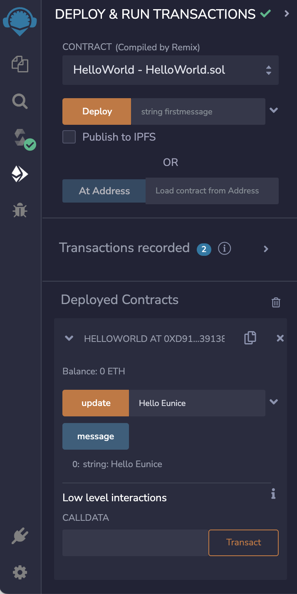

# 4일차: 리믹스를 이용한 헬로 월드 계약 작성

초보 프로그래머들에게 스마트 계약서 작성은 정말 지루한 일입니다. 너무 많은 정보와 튜토리얼이 있고 어디서부터 시작해야 할지 모르는 것에 대해 혼란스러울 거에요. 혹시 `어디서부터 시작해야 할까요?` `이 모든 외계 용어들은 무슨 뜻인가요?` `어떤 IDE를 사용해야 하나요?`... 모르는 것 투성이라 혼돈의 미궁 속에 갇힌 기분이라구요? 더 이상 걱정할 필요 없어요. 처음 스마트 계약을 작성할 때 딱 맞는 가이드를 준비했습니다. 완전 초보자이든 숙련된 전문가이든 상관없이, 본 포스트를 통해 첫 계약을 시작해보아요. 우선, 몇 가지 기본 용어들을 복습해볼까요?

## Remix IDE란?

Remix IDE는 Solidity를 통한 스마트 계약 개발을 가능하게 하는 통합 개발 환경입니다. 일반적으로 IDE는 공통 개발자 도구를 하나의 GUI로 결합한 응용 프로그램을 구축하기 위한 소프트웨어입니다. 리믹스(Remix)는 자바스크립트로 작성된 이더리움 스마트 컨트랙트 개발을 위한 인기 있는 IDE이며 모든 스마트 컨트랙트의 완전한 테스트, 배포, 디버깅을 지원합니다. 리믹스를 사용하는 방법은 여러 가지가 있습니다:

1. 웹 브라우저에서 [`https://remix.ethereum.org/`](https://remix.ethereum.org/) 에 접속하세요.
2. [GitHub - @ethereum/remix-ide](https://github.com/ethereum/remix-ide) 를 클릭하여 시스템에 설치할 수도 있습니다.
3. 미스트(Mist)라는 ETH Dapp 브라우저에서 사용할 수 있습니다.

이제 여러분이 가장 가슴이 두근거리는 단계를 시작해 봅시다. 이 글은 처음으로 스마트 계약을 작성하는 분들을 독자로 상정하고 있습니다. 그러니 걱정하지 않으셔도 돼요. 아래 단계의 기본 작동 원리를 파악하는데에 주저하지 않으셔도됩니다. 또한, 멍청한 질문은 없고 멍청한 대답만 있다는 것을 명심하세요. 그러니 여러분의 호기심을 표현하는 것을 부끄러워하지 마세요.

## 첫 헬로 월드 계약 작성 시작하기

이제 리믹스의 "Hello World" 계약을 시작하겠습니다. 우리는 화면에 "Hello World"를 인쇄하고 수정하는 것을 목표로 하며, 도중에 스마트 계약에 대한 몇 가지 주요 측면을 배울 것이다. 추가적인 번거로움을 피하기 위해 아래 단계를 주의 깊게 따라야 합니다. 시작해 봅시다:

Remix IDE를 시작하려면 브라우저의 [`http://remix.ethereum.org/`](http://remix.ethereum.org/) 로 이동하십시오. 다음 화면이 표시됩니다:


위 이미지의 흰색 화살표로 표시된 파일 탐색기 탭을 클릭합니다. 기본 환경으로 솔리디티(Solidity)를 선택한 다음(메시지가 표시되는 경우) 브라우저 옆의 더하기 아이콘을 클릭합니다(흰색 화살표로 표시됨)


파일 이름을 `HelloWorld.sol`(".sol"은 Solidity 프로그램을 의미함)로 지정합니다.

전체 코드부터 보고 싶은 전문 엔지니어들은 아래 코드를 참고하세요.

```solidity
//SPDX-License-Identifier: UNLICENSED

pragma solidity ^0.8.9;

contract HelloWorld {

  event messagechanged(string oldmsg, string newmsg);

  string public message;

  constructor(string memory firstmessage) {

    message = firstmessage;

  }

  function update(string memory newmesssage) public {

    string memory oldmsg = message;

    message = newmesssage;

    emit messagechanged(oldmsg, newmesssage);

  }
}
```

이제 본격적으로 설명해 보겠습니다:

Solidity 계약은 라이센스가 없기 때문에 코드 첫 줄에 코멘트로 선언하는 것이 좋습니다:

`//SPDX-License-Identifier: UNLICENSED`

그런 다음 계약을 위해 Solidity의 컴파일러 버전을 선언합니다. 임의의 숫자로 `0.8.0`보다 큰 값을 선택합니다

`pragma solidity ^0.8.9;`

그런 다음 계약명 "Hello World"를 다음과 같이 선언합니다:

`contract HelloWorld {}`

그런 다음 `string` 유형의 `message`라는 공개 변수를 선언하여 메시지의 최신 값을 유지합니다. 이더리움은 디버깅 목적으로 `event` 라는 내장형 데이터 타입을 제공합니다. 이더리움에서 거래 중에 방출되어 블록체인에 저장된다는 점을 제외하면 자바스크립트의 console.log와 유사합니다. 우리의 경우, `message`의 가치를 나중에 "헬로 월드"에서 "헬로 유니스"로 수정할 것이기 때문에, 그 값이 바뀔 때마다 이벤트에 우리의 기존 메시지와 새 메시지의 값을 저장하는 습관을 들이는 게 좋을거에요.

```solidity
event messagechanged(string oldmsg, string newmsg);

string public message;
```

Solidity의 생성자는 계약 배포 시 실행되는 코드입니다. 생성자를 선언하고 입력값 `firstmessage` 을 변수 `message`에 할당합니다.

이것은 계약이 구축되면 시작할 초기 메시지를 요청한다는 것을 의미합니다.

```solidity
constructor(string memory firstmessage) {
    message = firstmessage;
}
```

계약을 배포할 때 첫 번째 메시지로 "**Hello World**"를 전달하여 공개 문자열 메시지의 값이 업데이트됩니다.

우리는 이제 필요할 때마다 `message`의 값을 갱신할 수 있는 수단이 필요합니다. 이를 위해 문자열 `newmesssage`를 입력값으로 받는 `update`라는 함수을 작성합니다.

```solidity
function update(string memory newmesssage) public {

}
```

그런 다음 현재 `message`의 값을 저장하기 위해 임시 변수(`memory`를 주목!)를 선언합니다. 그런 다음 `message`의 값을 `newmesssage`로 업데이트하고 블록체인의 변경 사항을 추적하기 위해 이전에 선언한 이벤트 `messagechanged`를 내보냅니다:

```solidity
function update(string memory newmesssage) public {

  string memory oldmsg = message;

  message = newmesssage;

  emit messagechanged(oldmsg, newmesssage);

}
```

튜토리얼 중 프로그래밍 부분은 이게 끝입니다. 계약을 정리해봅시다. 왼쪽 모서리에 있는 Solidity Compiler(Solidity Compiler)를 클릭합니다(노란색으로 강조 표시됨):


그런 다음 이전 설정을 변경하지 않고 `*Compile HelloWorld.sol*` 을 클릭합니다. 컴파일이 완료되면 Solidity 컴파일러 아래의 navbar에서 "Deploy and run transactions"를 클릭합니다:


설정을 변경할 필요 없이 "Hello World"를 입력하고 "Deploy"를 클릭하면 됩니다. 'Deployed Contracts(배포 계약) 탭'에 계약이 표시됩니다. 이제 Hello World 계약이 로컬 가상 시스템에 배포되었습니다. 테스트할 시간:

계약 옆에 있는 아래쪽 화살표를 클릭하면 "업데이트"와 "메시지"라는 두 가지 옵션이 표시됩니다. "메시지 변수"에 저장된 최신 값을 보려면 "메시지"를 클릭하십시오:


헬로 월드! 이제 `update` 함수를 사용하여 "Hello Eunice"를 전달해 보겠습니다. 이제 `message`의 최신 값을 가져오면 다음과 같이 표시됩니다:



🎉 축하합니다. Solidity에서 첫 번째 스마트 계약을 작성하고 했어요! 해피 코딩!